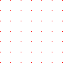
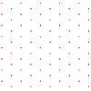
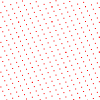
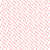
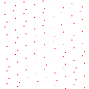
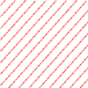

# \[サンプル\] クエリ式とリスト内包

## <a id="sec-generated-title-1"></a> <a id="abst"></a>概要

C# 3.0 の「[LINQ](../data/sp3_linq.md#linq)」を使うと、リスト内包（list comprehensions）のようなことが可能。


## <a id="sec-generated-title-2"></a> <a id="in_ex"></a>内包と外延

ここでいう内包ってのは、元々は公理的集合論の用語で、

* 内包（intension）記法： {f(x) | x ∈ A} みたいな書き方。

* 外延（extension）記法： {a, b, c, d, e, …} みたいな書き方。


というようなものの事をいいます。
この言葉はさらにさかのぼると、哲学とか論理学の用語で、

* 内包：「ある事物が充たすべき条件」… 事物が内に持っているだろう性質。

* 外延：「ある条件を充たす事物の集合」… 具体例で外堀埋めるように事物を記述。


というような意味です。
要するに例えば、犬というものを定義するに当たって、

* 内包： 犬は、哺乳類で、4足歩行で、群れを成す生き物で、・・・

* 外延： お隣のポチは犬、向かいのシロも犬・・・


というような考え方の区分。
こういう考え方を集合論の記号で表したものが最初に例示したような内包記法・外延記法です。

* 内包記法： 犬 ＝ {x | x ⊂ 哺乳類, x は4足歩行, x は群れを成す, ・・・}

* 外延記法： 犬 ＝ {お隣のポチ, 向かいのシロ, ・・・}


## <a id="sec-generated-title-3"></a> <a id="list_init"></a>リストの初期化

具体例を挙げてみましょう。
0 以上 10未満の偶数の集合といわれると、
数学的には以下の2通りの書き方ができます。

* 外延記法：<span class="math">
          <span class="paren" style="font-size:em;">{</span>
            <span class="normal">0</span>, <span class="normal">2</span>, <span class="normal">4</span>, <span class="normal">6</span>, <span class="normal">8</span>
          <span class="paren" style="font-size:em;">}</span>
        </span>

* 内包記法：<span class="math">
          <span class="paren" style="font-size:em;">{</span>
            n <span class="normal">|</span> n <span class="normal">∈</span><span class="normal">10</span>, <span class="normal">2</span><span class="normal">|</span>n
          <span class="paren" style="font-size:em;">}</span>
        </span>あるいは<span class="math">
          <span class="paren" style="font-size:em;">{</span>
            <span class="normal">2</span>n <span class="normal">|</span> n <span class="normal">∈</span><span class="normal">5</span>
          <span class="paren" style="font-size:em;">}</span>
        </span>


ただし、
集合論的には 10 ってのは <span class="math">
        <span class="paren" style="font-size:em;">{</span>
          <span class="normal">0</span>, <span class="normal">1</span>, <span class="normal">2</span>, <span class="normal">3</span>, <span class="normal">4</span>, <span class="normal">5</span>, <span class="normal">6</span>, <span class="normal">7</span>, <span class="normal">8</span>, <span class="normal">9</span>
        <span class="paren" style="font-size:em;">}</span>
      </span> という集合と同じ意味で、
<span class="math">
        <span class="normal">2</span><span class="normal">|</span>n
      </span> は「2 は n の約数」（したがって、n は偶数）の意味です。

で、プログラミング言語的には、
外延記法の方は、C 言語の配列でもできます。

```csharp
int evens[] = { 0, 2, 4, 6, 8 };
```


でも、内包記号の方は無理です。これと近いことを C 言語でやろうとすると、以下のようになります。

```csharp
int evens[5];
int i = 0;
for (int k = 0; k < 10; ++k)
{
  if (k % 2 == 0)
  {
    evens[i] = k;
    ++i;
  }
}
```


C# の List を使って書くとほんの少しだけ数学の記法に近づく事ができて、
以下のようになります。

```csharp
var _10 = Enumerable.Range(0, 10);

List<int> evens = new List<int>();
foreach (var n in _10)
  if (n % 2 == 0)
    evens.Add(n);
```


とはいえ、
<span class="math">
        n <span class="normal">∈</span><span class="normal">10</span>
      </span> の部分を <code>n in _10</code> と書けたくらいで、
数学の集合の内包記法とは程遠いです。
{} の中に条件式を書けるわけじゃないですし、
何よりも、
「先にリストを作ってからそれに値を Add する形で初期化する」って形になるのが少々不恰好。


## <a id="sec-generated-title-4"></a> <a id="comprehension"></a>リスト内包

いくつかの言語では、数学の内包記法に似た書き方でリストを初期化できる構文を持っています。
この構文を<strong id="comprehension" class="keyword">リスト内包</strong>（list comprehensions）と呼びます。
（intension と comprehension はほぼ同義語。日本語訳的にはどっちも内包。）

特に、関数型言語にそういう機能を持った言語が多いんですが、
例えば、Erlang では以下のようにしてリストを作れます。

```csharp
Ten = [0, 1, 2, 3, 4, 5, 6, 7, 8, 9]
Evens = [n || n <- Ten, n rem 2 == 0]
```


関数型言語でも F# の場合、以下のように for とか when が必要。

```fsharp
let evens = { for n in 0 .. 9 when n % 2= 0 -> n }
```


関数型言語以外でも、例えば、Python はリスト内包構文を持っています。
F# と同様、数学の集合の内包記法とは違って、for とか if とかいうキーワードが必要になります。

```python
ten = range(0, 10)
evens = [n for n in ten if n % 2 == 0]
```


これは、以下のように解釈されるようです。
（Python にはそんなに詳しくないんで、もしかすると間違ってるかも。）

```python
ten = range(0, 10)
evens = []
for n in ten :
  if n % 2 == 0 :
    evens.append(n)
```


これは、前節の最後で書いたような C# のコードに近いです。


## <a id="sec-generated-title-5"></a> <a id="linq"></a>クエリ式とリスト内包

さて、前節の Python コード

```python
ten = range(0, 10)
evens = [n for n in ten if n % 2 == 0]
```


と、以下の C# コードを比べてみてください。

```csharp
var ten = Enumerable.Range(0, 10);
var evens = from n in ten where n % 2 == 0 select n;
```


先頭の n が末尾の select n に、
for が from に、
if が where に変わっていますが、
そういう見かけの差を除けばやってることは一緒です。
そして、結果として得られるのは同じ「0以上10未満の偶数」になります。

（実際には、Python 版はリスト、C# 版で IEnumerable になるんで、
細かいこと言うといろいろ違いますけど。
あと、生成されるコードも全然違います。）

ということで、C# 3.0 のクエリ式は、書き方こそ微妙に違えど、性質はリスト内包に近いかも。

まあ、クエリ式の方が、join とか order by とか group by とかが使えて、
より高機能なんですが。


## <a id="sec-generated-title-6"></a> <a id="projection"></a>具体例： 3次元格子点の平面への投影

リスト内包表記っぽいものを実際に C# 3.0 のクエリ式で書いてみましょう。


##### <a id="sec-generated-title-7"></a>題材

ここでの例として、3次元上の格子点を平面に投影してみた結果がどういう点を描くかというのをやってみます。
3次元の格子点って言うと、数学の記号を使って書くと以下のような感じです。
<div class="math">
      L<sub><span class="normal">3</span></sub><span class="normal">=</span><span class="paren" style="font-size:em;">{</span>
        <span class="paren" style="font-size:em;">(</span>x, y, z<span class="paren" style="font-size:em;">)</span><span class="normal">∈</span><span class="bold">R</span><sup><span class="normal">3</span></sup><span class="normal">|</span>
        x <span class="normal">∈</span><span class="bold">N</span>,
        y <span class="normal">∈</span><span class="bold">N</span>,
        z <span class="normal">∈</span><span class="bold">N</span>
      <span class="paren" style="font-size:em;">}</span>
    </div>
で、3次元上の点を平面に投影する関数
<span class="math">
        Pr: <span class="bold">R</span><sup><span class="normal">3</span></sup><span class="normal">→</span><span class="bold">R</span><sup><span class="normal">2</span></sup>
      </span>
を用意して、
以下のような集合を作ります。
<div class="math">
      P
      <span class="normal">=</span><span class="paren" style="font-size:em;">{</span>
        Pr<span class="paren" style="font-size:em;">(</span>p<span class="paren" style="font-size:em;">)</span><span class="normal">|</span>
        p <span class="normal">∈</span> L<sub><span class="normal">3</span></sub>
      <span class="paren" style="font-size:em;">}</span>
    </div>
簡単化のため、投影面は原点を通る平面に限定します。
で、この平面の正規直交基底を
<span class="math">
        <span class="vector">i</span><sub><span class="normal">1</span></sub>, <span class="vector">i</span><sub><span class="normal">2</span></sub>
      </span>
とすると、投影関数 Pr は以下のように書くことができます。
<div class="math">
      Pr<span class="paren" style="font-size:em;">(</span>p<span class="paren" style="font-size:em;">)</span><span class="normal">=</span><span class="paren" style="font-size:em;">(</span>
        p <span class="normal">⋅</span><span class="vector">i</span><sub><span class="normal">1</span></sub> ,
        p <span class="normal">⋅</span><span class="vector">i</span><sub><span class="normal">2</span></sub>
      <span class="paren" style="font-size:em;">)</span>
    </div>
すなわち、投影された点の集合 <span class="math">P</span> は以下のように書けます。
<div class="math">
      P
      <span class="normal">=</span><span class="paren" style="font-size:em;">{</span>
        <span class="paren" style="font-size:em;">(</span>
          p <span class="normal">⋅</span><span class="vector">i</span><sub><span class="normal">1</span></sub> ,
          p <span class="normal">⋅</span><span class="vector">i</span><sub><span class="normal">2</span></sub>
        <span class="paren" style="font-size:em;">)</span><span class="normal">|</span>
        p <span class="normal">∈</span> L<sub><span class="normal">3</span></sub>
      <span class="paren" style="font-size:em;">}</span>
    </div>

##### <a id="sec-generated-title-8"></a>コーディング

まず、3次元上の格子点は C# 3.0 的に書くと以下のような感じ。

```csharp
var points3d =
  from x in Enumerable.Range(-N, 2 * N)
  from y in Enumerable.Range(-N, 2 * N)
  from z in Enumerable.Range(-N, 2 * N)
  select new Vector3D(x, y, z);
```


N は適当な定数です。
無限個の点を扱うわけにもいかないので、N で探索範囲を限定します。
Vector3D は 「[WPF](../../dotnet/wpf/wpf_abst.md#wpf0)」 の System.Windows.Media.Media3D.Vector3D クラス。
Enumerable は .NET Framework 3.5 で追加された System.Linq.Enumerable クラスです。

平面への投影は、平面の基底ベクトル i1, i2 を与えて、以下のようにします。

```csharp
var projectedPoints =
  from p in points3d
  let x = Vector3D.DotProduct(p, i1)
  let y = Vector3D.DotProduct(p, i2)
  select new Point(x, y);
```


そこそこ数学のイメージ通りにコーディングできているんじゃないかと。

ちなみに、（原点を通る）平面は法線ベクトル1つを与えて定められるわけですが、
法線ベクトル normal から適当な平面状の基底ベクトル2つを求めるには、
以下のような関数を使います。

```csharp
static void GetOrthogonalBase(
  Vector3D normal, out Vector3D i1, out Vector3D i2)
{
  Vector3D temp;

  if (normal.X > normal.Y)
    if (normal.X > normal.Z) temp = new Vector3D(0, 1, 0);
    else temp = new Vector3D(1, 0, 0);
  else
    if (normal.Y > normal.Z) temp = new Vector3D(0, 0, 1);
    else temp = new Vector3D(1, 0, 0);

  i1 = Vector3D.CrossProduct(normal, temp); i1.Normalize();
  i2 = Vector3D.CrossProduct(normal, i1); i2.Normalize();
}
```


あと、探索する範囲をもう少し絞って、
「平面から遠い点」と「表示可能な範囲外」の点を除外するために、
以下のような条件をつけておきます。

```csharp
var points3d = (
  from x in Enumerable.Range(-M, 2 * M)
  from y in Enumerable.Range(-M, 2 * M)
  from z in Enumerable.Range(-M, 2 * M)
  select new Vector3D(x, y, z) into p
  let distance = Math.Abs(Vector3D.DotProduct(p, normal))
  where distance < THICKNESS
  select p
  ).ToArray();

Vector3D i1, i2;
GetOrthogonalBase(normal, out i1, out i2);

var projectedPoints =
  from p in points3d
  let x = Vector3D.DotProduct(p, i1)
  let y = Vector3D.DotProduct(p, i2)
  where -WIDTH <= x && x <= WIDTH
    && -WIDTH <= y && y <= WIDTH
  select new Point(x, y);
```


THICKNESS が平面からの距離、
WIDTH が表示可能な範囲の幅を表す定数です。

完成品 → 
[Projection.zip](../../../../assets/media/ufcpp2000/csharp/source/Projection.zip)
（ソース一式、zip 圧縮）。

↑WPF を使っているので、コーディングは簡単なんですけど、
かなり処理が重たいです。

あと、現状では、法線ベクトルはハードコーディングしています。
ちょっとした修正で、実行時に法線ベクトルの向きを変更することも簡単にできると思いますが。


##### <a id="sec-generated-title-9"></a>結果

さて、投影結果ですが、
法線の向きを変えていくつかプロットしたものを見てみましょう。

法線が (1, 0, 0) みたいなのだと、投影結果もきれいに格子点になって、↓みたいな感じになります。

<figure>

[](../../../../assets/media/ufcpp2000/csharp/fig/projection/1_0_0.png)

<figcaption></figcaption>
</figure>


法線を (1, 1, 1) とかにすると、最密充填な感じの6角形状の点が得られます↓。

<figure>

[](../../../../assets/media/ufcpp2000/csharp/fig/projection/1_1_1.png)

<figcaption></figcaption>
</figure>


(1, 5, 7) みたいな多少妙な比率にしても、有理比である限りきれいな格子模様になります↓。（精度の問題でぼやけてるけど、理屈の上ではちゃんと点になる。）

<figure>

[](../../../../assets/media/ufcpp2000/csharp/fig/projection/1_5_7.png)

<figcaption></figcaption>
</figure>


一方、
<span class="math">
        <span class="paren" style="font-size:em;">(</span>
          <span class="normal">1</span>, <span class="normal" style="font-size:em;">√</span><span class="bar">
            <span class="normal">2</span>
          </span>, <span class="normal" style="font-size:em;">√</span><span class="bar">
            <span class="normal">3</span>
          </span>
        <span class="paren" style="font-size:em;">)</span>
      </span>
みたいに無理数比にしてしまうと、周期性がなくなります↓。

<figure>

[](../../../../assets/media/ufcpp2000/csharp/fig/projection/1_r2_r3_t10.png)

<figcaption></figcaption>
</figure>


この画像は THICKNESS == 10 の厚み（平面からの距離）くらいまでをプロットしたものです。
厚みを太くすればするほど、全体が真っ赤に染まるはず。
逆に薄くすると↓みたいな感じになります（厚み 1.2）。
規則性があるようなないようなちょっと不思議な模様に。

<figure>

[](../../../../assets/media/ufcpp2000/csharp/fig/projection/1_r2_r3_t1.2.png)

<figcaption></figcaption>
</figure>


で、
<span class="math">
        <span class="paren" style="font-size:em;">(</span>
          <span class="normal">2</span>,
          <span class="normal">1</span><span class="normal">−</span><span class="normal" style="font-size:em;">√</span><span class="bar">
            <span class="normal">5</span>
          </span>,
          <span class="normal">1</span><span class="normal">+</span><span class="normal" style="font-size:em;">√</span><span class="bar">
            <span class="normal">5</span>
          </span>
        <span class="paren" style="font-size:em;">)</span>
      </span>
みたいな比率にすると、x, y, z のうち2つだけが独立（x = y + z）なので、
縞模様が現れます
（ある1方向には周期性がなくなって、別の1方向には周期性が残る）↓。

<figure>

[](../../../../assets/media/ufcpp2000/csharp/fig/projection/2_1-r5_1+r5.png)

<figcaption></figcaption>
</figure>


ちょっと数学的な話をすると、
こういう、高次元の格子点を法線が無理数比の平面に投影するって話、準結晶の研究で出てきた話らしい。
うまくやれば5回回転対称性を持つような準周期構造が作れるとか
（完全な結晶構造だと、1,2,3,4,6 回の回転対象性しか作れない）。
