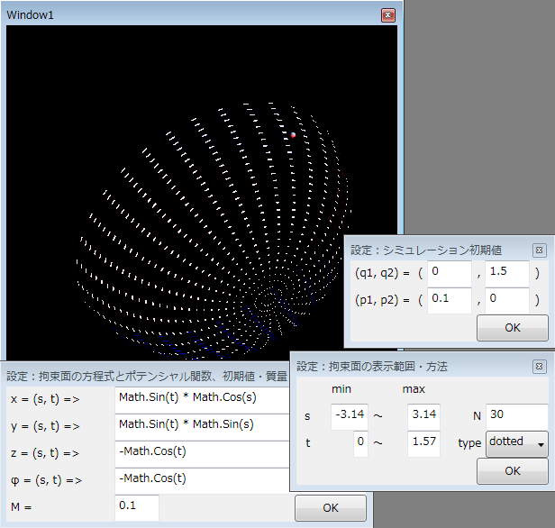

# \[サンプル\] 式木の利用例

## 概要
<h5 class="version version3">Ver. 3.0</h5>

式木使って遊んでみます。

C# 3.0 の Expression Tree の一番すごいところは、匿名デリゲートと同じ記法で書けるのと、
式木をいろいろいじった後に動的にコンパイルして実行できるところ。
シンボリックに計算した結果を、動的に実行形式に変換して効率よく実行できるってのはすごい。

<pre class="source" title="x * x を微分して実行" lang="">
<code>Expression&lt;Func&lt;double, double&gt;&gt; <em>f = x =&gt; x * x</em>;
var df = f.Derive();

Console.Write("f  = {0}\n", f);
Console.Write("df = {0}\n", df);

<em>var df_ = df.Compile();</em>

for (int i = -2; i &lt;= 2; ++i)
  Console.Write("df({0}) = {1}\n", i, df_(i));
</code></pre>

<pre class="console" title="実行結果">
f  = x =&gt; (x * x)
df = x =&gt; (2 * x)
df(-2) = -4
df(-1) = -2
df(0) = 0
df(1) = 2
df(2) = 4
</pre>

ちなみに、この例で示した Derive（微分メソッド）の話は次節で。

## 式木を微分
式木をいじりたおしてみようということで、
式木を（記号的に）微分するライブラリ作ってみた。

[ソース一式](../../../../assets/media/ufcpp2000/csharp/source/Differential.zip)
（zip 形式圧縮、Visual Studio 2008 使用）。

（コメントが英語なのは、せっかくだから英語でも公開してみようかと思って。→ 「[Symbolic Computation with Expression Trees in C# 3.0](../../en/expressions/symbolic.md)」）

ちなみに、関数 f(x) が与えられたときに、

<pre class="source" title="数値計算で微分" lang="">
<code>double Derive(Func&lt;double, double&gt; f, x)
{
  return (f(x + DX / 2) - f(x - DX / 2)) / 2;
}
</code></pre>

みたいな感じで近似的に微分係数値を求めるのが数値計算（numerical computation）。
対して、x * x から 2 * x を得るような方法が記号計算（symbolical computation）。
ここでは、記号計算で式木を微分します。

以下、ライブラリの簡単な説明。

### 記号的に微分
部分的に、右記のサイトを参考にしています →
[Symbolic computation with C# 3.0](http://www.elguille.info/NET/futuro/firmas_octavio_symbolic_computation_EN.htm)。

元よりも大幅に最適化がかかるように作ってあります。
（まあ、まだ改善の余地はかなりあるんですが。）
例えば、下手な作り方をすると <code>x * x</code> の微分が <code>1 * x + x * 1</code> になったりするんですが、
今回作ったものはちゃんと、以下のような結果が得られます。

* <code>x * x * x + 2 * x * x + 3 * x + 1</code>→<code>3 * x * x + 4 * x + 3</code>

* <code>Math.Log(Math.Exp(x))</code>→<code>1</code>

* <code>x * 3 / x * 2 / x * 4 * x / 24</code>→<code>0</code>

あと、偏微分にも対応しています。

<pre class="source" title="偏微分" lang="">
<code>Expression&lt;Func&lt;double, double, double&gt;&gt; f =
  (x, y) =&gt; x * x * y + 2 * x * y;

Console.Write("f     = {0}\n", f);      
Console.Write("df/dx = {0}\n", f.Derive("x"));
Console.Write("df/dy = {0}\n", f.Derive("y"));
</code></pre>

<pre class="console" title="偏微分の結果">
f     = (x, y) =&gt; (((x * x) * y) + ((2 * x) * y))
df/dx = (x, y) =&gt; ((2 * (x * y)) + (2 * y))
df/dy = (x, y) =&gt; ((x * x) + (2 * x))
</pre>

それから、微分演算子もクラス化しています。

<pre class="source" title="微分演算子" lang="">
<code>Expression&lt;Func&lt;double, double, double&gt;&gt; f =
  (x, y) =&gt; x * x * y + 2 * x * y;
var dx = new DifferentialOperator("x");
var dy = new DifferentialOperator("y");
var laplacian = dx * dx + dy * dy;

Console.Write("f     = {0}\n", f);      
Console.Write("df/dx = {0}\n", dx.Apply(f));
Console.Write("Δf   = {0}\n", laplacian.Apply(f));
</code></pre>

<pre class="console" title="微分演算子の実行結果">
f     = (x, y) =&gt; (((x * x) * y) + ((2 * x) * y))
df/dx = (x, y) =&gt; ((2 * (x * y)) + (2 * y))
Δf   = (x, y) =&gt; (2 * y)
</pre>

ちなみに、以下のようなマネも可能。

<pre class="source" title="ラムダ式から微分演算子を作る" lang="">
<code>var laplacian = new DifferentialOperator(
  (x, y) =&gt; x * x + y * y
  );
Console.Write("Δf = {0}\n", laplacian.Apply(f));
</code></pre>

要するに、ラムダ式で特性多項式を与えて初期化します。
この場合、

          x2+ y2
         を与えているので、

          <table class="frac" summary="differential"><tr><td class="num">∂</td></tr><tr><td>∂x</td></tr></table>
          <table class="frac" summary="differential"><tr><td class="num">∂</td></tr><tr><td>∂x</td></tr></table>
          +
          <table class="frac" summary="differential"><tr><td class="num">∂</td></tr><tr><td>∂y</td></tr></table>
          <table class="frac" summary="differential"><tr><td class="num">∂</td></tr><tr><td>∂y</td></tr></table>
         という微分演算子（要するにラプラシアン）になります。

##### 改善案
対応したいけどもまだ未対応のもの↓。

* ExpressionType.Power への対応。

* ExpressionType.Conditional への対応。

* Math.Sinh, Math.Cosh, Math.Asin, Math.Acos などへの対応。

* Math.Log(x, y) や Math.Pow(x, y) の対応。

* Math.Exp(Math.Log(x)) → x みたいな特殊な最適化。

* 記号的に微分できない関数の Call があった場合、数値微分関数を挟むことで対応。

* g(f(x)) みたいな合成の対応。

### 文字列から動的に式木を生成
文字列から Expression 型を動的に生成できます。

自分でパーサを書いてもいいんでしょうけど、
面倒だったので System.CodeDom とか Microsoft.CSharp あたりの Code DOM 機能を利用。

CodeDom に関しては右記のページを参考にしました →
[CodeDomサンプル - 生成した文字列を実行する - 福井 厚のBlog](http://www.users.gr.jp/blogs/fukui/archive/2004/02/07/1135.aspx)。

以下のように使います。

<pre class="source" title="文字列から動的に式木を生成" lang="">
<code>var f = (Expression&lt;Func&lt;double, double&gt;&gt;)CodeDom.GetExpressionFrom(
  "x =&gt; x * x"
  );
</code></pre>

これと記号的微分ライブラリと併せて、
コンソールから式を入力 → 微分結果を表示というデモプログラムも作成。

[ソース一式](../../../../assets/media/ufcpp2000/csharp/source/Differential.zip)
の中の ConsoleCodeDom プロジェクト。
実行例は以下の通り。

<pre class="console" title="実行例">
x =&gt; x * x + 2 * x + 1
function  : x =&gt; (((x * x) + (2 * x)) + 1)
derivative: x =&gt; ((2 * x) + 2)
x =&gt; x * Math.Log(x) - x
function  : x =&gt; ((x * Log(x)) - x)
derivative: x =&gt; Log(x)
x =&gt; Math.Sin(x) * Math.Sin(x) + Math.Cos(x) * Math.Cos(x)
function  : x =&gt; ((Sin(x) * Sin(x)) + (Cos(x) * Cos(x)))
derivative: x =&gt; 0
x =&gt; Math.Log(Math.Cos(x))
function  : x =&gt; Log(Cos(x))
derivative: x =&gt; (-1 * (Sin(x) / Cos(x)))
</pre>

## Expression Tree ＋ CodeDom ＋ WPF
前節の式木を使った記号計算ライブラリと、
「[曲面上の物体の運動シミュレーション](../../dotnet/appendix/sample.md#dynamics)」で作った 「[WPF](../../dotnet/wpf/wpf_abst.md#wpf0)」 を統合してみた。

このサイトで公開している中で、
一番見た目的にわかりやすくて、かつ、
一番要素詰め込み感のあるプログラム。

* [ソース一式（zip圧縮）](../../../../assets/source/SymbolicComputation.zip)

* [説明スライド（PowerPoint（Open XML））](../../../../assets/slide/dynamics.pptx)

* [説明スライド（XPS）](../../../../assets/slide/dynamics.xps)

以下のような機能を実装しました。

* CodeDom で文字列から Expression Tree を動的生成

* 作った Expression Tree を記号計算して、自動的に運動方程式を立てる

* 複雑な式を入れても極力精度が落ちないように Experssion Tree を最適化

* 数値的に微分方程式を解いて、WPF の Viewport3D でリアルタイム表示

最近流行の動的計算、C# 3.0 のラムダ式、WPF で 3D と、なかなかいい感じの話題を盛り込めたんじゃないかと。

作ったプログラムのスクリーンショット↓。

<figure>
	
	<figcaption>スクリーンショット</figcaption>
</figure>

記号計算ライブラリの中身も、前節よりも何点か改善。

* System.Linq.Expressions.Expression を、一度自作の Expression クラスに変換
    * Expression 同士の operator を実装

* 結構な最適化がかかる
    * 共通因子のくくりだしとか、分母・分子の約分までやる
        * x * x / x * x / x / x みたいなのが 1 に

        * (x * x + x) / (x + 1) が x に

    * 関数の特殊な最適化もある程度実装
        * Sin(x) * Sin(x) が 0.5 - 0.5 * Cos(2 * x) に

        * Sin(x) * Sin(x) + Cos(x) * Cos(x) はちゃんと 1 になる

        * Exp(Log(x)) が x に

* 微分とか共通因子のくくりだし・約分計算にキャッシュ機構を導入して高速化
