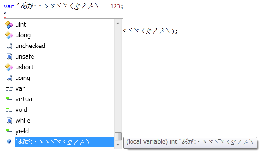
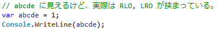
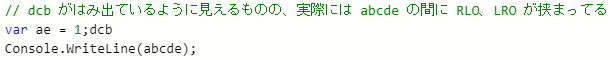

# \[雑記\] 識別子名に使える文字

## <a id="sec-generated-title-1"></a> <a id="abst"></a>概要

「[識別子名](st_variable.md#identifier)」で説明したように、
変数など、プログラマが自由に名前を付けることの出来るものを識別子（identifier）と呼びます。
識別子の名前は以下のルールでつける必要があります。

* if や while などの C# のキーワードは利用できない。

* 先頭の文字は、<code>\_</code>(下線)もしくは letter-character でなければならない。

* 先頭以外の文字は、letter-character、decimal-digit-character、connecting-character、combining-character、formatting-character のいずれかでなければならない。

* 変数名の前に<code>@</code>を付けるとキーワードも識別子名として使用できる。コンパイラには<code>@</code>は無視される(<code>x</code>という変数と<code>@x</code>は同じものとして扱われる)。

* 識別子名には Unicode エスケープシーケンス(<code>\uxxxx</code>という書式で4桁の Unicode を書いたもの)も利用できる。


ここでは、letter-character とかが何かというのを説明します。

ちなみに、C# に限らず、識別子に Unicode を使える言語では、たいてい同じようなルールを採用しています。


## <a id="sec-generated-title-2"></a> <a id="unicode"></a>Unicode の文字クラス

C# の識別子に利用可能な文字、letter-character などは、Unicode の文字クラスに基づいて以下のように定められています。

（
Unicode では、文字の持つ意味によって各文字をカテゴリーわけしています。
このカテゴリーのことを文字クラスと呼びます。
）

* letter-character: Lu、Ll、Lt、Lm、Lo、Nl

* combining-character: Mn、Mc

* decimal-digit-character: Nd

* connecting-character: Pc

* formatting-character: Cf

まあ、これだけで意味が分かったら苦労しません。
普段からよっぽど Unicode とおつきあいのある人以外には、
こんな文字クラスの記号を見せられても意味が分からないですよね。

ということで、次節以降で簡単な説明をしていきます。


##### <a id="sec-generated-title-3"></a>参考

一応、参考までにリンクを2つほど：

* [文字クラスのルール（第35回　要素や属性の名前に使用できる文字の規定） ](http://www.atmarkit.co.jp/fxml/rensai/w3cread35/w3cread35_2.html)

* [Unicode 表](http://www.unicode.org/Public/3.1-Update/UnicodeData-3.1.0.txt)

ちなみに、C# が採用しているこの識別子のルールは C# が独自に定めたものではなく、
Unicode が推奨しているルール([Unicode Standard Annex #31](https://unicode.org/reports/tr31/))に則ったものです。

## <a id="sec-generated-title-4"></a> <a id="initial"></a>識別子の1文字目から使える文字

識別子の1文字目には以下の文字が使えます。

* letter-character
    * Lu : 大文字。

    * Ll : 小文字。

    * Lt : 見出しにだけ使うような特殊なアルファベット。

    * Lm : 文字修飾子。
        * 日本語でいうと、長音記号とか繰り返し記号（ゝ）とか。

        * 発音記号の長音を表す三角コロン（ː）なんかもこの文字クラス。


    * Lo : その他の文字。大小の区別をもたないような言語の文字は全部この文字クラス。
        * ひらがな、カタカナ、漢字はいずれもこれ。

        * というか、アジア諸国の文字は大概これ。

        * 「ゆ」も「ゅ」も両方 Lo。


    * Nl : letter-character 扱いされる数字。ローマ数字（Ⅰ、Ⅱ、Ⅲ、Ⅳ）とか。


要するに、可読文字なら言語を問わずたいてい利用可能です。


## <a id="sec-generated-title-5"></a> <a id="noninitial"></a>識別子の2文字目以降に使える文字

識別子の2文字目以降では、
letter-character に加えて、
以下の文字が使えます。

* combining-character
    * Mn : アクセント記号など（â ←この a の上に載ってるような記号）。
        * 他の文字とくっついて、表示上は1文字に見えるもの。

        * 例えば、HTML で「あ&amp;#x3099;か&amp;#x309A;」って書くことで、あ゙か゚ って表示される。


    * Mc : 他の文字にくっついてしか現れない文字。
        * ಹಾ ← カナダ先住民の文字らしいけど、2文字がくっついて1つになってる。これの2文字目が Mc クラス。


* connecting-character
    * Pc : 単語をつなぐ文字。アンダーバー（_）とか。
        * a⁀b とか c‿d （tie 記号）とかも。


* decimal-digit-character
    * Nd : 数字。算用数字だけじゃなくて、インドとかの数字もこのクラス。


* formatting-character
    * Cf : 書式指定。 zero width joiner とか left to right mark とか、見た目には表れない文字。


## <a id="sec-generated-title-6"></a> <a id="confusing"></a>紛らわしい文字

* 濁点・半濁点
    * 日本語の濁点・半濁点には、半角文字を除いても、 Mn クラスの combining voiced sound mark っていうのと、 Sk クラス（記号扱い）の voiced sound mark っていうのの2つある。

    * IME で「だくてん」の変換で出てくるのは Sk クラスの方なので、識別子には使えない。

    * あ゙か゚ とかは OK（Mn クラスの方の濁点・半濁点は、ほかのひらがな・カタカナと一体化して表示される）。

    * 半角の濁点・半濁点（ﾞ と ﾟ）はなぜか Lm クラス。1文字目から識別子に使えたりする・・・。


* ドット
    * ドット（·）やカタカナ中点（・）は  Po クラス（句読点扱い）で識別子に使えない。

    * 同様に、数学で使うドット演算子（⋅）も Sm クラス（数学記号）で識別子に使えない。


* コロン
    * 半角のコロン（:）が識別子に使えないのはもちろん、全角のコロン（：）もダメ（Po クラス）。

    * でも、三角コロン（ː）は識別子に使える。 この文字は発音記号の長音に使うものなので、扱いが日本語の長音記号（ー）と同じ（Lm クラス）。


* 長音記号っぽいもの
    * カタカナの長音記号（ー）は識別子として使える。

    * 見た目似てるけど、ダッシュ記号（― とか）は識別子に使えない。文の区切りに使うものなので（Pd クラス）。

    * ～ 記号は、wave dash（ダッシュ記号扱い、Pd クラス）も、 fullwidh tilde（全角チルダ、数学記号扱い、Sm クラス）も識別子に使えない。


* ￥（全角円記号）は Sc クラス（通貨記号扱い）で、識別子利用不可。


##### <a id="sec-generated-title-7"></a>おまけ

案外、変な記号も識別子に使えちゃうんで、以下のようなまね可能。
良い子は真似しちゃダメ。

```csharp {title="コンパイル通るよ"}
        var ﾟあ゙か゚ː・ゝゞヽ⁀ヾ〱‿〲〳〴〵 = 123;
```


<figure>

[](../../../../assets/media/ufcpp2000/csharp/fig/OddIdentifier.png)

<figcaption>変な記号</figcaption>
</figure>

## <a id="sec-generated-title-8"></a> <a id="supplementary"></a>追加面文字

C# は内部的に文字を UTF-16 (2バイト)で扱っています。
C# は2002年のリリースですが、開発自体は1990年代から始まっていて、ちょっと90年代の名残が見られます。
そのため、2バイトに収まらない文字(追加面文字、supplementary planes)の扱いが面倒だったりします。

[現在の C# コンパイラー](https://github.com/dotnet/roslyn)は C# 自身を使って書かれていているので、識別子に使える文字にも影響があります。
要するに、2バイトに収まらない文字は使えません。

C# の仕様上は「2バイトに収まるかどうか」には触れておらず、単に「letter であれば使える」となっているので、実は現在の C# コンパイラーは仕様を満たしていない状態です。

```csharp {title="追加面文字識別子"}
// 以下の文字はカテゴリー的には Other Letter なので本来は識別子として使えるはず。
// 以下のコードがコンパイル エラーを起こすのは、現在の C# コンパイラーが仕様を満たしていない。
var 𓀀 = 1; // ヒエログリフ
var 𩸽 = 2; // 漢字の一部は追加面文字
var 𐊀 = 3; // 鉄器時代に使われていた古い文字
 
// 以下の文字は Number なので、2文字目以降であれば使えたはず。
// 現状はコンパイル エラー。
var a𒐀 = 4; // 楔形文字の数字
 
// 絵文字とかは Symbol カテゴリーなので追加面かどうかにかかわらず、仕様的にダメ。
// 以下のコードがコンパイル エラーになるのは仕様通り。
var 😊 = 5;
var 🀀 = 6;
```

ちなみに、これは C# コンパイラー開発チームも把握している既知の問題ですが、
実際にこれで困ることが少なくて需要がないため、修正は先送りにされています。

## <a id="sec-generated-title-9"></a> <a id="escape-sequence"></a>エスケープ シーケンス

[エスケープ シーケンス](st_embeddedtype.md#escape-sequence)のうち、`\u` と `\U` の2つは識別子としても使えます。
例えば以下のコードは普通に有効な C# コードです。

```csharp {title="エスケープ シーケンス識別子の例"}
var \u0061 = 1; // var a = 1; と同じ意味
Console.WriteLine(a); // 1
Console.WriteLine(\U00000061); // 記法が違ってもやっぱり a の意味で解釈されるので 1 が表示される
Console.WriteLine(nameof(\u0061)); // a と表示される
```

## <a id="sec-generated-title-10"></a> <a id="ignore-format"></a>formatting character の無視

これも[Unicode Standard Annex #31](https://unicode.org/reports/tr31/)による推奨事項なんですが、
C# では、識別子中に含まれる formatting character を完全に無視します。
例えば[zero width joiner](https://ja.wikipedia.org/wiki/%E3%82%BC%E3%83%AD%E5%B9%85%E6%8E%A5%E5%90%88%E5%AD%90)という文字(文字コード U+200D)が該当します。
なので、`ab` と `a\u200Db` は同じ識別子として認識されて、
以下のコードはコンパイル可能なコードになります。

```csharp {title="formatting character を含むい識別子の例"}
var ab = 1;
Console.WriteLine(a\u200Db); // 間に ZWJ が挟まっていても無視されて ab と同じ意味
```

[双方向テキスト](https://ja.wikipedia.org/wiki/%E5%8F%8C%E6%96%B9%E5%90%91%E3%83%86%E3%82%AD%E3%82%B9%E3%83%88)がらみの formatting character を使うと、
見た目がだいぶおかしいソースコードを書けたりもします。
例えば以下のコードは、おそらく今見ているこのページ上では表示がおかしいと思います。
(ちゃんとコンパイルできるコードです。)

```csharp {title="双方向テキスト用 formatting character の例"}
var a‮bcd‭e = 1;
Console.WriteLine(abcde);
```

このソースコードは環境によって以下のように表示されます。





(ちなみに、1枚目が Visual Studio 上での表示、
2枚目が[ブラウザー上での表示](https://try.dot.net/)です。)
