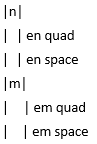
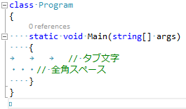

# \[雑記\] C# ソースコードと Unicode

## <a id="sec-generated-title-1"></a> <a id="abstract"></a>概要

「[[雑記] 識別子名に使える文字](misc_identifier.md)」 で説明したように、C# では、Unicode の文字クラスに基づいて「使える文字」を規定しています。
ここでは、いくつかその Unicode にまつわる与太話をしていきます。

C# だけでなく、1990年代後半以降にできたプログラミング言語はだいたい同じような方針のはずです。
(ぱっと思いつくのでも、Java, Go, Swift とかではここで話したような内容が当てはまるはず。)


## <a id="sec-generated-title-2"></a> <a id="whitespace"></a>空白文字

識別子だけでなく、空白文字の判定にも Unicode 文字クラスを使います。
(C# の場合、空白文字はほとんどの場面で意味を持たず無視されます。意味があるのは ++ の間くらい。)
具体的には、C# の空白文字の定義は以下のようになっています。

* 空白(whitespace)とは、以下のいずれかである
    * Unicode クラス Zs の任意の文字

    * 水平タブ (horizontal tab) 文字 (U+0009)

    * 垂直タブ (vertical tab) 文字 (U+000B)

    * 改ページ (form feed) 文字 (U+000C)


また、クラス Zs の文字は表1に示す通りです。

<table summary="クラス Zs の文字">
	<caption>
		クラス Zs の文字
	</caption>
	<tr>
		<th>文字コード</th>
		<th>文字</th>
		<th>補足</th>
	</tr>
	<tr>
		<td markdown="1">U+0020</td>
		<td markdown="1">SPACE</td>
		<td markdown="1">普通のスペース</td>
	</tr>
	<tr>
		<td markdown="1">U+00A0</td>
		<td markdown="1">NO-BREAK SPACE</td>
		<td markdown="1">「ここで改行するな」指定付きのスペース</td>
	</tr>
	<tr>
		<td markdown="1">U+1680</td>
		<td markdown="1">OGHAM SPACE MARK</td>
		<td markdown="1">古アイルランド語の文字</td>
	</tr>
	<tr>
		<td markdown="1">U+2000</td>
		<td markdown="1">EN QUAD</td>
		<td markdown="1">n 字幅のクワタ(行末の隙間埋めスペース)</td>
	</tr>
	<tr>
		<td markdown="1">U+2001</td>
		<td markdown="1">EM QUAD</td>
		<td markdown="1">m 字幅のクワタ(行末の隙間埋めスペース)</td>
	</tr>
	<tr>
		<td markdown="1">U+2002</td>
		<td markdown="1">EN SPACE</td>
		<td markdown="1">n 字幅のスペース</td>
	</tr>
	<tr>
		<td markdown="1">U+2003</td>
		<td markdown="1">EM SPACE</td>
		<td markdown="1">m 字幅のスペース</td>
	</tr>
	<tr>
		<td markdown="1">U+2004</td>
		<td markdown="1">THREE-PER-EM SPACE</td>
		<td markdown="1">1/3 m 字幅のスペース</td>
	</tr>
	<tr>
		<td markdown="1">U+2005</td>
		<td markdown="1">FOUR-PER-EM SPACE</td>
		<td markdown="1">1/4 m 字幅のスペース</td>
	</tr>
	<tr>
		<td markdown="1">U+2006</td>
		<td markdown="1">SIX-PER-EM SPACE</td>
		<td markdown="1">1/6 m 字幅のスペース</td>
	</tr>
	<tr>
		<td markdown="1">U+2007</td>
		<td markdown="1">FIGURE SPACE</td>
		<td markdown="1">数字と同じ幅のスペース</td>
	</tr>
	<tr>
		<td markdown="1">U+2008</td>
		<td markdown="1">PUNCTUATION SPACE</td>
		<td markdown="1">ピリオドとかと同じ幅のスペース</td>
	</tr>
	<tr>
		<td markdown="1">U+2009</td>
		<td markdown="1">THIN SPACE</td>
		<td markdown="1">狭いスペース</td>
	</tr>
	<tr>
		<td markdown="1">U+200A</td>
		<td markdown="1">HAIR SPACE</td>
		<td markdown="1">かなり狭いスペース</td>
	</tr>
	<tr>
		<td markdown="1">U+202F</td>
		<td markdown="1">NARROW NO-BREAK SPACE</td>
		<td markdown="1">細めの「ここで改行するな」指定付きのスペース</td>
	</tr>
	<tr>
		<td markdown="1">U+205F</td>
		<td markdown="1">MEDIUM MATHEMATICAL SPACE</td>
		<td markdown="1">数式中で記号間に使うスペース</td>
	</tr>
	<tr>
		<td markdown="1">U+3000</td>
		<td markdown="1">IDEOGRAPHIC SPACE</td>
		<td markdown="1">日本語の全角スペース</td>
	</tr>
</table>


幅違いなだけのスペースが山ほどあります。例えば、m 字幅、n 字幅を | で囲って表示してみると、図1のようになります。
(ちなみに、Microsoft Word で Unicode を16進数で打った後、Alt+X を押すと変換できたりします。この場合はそれぞれ 2000, 2001, 2002, 2003 の後に Alt+X。)

<figure>

[](../../../../assets/media/ufcpp2000/csharp/fig/em-space.png)

<figcaption>m 字幅スペースと n 字幅スペース</figcaption>
</figure>


表1の最後の1列を見ての通り、全角スペースも Zs クラスです。
つまり、C# は全角スペースをちゃんと空白文字として認識しています。
「プログラマに全角スペースを見せると発狂する」なんてネタもありますが、ソースコードを Unicode で保存する限り、全角スペースが入っていてもどうということはありません。

<figure>

[](../../../../assets/media/ufcpp2000/csharp/fig/WhiteSpace.png)

<figcaption>C# は全角スペースを空白文字として受け付けます(Visual Studio のスクリーン キャプチャ画像)</figcaption>
</figure>


ちなみに、Visual Studio は Zs クラスの文字を打った先から消したり、通常のスペース(U+0020)に変換したりしてくれますが、
クリップボードから貼り付けた上で、Visual Studio に変換されてしまったら Ctrl+Z で戻すとかやれば、
任意の空白文字を入力することは一応できます。
メリットはないですけども。


## <a id="sec-generated-title-3"></a> <a id="katakana-middle-dot"></a>注意: カタカナ中点

Unicode の文字クラスに基づいているということは、Unicode に変更があった場合、C# も影響を受けます。
日本語的にかなり困るのは、カタカナ中点(なかぐろ)「・」(katakana middle dot、U+30FB)です。

カタカナ中点は、昔は Pc クラス(connector。C# 的には識別子の2文字目以降に使っていい文字)でしたが、
Unicode 5.1 から 6.0 の間で Po クラス(その他の句読点。C# 的に、識別子に使えない)に変更されました。
ちなみに、カタカナ中点の用途はハイフンとかと同じということになっているので、Po が正しい(ハイフンとかは Po)です。
5.1 までがミスみたい。

そして、C# 6 から、判定基準が Unicode 6.0 以降になりました。
つまり、以下のソースコードは、C# 5.0 まではコンパイルできたものの、C# 6 ではコンパイルできません。

```csharp {title="C# 6 でコンパイルできなくなったコード"}
using System;

class Program
{
    static void Main(string[] args)
    {
        int x・y = 10;
        Console.WriteLine(x・y);
    }
}
```


同様の問題は、Java 7 でも起きているようです。

### <a id="sec-generated-title-4"></a> <a id="vb-unicode"></a>余談: Visual BasicとUnicode

余談になりますが、使っているUnicodeのバージョンが変わった影響は、Visual Basicの方が大きいみたいです。

VBは、識別子の大文字・小文字を区別しない言語なわけですが、この大文字・小文字の判定もUnicodeの文字クラスをベースに判定しています。

カタカナ中点のように文字クラスががらっと変わったような文字はほとんどありませんが、大文字・小文字の判定変わった文字はちらほらあるみたいで、VBに影響が少し出ているそうです。
(こちらは、日本人にとっては全くといっていいほど影響はないはずですが。)

## <a id="sec-generated-title-5"></a> <a id="emoji"></a>絵文字

Swift は絵文字を識別子に使えると聞いて。

ちなみに、C#は今のところ、[サロゲート ペア](http://www.codezine.jp/article/detail/1592) (16ビットで収まらず、UTF16 では2ワードになっちゃう文字)になっている文字は受け付けていません。
絵文字はその領域に入っている文字なので、識別子には使えません。

また、たとえC#がサロゲート ペアを解釈するようになったとしても、絵文字はUnicodeの文字クラスは「記号・その他」(C#では識別子に使えない)なので、C#で絵文字識別子が使えるようになることは今後もないでしょう。

まあ、使えてもしょうがないというか、むしろ使えるとやばそうな例がいくつかあったりします。

##### <a id="sec-generated-title-6"></a>カラー絵文字

やばい例その1: [http://www.swiftstub.com/381749597/](http://www.swiftstub.com/381749597/)

```swift {title="Swift 絵文字識別子 その1: 色付きハート"}
let 💙 = 1
let 💚 = 2
let 💛 = 4
let 💜 = 8
println(💙 + 💚 + 💛 + 💜)
```


```console {title="実行結果"}
15
```


上から順に、青ハート、緑ハート、黄ハート、紫ハートです。カラー絵文字フォントを使って表示すると結構きれい。
白黒フォントだと結構悲惨。


##### <a id="sec-generated-title-7"></a>数学シンボル

やばい例その2: [http://www.swiftstub.com/647829248/](http://www.swiftstub.com/647829248/)

```swift {title="Swift 絵文字識別子 その2: 数字識別子"}
let 𝟢 = 1
let 𝟣 = 2
let 𝟤 = 4
let 𝟥 = 8
let 𝟦 = 16
let 𝟧 = 32
let 𝟨 = 64
let 𝟩 = 128
let 𝟪 = 256
let 𝟫 = 512

var x = 0
x += 𝟢
x += 𝟣
x += 𝟤
x += 𝟥
x += 𝟦
x += 𝟧
x += 𝟨
x += 𝟩
x += 𝟪
x += 𝟫

println(x)
```


```console {title="実行結果"}
1023
```


コンパイル通った… 
𝟢って書いたら0じゃなかった。
何を言っているかわからねぇと思うが、書いた本人も後で見てわかる気がしねぇ。

種を明かすと、これ、変数に使っているのは数学シンボルです。
「Mathematical Alphanumeric Symbols」って言って、U+1D400 ~ 1D7FF の辺りに、数式で使う用の、フォント指定付きのアルファベットや数字があります。
上記コードの0は、リテラルの方が普通の数字、変数に使ってる方が「MATHEMATICAL SANS-SERIF DIGIT」(サンセリフ フォント指定の数字)の𝟢(U+1D7E2)。

ちなみに、Unicode 的にも、こういう「フォント指定付き文字」みたいなものを使うのはあんまり推奨されていません。
