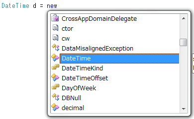
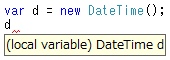

# \[雑記\] 型推論の是非

##  概要

<h5 class="version version3">Ver. 3.0</h5>

C# 3.0 では、var キーワードを用いて、暗黙的に型付けされたローカル変数を定義できるようになりました（型推論（type inference））。
型推論は便利な機能ではあるんですが、“いいことずくめ”なものではなく、少々副作用もあって、
その利用形態をめぐって軽い論争が起きたりもしています。

具体的にいうと、var の利用ポリシーとして、
以下のようなものが考えらていて、
どれがいいのかでもめています。

* 匿名型利用時など、どうしても必要なときだけ使う

* ↑に加え、右辺が new SomeClass() のようなときだけ var を使う

* int, string などの組み込み型に対しては使わない

* 使えるところでは全部使う

“いいことずくめ”なんだったら「使えるところでは全部使う」でいいんですが、
最初に言ったように、少々副作用を伴うので、利用を制限した方がいいのではないかという話。
実際、マイクロソフト自身も、MSDN Library などのドキュメント中では「型推論がどうしても必要な場合に限って var を使う」という方針を採っています。

##### 現状（2010年）の認識

ほとんどの場合は var を使って問題ないはずです。
var を使って見づらいと感じる場合、それは var 自体の問題というよりは、他の要因（1つのメソッドが長すぎるなど）があるので、リファクタリングしましょう。

ただし、var の見やすさは Visual Studio などの IDE 前提な面があります。
そのため、教科書や、MSDN Library などのドキュメント上では var が避けられる傾向があります。

##  最初に私見を

最初に私見を書いておこうかと。

まず何より、「C# 3.0 の var はあくまで「型推論」であって、バリアント型ではない」ということは改めて念を押しておきます。型が合ってなければコンパイル時にエラーがでるし、Visual Studio で変数にマウスカーソルを合わせれば型名が表示される。C# が型の甘い言語になったということでは断じてない。

で、var 利用ポリシーに関して、僕としては、当初は、

* 型は厳格であって欲しい

* 冗長な記述も、人的エラーのコンパイル時訂正機能として働く

という理由から var は乱用すべきではないなぁと思っていたんですが。

最近はどうかというと、特にこだわることなく適当にコードを書いていて、ふと自分のコードを見返してみると「var が使えるところでは割と全部 var」になっていて、しかもそれで可読性が落ちたとも感じませんでした。多分、Visual Studio の補助があるからこそそう感じるんだと思いますが。まあ、せいぜい、右辺値からぱっと見で型がよっぽど想像しにくそうなときにだけ var を避けようかなぁと思うくらい。

##  var の長短

var、すなわち、型推論の導入というのは、結局のところ、コードの冗長性の排除なわけですね。

<pre class="source" title="" lang="">
<code>SomeClass x = new SomeClass();
</code></pre>

みたいなコード、なんで2度も SomeClass って書かなきゃいけないのよと。以下のように、型名が長い場合には特にうんざりします。

<pre class="source" title="" lang="">
<code>System.Collections.Generic.List&lt;int&gt; list =
  new System.Collections.Generic.List&lt;int&gt;();
</code></pre>

プログラミングの格言の1つに、Don't Repeat Yourself、通称“DRY 原則”というのがあって、重複・冗長性は排除しろといわれます。重複があると、何か変更する際に複数の場所を書き換えないと動かない。手間はかかるし、バグの原因になるからやめろと。

一方で、冗長性というのはエラー耐性を生む場合もあります。通信・符号化理論を学んだことがある人は分かると思いますが、日常的にやり取りしている情報には冗長性があって、それを排除することでファイルサイズを圧縮したり、逆に、ファイルサイズを増やす代わりにエラー訂正・検出能力を持たせることができます。

冗長性によるエラー耐性
例えば以下のコードを考えてみます。

<pre class="source" title="" lang="">
<code>int n1 = 10; // (1)
var n2 = 10; // (2)
</code></pre>

(1) の場合、左辺値だけで型は明らかに int だと分かります。一方、(2) の場合は、「サフィックスなしの数値リテラルは int だよな」と一瞬考えて初めて int 型だと分かります。もちろん、C# になれた人からするとこのくらいは常識ではあるんですが、チーム開発とかやると、自分が常識だと思っていることで、チームメイトとの意思疎通に失敗することもあるので危険だと。結局、冗長なままにしておいた方が読みやすくていいだろうって話に。

あと、以下のようなコードも考えてみましょう。

<pre class="source" title="" lang="">
<code>var x = 1;
var y = .1;
</code></pre>

たった1つの . の有無で変数の型が変わります。まあ、等幅フォントを使っていて . が見えないってことはないし、ちゃんと 0.1 と書けよという話ではあるんですが。でも、冗長性を極力排除するというのは、こういう「コード上ほんの少しの変更が、コンパイル結果に大きな変化をもたらす」という状況を生みます。これは、時に、重大なエラーを引き起こす可能性を秘めています。

###  DRY 原則

ところで、最初のコード、開発の途中で「整数にするよりも浮動小数点にする方がよさそうだぞ」と思ってしまった場合にはどうなるでしょう。

<pre class="source" title="" lang="">
<code>// (1)
// int n1 = 10;
// ↓
double n1 = 3.14;

// (2)
// var n2 = 10;
// ↓
var n2 = 3.14;
</code></pre>

(1) の側は左右両辺書き換えが必要になりますね。ここだけではなく、n1 を利用する箇所全部で修正が必要になるかもしれません。ところが、(2) の側はその必要がない。これが、最初に言った DRY 原則って奴です。冗長なコードを書くと、仕様変更時に修正が複数個所に及び、手間がかかると。

ある意味、var は Generics と一緒で、静的ポリモーフィズムに使えるわけです。どんな型にでも対応可能な変数が作れるけども、コンパイル時には型が確定します。

###  作法の問題？

「変数の型が右辺値を見て明らかな場合にのみ var を使う」と決めた場合、以下のようなコードはどう考えるべきでしょう。

<pre class="source" title="" lang="">
<code>var x = GetPoint();
SetPoint(x);
</code></pre>

メソッドの名前からして Point 型だろうとは想像付きますが、それは System.Drawing.Point 型？それとも、自作の Point 構造体？

また、前節の説明どおり、var は静的ポリモーフィズムの1形態とも考えられるんで、型が分かることが必ずしもいいとは限らないわけです。

例えば、↑のコードは SetPoint(GetPoint()); とほぼ同様のコードとみなせます。この場合、GetPoint() の戻り値が System.Drawing.Point だろうが、System.Windows.Media.Media3D.Point3D だろうが、自作の Point 構造体だろうが、なんだってかまわない。要は、GetPoint の戻り値と SetPoint の引数の型があってさえすればそれで OK。ところが、変数 x の型を明示してしまうとそうも言っていられないと。

で、じゃあ、今度は以下のようなコードを考えてみましょう。

<pre class="source" title="" lang="">
<code>var x = GetPoint();

// 長い処理

SetPoint(x);
</code></pre>

最初のコードには賛成派な人も、こうなると一気に否定的印象を持つんじゃないでしょうか。最初のコードは、変数 x のスコープが短いんで、「ぱっと見で型が判別しづらい」という var の欠点があまり問題にならないんですが、間に長い処理が挟まることで、その欠点が問題になりそうだと、警戒感が生まれます。

でも、このコード、変数名に x なんていう適当な名前をつけてるのがそもそもの問題とも取れます。

プログラミング作法的には、一般に、処理の単位ごとに細かく関数に区切るべきだとされていますし、変数名も意味のある名前をつけろってのが常識。そうすると、↑みたいなコードの問題は、結局、var が悪いんじゃなくて、長ったらしい関数を書いたこととか x っていう適当な名前を付けたことにあるのかもしれない。

同じようなものでも、以下のようなコードならどうでしょうか。

<pre class="source" title="" lang="">
<code>var point = GetPoint();

// 長いっていってもせいぜい1画面に収まる程度の処理

SetPoint(point);
</code></pre>

ずいぶんと印象が変わると思います。

結局、コードの可読性というのは、var の是非の問題というか、プログラミング作法の問題な気がします。

###  Visual Studio による補助

var を使うと変数の型が分かりにくくなるというのも、var の方がタイピング数が少なくていいというのも、Visual Studio を使ってプログラミングをしているとどちらも大した問題にはならなかったり。もちろん、全ての人が Visual Studio を使ってるわけではないですし、中にはやっぱり、テキストエディタでプログラミングをしたいという昔かたぎな人もいるわけですけど。

まあ、例えば、以下のコードを Visual Studio で打つことを考えます。

<pre class="source" title="" lang="">
<code>DateTime d1 = new DateTime(); // (1)
var d2 = new DateTime();      // (2)
</code></pre>

まず、タイピング数に関しては、(1) の方は「DateTime d = new 」まで打てばインテリセンスで DateTime が出てくる（図1）のに対して、(2) の方は new の後ろをちゃんと打たないといけません。結局、インテリセンスに頼る限り、タイピング数に大差は生まれません。

<figure>
	
	<figcaption>Visual Studio のインテリセンス</figcaption>
</figure>

変数 d の型の判別のしやすさも、型を明記しようが var を使おうが、Visual Studio で変数 d にマウスカーソルを合わせれば型名が出てくるんで（図2）、型を明記するメリットはあんまり大きくもないです。

<figure>
	
	<figcaption>Visual Studio の型情報表示</figcaption>
</figure>

##  [余談] ラムダ式と var の相性の悪さ

少し話題はそれますが、var による型推論は、ラムダ式と相性が悪かったりします。

(追記: [ラムダ式以外にも、同様に `var` と相性の悪い構文がいくつかあります](misctyperesolution.md#target-type))

例えば、以下のコードはコンパイルができますが、

<pre class="source" title="" lang="">
<code>Func&lt;int, int&gt; f1 = x =&gt; x * x;
var f2 = (Func&lt;int, int&gt;)(x =&gt; x * x);
</code></pre>

以下のコードはコンパイルできません。

<pre class="source" title="" lang="">
<code>var g1 = x =&gt; x * x;
var g2 = (int x) =&gt; (int)(x * x);
var g3 = (Func&lt;int, int&gt;)x =&gt; x * x;
</code></pre>

(追記: C# 10.0 からは `g2` についてはコンパイルできるようになっています。
詳しくは「[デリゲートの自然な型](../functional/sp_delegate.md#natural-type)」で説明します。)

g1 がコンパイルできない理由は簡単。ラムダ式は左辺を見て型推論して、var は右辺値を見て型推論する。循環していては型推論ができるはずはないと。

g2 は、C# では同じシグネチャを持つ別のデリゲートを定義できるのが原因で、int → int のメソッドなことが分かっていても、デリゲートの型が確定しない。

g3 は単純ミスですね。ラムダ式を作るための =&gt; 演算子よりも、キャスト演算子の方が結合順位が高いせいです。(Func&lt;int, int&gt;)(x =&gt; x * x) と書けばコンパイルできます。

ラムダ式に対して無理やりにでも var を使いたければ、例えば、以下のような補助メソッドを書いて、

<pre class="source" title="" lang="">
<code>static Func&lt;T, T&gt; F&lt;T&gt;(Func&lt;T, T&gt; func)
{
  return func;
}
</code></pre>

以下のようにします。

<pre class="source" title="" lang="">
<code>var f3 = F&lt;int&gt;(x =&gt; x * x);
var f4 = F((int x) =&gt; x * x);
</code></pre>

この場合でも、以下のようなコードはコンパイルできません。

<pre class="source" title="" lang="">
<code>var g4 = F(x =&gt; (int)x * x);
Func&lt;int, int&gt; g5 = F(x =&gt; x * x);
</code></pre>

Generics も型推論に頼っているので、変にサボろうとするとうまく型推論が働かなくなります。

<!-- original-page-break -->

##  戻り値型推論は認められない

`var`キーワードによる型推論は、C#に追加された当初こそ否定的な意見も多かったですが、今となってはそれほど警戒すべきものでもないでしょう。
C#の型推論はローカル変数に対してしか使えず、型が見えにくくて困るとしても、せいぜいローカルな狭い範囲だけの話です。

むしろ、ローカル変数にしか`var`を使えないことに不満がる声すらあります。
[関数](../structured/st_function.md)の戻り値や[複合型](../structured/st_struct.md)のメンバーの型を推論してほしいという要望もよく出ます。
C#以外の言語だと、こういう、より多くの場面で型推論を認めているプログラミング言語もあります。
要するに、以下のような書き方を許してほしいという話です。

<pre class="source" title="フィールドやメソッド戻り値の型推論(案)">
<code>class Program
{
    static void Main()
    {
        var x = Add(M, N); // (int, int) に推論される
    }

    static var M = 50;  // int に推論される
    static var N = 100; // 同上
    static var Add&lt;T&gt;(T x, T y) =&gt; (x, y);
}
</code></pre>

これに関しては、<em>C#で認められることは今後もない</em>でしょう。
推論が多段になることが原因です。
ローカル変数の`var`と違って、以下のように、書いた人も書かれた場所も違うコードを多段に追いかける必要があります。

<pre class="source" title="戻り値型推論では、多段にコードを追う必要がある">
<code>// 開発者 X がソースコード A.cs に書いたコード
class A
{
    public static var a = 1;
}

// 開発者 Y がソースコード B.cs に書いたコード
class B
{
    public static var b = A.a + 1;
}

// 開発者 Z がソースコード C.cs に書いたコード
class C
{
    public static var c = B.b * B.b;
}
</code></pre>

多段になることで、いくつかの観点での問題を起こします。

- 性能上の問題: 型推論に掛かる時間が読めなくなる
- 影響範囲の問題:
  - 深くまでソースコードを追わないと実際の型がわからくなる
  - 自分の変更が他人に与える影響が読めなくなる。
  - コンパイル時のエラーの発生場所と、実際のエラーの原因になっている場所が遠く離れて直しにくくなる

###  性能上の問題

多段の型推論は、先ほど示したようなシンプルな例でも、書いた行数に比例した時間がかかる可能性があります。
さらに問題になるのは、書いた行数に対して指数的な時間がかかる場合すらあることです。
以下のようなコードでも、4行に対して、下手な実装だと2の4乗で16倍の時間がかかりかねません。

<pre class="source" title="組み合わせによって、指数的に推論時間が伸びる例">
<code>using System;

class A
{
    public static var a = 1;
    public static var b = Tuple.Create(a, a);
    public static var c = Tuple.Create(b, b);
    public static var d = Tuple.Create(c, c);
}
</code></pre>

もっと複雑なコードであれば、ちゃんとした実装であっても指数時間を避けれない場合があり得ます。

実際、大幅に型推論を許しているプログラミング言語の中には、「型推論に時間が掛かりすぎているので推論を打ち切ります。コンパイルできませんでした」というエラー メッセージを出すものもあったりします。

C#はコンパイル時間にもかなり気を使っているプログラミング言語なので、この時間の増大はあまり許容できません。

###  影響範囲の問題

先ほどの3つの型`A`, `B`, `C`の例で、`A`の作者が軽い気持ちでちょこっと値を書き換えたとします。
例えば以下のような感じで、計算過程で`int`(左)の代わりに`double`(右)を使いたくなったとしましょう。

<table>
<tr>
<td>
<pre class="source" title="c は int">
<code>class A
{
    public static var a = 1;
}
class B
{
    public static var b = A.a + 1;
}
class C
{
    public static var c = B.b * B.b;
}
</code></pre>
</td>
<td>
<pre class="source" title="c は double">
<code>class A
{
    public static var a = <em>1.0</em>;
}
class B
{
    public static var b = A.a + 1;
}
class C
{
    public static var c = B.b * B.b;
}
</code></pre>
</td>
</tr>
</table>

以下のようなことが起こっています。

- `A`の作者としてはメンバー`a`の型まで変えるつもりはなかったかもしれませんが、推論によって勝手に`double`に変化しました
- 芋づる式に、`B.b`と`C.c`の型も`double`に変わりました
- `C`を利用していた人が、`int`を前提としたコードを書いていて、コンパイル エラーを起こします
- よくわからないけども、`C.c`の型が変わったらしいです。でも`C.c`のコード的には型が見えず、何のせいでこうなったのかわかりません
- `C`の作者に問い合わせます。`C`の作者は身に覚えがありません。たぶん`B`のせい？
- `B`の作者(以下略
- `A`の作者が初めて問題に気づきます

高々3段、高々3人ですらそこそこ面倒な問題になるでしょう。
まして、実際のプログラムはもっと複雑です。
前節の性能上の問題と同様、段数に対して指数的に関係者が増える可能性もあります。

もう1例見てみましょう。
今度は、戻り値の型推論と匿名型が組み合わさっています。

<table>
<tr>
<td>
<pre class="source" title="変更前">
<code>using System;

class A
{
    public static var F(int x, int y)
        =&gt; new { x, y };
}
class B
{
    public static var G(int x) = A.F(x, x);
}

class Program
{
    static void Main()
    {
        var p = B.G(1);
        Console.WriteLine(p.x);
    }
}
</code></pre>
</td>
<td>
<pre class="source" title="変更後">
<code>using System;

class A
{
    public static var F(int x, int y)
        =&gt; new { <em>X</em> = x + y, <em>Y</em> = x - y };
    // ↑ new { x, y } だったのが new { X, Y } に変わった
}
class B
{
    public static var G(int x) =&gt; A.F(x, x);
}

class Program
{
    static void Main()
    {
        var p = B.G(1);
        Console.WriteLine(<em>p.x</em>); // ここでエラー
    }
}
</code></pre>
</td>
</tr>
</table>

こちらは、メンバー名の変更です。小文字の`x`、`y`だったものが、大文字の`X`、`Y`に変わっています。
結果的に、利用側の、`Main`の中の`p.x`の部分でコンパイル エラーになるでしょう。
このとき、エラー メッセージとしては、「出所はよくわからないけども、匿名型にメンバー`x`がありません」というようなメッセージしか出せなかったりします。

大幅に型推論を許しているプログラミング言語では、コードが複雑になると、ちょっとしたエラーで、読めた代物じゃない上に膨大な量のエラー メッセージが出ることがあります。

C#のように、大規模プロジェクトでも使われるプログラミング言語では、このような問題は、型推論で得られるメリットよりも大幅なデメリットになります。

###  対案: 左辺から右辺の型推論

この通り、C#では、ローカル変数以外の`var`による型推論は、おそらくずっと認められることはないでしょう。
代わりと言ってはなんですが、「逆向きの型推論」が入る可能性はあります。
すなわち、以下のような書き方です。

<pre class="source" title="newの際の型推論">
<code>class A
{
    public A() { }
    public A(int n) { }
}

class Program
{
    A n = default; // defautl(A)
    A x = new();   // new A()
    A y = new(1);  // new A(1)
    A F(int n) =&gt; new(n); // new A(n)
}
</code></pre>

`new`演算子の後ろや、`default`演算子の`()`を省略可能で、型は、フィールドの型や戻り値の型から推論されます。

型推論をしたいという要望の大部分が、「同じ型を2度ずつ書くのが無駄」という面倒さに対する嫌悪感なので、
この構文が入れば`var`による(右辺から左辺の)型推論の必要性は下がるはずです。
かつ、この向き(左辺から右辺)の型推論であれば、これまで問題視してきた多段になるような事態は避けられます。

この構文は、早ければC# 8あたり(2017～2018年頃？)で入りそうです。

(追記: `A n = default;` は C# 7.1 ([default 式](../cheatsheet/ap_ver7_1.md#default-expr))で、
`A x = new();` は C# 9.0 ([ターゲットからの new 型推論](../cheatsheet/ap_ver9.md#target-typed-new))で入りました。)
