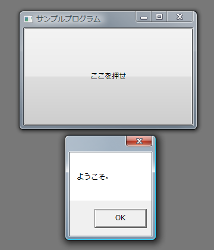
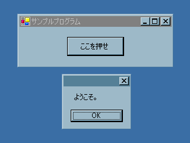
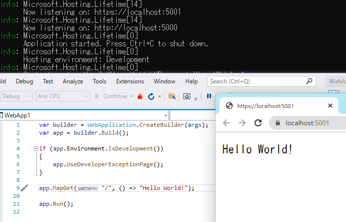

# C#のプログラムの基本構造

## 概要
##### ポイント
* C# プログラムは Main から始まります。

* 「[クラス](../oop/oo_class.md#class)」とか「[名前空間](../structured/sp_namespace.md#namespace)」とかは、今のところおまじない（後々説明）。

## C#の簡単なプログラム例
まずは C# を用いて書かれた簡単なプログラムを見てみましょう。

<ul>
	<li>C#</li>
	<li>VB</li>
	<li>F#</li>
	<li>C++</li>
</ul>

<pre class="source" title="最も簡単なC#プログラム" lang="C#">
<code>using System;
 
class Program
{
<em>    static void Main(string[] args)
    {
        // 初めてC#を学ぶ方々にご挨拶
        Console.WriteLine("皆様、はじめまして");
    }</em>
}
</code></pre>

<pre class="source" title="" lang="VB">
<code>Module Program
 
    Sub Main()
        ' 初めてVisual Basicを学ぶ方々にご挨拶
        Console.WriteLine(("皆様、はじめまして")
    End Sub
 
End Module
</code></pre>

<pre class="source" title="" lang="F#">
<code>// 初めてF#を学ぶ方々にご挨拶
open System
Console.Write "皆様、はじめまして"
</code></pre>

<pre class="source" title="" lang="C++">
<code>#include "stdafx.h"
 
using namespace System;
 
int main(array&lt;System::String ^&gt; ^args)
{
  // 初めてC++/CLIを学ぶ方々にご挨拶
    Console::WriteLine(L"皆様、はじめまして");
    return 0;
}
</code></pre>

これからしばらくの間は <code>using</code> とか <code>class</code> という部分のことは忘れて、
背景色を変えて強調してある部分だけを注目してください。

<em>
        C#のプログラムは、すべてこの<code>Main</code>と書いてある部分から始まります
      </em>。
このプログラムは、画面(DOSプロンプト中)に“皆様、始めまして。”という文字を表示します。
<em>
        <code>Console.Write</code>は文字や数値を画面に出力するためのもの
      </em>で、詳しくは「[ライブラリ](../structured/st_library.md)」で説明します。
また、<em>
        <code>//</code>から始まる行はコメント
      </em>で、プログラムの動作とは関係ありません。詳しくは「[コメント](st_comment.md)」で説明します。

ちなみに、
<code>using</code>は「[名前空間](../structured/sp_namespace.md)」で、
<code>class</code>は「[クラス](../oop/oo_class.md)」で、
<code>public</code>は「[実装の隠蔽](../oop/oo_conceal.md)」で、
<code>static</code>は「[静的メンバー](../oop/oo_static.md)」で、
<code>void</code>は「[関数](../structured/st_function.md)」で説明していきます。

### C# 9.0 から
<h5 class="version version9">Ver. 9.0</h5>

C# 9.0 からは、上記のコードを以下のように書くことができます。

<pre class="source" title="">
<code>using System;
// 初めてC#を学ぶ方々にご挨拶
Console.WriteLine(&quot;皆様、はじめまして&quot;);
</code></pre>

`namespace` とか `class` とかを飛ばして、書きたい処理を直接ファイル直下に書くことができるようになりました。
詳しくは「[トップ レベル ステートメント](../misc/miscentrypoint.md#top-level-statements)」で説明します。

### C# 10.0 から
<h5 class="version version10">Ver. 10.0</h5>

C# 10.0 からは、さらに、以下のように縮めて書くことができます。

<pre class="source" title="">
<code>// 初めてC#を学ぶ方々にご挨拶
Console.WriteLine(&quot;皆様、はじめまして&quot;);
</code></pre>

`using` も消えました。
詳しくは「[global using](../structured/sp_namespace.md#global-using)」で説明します。

## GUIプログラム例
C# では GUI (Graphical User Interface: 要するに、Windowsなどのようにボタンやメニューなどをマウスで操作するようなもの)プログラミングも行えます。

GUI プログラムは文字ベース(CUI: Character User Interfaceという)のプログラムに比べて煩雑な処理が多く、難しいので、ここでは例を挙げるにとどめます。

<h5 class="version version3">Ver. 3.0</h5>
ちなみに、この例は、.NET Framework 3.0、C# 3.0 以降で動きます。
詳しくは、「[Windows Presentation Foundation](../../dotnet/index.md#wpf)」で説明します。

<ul>
	<li>C#</li>
	<li>VB</li>
	<li>F#</li>
</ul>

<pre class="source" title="GUI プログラム例（WPF）" lang="C#">
<code>using System;
using System.Windows;
using System.Windows.Controls;

public class Program
{
    [STAThread]
    static void Main()
    {
        var button = new Button { Content = "ここを押せ" };
        button.Click += (sender, e) =&gt; MessageBox.Show("ようこそ");

        var win = new Window
        {
            Title = "サンプルプログラム",
            Width = 300,
            Height = 200,
            Content = button,
        };

        var app = new Application();
        app.Run(win);
    }
}
</code></pre>

<pre class="source" title="" lang="VB">
<code>Module VBSample

    Sub Main()
        Dim button = New Button With {.Content = "ここを押せ"}
        AddHandler button.Click, Function(sender, args) {MessageBox.Show("ようこそ")}

        Dim win = New Window With
                  {
                      .Title = "サンプルプログラム",
                      .Width = 300,
                      .Height = 200,
                      .Content = button
                  }

        Dim app = New Application()
        app.Run(win)
    End Sub

End Module
</code></pre>

<pre class="source" title="" lang="F#">
<code>open System
open System.Windows
open System.Windows.Controls
 
let button = new Button(Content = "ここを押せ")
button.Click.Add(fun x -&gt; MessageBox.Show("ようこそ") |&gt; ignore)

let win = new Window(
                     Title = "サンプルプログラム",
                     Width = 300.0,
                     Height = 200.0,
                     Content = button)

[&lt;STAThread&gt;]
do
    let app = new Application()
    app.Run(win) |&gt; ignore
</code></pre>

<figure>
	
	<figcaption>C# 3.0 WPF によるGUIプログラムの例</figcaption>
</figure>

（古いコード（Windows Forms））

      
.NET Framework 2.0 時代の古いコードも残しておきます。
詳しくは、「[GUI アプリケーション](../lib/lib_forms.md)」で説明します。

      
<pre class="source" title="C#によるGUIプログラムの例" lang="">
<code>namespace CsharpSample
{
  using System;
  using System.Windows.Forms;
  using System.Drawing;

  /// &lt;summary&gt;
  /// ボタンが1つ付いたウィンドウを作成し、
  /// ボタンを押したときに「ようこそ。」と書かれたメッセージボックスを表示
  /// &lt;/summary&gt;
  class WelcomeForm : Form
  {
    Button button;

    WelcomeForm()
    {
      // ウィンドウ内にボタンをひとつ作成
      this.Text       = "サンプルプログラム";
      this.ClientSize = new Size(256, 64);

      this.button = new Button();
      this.button.Location = new Point(80, 16);
      this.button.Size     = new Size(96, 32);
      this.button.Text     = "ここを押せ";
      this.button.Click   += new EventHandler(button_Click);
      this.Controls.Add(this.button);
    }

    // ボタンが押されたときの処理
    private void button_Click(object sender, System.EventArgs e)
    {
      MessageBox.Show("ようこそ。");
    }

    static void Main() 
    {
      Application.Run(new WelcomeForm());
    }
  }
}
</code></pre>

      
このサンプルプログラムでは、ボタンがひとつあるウィンドウが表示され、
ボタンを押すと“ようこそ。”というメッセージが表示されます。

      
<figure>
	
	<figcaption>C#によるGUIプログラムの例</figcaption>
</figure>

      
ちなみに、
Visual Studio でこのソースをコンパイルする場合、
「Windows フォームアプリケーション」プロジェクトにしてください。
また、コマンドラインで csc を使ってコンパイルする場合、
（ソースファイルの名前を WelcomeForm.cs とすると）以下のようなコマンドでコンパイルします。

      
<pre class="console" title="コマンドラインで csc を使ってコンパイルする場合">
csc /r:system.windows.forms.dll /r:system.drawing.dll /t:winexe WelcomeForm.cs
</pre>
   

## Webアプリ例
<h5 class="version version10">Ver. 10</h5>

C# 10.0/ .NET 6 世代では、Webアプリ開発を以下のような十数行のコードから始められるようになりました。

<pre class="source" title="">
<code>var builder = WebApplication.CreateBuilder(args);
var app = builder.Build();

if (app.Environment.IsDevelopment())
{
    app.UseDeveloperExceptionPage();
}

app.MapGet("/", () =&gt; "Hello World!");

app.Run();
</code></pre>

