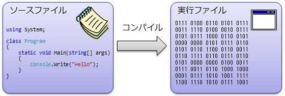
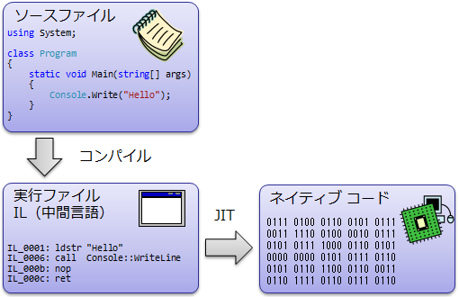
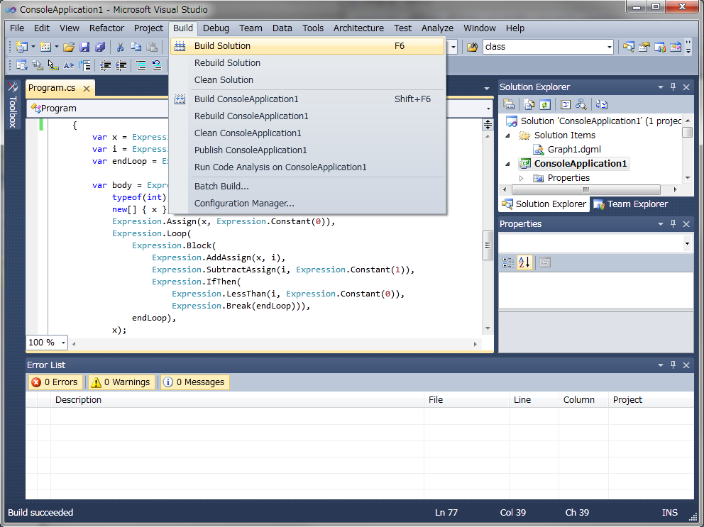

# プログラムの作成・実行

## <a id="sec-generated-title-1"></a> <a id="abst"></a>概要

ここでは、C# でプログラムを書いたあと、そのプログラムを実行するまでの流れを説明します。


##### <a id="sec-generated-title-2"></a>ポイント

* ソースファイル: プログラミング言語（人が読み書きしやすい形式）で書かれたコード

* 実行ファイル: コンピューターが実行できる形式

* コンパイル: ソース → 実行ファイルへの変換

* Visual Studio（無料版の Visual Studio Community もあり）等を使えば、1ボタンでコンパイル

* csc source.cs


## <a id="sec-generated-title-3"></a> <a id="make"></a>プログラムの作成

コンピュータプログラムを作成するには、
プログラミング言語を用いてプログラムを記述し、
それをコンピュータが理解できる形式に変換する必要があります。
もちろん、始めからコンピュータが理解できる形式(0, 1 の羅列)で命令を打ち込むことでもプログラムを作成できますが、
通常は人間にとって理解しやすいプログラミング言語を用いてプログラムを作成します。

このプログラミング言語を用いて書かれたプログラム記述(<strong id="source" class="keyword">ソースファイル</strong>(source file))をコンピュータが実行できる形式(<strong id="exec" class="keyword">実行ファイル</strong>(excutable file))に変換する作業のことを<strong id="compile" class="keyword">コンパイル</strong>(compile: 翻訳)と言います。
また、コンパイルを行うためのソフトウェアのことを<strong id="compiler" class="keyword">コンパイラ</strong>(compiler)と呼びます。

<figure>

[](../../../../assets/media/ufcpp2000/csharp/fig/compile1.png)

<figcaption>コンパイル</figcaption>
</figure>


### <a id="sec-generated-title-4"></a> <a id="dotnet"></a>.NET プログラム

C# など、.NET Framework 上で動くプログラムの場合、
CPU 依存な命令（ネイティブ コード（native code）に直接コンパイルするのではなく、
CPU 非依存な中間言語（intermediate language、略して IL）と呼ばれるものにコンパイルされます。

<figure>

[](../../../../assets/media/ufcpp2000/csharp/fig/compile2.png)

<figcaption>コンパイル</figcaption>
</figure>


IL は、プログラムの実行時に少しずつネイティブ コードにコンパイルされます。
このような方式を、Just In Time コンパイル（JIT）と呼びます。


## <a id="sec-generated-title-5"></a> <a id="vc"></a>Visual Studio を使ったプログラムの作成

[統合開発環境](../devenv/ab_devenv.md)を用いると、プログラムを容易に作成できます。
ここでは、
統合開発環境の1つである Visual Studio を使ってコンソール アプリ(文字ベースのプログラム)の作成手順を例にして解説します。

※ スクリーンショットなどは古いバージョンの Visual Studio のものですが、
見た目が少し変わっていたりするくらいで、大まかな流れは現在(執筆時点で Visual Sutido 2017 15.3)でもそれほど変わっていません。

### <a id="sec-generated-title-6"></a> <a id="project"></a>プロジェクトの作成

Visual Studio でコンソールプログラムを作る場合には、まず、新しいプロジェクトを作成します。
プロジェクトの作成は、スタートページにある[新しいプロジェクト]というボタンを押すか、
メニューから[ファイル]→[新規作成]→[プロジェクト]を選択します。

すると「新しいプロジェクト」というウィンドウが出てくるので、
この中から「コンソールアプリケーション」を選択し、
[プロジェクト名]に今から作りたいプログラムの名前を入れて[OK]ボタンを押します。


### <a id="sec-generated-title-7"></a> <a id="excute"></a>プログラムの作成・実行

プロジェクトを作成したら、後は作成された C# プログラムの雛形を元にソースを編集してコンパイルすればプログラムを作成できます。
Visual Studio では [F6] キーまたは [Ctrl+Shift+B] というショートカットキーを押すだけでコンパイルが行えます。
また、テスト実行をしたい場合には [F5] キーを押せば作成したプログラムを実行してみることができます。

<figure>

[](../../../../assets/media/ufcpp2000/csharp/fig/VsBuild.png)

<figcaption>Visual Studio でのプログラムの作成（画像は 2010 β2 のもの）</figcaption>
</figure>


##### <a id="sec-generated-title-8"></a>参考動画

サンプル作成の様子を動画化してみました。
<iframe width="480" height="390" src="https://www.youtube.com/embed/P_9xj2msC6M" frameborder="0" allowfullscreen=""></iframe>
(この動画では Visual Studio 2010 を利用しています。)


## <a id="sec-generated-title-9"></a> <a id="sdk"></a>C# コンパイラーのみでのプログラムの作成

（注意: 本節は Visual Studio に無料版がなかった頃に書いた文章です。
現在の [Visual Studio](https://visualstudio.microsoft.com/ja/downloads/) は、
条件を満たせば無料で使用可能です。
そのため、現在では統合開発環境を使わない理由も特にないのですが、
一応、統合開発環境に頼りたくないという人向けの説明も残します。
）

これからプログラミングの勉強を始めようという人にとっては無料で入手できる環境が欲しいものです。
そこで、無料で入手できる.NET Framework SDK のみを使った C# によるプログラム作成方法を紹介します。


### <a id="sec-generated-title-10"></a> <a id="cscompiler"></a>C# コンパイラ

C# のソースファイルをコンパイルするためには C# コンパイラが必要になります。
.NET Framework をインストール（開発者向けである必要はなく、Windows Update でインストール可能な実行環境のみで OK）すれば、
CSC(C Sharp Compiler)というコンパイラも一緒にインストールされます。
CSC は、

```console
[Windowsフォルダ]\Microsoft.NET\Framework\[バージョン番号]
```


というフォルダーに、csc.exe という名前で置かれています。
例えば、C ドライブに Windows を（標準設定で）インストールしている人で、
.NET Framework 2.0 の場合なら、

```console
C:\Windows\Microsoft.NET\Framework\v2.0.50727
```


という場所に csc.exe があるはずです。


### <a id="sec-generated-title-11"></a> <a id="makewithsdk"></a>プログラムの作成

C# のソースファイルはただのテキストファイルですから、Windows 付属のメモ帳や、ネットにフリーで公開されているエディタなどを使って編集できます。
(エディタは[窓の杜](http://www.forest.impress.co.jp/editor.html)や[Vector](http://www.vector.co.jp/vpack/filearea/win/writing/edit/index.html)で探してみてください。)

ためしに、[「C#のプログラムの基本構造」](../../../../assets/st_basis.html)で書いたサンプルプログラムをメモ帳などを使って自分の手で打ち込んで、それを「sample.cs」という名前で保存してみてください。
(ここではとりあえず、<code>C:\My Documents</code> に保存したということにして話を進めます。)

この作成した C# ソースファイルを CSC を使ってコンパイルするわけですが、
そのためにはまず、Windows NT, 2000 の場合は「コマンドプロンプト」を、Windows98, Me の場合は「MS DOS プロンプト」を開きます(どちらも標準ではスタートメニューのアクセサリのところにショートカットが入っています)。

コマンドプロンプトのウィンドウが開いたら、
先ほど sample.cs を保存したフォルダに移動します

```console
cd "\My Documents"
```


最後に、csc を実行して sample.cs をコンパイルします。
コンパイルは以下のように入力することで行えます。

```console
csc sample.cs
```


また、「<code>csc /?</code>」と入力することで csc のヘルプが見れますので、
csc のより詳しい操作が知りたい人は一度目を通してみてください。


### <a id="sec-generated-title-12"></a> <a id="excutewithsdk"></a>プログラムの実行

さて、これでソースファイルの間違いが無ければコンパイルが行われ、
sample.exe という名前の実行ファイルが出来ているはずです。
「<code>sample</code>」と入力することでプログラムを実行することが出来ます。
以下に実行例を示します。

```console
C:\My Documents> sample
皆様始めまして。
```


##### <a id="sec-generated-title-13"></a>参考動画

サンプル作成の様子を動画化してみました。
<iframe width="480" height="390" src="https://www.youtube.com/embed/oYUClOpjwQE" frameborder="0" allowfullscreen=""></iframe>
* 表示する文字は単に "Hello" にしています（タイピングが面倒だった）。

* csc.exe のある場所には、事前にパスを通してあります。
## <a id="exercise"></a>演習問題

### <a id="exercise-compile1"></a>問題 1


「[C#の簡単なプログラム例](st_basis.md#sample)」中のプログラムを実際に作成し、コンパイル・実行してみよ。
