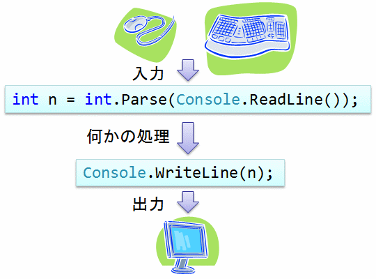
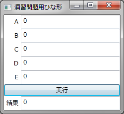
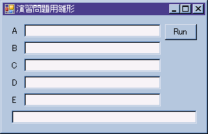

# 値の入出力

## 概要
これから本格的に C# によるプログラミングを解説して行くことになりますが、
ただ文章で説明するよりも実際にサンプルプログラムを挙げて説明するほうが分かりやすいと思うので、
そうして行きたいと思います。
また、ただ単に計算を行うだけのプログラムよりも、
ユーザーからの入力を受け取って、計算結果を出力するようなもののほうが面白いでしょうから、
そのようなサンプルプログラムを挙げていきたいと思っています。

そのためにまず、C# の文字ベースプログラムにおける入出力の行い方について簡単に説明しておきます。
ただ、現時点ではまだ詳しい説明は出来ませんので、
「とりあえずこうすれば入出力が行える」ということだけ覚えておいてもらうことになります。

<figure>
	
	<figcaption>値の入出力</figcaption>
</figure>

##### ポイント
* 「まずは慣れろ」ということで、とりあえず今は詳しい説明省略。

## 入力
C#でユーザーからの入力を受け取りたい場合、<em>
        <code>Console.ReadLine</code>
      </em> というものを使います。

<ul>
	<li>C#</li>
	<li>VB</li>
	<li>F#</li>
	<li>C++</li>
</ul>

<pre class="source" title="文字列の入力" lang="C#">
<code>var str = Console.ReadLine(); // ユーザーの入力した文字列を1行読み込む
</code></pre>

<pre class="source" title="" lang="VB">
<code>Dim str = Console.ReadLine()
</code></pre>

<pre class="source" title="" lang="F#">
<code>let str = Console.ReadLine()
</code></pre>

<pre class="source" title="" lang="C++">
<code>auto str = Console::ReadLine();
</code></pre>

数値を入力したい場合には、さらに <code>Parse</code> というものを使って、以下のようにします。

<ul>
	<li>C#</li>
	<li>VB</li>
	<li>F#</li>
	<li>C++</li>
</ul>

<pre class="source" title="数値の入力" lang="C#">
<code>var n    = int.Parse(Console.ReadLine());  // ユーザーの入力した整数を読み込む
var x = double.Parse(Console.ReadLine()); // ユーザーの入力した実数を読み込む
</code></pre>

<pre class="source" title="" lang="VB">
<code>Dim n = Integer.Parse(Console.ReadLine())
Dim x = Double.Parse(Console.ReadLine())
</code></pre>

<pre class="source" title="" lang="F#">
<code>let n = Int32.Parse(Console.ReadLine())
let x = Double.Parse(Console.ReadLine())
</code></pre>

<pre class="source" title="" lang="C++">
<code>auto n = Int32::Parse(Console::ReadLine());
auto x = double::Parse(Console::ReadLine());
</code></pre>

<code>int</code> や <code>double</code> については「[変数と式](st_variable.md)」で、
<code>var</code> については「[型推論](st_variable.md#infer)」で、
<code>Console</code> については「[ライブラリ](../structured/st_library.md)」で説明します。

## 出力
計算結果などを出力したい場合には <em>
        <code>Console.Write</code>
      </em> というものを使います。

<ul>
	<li>C#</li>
	<li>VB</li>
	<li>F#</li>
	<li>C++</li>
</ul>

<pre class="source" title="出力" lang="C#">
<code>int m = 1, n = 3;
Console.Write("m = {0}, n = {1}", m, n); // 文字や数値の出力
</code></pre>

<pre class="source" title="" lang="VB">
<code>Dim m = 1, n = 3
Console.Write("m = {0}, n = {1}", m, n)
</code></pre>

<pre class="source" title="" lang="F#">
<code>let m, n = 1, 3
Console.Write("m = {0}, n = {1}", m, n)
</code></pre>

<pre class="source" title="" lang="C++">
<code>int m = 1, n = 3;
Console::Write("m = {0}, n = {1}", m, n);
</code></pre>

この出力の仕方はフォーマット出力といって、
<code>{0}</code> とある場所に <code>m</code> の値が、
<code>{1}</code> とある場所に <code>n</code> の値が書き込まれます。
例えば上述のサンプルの出力結果は以下のようなものになります。

<pre class="console" title="">
m = 1, n = 3
</pre>

##### サンプル

<ul>
	<li>C#</li>
	<li>VB</li>
	<li>F#</li>
	<li>C++</li>
</ul>

<pre class="source" title="入出力のサンプル" lang="C#">
<code>using System;

class Program
{
    static void Main()
    {
        // 入力を促すメッセージの表示して、文字を入力してもらう
        Console.Write("あなたのお名前は？ : ");
        var name = Console.ReadLine();

        // 入力を促すメッセージの表示して、数値を入力してもらう
        Console.Write("あなたのお年は？   : ");
        var age = int.Parse(Console.ReadLine());

        // メッセージの出力
        Console.WriteLine("{0} ({1}歳) さん、ようこそお越しくださいました。", name, age);
    }
}
</code></pre>

<pre class="source" title="" lang="VB">
<code>Module Program

    Sub Main()
        Console.Write("あなたのお名前は？ : ")
        Dim name = Console.ReadLine()

        Console.Write("あなたのお年は？   : ")
        Dim age = Integer.Parse(Console.ReadLine())

        Console.WriteLine("{0} ({1}歳) さん、ようこそお越しくださいました。", name, age)
    End Sub

End Module
</code></pre>

<pre class="source" title="" lang="F#">
<code>open System

Console.Write("あなたのお名前は？ : ")
let name = Console.ReadLine()

Console.Write("あなたのお年は？   : ")
let age = Int32.Parse(Console.ReadLine())

Console.WriteLine("{0} ({1}歳) さん、ようこそお越しくださいました。", name, age)
</code></pre>

<pre class="source" title="" lang="C++">
<code>Console::Write("あなたのお名前は？ : ");
auto name = Console::ReadLine();

Console::Write("あなたのお年は？   : ");
auto age = int::Parse(Console::ReadLine());

Console::WriteLine("{0} ({1}歳) さん、ようこそお越しくださいました。", name, age);
</code></pre>

<pre class="console" title="">
あなたのお名前は？ : tiyu
あなたのお年は？   : 12
tiyu (12歳) さん、ようこそお越しくださいました。
</pre>

## GUI 雛形プログラム
GUI プログラム（Windows アプリ）を使って演習問題（の一部）を解いてもらうために、
演習用 GUI プログラムの雛形を用意しました。

[GUI 雛形プログラム1](https://github.com/ufcpp/UfcppSample/tree/master/Chapters/Old/UserInputSample)

プログラムは図1に示すような見た目で、
A ～ E のテキストボックスに値を入力し、
[実行] ボタンを押してプログラムを実行します。

<figure>
	
	<figcaption>GUI 雛形プログラム1</figcaption>
</figure>

GUI プログラムの大部分は、この時点までの知識では説明できませんが、
今はとりあえず、分からない大部分は無視してもらって、
InputData.cs 中の「TODO: ↓ここに演習問題の回答コードを書いてください」というコメントのある部分だけ書き換えてください。

（旧バージョン）

(※旧ウェブサイトから未移植につきコードなし)      
      
プログラムは図1に示すような見た目で、
A ～ E のテキストボックスに値を入力し、
[Run] ボタンを押してプログラムを実行します。

      
<figure>
	
	<figcaption>GUI 雛形プログラム1</figcaption>
</figure>

      
GUI プログラムの大部分は、この時点までの知識では説明できませんが、
今はとりあえず、分からない大部分は無視してもらって、
Form1.cs 中の「TODO: ↓ここに演習問題の回答コードを書いてください」というコメントのある部分だけ書き換えてください。

    

演習問題の多くは基本的に CUI プログラム（コマンドプロンプト）を前提に作っていますが、
値を入力してもらって、何らかの計算を行って、結果を出力するタイプの演習問題には、
この雛形プログラムを利用できます。
## 演習問題

### 問題 1

Console.Write を用いて、自分の名前を画面に表示せよ。

#### 解答例 1

<pre class="source" title="" lang="">
<code>using System;

class Sample
{
  static void Main()
  {
    Console.Write("岩永信之");
  }
}
</code></pre>

### 問題 2

Console.ReadLine を用いて文字列を1行読み込み、
Console.Write を用いて読んだ文字列をそのまま鸚鵡返しするプログラムを作成せよ。

おまけ： 1度読み込んだ文字列を2度ずつ鸚鵡返しするものを作成せよ。

#### 解答例 1

<pre class="source" title="鸚鵡返し" lang="">
<code>using System;

class Sample
{
  static void Main()
  {
    string line = Console.ReadLine();
    Console.Write(line);
  }
}
</code></pre>

#### 解答例 2

<pre class="source" title="鸚鵡返し×2" lang="">
<code>using System;

class Sample
{
  static void Main()
  {
    string line = Console.ReadLine();
    Console.Write(line);
    Console.Write(line);
  }
}
</code></pre>
