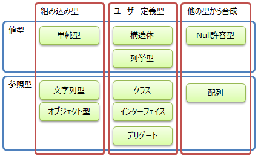

# 組込み型

## <a id="sec-generated-title-1"></a> <a id="abst"></a>概要

プログラミング言語にあらかじめ用意されている変数の型を組込み型といいます。
ここでは、C# の組み込み型について説明します。


##### <a id="sec-generated-title-2"></a>ポイント

* 整数（int）や文字列（string）などは、C# 言語に組み込まれた型です

* 整数、浮動小数点数、文字、文字列、10進小数、論理値


## <a id="sec-generated-title-3"></a> <a id="type"></a>C# の型

C# の型は、以下のように分類されます。

<figure>

[](../../../../assets/media/ufcpp2000/csharp/fig/TypeClassification.png)

<figcaption>C# の型の分類</figcaption>
</figure>


このうち、本項で説明するのは「組み込み型」のところになります。

他に関しては後々説明していきます。

* 構造体:「[データの構造化](../structured/st_struct.md)」、「[構造体](../resource/rm_struct.md)」

* 列挙型:「[列挙型](../structured/st_enum.md)」

* クラス:「[データの構造化](../structured/st_struct.md)」、「[クラス](../oop/oo_class.md)」

* インターフェイス:「[インターフェース](../oop/oo_interface.md)」

* デリゲート:「[デリゲート](../functional/sp_delegate.md)」

* Null 許容型:「[Nullable 型](../resource/sp2_nullable.md)」

* 配列:「[配列](../structured/st_array.md)」


### <a id="sec-generated-title-4"></a> <a id="embedded"></a>組込み型の種類

C# には以下のような組込み型が用意されています。

<table summary="">

	<tr>
		<td markdown="1" colspan="3"></td>
		<th>符号付き</th>
		<th>符号無し</th>
	</tr>
	<tr>
		<th rowspan="9">単純型</th>
		<th rowspan="5">整数型</th>
		<th>8ビット整数</th>
		<td markdown="1"><code>sbyte</code></td>
		<td markdown="1"><code>byte</code></td>
	</tr>
	<tr>
		<th>16ビット整数</th>
		<td markdown="1"><code>short</code></td>
		<td markdown="1"><code>ushort</code></td>
	</tr>
	<tr>
		<th>32ビット整数</th>
		<td markdown="1"><code>int</code></td>
		<td markdown="1"><code>uint</code></td>
	</tr>
	<tr>
		<th>64ビット整数</th>
		<td markdown="1"><code>long</code></td>
		<td markdown="1"><code>ulong</code></td>
	</tr>
	<tr>
		<th>文字型</th>
		<td markdown="1" colspan="2">char</td>
	</tr>
	<tr>
		<th rowspan="2">浮動小数点型</th>
		<th>単精度</th>
		<td markdown="1" colspan="2"><code>float</code></td>
	</tr>
	<tr>
		<th>倍精度</th>
		<td markdown="1" colspan="2"><code>double</code></td>
	</tr>
	<tr>
		<th colspan="2">デシマル（10進小数）</th>
		<td markdown="1" colspan="2"><code>decimal</code></td>
	</tr>
	<tr>
		<th colspan="2">論理値型</th>
		<td markdown="1" colspan="2"><code>bool</code></td>
	</tr>
	<tr>
		<th colspan="3">文字列型</th>
		<td markdown="1" colspan="2"><code>string</code></td>
	</tr>
	<tr>
		<th colspan="3">オブジェクト型</th>
		<td markdown="1" colspan="2"><code>object</code></td>
	</tr>
</table>

※ C# 9.0 以降はこれに加えて、サイズが環境によって変わる [`nint`、`nuint`](../cheatsheet/ap_ver9.md#nint) という型もあります。

### <a id="sec-generated-title-5"></a> <a id="literal"></a>リテラル

<code>int x = 10;</code> というように書くとき、10 のような値をそのまま書いた部分のことをリテラル（literal: 「文字通りの」という意味。見たまんまの定数）と呼びます。
組み込み型には、型ごとにリテラルの書き方があります。

ちなみに、リテラルのことは「定数」とは訳しません。
通常、「定数」は constant の訳語です（参考: 「[定数](sp_const.md)」）。
literal を和訳する場合には、直定数と訳されます。


## <a id="sec-generated-title-6"></a> <a id="integer"></a>整数型

数学では無限の桁数の数字を扱えますが、コンピュータの内部では値を記憶しておく場所が限られているため、扱える値の範囲も限られています。
当然、桁の大きな値ほど大きな記憶領域を必要とします。
また、符号の有無によっても扱える値の範囲は変わります。

以下にC#の整数型の一覧を挙げます。

<table summary="">

	<tr>
		<th>型名</th>
		<th>記憶領域サイズ</th>
		<th>符合の有無</th>
		<th>扱える値の範囲</th>
	</tr>
	<tr>
		<td markdown="1"><code>
                        <span class="reserved">byte</span>
                    </code></td>
		<td markdown="1">1バイト</td>
		<td markdown="1">なし</td>
		<td markdown="1">0 ～ 255</td>
	</tr>
	<tr>
		<td markdown="1"><code>
                        <span class="reserved">sbyte</span>
                    </code></td>
		<td markdown="1">1バイト</td>
		<td markdown="1">あり</td>
		<td markdown="1">-128 ～ 127</td>
	</tr>
	<tr>
		<td markdown="1"><code>
                        <span class="reserved">short</span>
                    </code></td>
		<td markdown="1">2バイト</td>
		<td markdown="1">あり</td>
		<td markdown="1">-32,768 ～ 32,767</td>
	</tr>
	<tr>
		<td markdown="1"><code>
                        <span class="reserved">ushort</span>
                    </code></td>
		<td markdown="1">2バイト</td>
		<td markdown="1">なし</td>
		<td markdown="1">0 ～ 65,535</td>
	</tr>
	<tr>
		<td markdown="1"><code>
                        <span class="reserved">int</span>
                    </code></td>
		<td markdown="1">4バイト</td>
		<td markdown="1">あり</td>
		<td markdown="1">-2,147,483,648 ～ 2,147,483,647</td>
	</tr>
	<tr>
		<td markdown="1"><code>
                        <span class="reserved">uint</span>
                    </code></td>
		<td markdown="1">4バイト</td>
		<td markdown="1">なし</td>
		<td markdown="1">0 ～ 4,294,967,295</td>
	</tr>
	<tr>
		<td markdown="1"><code>
                        <span class="reserved">long</span>
                    </code></td>
		<td markdown="1">8バイト</td>
		<td markdown="1">あり</td>
		<td markdown="1">-9,223,372,036,854,775,808 ～ 9,223,372,036,854,775,807</td>
	</tr>
	<tr>
		<td markdown="1"><code>
                        <span class="reserved">ulong</span>
                    </code></td>
		<td markdown="1">8バイト</td>
		<td markdown="1">なし</td>
		<td markdown="1">0 ～ 18,446,744,073,709,551,615</td>
	</tr>
</table>


<code>int</code> は integer (整数)の略で、<code>short</code> と <code>long</code> の意味は名前通り、記憶領域サイズの長い/短いの違いです。
<code>byte</code> も名前通りで「1バイトの変数」という意味です。
<code>sbyte</code> の「s」は signed の s で符号付きを意味します。
また、<code>uint, ushort, ulong</code> の「u」は unsigned の u で符号無しを意味します。

ちなみに、8バイトよりも大きな整数値を扱いたい場合、`BigInteger`構造体(`System.Numerics`名前空間)という物を使います。
([構造体](../resource/rm_struct.md)や[名前空間](../structured/sp_namespace.md)については別項にて説明します。)

また、C# 9.0 で追加された `nint`、`nuint` は、
32ビット CPU で使う場合は `int`、`uint` と同じで、
64ビット CPU で使う場合は `long`、`ulong` と同じ範囲の値を使えます。
ただし、どちらのタイプの CPU で実行するかは事前にはわからないので、
ソースコード中に書けるリテラルとしては32ビット分(`int`、`uint` と同じ)しか使えません。

### <a id="sec-generated-title-7"></a> <a id="intl"></a>整数リテラル

C# のソースコード中に直接整数値を書き込むと整数リテラルとみなされます。
また、整数値の後ろに「u」か「U」を付けると符号なし整数とみなされ、
「l」か「L」を付けると <code>long</code> 型のリテラルとみなされます。

```csharp
int   k = 351;    // 整数リテラル
uint  l = 86U;    // 符号なし
long  m = 1879L;  // Lを付けるとlongとみなされる
ulong n = 2419UL; // UとLを付けるとulongとみなされる
```


## <a id="sec-generated-title-8"></a> <a id="char"></a>文字型

コンピュータは基本的に数値しか扱えません。
そのため、文字もコンピュータの内部では整数値として扱われています。
どの文字に対して何番の数字を割り当てるかは、標準化団体によって取り決めがなされています。
このような取り決めによって文字に割り当てられた整数値を<em>文字コード</em>といいます。

C# では、内部的に Unicode という2バイトの文字コードが使われています。
（正確には UCS-2。サロゲートなしの UTF-16。
残念ながら、UTF-32 ではないので、一部の文字（サロゲート ペア）の表現に2文字分の領域を使います。）

とにかく、C# の文字型 <code>
                <span class="reserved">char</span>
            </code> (characterの略)は2バイトの数値として扱われます。


### <a id="sec-generated-title-9"></a> <a id="charl"></a>文字リテラル

文字リテラルは <code>
                    <span class="string">'a'</span>
                </code> といったように <code>'</code> (シングルクォーテーション)で囲んで表現します。

前述の通り、C# の `char`型 UTF-16 なので、文字リテラルも2バイトの数値です。
[`short` や `ushort`](#integer)とは、互いに桁落ちなく変換することもできます。

```csharp
short x = (short)'a'; // 97 と同じ意味
char c = (char)97;    // 'a' と同じ意味
```

また、<code>'</code> 自身を表す文字リテラルは <code>
                    <span class="string">'\''</span>
                </code> というように書きます。

```csharp
char c = 'a';                       // 文字リテラル
```

### <a id="sec-generated-title-10"></a> <a id="escape-sequence"></a>エスケープ シーケンス

C# では `\` 記号(バックスラッシュ。日本語環境だと ¥ マークで表示されることもあり)が特別な意味を持っていて、`\` に続く数文字を一定のルールで別の文字に置き換えます。
以下のような用途で使います。

- `''` 中で `'` 自体を書くなど、本来書けない場所に記号を書く
- 改行文字やタブ文字など、不可視だけどそれなりの頻度で使いたい文字を目に見える形で書く

(今となってはほとんど使わないような文字も、古くからの名残で数文字あります。
通信で文字くらいしか送れなかった時代の名残であったり、
文字ではないもののキーボードにボタンがあるものであったりです。)

この `\` 記号から始まる特殊記法を、
「書けない文字を書くための回避策(escape)」、「数文字(sequence)使って1文字を表す」という意味で、<strong id="key-escape" class="keyword">エスケープ シーケンス</strong>(escape sequence)と言います。

C# は以下のようなエスケープ シーケンスを持っています。

| 使う文字 | 意味 | Unicode の値(16進数) |
| ---- | ---- | ---- |
| `\'` | `'` (引用符)。文字リテラル(`''`) 中に `'` を書くために使う | 27 |
| `\"` | `"` (2重引用符)。文字列リテラル(`""`) 中に `"` を書くために使う | 22 |
| `\\` | `\` (バックスラッシュ)。エスケープ シーケンスにでない意味で `\` を書くために使う | 5C |
| `\0` | null 文字(文字列の終端を表したり、特別な使い方をする文字) | 00 |
| `\a` | アラート音(ビープ音を鳴らすのに使ってた) | 07 |
| `\b` | バックスペース(1文字前文字を消す) | 08 |
| `\f` | フォーム フィード(タイプライターで用紙送りに使ってたコード) | 0C |
| `\n` | 改行(new line) | 0A |
| `\r` | 復帰(carriage return)。行頭に戻る処理<sup>※</sup> | 0D |
| `\t` | 水平タブ | 09 |
| `\v` | 垂直タブ | 0B |
| `\e` | 【[C# 13](../cheatsheet/ap_ver13.md) 以降】エスケープ文字 | 1B |
| `\u` | Unicode の値直打ち(4桁) | 後述 |
| `\U` | Unicode の値直打ち(8桁) | 後述 |
| `\x` | Unicode の値直打ち(任意桁) | 後述 |

<sup>※</sup>Windows で改行が `\r\n` なのは、行頭に戻る + 次行に移る の組み合わせが必要だった時代の名残り。今となっては `\n` だけで改行を表せるので `\r` は 微妙な文字。

`\u`、`\U`、`\x` は実際には `\u0061`、`\U0001F60A`、 `\x61` などというように、後ろに16進数の値を伴います。
この、後ろに書かれた16進数の数値を文字コードに持つ文字に置き換わります。
例えば16進数で61というのはアルファベットの a を表すコードで、要するに `\u0061` は `a` と同じ意味になります。

```csharp {title="Unicode エスケープ シーケンス"}
Console.WriteLine('\u0061'); // 文字 a
Console.WriteLine("\U0001F60A"); // 絵文字の 😊
Console.WriteLine('\x61'); // 文字 a。4桁固定じゃないということ以外は \u と同じ
```

`\u`、`\U`、`\x`の3つの差は、後ろに続く16進数の長さの差です。

- `\u` … 4桁固定。61であっても `\u0061` というように0を埋めて4桁にする必要がある
- `\U` … 8桁固定。同様に0埋めして8桁にする必要がある
- `\x` … 任意桁

前述の通り、C# の文字は UTF-16 になっていて2バイトの数値です。
これは Unicode が2バイト固定だった(65536文字ですべての文字を表せるとおごっていた)時代の名残で、今となっては `char` では表せない文字がたくさんあります。
(日本の常用漢字が2136文字ですし、1990年代以前には文字は2バイトもあれば十分だと思われていました。)

`\U` (16進数8桁 = 4バイト)はそういう2バイトに収まらない文字を表すのに使います。
例えば絵文字がそうで、😊 の文字コードは 1F60A なので、C# では `\U0001F60A` と書くことができます。
`char` では値が収まらないので、文字リテラル(`''`)中には書けません。
後述する[文字列リテラル](#stringl)の中で使います。
(無意味ですが、0で埋めてわざわざ `\U00000061` などと書くなら、`char` として有効な値なので文字リテラルの中にも書けます。)

`\x` は、後ろに続く16進数が任意桁である点だけが `\u` との差です。
任意桁数な代わりに、区切りがはっきりしている場面でしか使えません。
例えば、`\u0061b` (文字コード 61 の後ろに文字 b)なら `ab` と同じ意味なりますが、
`\x61b`と書いてしまうとこれは文字コード 61B (アラビア語の文字です)の意味になります。

ちなみに、`\u` と `\U` は文字・文字列リテラルの外で、[識別子](misc_identifier.md)にも使えます。

```csharp {title="\u, \U 識別子"}
var \u0061 = 1; // var a = 1; と同じ意味
Console.WriteLine(a); // 1
Console.WriteLine(\U00000061); // 記法が違ってもやっぱり a の意味で解釈されるので 1 が表示される
Console.WriteLine(nameof(\u0061)); // a と表示される
```

## <a id="sec-generated-title-11"></a> <a id="float"></a>浮動小数点型(実数型)

整数型のところでも述べたように、コンピュータの中では有限桁の数しか扱えませんので、
厳密にはコンピュータの中で「実数型」というものは扱うことが出来ません。
しかし、科学技術計算などでは、非常に大きな数や、非常に小さな数を扱いたい場面がしばしばあります。

そこで、「1.4982654×10<sup>58</sup>」というように、
指数表記を使って数を表すことを考えます。
こうすることで、非常に大きな数や、非常に小さな数を限られた桁数で表現することが出来ます。
小数点の位置を変えて数を表現するので、このような形式の数を<em>浮動小数点数</em>(floating point number)といいます。
コンピュータの内部では、実数はこのように浮動小数点数として（近似的に）扱われています。

以下にC#の浮動小数点型の一覧を挙げます。

<table summary="">

	<tr>
		<th>型名</th>
		<th>記憶領域サイズ</th>
		<th>精度</th>
		<th>扱える値の範囲</th>
	</tr>
	<tr>
		<td markdown="1"><code>
                        <span class="reserved">float</span>
                    </code></td>
		<td markdown="1">4バイト</td>
		<td markdown="1">7桁</td>
		<td markdown="1">±1.5 × 10<sup>-45</sup>～ ±3.4 × 10<sup>38</sup></td>
	</tr>
	<tr>
		<td markdown="1"><code>
                        <span class="reserved">double</span>
                    </code></td>
		<td markdown="1">8バイト</td>
		<td markdown="1">15桁</td>
		<td markdown="1">±5.0 × 10<sup>-324</sup>～ ±1.7 × 10<sup>308</sup></td>
	</tr>
</table>


<code>float</code>は floating-point (浮動小数点)の略で、<code>double</code>は double-precision floating-point (倍精度浮動小数点)という意味です。

ちなみに、浮動小数点数の内部的な形式（何ビット目がどういう意味を持つか）は標準規格化されていて、
ほとんどの CPU やプログラミング言語では IEEE 754 という名前の規格を使っています。


### <a id="sec-generated-title-12"></a> <a id="floatl"></a>浮動小数点リテラル

C# のソースコード中に小数を書き込むと浮動小数点リテラルとみなされます。
数値の後ろに「f」か「F」を付けると <code>float</code> 型とみなされ、
「d」か「D」を付けると <code>double</code> 型とみなされ、
また、浮動小数点リテラルは指数表記(2.56×10<sup>4</sup>といった形式。2.56の部分を仮数部、10の肩に乗っている4のことを指数部といいます)でも書くことが出来ます。
指数表記のリテラルの書き方は [仮数部]e[指数部] (例えば、2.56×10<sup>4</sup>は<code>2.56e4</code>と書く)です。

```csharp
double x = 2.2362;  // 浮動小数点リテラル
float  y = 2.7183f; // fを付けると単精度
double z = 6.02e23; // 指数表記 6.02×10^23
```


## <a id="sec-generated-title-13"></a> <a id="decimal"></a>デシマル（10進小数）

float や double などの浮動小数点数は、コンピュータの内部では2進小数になっています。
表1に、2進小数と10進小数の対応関係の例をいくつか挙げます。

<table summary="2進小数と10進小数">
	<caption>
		2進小数と10進小数
	</caption>
	<tr>
		<th>2進小数</th>
		<th>10進小数</th>
	</tr>
	<tr>
		<td markdown="1">0.1</td>
		<td markdown="1">0.5</td>
	</tr>
	<tr>
		<td markdown="1">0.01</td>
		<td markdown="1">0.25</td>
	</tr>
	<tr>
		<td markdown="1">0.11</td>
		<td markdown="1">0.75</td>
	</tr>
	<tr>
		<td markdown="1">0.001</td>
		<td markdown="1">0.125</td>
	</tr>
	<tr>
		<td markdown="1">0.000110011…</td>
		<td markdown="1">0.1</td>
	</tr>
</table>


これで何が問題になるかというと、
実は、（10進数での）0.1 すら、浮動小数点数では正確に（有限桁で）表すことができません。

元々誤差がつき物な科学技術計算などではこれが問題になることもないんですが、
例えば、金融などの分野では、「1.1ドル（1ドル10セント）」が正確に表せないとなると大問題になります。

そこで、C# では10進小数を表すための decimal という型が用意されています。

```csharp
decimal m = 99.9m;  // mを付けるとdecimalになる
```


一見、浮動小数点と似ていますが（小数点の位置が動くという意味では decimal も浮動小数点なんですが）、
float、double と比べて以下のような特徴があります。

* 内部的に10進数になっているので、0.1m と書けば正確に 0.1 になる。

* <code>float</code>や<code>double</code>と比べて、精度が高い代わりに、表現できる数の範囲が狭い(つまり、指数部の桁が少ない)

* サイズが16バイトと、他の数値型と比べて大きい。


表現できる数の範囲を以下に示します（比較のため、改めて浮動小数点数の値の範囲も示します）。

<table summary="">

	<tr>
		<th>型名</th>
		<th>記憶領域サイズ</th>
		<th>精度</th>
		<th>扱える値の範囲</th>
	</tr>
	<tr>
		<td markdown="1"><code>
                        <span class="reserved">float</span>
                    </code></td>
		<td markdown="1">4バイト</td>
		<td markdown="1">7桁</td>
		<td markdown="1">±1.5 × 10<sup>-45</sup>～ ±3.4 × 10<sup>38</sup></td>
	</tr>
	<tr>
		<td markdown="1"><code>
                        <span class="reserved">double</span>
                    </code></td>
		<td markdown="1">8バイト</td>
		<td markdown="1">15桁</td>
		<td markdown="1">±5.0 × 10<sup>-324</sup>～ ±1.7 × 10<sup>308</sup></td>
	</tr>
	<tr>
		<td markdown="1"><code>
                        <span class="reserved">decimal</span>
                    </code></td>
		<td markdown="1">16バイト</td>
		<td markdown="1">28桁</td>
		<td markdown="1">1.0 × 10<sup>-28</sup>～ 7.9 × 10<sup>28</sup></td>
	</tr>
</table>


double 型と比べて、大きな数を表すことは出来ない代わりに、表現できる桁数が多くなっています。
そのため、<code>float</code> や <code>double</code> とはまったくの別物として扱われ、
互いに暗黙的な型変換ができなくなっています。

2008年に IEEE 754 規格が更新されて、10進小数にも標準規格ができました。
しかし、C# の誕生よりも後なため、C# の decimal 型の内部表現はこの IEEE 754-2008 規格と互換性がありません。


### <a id="sec-generated-title-14"></a> <a id="decimall"></a>デシマルリテラル

小数の後ろに「m」か「M」を付けると <code>decimal</code> 型とみなされます。

```csharp
decimal m = 99.9m;  // mを付けるとdecimalになる
```


## <a id="sec-generated-title-15"></a> <a id="bool"></a>論理値型

論理値とは条件式が正しいか間違っているかをあらわすものです。
正しい状態(<em>真</em>または true という)と、
間違った状態(偽または false という)の2つの値を持ちます。

C# では論理値型は <code>
                <span class="reserved">bool</span>
            </code> (boolean の略。論理代数を考案した George Bool という人物にちなんで論理値のことを英語で boolean という)といいます。


### <a id="sec-generated-title-16"></a> <a id="booll"></a>論理値リテラル

論理値リテラルは真を表す <code>
                    <span class="reserved">true</span>
                </code> と、
偽を表す <code>
                    <span class="reserved">false</span>
                </code> の2つです。

```csharp
bool b = x==1;  // x が 1 ならば true 、そうでなければ false になる。
bool t = true;  // 直接 true を代入
bool f = false; // 直接 false を代入
```


ちなみに、1行目を見ての通り、== などの比較演算の結果は bool 値になります。


## <a id="sec-generated-title-17"></a> <a id="string"></a>文字列型

文字列は名前通り、文字の列なわけですから、<code>
                <span class="reserved">char</span>
            </code> 型の配列で十分な気もします。
実際、C言語などのプログラミング言語では文字列は <code>char</code> 型の配列として扱われています。
しかし、文字列には、連結、検索、置換、数値への変換など、文字の配列には無い機能が必要になります。
そのため、C# では <code>
                <span class="reserved">string</span>
            </code> という文字列用の型が用意されています。


### <a id="sec-generated-title-18"></a> <a id="stringl"></a>文字列リテラル

文字列リテラルは <code>
                    <span class="string">"文字列の例"</span>
                </code> といったように <code>"</code> (ダブルクォーテーション)で囲んで表現します。

また、文字列リテラル中で <code>"</code> を使うためには、
文字リテラル中の'と同様にエスケープシーケンスを使って
<code>
                    <span class="string">"&lt;a href=\"index.html\"&gt;"</span>
                </code> というように表現します。

```csharp
string s = "C#入門";                // 文字列リテラル
string x = "\uff9f\u0434\uff9f";    // Unicodeを直入力。 ﾟдﾟ ←これ。
```


### <a id="sec-generated-title-19"></a> <a id="verbatim-string"></a>逐語的文字列リテラル

※ C# 11 からは「[生文字列](st_string.md#raw-string)]」という同用途の別構文があります。こちらの方が書きこごちがよかったりするので、こちらの記事もご確認ください。

文字列リテラルの書き方にはもう1種類あって、<code><span class="string">@"@-quoted string"</span></code> というように、
'' や "" の前に @ (アットマーク)を付けると \ とそれに続く文字がエスケープシーケンスとはみなされず、
普通に \ 記号として解釈されます。これを逐語的文字列リテラル（verbatim string literal）といいます。

```csharp
string path = @"C:\windows\system"; // 逐語的リテラル（@-quoted string）。 \ 記号がそのまま解釈される。
```


ちなみに、逐語的文字列リテラルの場合、<em>複数行に渡る文章を書くことも出来ます</em>。
改行の位置にはちゃんと改行文字が入ります。

```csharp {title="複数行にわたる文字列"}
string multiLineString =
@"@-quoted string では、
文章を複数行に渡って書くことができます。
";
Console.Write(multiLineString);
```


こういう逐語的文字列リテラルの使い方のことを <em>here 文字列</em>と言ったりもします。
（エスケープなし、改行も含めて全部見たまま「ここに書いた通り」という意味。）

また、逐語的文字列リテラル中で " （ダブルクォーテーション）を使いたい場合は、"" というように、2つ並べて書きます。

```csharp {title="here 文字列中の引用符"}
var s = @"
var s = ""here 文字列中の引用符"";
";
Console.WriteLine(s);
```


```console
var s = "here 文字列中の引用符";
```


### <a id="sec-generated-title-20"></a> <a id="special-string"></a>特殊な文字列

<h5 class="version version6">Ver. 6</h5>

C# 6 で、文字列関連の機能が増えました。
詳しくは、「[特殊な文字列リテラル](st_string.md)」 で説明します。


## <a id="sec-generated-title-21"></a> <a id="object"></a>オブジェクト型

<code>object</code> はオブジェクト型と呼ばれ、任意の型の値を格納できる型です。

C# では、組込み型・ユーザー定義型を問わずすべての型は <code>object</code> から派生しています。
(ユーザー定義型や派生については後ほど説明します。)


### <a id="sec-generated-title-22"></a> <a id="null"></a>null

string 型や object 型は、有効な値の他に、無効な（まだ初期化されていない）状態を表す null という値を持つことができます。

```csharp {title="複数行にわたる文字列"}
object notInitializedVariable = null;
```


null （無効な値）を代入できるのは、参照型か Nullable 型のみになります
（参考： 「[値型と参照型](../resource/oo_reference.md)」、「[Nullable 型](../resource/sp2_nullable.md)」）。


## <a id="sec-generated-title-23"></a> <a id="dotnet"></a>.NET の型

.NET では、組み込み型を可能な限り他の型（詳細は後述）と区別しないようにしています。
int のような組み込み型も、「.NET の標準ライブラリ中の型の1つ」に見えるように作られています。

ということで、C# の組込み型も、実際には、.NET の標準ライブラリで定義されている型の別称になっています。
（頻繁に使うので、C# の予約語として省略形を提供している。）
以下に、C# の組込み型名と .NET の標準ライブラリで定義されている型との対応表を示します。

<table>
	<tr>
		<th>C#</th>
		<th>.NET 標準ライブラリ</th>
	</tr>
	<tr>
		<td markdown="1"><code>bool    </code></td>
		<td markdown="1"><code>System.Boolean </code></td>
	</tr>
	<tr>
		<td markdown="1"><code>byte    </code></td>
		<td markdown="1"><code>System.Byte    </code></td>
	</tr>
	<tr>
		<td markdown="1"><code>sbyte   </code></td>
		<td markdown="1"><code>System.SByte   </code></td>
	</tr>
	<tr>
		<td markdown="1"><code>short   </code></td>
		<td markdown="1"><code>System.Int16   </code></td>
	</tr>
	<tr>
		<td markdown="1"><code>ushort  </code></td>
		<td markdown="1"><code>System.UInt16  </code></td>
	</tr>
	<tr>
		<td markdown="1"><code>int     </code></td>
		<td markdown="1"><code>System.Int32   </code></td>
	</tr>
	<tr>
		<td markdown="1"><code>uint    </code></td>
		<td markdown="1"><code>System.UInt32  </code></td>
	</tr>
	<tr>
		<td markdown="1"><code>long    </code></td>
		<td markdown="1"><code>System.Int64   </code></td>
	</tr>
	<tr>
		<td markdown="1"><code>ulong   </code></td>
		<td markdown="1"><code>System.UInt64  </code></td>
	</tr>
	<tr>
		<td markdown="1"><code>nint     </code></td>
		<td markdown="1"><code>System.IntPtr   </code></td>
	</tr>
	<tr>
		<td markdown="1"><code>nuint    </code></td>
		<td markdown="1"><code>System.UIntPtr  </code></td>
	</tr>
	<tr>
		<td markdown="1"><code>char    </code></td>
		<td markdown="1"><code>System.Char    </code></td>
	</tr>
	<tr>
		<td markdown="1"><code>float   </code></td>
		<td markdown="1"><code>System.Single  </code></td>
	</tr>
	<tr>
		<td markdown="1"><code>double  </code></td>
		<td markdown="1"><code>System.Double  </code></td>
	</tr>
	<tr>
		<td markdown="1"><code>decimal </code></td>
		<td markdown="1"><code>System.Decimal </code></td>
	</tr>
	<tr>
		<td markdown="1"><code>string  </code></td>
		<td markdown="1"><code>System.String  </code></td>
	</tr>
	<tr>
		<td markdown="1"><code>object  </code></td>
		<td markdown="1"><code>System.Object  </code></td>
	</tr>
</table>


特別扱いを受けないという意味では、「C# には組み込み型はない」とも言えるでしょう。
ただし、実際のところ、ここで紹介したような「組み込み型」は、コンパイルの挙動的には結構特別扱いされています。


## <a id="sec-generated-title-24"></a> <a id="default-value"></a>既定値

C# では、変数を明示的に初期化しなかった場合に与えられる、既定値（default value）というものが決まってます。
（Main メソッドなどの内部で使う変数（＝ローカル変数と言います）の場合は、必ず明示的な初期化が必要です。
一方で、今後説明していくような、クラスのフィールドや、配列の要素では、明示的に初期値を与えず、既定値で初期化することができます。）

既定値は、現時点では 0 （数値の場合）もしくは <code>null</code> （string や object の場合）とだけ覚えておいてください。

既定値を得るための default 式というものもあります。例えば、以下のように書くと、int の規定値（0）が得られます。

```csharp {title="既定値"}
int n = default(int);
```
