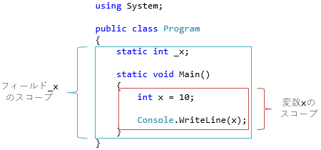

# \[雑記\] 識別子のスコープとオブジェクトの寿命

## <a id="sec-generated-title-1"></a> <a id="abstract"></a>概要

ローカル変数、メンバー名(メソッドなどの名前)、型名など、開発者が自由につけれる名前のことを<strong id="identifier" class="keyword">識別子</strong>(identifier)と言います。「識別」(identify)の名のとおり、一意に区別するためにつける名前なので、基本的には複数のものに同じ名前は付けれません。

ただし、識別子には有効は範囲があります。この範囲を識別子の<strong id="scope" class="keyword">スコープ</strong>(scope)と言い、スコープ内では識別子名は一意でなければならず、逆に、スコープが違えば、別のものに同じ名前を付けることができます。

また、スコープと関連して、以下のようなものがあります。

- スコープ: 別のものに同じ名前を付けられない範囲
  - 基本的には、その識別子を囲うブロック内がスコープです
- 変数に格納したオブジェクトの寿命
  - 基本的に、変数のスコープを外れれば、そのオブジェクトは不要([GC](../resource/rm_gc.md#garbage-collection)の対象)になります
  - ただし、[ラムダ式](../functional/sp_delegate.md#anonymous)や[イテレーター](../data/sp2_iterator.md#complied)、[非同期メソッド](../async/sp5_awaitable.md)など、オブジェクトの寿命を延ばしてしまう構文がいくつかあります
- 変数を使える範囲:
  - スコープ内で、かつ、変数宣言より下でだけ変数を使えます
  - さらに、変数に格納した値を読み出すためには、確実に初期化してからでなければいけません

本稿では、これらについて説明して行きます。

## <a id="sec-generated-title-2"></a> <a id="scope"></a>識別子のスコープ

C#の識別子のスコープは、原則として、<em>その識別子の定義場所を囲むブロック内</em>です。例えば以下のようになります。



この範囲では、基本的に同じ名前は使えないということになります。

### <a id="sec-generated-title-3"></a> <a id="nested-block"></a>入れ子のブロック

スコープの範囲は、ブロックが入れ子になっている個所も含めます。
すなわち、以下のようなコードはコンパイル エラーになります。

```csharp
public static void M()
{
    int x = 10;

    {
        int x = 20; // ここでエラー
        Console.WriteLine(x);
    }

    Console.WriteLine(x);
}
```

この例では`x`という名前の変数が2つあります。1つ目の`x`(10を代入している方)のスコープはメソッド`M`全体になります。2つ目の`x`(20の方)のスコープはそれよりも1回り小さい内側のブロック内になりますが、この範囲は1つ目の`x`のスコープ内でもあります。
プログラミング言語によっては、この「入れ子のレベル違い」の同名識別子を認めているものもありますが、C#では認めません。
C#は、原則として<em>スコープ内で識別子の意味を変えない・上書かない</em>という方針をとっています。

逆に、以下のようなコードであれば、2つの`x`がそれぞれ直近のブロック内だけをスコープにしているので、エラーにはなりません。

```csharp
public static void M()
{
    {
        int x = 10;
        Console.WriteLine(x);
    }

    {
        // 別ブロック = 別スコープ。↑のxとは完全に別物
        string x = "a";
        Console.WriteLine(x);
    }
}
```

もう1つ注意が必要なのは、変数の定義位置がどこであろうと、スコープは直近のブロック全体になるということです。
例えば以下のコードを見てください。

```csharp
public static void M3()
{
    {
        // 下で定義されている string の方の x と名前被り
        int x = 20; // コンパイル エラー
        Console.WriteLine(x);
    }

    // string の方の x はここから下でしか使えない
    // にも関わらず、x のスコープはメソッド内全体
    string x = "a";
    Console.WriteLine(x);
}
```

2つ目の`x`(`string`の方)は下の方で定義されていますが、これのスコープはブロックの先頭からになります。
その結果、1つ目の`x`は「スコープ被り」で、同名が許されず、コンパイル エラーになります。

### <a id="sec-generated-title-4"></a> <a id="member-local"></a>例外1: メンバーとローカル変数

「入れ子のもの含めて、スコープ内では同名不可」の原則には例外もあります。
1つは、以下のように、メンバーとローカル変数には同じ名前をつけれるということです。

```csharp
public class Sample
{
    int x = 20;

    public void M()
    {
        int x = 10;

        Console.WriteLine(x);      // ローカル変数の方の x = 10
        Console.WriteLine(this.x); // フィールドの方の x = 20
    }
}
```

この場合、ローカル変数側が優先されます。フィールドの方を使うためには`this.`を付けるのが必須になります。

### <a id="sec-generated-title-5"></a> <a id="type-member"></a>例外2: 型と名前空間

もう1つの例外は、型と名前空間です。外で定義された型の名前と同名のメンバーやローカル変数が作れます。

```csharp
namespace Color
{
    public enum Color
    {
        Green,
        Yellow,
        Red,
    }

    public class Sample
    {
        public Color Color { get; set; }

        public void M()
        {
            Color Color = Color.Red;
        }
    }
}
```

この場合、どの識別子かを明確化するには、完全修飾名を使うことになります。

```csharp
using System;

namespace Color
{
    public enum Color
    {
        Green,
        Yellow,
        Red,
    }

    public class Sample
    {
        public global::Color.Color Color { get; set; }

        public void M()
        {
            global::Color.Color Color = global::Color.Color.Red;

            Console.WriteLine(Color);
            Console.WriteLine(this.Color);
        }
    }
}
```

ちなみに、これは、あくまで型が外側のスコープで定義されている場合だけです。
以下のように、まったく同じスコープ内で定義する場合は、型名とメンバー名を同じにすることはできなくなります。

```csharp
public class Sample
{
    public enum Color
    {
        Green,
        Yellow,
        Red,
    }

    // enum の Color と同じスコープ内でプロパティの Color を作ろうとしていて
    // この場合はコンパイル エラーになる
    public Color Color { get; set; }
}
```

### <a id="sec-generated-title-6"></a> <a id="parameter"></a>引数

メソッドの引数のスコープは、そのメソッド本体内全域です。ほぼ、ローカル変数と扱いは一緒です。
メソッド内で、引数と同名のローカル変数は作れません。

```csharp
public static void M(int x)
{
    int x = 10; // コンパイル エラー
    Console.WriteLine(x);
}
```

ローカル変数と同じくスコープの例外として、メンバーと同じ名前を付けることができます。
極端な話、以下のように、メソッドと同名の引数を使うこともできます。

```csharp
public class Sample
{
    public static int X(int X)
    {
        if (X <= 1) return 1;
        else return Sample.X(X - 1);
    }
}
```

### <a id="sec-generated-title-7"></a> <a id="loop"></a>ループ変数

`for`ステートメントや、`foreach`ステートメントの場合、ループ変数があります。ループ変数のスコープはステートメントの内側になります。

```csharp
for (int i = 0; i < 5; i++)
{
    // for の i のスコープはこのブロック内
    Console.WriteLine(i);
}

foreach (var i in Enumerable.Range(0, 5))
{
    // foreach の i のスコープはこのブロック内
    // for の方の i とは別物
    Console.WriteLine(i);
}
```

## <a id="sec-generated-title-8"></a>変数を使える範囲

変数を使える範囲は、スコープよりもやや厳しくなります。
前節の通り、スコープは、その識別子を囲うブロック全体になりますが、
変数の場合はそのブロック全体でから使えるわけではありません。

まず、変数は、変数宣言よりも前では使えません。

```csharp
// 宣言より後なのでコンパイル エラー
x = 10;

int x; // 変数宣言

// 宣言より後なので OK
x = 20;
```

また、変数に格納された値を読み出すためには、それよりも前に確実に初期化を行っている必要があります。

```csharp
{
    int x; // 未初期化変数

    // 初期化前には読めない。コンパイル エラー
    Console.WriteLine(x);
}

{
    int y; // 未初期化変数

    y = 10; // ここで初期化

    // これならOK
    Console.WriteLine(y);
}
```

C#では、変数が確実に初期化されているかどうかを結構真面目に判定しています。
例えば、以下のように、if ステートメントでは真偽両方で初期化されているかまで見ています。
(これを、「確実な代入ルール」(definite assignment rule)と呼んで、結構事細かにルールが決まっています。)

```csharp
{
    int x; // 未初期化変数

    if (Console.ReadKey().Key == ConsoleKey.A)
    {
        x = 10;
    }

    // 条件を満たさない時に x が初期化されない。コンパイル エラー
    Console.WriteLine(x);
}

{
    int y; // 未初期化変数

    if (Console.ReadKey().Key == ConsoleKey.A)
    {
        y = 10;
    }
    else
    {
        y = 20;
    }

    // これならOK
    Console.WriteLine(y);
}
```

<!-- original-page-break -->


## <a id="sec-generated-title-9"></a> <a id="lifetime"></a>オブジェクトの寿命

オブジェクトは、誰からも参照されなくなったら[ガベージ コレクション](../resource/rm_gc.md#garbage-collection)の対象になります。この時点をもって、オブジェクトの寿命は尽きていると考えます。

この「誰かが参照している」というのは、以下のように判定します。

1. 何もしなければ識別子のスコープを抜けた時点で参照が外れたことになる
1. 明示的に別の値やnullを代入すれば、その時点で参照が外れたことになる

1つ目の制限 があるので、基本的に、識別子のスコープが、オブジェクトの寿命の最大範囲です。
例えば以下のようなコードから、変数のスコープ = オブジェクトの寿命になっていることが分かります。

```csharp
using System;

class Sample
{
    public Sample()
    {
        Console.WriteLine("Sampleが作られました");
    }
    ~Sample()
    {
        Console.WriteLine("SampleがGCされました");
    }
}

public class Program
{
    public static void M()
    {
        {
            Console.WriteLine("Scope開始");
            var s = new Sample();

            // この時点ではまだ生きているので、GC しても無駄
            GC.Collect();

            Console.WriteLine("Scope終了");
        }

        // この時点で s に入っていた Sample インスタンスは寿命迎えてる
        // GC を強制起動すると回収されるはず
        GC.Collect();
    }
}
```

```console
Scope開始
Sampleが作られました
Scope終了
SampleがGCされました
```

### <a id="sec-generated-title-10"></a> <a id="closure"></a>ラムダ式と変数の昇格

通常、ローカル変数に格納したオブジェクトの寿命は非常に短いです。戻り値で返したりしない限り、ブロック内だけで寿命を終えます。
ただ、C#にはいくつか、ただのローカル変数を、もう少し寿命の長いものに「昇格」(elevation)させてしまう構文があります。

その1つが[匿名関数](../functional/sp_delegate.md#anonymous)です。匿名関数は、外側のローカル変数を取り込んでしまえる(補足(capture)できる)機能を持っています。この場合、取り込んだローカル変数に入っているインスタンスの寿命が延びます。

```csharp
using System;

class Sample
{
    public int Value { get; }

    public Sample(int value)
    {
        Value = value;
    }
    ~Sample()
    {
        Console.WriteLine("SampleがGCされました");
    }
}

public class Program
{
    public static Func<int> M()
    {
        Func<int> f;
        {
            var s = new Sample(1);
            f = () => s.Value;
            // 変数 s のスコープはここまで
        }

        // でも、f が内部で s を参照しているので、インスタンスの寿命が延びる
        // 変数 s のスコープを超えて、f のスコープ内でずっと生き残る
        // GC 起動しても回収されず
        GC.Collect();

        return f;
    }
}
```

詳細は「[匿名デリゲートのコンパイル結果](../functional/sp2_anonymousmethod.md)」で説明していますが、匿名関数から外部のローカル変数を参照すると、実際にはクラスが自動生成されて、フィールドが作られます。すなわち、ローカル変数だったものがフィールドに昇格します。この昇格により、格納されているインスタンスの寿命が延びます。

### <a id="sec-generated-title-11"></a> <a id="for-loop-variable"></a>forステートメントのループ変数

ラムダ式の外部変数補足と合わせると、ループ変数のスコープに関して注意が必要になります。

まず、`for`ステートメントですが、これのループ変数は、全ループで1つ、同じ変数扱いになります。
例えば、以下の2つのループ(`for`ステートメントと、その下の`while`ステートメントを使ったもの)は同じ意味になります。

```csharp
public static void M(int n)
{
    for (int i = 0; i < n; i++)
    {
        Console.WriteLine(i);
    }

    {
        int i = 0;
        while(i < n)
        {
            Console.WriteLine(i);
            i++;
        }
    }
}
```

`while`に書き換えたものを見てのとおり、ループの外側に1つの変数があり、それがずっと使いまわされます。

```csharp
Action a = null;

for (int i = 0; i < 10; i++)
{
    a += () => Console.WriteLine(i); // この i はずっと共有
}
// ループを抜けたときには、i の値は 10 に置き換わってる

// 結果、10が10回表示される
a();
```

この結果(10が10回表示される)は意図通りでしょうか。0～9までの数字が1回ずつ表示される方を期待したいところですが、残念ながらそうはなりません。「0～9まで1回ずつ」という挙動を得るためには以下のように書く必要があります。

```csharp
Action a = null;

for (int i = 0; i < 10; i++)
{
    var j = i;
    a += () => Console.WriteLine(j); // この j は1回1回別
}

// 結果、0～9が1回ずつ表示される
a();
```

### <a id="sec-generated-title-12"></a> <a id="foreach-loop-variable"></a>foreachステートメントのループ変数

<h5 class="version version5">Ver. 5.0</h5>

同様の件について、`foreach`ステートメントでは、C# 5.0を境に仕様変更がありました。

C# 4.0以前では、`for`ステートメントと同じで、ループ変数がループ全体で共有されていました。
一方、C# 5.0以降では、ループ1回1回別扱いされるように変更されています。
すなわち、`while`を使って書き直すなら以下のようになります。

```csharp
public static void M(IEnumerable<int> list)
{
    foreach (var i in list)
    {
        Console.WriteLine(i);
    }

    {
        // C# 4.0 以前
        var e = list.GetEnumerator();
        using (e as IDisposable)
        {
            int i; // ループの外
            while (e.MoveNext())
            {
                i = e.Current;
                Console.WriteLine(i);
            }
        }
    }

    {
        // C# 5.0 以降
        var e = list.GetEnumerator();
        using (e as IDisposable)
        {
            while (e.MoveNext())
            {
                var i = e.Current; // ループの中
                Console.WriteLine(i);
            }
        }
    }
}
```

当然、以下のように、匿名関数で変数を取り込んだ際の挙動が変わります。

```csharp
Action a = null;

foreach (var i in Enumerable.Range(0, 10))
{
    // C# 4.0 以前: この i はずっと共有
    // C# 5.0 以降: この i は1回1回別
    a += () => Console.WriteLine(i);
}

// C# 4.0 以前: 9が10回表示される
// C# 5.0 以降: 0～9が1回ずつ表示される
a();
```

便利になる方向への変更なので概ね問題は起こしませんが、もしも、C# 4.0以前を使う必要がある場合には注意が必要です。
最新のコンパイラーと同じ感覚で上記のようなコードを書くと、C# 4.0以前のコンパイラーではバグになったりします。

### <a id="sec-generated-title-13"></a> <a id="iterator"></a>イテレーターと非同期メソッド

ローカル変数がフィールドに昇格してしまうものがあと2つあります。[イテレーター](../data/sp2_iterator.md#complied)と[非同期メソッド](../async/sp5_awaitable.md)です。

これらは、結構大々的なクラスの自動生成を行っていて、ローカル変数がフィールドに格上げされます。
例えば、以下のようなコードを実行すると、`Sample`のインスタンスはプログラム終了直前まで回収されません。

```csharp
using System;
using System.Collections.Generic;
using System.Threading.Tasks;

class Sample
{
    ~Sample()
    {
        Console.WriteLine("SampleがGCされました");
    }
}

public class Program
{
    public static void M()
    {
        foreach (var i in Iterator()) ;
        AsyncMethod().Wait();
    }

    static IEnumerable<int> Iterator()
    {
        var s = new Sample();
        yield return 1;
        Console.WriteLine("1");

        // s はずっと生き残ってる。回収されない
        GC.Collect();

        yield return 2;
        Console.WriteLine("2");

        // 同上。回収されない
        GC.Collect();

        yield return 3;
        Console.WriteLine("3");
    }

    static async Task AsyncMethod()
    {
        var s = new Sample();
        await Task.Delay(1);
        Console.WriteLine("1");

        // s はずっと生き残ってる。回収されない
        GC.Collect();

        await Task.Delay(1);
        Console.WriteLine("2");

        // 同上。回収されない
        GC.Collect();

        await Task.Delay(1);
        Console.WriteLine("3");
    }
}
```


```console
1
2
3
1
2
3
SampleがGCされました
SampleがGCされました
```

<h5 class="version version6">Ver. 6</h5>

C# 5.0以前の場合、すべてのローカル変数が問答無用で軒並みフィールドに昇格していました。
元々、昇格が必要な理由は`yield return`や`await`をまたいで使うためです。
にもかかわらず、たとえ`yield return`や`await`をまたいでなくてもすべて昇格します。
これは、デバッグ実行時に変数の中身を覗けるようにするためです。

しかし、デバッグ実行のためというなら、デバッグ ビルドの際だけでいいはずです。
そこで、C# 6ではそう変更しました。リリース ビルドすると、`yield return`や`await`をまたがないものは通常のローカル変数にとどまります。
昇格が起きない分、オブジェクトの寿命が短くなります。
例えば、先ほどのコードですが、まったく同じものを、C# 6以降のコンパイラーを使って、リリース設定でコンパイルすると、結果は以下のように変わります。

```console
1
2
SampleがGCされました
3
1
SampleがGCされました
2
3
```

<!-- original-page-break -->

## <a id="sec-generated-title-14"></a> <a id="csharp7"></a>C# 7での新しいスコープ ルール

<h5 class="version version7">Ver. 7</h5>

[C# 7](../cheatsheet/ap_ver7.md)では、新機能の導入に伴って、それ以前にはなかったスコープ関連のルールが発生しています。

- [is 演算子の拡張](../datatype/typeswitch.md#is)と[出力変数宣言](../resource/sp_ref.md#out-var)が入ったので、式の途中で変数宣言できるようになりました
- [ローカル関数](../structured/st_function.md#sec-local)が入りましたが、ローカル変数とはちょっと違うルールになっています

<h5 class="version version7">Ver. 7.3</h5>

ちなみに、C# 7.0の時点では、「式中での変数宣言」が使えるのは、関数本体(メソッドなどの`{}`の中や`=>`の後ろの部分)の中の式だけでした。
また、[クエリ式](../data/sp3_linq.md#query)内では変数宣言できませんでした。

これに対して、C# 7.3からはこの制限がなくなり、
クエリ式や[コンストラクター初期化子](../oop/oo_construct.md#initializer)などの中でも変数宣言できるようになりました。

### <a id="sec-generated-title-15"></a> <a id="declaration-expressions"></a>式中での変数宣言

C# 6以前であれば、変数の宣言は宣言ステートメントでしかできませんでした。
そして、その宣言ステートメントを囲うブロックが、変数のスコープになります。

ちなみに、ブロックを持たない宣言ステートメントは書けません。
「ブロックを持たない」というのは、例えば、if ステートメントや foreach ステートメント直下です。
以下のようなコードはコンパイル エラーになります。

```csharp
if (true)
    int x = 10; // コンパイル エラー

if (true)
{
    int x = 10; // これなら OK
}

foreach (var n in new[] { 1 })
    int x = 10; // コンパイル エラー

foreach (var n in new[] { 1 })
{
    int x = 10; // これなら OK
}
```

このifやforeach直下の部分を、構文上は埋め込みステートメント(embedded statement)と呼びます。
つまり、変数宣言ステートメントは、埋め込みステートメントに含まれていません。

ということで、C# 6までは「変数のスコープと言えばそれを囲うブロック内」というシンプルなルールで説明が付きました。

ところが、C# 7で導入された[is 演算子の拡張](../datatype/typeswitch.md#is)と[出力変数宣言]では、式の中で変数宣言ができます。
式は割かしどこにでも書けるものなので、実質的に、ほぼどこででも変数宣言できるようになりました。

```csharp
static void M(object obj)
{
    if (obj is int x1) // 条件式内
        ;

    foreach (var n in obj is int x2 ? "a" : "b") // foreach の () 内
        ;

    for (var n = 0; obj is int x3 ? n < x3 : false; n++) // for の () 内
        ;

    if (true)
        Console.WriteLine(obj is int x4 ? 1 : 2); // 埋め込みステートメント内

    foreach (var n in "a")
        Console.WriteLine(obj is int x5 ? 1 : 2); // 埋め込みステートメント内
}
```

そうなると問題は、式中で宣言した変数のスコープがどうなるかです。
これには、仕様を決める段階で紆余曲折あったんですが、「式を囲うブロック、埋め込みステートメント、while、for、foreach、using、 case内」ということになりました。

```csharp
if (true)
{
    Console.WriteLine(obj is int x ? 1 : 2); // もちろん、ブロック内がスコープ
    x = 1; // これは OK
}

if (true)
    Console.WriteLine(obj is int x ? 1 : 2); // 埋め込みステートメント内がスコープ

foreach (var n in obj is int x ? "a" : "b") // foreach 内がスコープ
    ;

for (var n = 0; obj is int x ? n < x : false; n++) // for 内がスコープ
    ;

while (obj is int x) // while 内がスコープ
{
    obj = "";
}

using (obj is IDisposable x ? x : null) // using 内がスコープ
    ;

// どの x ももうスコープ外。コンパイル エラー
x = 10;
```

特に、forステートメントの更新式の部分で宣言された変数のスコープは、更新式内だけになります。
(ループ本体の中からすら参照できない。)

```csharp
for (int i = 0; i < 100; i += obj is int x ? x : 1) // この x はこの式内でだけ使える
{
    var x = "別の値"; // OK。更新式内の x とは別物
}
```

また、switch-case では以下のような書き方もできます。

```csharp
switch (obj)
{
    case int x: return x;
    case string x: return x.Length; // int x の方とは別になる
    default: throw new IndexOutOfRangeException();
}
```

一方で、if ステートメントの条件式ではスコープが区切られません。そのifを囲うブロックがスコープになります。

```csharp
if (obj is int x1) // 条件式内
{
}
else
{
    x1 = 10; // ここも x1 のスコープ
}

Console.WriteLine(x1); // ここも x1 のスコープ
```

これは、いわゆる「early return」(`if (条件) { 長い処理 }` の代わりに、`if (!条件) return;` で処理を打ち切ってしまうパターン)で変数宣言をしたいという要件が多いからだそうです。

```csharp
void M(string s)
{
    if (!int.TryParse(s, out var x)) return;

    // x を使った長い処理
}
```

### <a id="sec-generated-title-16"></a> <a id="lambda"></a>ラムダ式

[ラムダ式](../functional/sp3_lambda.md)では、ブロックを使った `() => { }` というようなものと、
`=>` に続けて式を直接書く `() => x` というようなものの2パターンの記法が使えます。
後者であっても、この中で宣言した変数のスコープはラムダ式内に限られます。
(要するに、`() => x` みたいなのの`x`の部分は、前述の「埋め込みステートメント」と同じ扱いになっています。)

```csharp
Func<string, int> f = s => int.TryParse(s, out var x) ? x : -1;
f("123");
Console.WriteLine(x); // ここで x は使えない
```

### <a id="sec-generated-title-17"></a> <a id="is-operator"></a>余談: is 演算子で新しい変数を導入

Swift など、他のプログラミング言語の一部では、(C#風に書くと)以下のような構文を持っているものがあります。

```csharp
using System;

class Base { }
class Derived1 : Base { public int Id => 1; }
class Derived2 : Base { public string Name => "2"; }

class Sample
{
    public static void M(Base x)
    {
        if (x is Derived1)
        {
            // この中では、x を Derived1 として扱える
            Console.WriteLine(x.Id);
        }
        else if (x is Derived2)
        {
            // この中では、x を Derived2 として扱える
            Console.WriteLine(x.Name);
        }
    }
}
```

is演算子の拡張は、C# 7でもこういう「型による分岐」機能がほしいということで入った機能です。
しかし、Swiftのような構文だと、「スコープ内で識別子の意味を変えない・上書かない」という原則に反します。
`x`は最初に`Base`型として定義した以上、ずっと`Base`型のままにしたいということです。

結局、is演算子の拡張は以下のように、式の中で新しい変数を導入する構文になっています。

```csharp
public static void M(Base x)
{
    if (x is Derived1 d1)
    {
        // x の型が Derived1 だった場合だけ、キャスト結果が d1 に入る
        Console.WriteLine(d1.Id);
    }
    else if (x is Derived2 d2)
    {
        // x の型が Derived2 だった場合だけ、キャスト結果が d2 に入る
        Console.WriteLine(d2.Name);
    }
}
```

### <a id="sec-generated-title-18"></a> <a id="local-functions"></a>ローカル関数を使える範囲

[ローカル関数](../structured/st_function.md#sec-local)はどう扱うべきでしょうか。
ローカル変数のようなものだと考えると、宣言より前では使えないはずです。
一方で、メソッドのようなものだと考えると、通常、メソッドは宣言よりも前で使えます。

```csharp
using System;

class Program
{
    static void Main()
    {
        // ローカル関数は、こういうローカル変数的な扱いすべき？
        Func<int, int> f = x => x * x;

        // もしローカル変数的に扱うなら、f はこの後ろでしか使えない
        var y = f(2);

        // それとも、メソッドと同じような扱いにすべき？
        // メソッドなら、宣言よりも前でも使える
        var z = M(2);
    }

    // メソッドであれば、宣言が後ろにあってもいい
    static int M(int x) => x * x;
}
```

これは結局、後者が選ばれました。すなわち、メソッド的に、宣言よりも前で使えます。

```csharp
static void Main()
{
    // ローカル関数は宣言より前で使える
    var y = f(2);

    int f(int x) => x * x;
}
```

もう1つ、ローカル関数が絡むと、「確実な代入ルール」も少々複雑です。
ローカル関数が周りのローカル変数をキャプチャする際、
その変数は、初めてローカル関数を呼び出すまでに初期化すればよいということになっています。

```csharp
static void SuccessfulSample()
{
    int a; // 未初期化
    int f(int x) => a * x; // (この時点で)未初期化変数 a 参照
    a = 10; // ここで初期化
    var y = f(2); // OK
}

static void ErroneousSample()
{
    int a; // 未初期化
    int f(int x) => a * x; // 未初期化変数 a 参照
    // a を初期化しない！
    var y = f(2); // コンパイル エラー
}
```

### <a id="sec-generated-title-19"></a> <a id="query-expression"></a>クエリ式

<h5 class="version version7">Ver. 7.3</h5>

C# 7.3までは、クエリ式中では式中での変数宣言ができませんでした。
(変数のスコープをどうするかがちょっと悩ましく、7.0時点では「先送り」していました。)
C# 7.3で、これが許されるようになりました。

```csharp
var q =
    from s in new[] { "a", "abc", "112", "132", "451", null }
    where s is string x && x.Length > 1
    where int.TryParse(s, out var x) && (x % 3) == 0
    select s;
```

ちなみに、この場合、変数のスコープは「句の中のみ」に限られます
(`where`とか`select`とかによってスコープが区切られます)。
上記の例の場合、1つ目の`where`中の`x`と、2つ目の`where`中の`x`はそれぞれ別変数になります。

これは、クエリ式が実際には以下のようなメソッド チェーンに展開されるためです。

```csharp
var q =
    new[] { "a", "abc", "112", "132", "451", null }
    .Where(s => s is string x && x.Length > 1)
    .Where(s => int.TryParse(s, out var x) && (x % 3) == 0);
```

前述の通り、ラムダ式内で変数宣言した場合、その変数のスコープはラムダ式内に限られます。
クエリ式は句ごとに1つのラムダ式が作られるので、それとの整合性を取った結果が「句ごとに別スコープ」です。
句をまたいだ変数を宣言したい場合は[`let`句](../data/sp3_stdquery.md#let)を使ってください。

### <a id="sec-generated-title-20"></a> <a id="initializer"></a>コンストラクター初期子、フィールド初期化子、プロパティ初期化子

<h5 class="version version7">Ver. 7.3</h5>

ラムダ式同様、スコープをどうするか悩ましくて保留になっていたものに初期化子があります。
C# 7.3で、以下のように、初期化子内でも変数宣言できるようになりました。

```csharp
using System;

class Derived : Base
{
    public Derived(string s) : this(int.TryParse(s, out var x) ? x : -1)
    {
        // コンストラクター初期化子中で宣言した x は、コンストラクター本体内で利用可能。
        Console.WriteLine(x);
    }

    public Derived(int a) : base(out var x)
    {
        // base の場合でも同様。
        Console.WriteLine(x);
    }

    // フィールド初期化子、プロパティ初期化子中で宣言した x は、その初期化子内でのみ有効。
    public int Field = int.TryParse("123", out var x) ? x : -1;
    public int Property{ get; set; } = int.TryParse("123", out var x) ? x : -1;
}
```

ちなみに、コンストラクター初期化子内で宣言した変数のスコープはそのコンストラクター全体、
フィールド初期化子・プロパティ初期化子中のものはその初期化子の中限定です。
