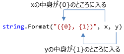
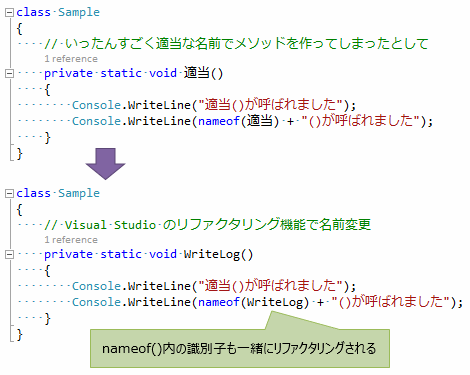

# 特殊な文字列リテラル

## <a id="sec-generated-title-1"></a> <a id="abst">概要</a>

<h5 class="version version6">Ver. 6</h5>

C# 6 で、補間文字列と、nameof 演算子(nameof operator)という、2つの文字列関連機能が追加されました。

また、C# 11 で、生文字列リテラルという構文が追加されました。

## <a id="sec-generated-title-2"></a> <a id="string-interpolation">文字列補間</a>

クラスのメンバーを整形して文字列化するには、.NETでは<code>string</code>の<code>Format</code>メソッドを使います。

```csharp
var formatted = string.Format("({0}, {1})", x, y);
```


<figure>

[](../../../../assets/media/ufcpp2000/csharp/fig/string-format.png)

<figcaption>string.Format メソッドの利用例</figcaption>
</figure>


しかし、Formatメソッドには、以下のような面倒事がありました。

* 頻出するわりに、string.Format という長めのタイピングが面倒

* 値を埋め込みたい場所と、埋め込む値を渡す場所が離れて読みにくい

* {0}とかの数と、渡す値の数が違っていても実行して見るまで気付かない


そこで、以下のような、Format用の専用構文が追加されました。

```csharp
var formatted = $"({x}, {y})";
```

このような書き方を<strong id="key-interpolated-string" class="keyword">補間文字列</strong>(interpolated string)、もしくは、<em>文字列補間</em>(string interpolation)といいます。
文字列補間の結果は、単純に `string.Format` メソッドの呼び出しに置き替えられます。
例えば、最初の例は以下のコードと同じ意味なります。

```csharp
var formatted = string.Format("({0}, {1})", x, y);
```

### <a id="sec-generated-title-3"></a> <a id="csharp10-improvement">C# 10 でのパフォーマンス改善</a>

<h5 class="version version10">Ver. 10</h5>

`string.Format` を使った実装ではどうしてもパフォーマンス上の改善が難しく、
C# 10.0 では別の型を使って結構複雑なコードに変換する最適化が入りました。
条件を満たす場合、

```csharp
var formatted = $"({x}, {y})";
```

このコードは `string.Format` ではなく、以下のようなコードに展開されます。

```csharp
DefaultInterpolatedStringHandler handler = new DefaultInterpolatedStringHandler(4, 2);
handler.AppendLiteral("(");
handler.AppendFormatted(x);
handler.AppendLiteral(", ");
handler.AppendFormatted(y);
handler.AppendLiteral(")");
string s = handler.ToStringAndClear();
```

詳細な条件については「[C# 10.0 の補間文字列の改善](improvedinterpolatedstring.md)」で別途説明します。

とりあえず、簡単な条件としては、実行環境を .NET 6 以上(TargetFramework を net6.0 以上)にして再コンパイルするだけで文字列補間のパフォーマンスが上がると思ってください。

また、C# 10.0 ではこれと同時に、[一定の条件を満たす場合、文字列補間を const にできるようになりました](sp_const.md#constant-string-interpolation)。

### <a id="sec-generated-title-4"></a> <a id="escape">エスケープ</a>

エスケープ(`$""` の中で本来使えない文字を埋め込む方法)の方法は[通常の文字列](st_embeddedtype.md#escape-sequence)とほぼ同じです。
通常の文字列リテラルと同じく、`\` に続けることで、`"`記号(`\"`)や改行文字(`\n`)などが書けます。

少しだけ違うのは、`$""` の中では `{` や `}` も特別な意味を持っているので、これらに対するエスケープが別途必要になります。`{` や `}` は2つ重ねて`{{` や `}}` 書くことで、補間の意味ではなく、その場所に波括弧を表示する意味になります。

```csharp
var p = new { X = 10, Y = 20 };
Console.WriteLine($"\"{{{p.X}, {p.Y}}}\"");
```

```console
"{10, 20}"
```

### <a id="sec-generated-title-5"></a> <a id="formatting">書式指定</a>

書式指定もできます。

```csharp
var formatted = $"({12300:c}, {12300:n}, {12300,4:x})";
```

書式の書き方も`string.Format`に対して使えるものと同じです。

ただ、C#の構文化したことで、元々実行してみるまでエラーがわからなかったのが、コンパイル時に検出できるようになったりしています。

```csharp
// ほぼ同じ意味
Console.WriteLine(string.Format("{0,4:x}", x));
Console.WriteLine($"{x,4:x}");

// 書き方を忘れて、 , と : を間違えてしまうと…

// 実行時エラー
Console.WriteLine(string.Format("{0,x}", x));

// コンパイル エラー
Console.WriteLine($"{x,x}");
```

### <a id="sec-generated-title-6"></a> <a id="conditional-in-string-interpolation">文字列補間と条件演算子</a>

`{}`の中には割と任意の式を書けます。
たとえば、以下のように、メソッドを呼び出したり、`{}`の中にさらに文字列リテラル`""`を含めることもできます。

```csharp
var data = new[] { 1, 2, 3 };
var s = $"{string.Join(", ", data)} => {string.Join(", ", data.Select(i => i * i))}";
```

ただ、1つだけ制限があって、条件演算子 `?:`は、`{}`中に直接書くことができません。
たとえば以下のコードでは、1行目(`s1`の行)がコンパイルエラーになります。

```csharp
var s1 = $"p = {p == null ? "null" : p.ToString()}"; // エラー
var s2 = $"p = {(p == null ? "null" : p.ToString())}"; // 1段 () でくくればOK
```

前節の書式指定の `:` と認識されて、「書式エラー」になります。
(「`?`がある時だけ`:`の解釈を変える」というのが高コストすぎるそうで、こういう仕様になっています。)
一応、`s2`の行のように、1段階 `()`でくくればコンパイルできるようになります。

### <a id="sec-generated-title-7"></a> <a id="multi-line">複数行の文字列補間</a>

また、`$@` から始めることで、複数行の文字列補間もできます。

```csharp
var verbatim = $@"
verbatim (here) string
{x}, {y}, {x:c}, {x:n}
";
```

ちなみに、逆順、つまり、`@$`は、C# 8.0 以降でだけ使えます(C# 7.3 以前だとコンパイル エラーになります)。

```csharp
// これは C# 7.3 以前ではコンパイル エラーになる
var verbatim = @$"
verbatim (here) string
{x}, {y}, {x:c}, {x:n}
";
```

また、`$@`を使った場合、エスケープのルールは[逐語的文字列リテラル](st_embeddedtype.md#verbatim-string)と同じになります。
すなわち、`"` と書きたければ `""`と、ダブルクォーテーションを2つ重ねます。また、`\`から始めるエスケープはできません(`\`記号がそのまま表示される)。

```csharp
Console.WriteLine($@"
""
{{
{p.X}\{p.Y}
}}
""
");
```

```console
"
{
10\20
}
"
```

### <a id="sec-generated-title-8"></a> <a id="FormatableString"></a><a id="FormattableString">FormattableString</a>

ちなみに、`Format`メソッドには、`IFormatProvider` インターフェイス(`System`名前空間)を与える(カルチャーなどの指定ができる)オーバーロードがあります(参考: 「[書式とカルチャー](../../dotnet/bcl/bcl_format.md#culture)」)。

C# 6 では、文字列補間機能を使いつつ、`IFormatProvider` を与える方法もちゃんと提供されます。
文字列補間でカルチャー指定するには、これから説明する `FormattableString` という型(`System`名前空間)を介します。

文字列補間構文では、以下のように、`IFormattable` インターフェイス(`System`名前空間)に代入すると、
一旦 `FormattableString` クラス(`System` 名前空間)のインスタンスが作られます。
(左辺の型を見て決定。右辺の書き方は直接文字列に整形する場合とまったく同じ。)

```csharp
// 左辺の型が IFormattable の時、文字列補間の結果は string ではなく、FormattableString になる
System.IFormattable formatable = $"({x}, {y})";
```


`IFormattable` の `ToString` メソッドには、`IFormatProvider` を与えることで、整形の仕方を調整できます。

```csharp
IFormattable f = $"{x :c}, {x :n}";
Console.WriteLine(f.ToString(null, new System.Globalization.CultureInfo("en-us")));
```


ちなみに、こちらは、`FormattableStringFactory` クラス(`System.Runtime.CompilerServices` 名前空間)の `Create` メソッド呼び出しに変換されます。

```csharp
System.IFormattable formatable = System.Runtime.CompilerServices.FormattableStringFactory.Create("({0}, {1})", x, y;
```

### <a id="sec-generated-title-9"></a> <a id="FormattableString-overload">FormattableString のオーバーロード解決</a>

`string` 引数と `FormattableString` 引数のオーバーロードがあるとき、
`$""` リテラルを渡すと、常に `string` の方が優先されます。

例えば以下のようなメソッドを考えます。

```csharp
// string が優先されるので、M1($"") という書き方では呼び分けできない。
static void M1(string s) => Console.WriteLine("string: " + s);
static void M1(FormattableString s) => Console.WriteLine($"format: {s.Format}, args: {string.Join(", ", s.GetArguments())}");
```

このとき、`M1($"")` という書き方では `M1(string)` の方が呼ばれてしまいます。

```csharp
// string の方が呼ばれる
M1("");
 
// これでも、結局 string の方が呼ばれる
M1($"");
 
// FormattableString の方を呼びたければ明示的なキャストが必要
M1((FormattableString)$"");
```

`FormattableString` の方を優先的に呼んでほしい場合は、
以下のようなちょっとしたトリックが必要になります。

```csharp
// M2("") と M2($"") で呼び分けできる。
static void M2(RawString s) => M1(s.Value);
static void M2(FormattableString s) => M1(s);
 
// オーバーロード解決の優先度をごまかすために、string からの暗黙的型変換を持つ構造体を用意。
public readonly struct RawString
{
    public readonly string Value;
    public RawString(string value) => Value = value;
    public static implicit operator RawString(string s) => new RawString(s);
 
    // これがないとダメみたい
    public static implicit operator RawString(FormattableString s) => throw new InvalidCastException();
}
```

暗黙的型変換と比べれば `FormattableString` の方が優先度が高いので、
この `M2` であれば、ちゃんと `M2("")` で `string` の方が、
`M2($"")` で `FormattableString` の方が呼ばれます。

```csharp
// RawString (string) の方が呼ばれる
M2("");
 
// これなら FormattableString の方が呼ばれる
M2($"");
 
// ただ、 + とかを加えてしまうと string 扱いになってしまうので注意
M2($"" + $"");
```

## <a id="sec-generated-title-10"></a> <a id="nameof-operator">nameof 演算子</a>

C# 6 で、<strong id="key-nameof" class="keyword">nameof 演算子</strong>(nameof operator: "name of X" (Xの名前)を1キーワード化したもの)というものが追加されました。
変数や、クラス、メソッド、プロパティなどの名前(識別子)を文字列リテラルとして取得できます。

```csharp
using System;

class MyClass
{
    public int MyProperty => myField;
    private int myField = 10;

    public void MyMethod()
    {
        var myLocal = 10;
        Console.WriteLine(nameof(MyClass));
        Console.WriteLine(nameof(MyProperty) + " = " + MyProperty);
        Console.WriteLine(nameof(myField) + " = " + myField);
        Console.WriteLine(nameof(MyMethod));
        Console.WriteLine(nameof(myLocal) + " = " + myLocal);
    }
}
```


```console
MyClass
MyProperty = 10
myField = 10
MyMethod
myLocal = 10
```

(ちなみに、[nameof 演算子は const にできます](sp_const.md#constant-expressions)。)

こういう識別子名を文字列化したくなる場面の例としてC# で頻出するパターンは、
`INotifyPropertyChanged` の実装や、`ArgumentException`の引数などがあります。

例えば、C# 5.0までであれば、`ArgumentoException`は以下のようにメッセージを書くことになりました。

```csharp
static double Sqrt(double x)
{
    if (x < 0)
        throw new ArgumentException("x は0以上でなければなりません");
    return Math.Sqrt(x);
}
```

しかし、この例のように、普通の文字列リテラルとして識別子を書いてしまうと、それが識別子だという情報が失われて、ソースコード解析の対象から外れてしまう問題があります。例えばVisual Studioは、変数、引数、メソッド名など、識別子のリネーム機能を持っていますが、文字列中に埋め込んでしまったものは識別子としては認識されず、リネームできません。

そこで、C# 6で追加されたnameof 演算子を使います。

```csharp
static double Sqrt(double x)
{
    if (x < 0)
        throw new ArgumentException($"{nameof(x)} は0以上でなければなりません");
    return Math.Sqrt(x);
}
```

このようなリファクタリング機能を使った際、nameof 演算子であれば、その識別子を使っている個所全ての変更も全て行われます。

(ここから下、文章が古い。図も含めて要修正)

例えば、メソッド名などに一度適当な名前を付けて実装したあと、Visual Studioのリファクタリング機能を使ってちゃんとした名前にリネームしたいことがあります。
しかし、文字列にしてしまっている "" 内のメソッド名の部分はリファクタリングできず、元のまま残ります。

<figure>

[](../../../../assets/media/ufcpp2000/csharp/fig/nameof-refactoring.png)

<figcaption>nameof 演算子をリファクタリングの対象にする</figcaption>
</figure>

nameof 演算子の目的はここにあります。識別子名を文字列化するだけなんですが、ソースコード解析の対象にできます。

INotifyPropertyChanged の実装でもnameof 演算子を使う例を以下に挙げておきましょう。

```csharp
using System.ComponentModel;
using System.Runtime.CompilerServices;

class Rect : BindableBase
{
    public int Width
    {
        get { return _width; }
        set
        {
            SetProperty(ref _width, value);
            // Width が変化すると Area も変化するので、それを通知
            OnPropertyChanged(nameof(Area));
        }
    }
    private int _width;

    public int Height
    {
        get { return _height; }
        set
        {
            SetProperty(ref _height, value);
            // Height が変化すると Area も変化するので、それを通知
            OnPropertyChanged(nameof(Area));
        }
    }
    private int _height;

    public int Area => Width * Height;
}

public class BindableBase : INotifyPropertyChanged
{
    protected void SetProperty<T>(ref T storage, T value, [CallerMemberName] string propertyName = null)
    {
        if (!Equals(storage, value))
        {
            storage = value;
            OnPropertyChanged(propertyName);
        }
    }

    protected void OnPropertyChanged([CallerMemberName] string propertyName = null)
        => PropertyChanged?.Invoke(this, new PropertyChangedEventArgs(propertyName));

    public event PropertyChangedEventHandler PropertyChanged;
}
```
。

### <a id="sec-generated-title-11"></a> <a id="nameof-parameter"></a>nameof(引数) のスコープ変更

<h5 class="version version11">Ver. 11</h5>

C# 11 で、`nameof` にちょっとだけ変更が掛かりました。
以下のように、メソッドに対する属性の中で、そのメソッドの引数の名前が参照できるようになりました。

```csharp
using System.Diagnostics.CodeAnalysis;

// C# 10 までこの属性、 NotNullIfNotNull("x") と書かないといけなくて割かしつらかった。
[return: NotNullIfNotNull(nameof(x))]
static string? m(string? x) => x;
```

この例で使っているように、きっかけとしては[null 許容参照型](../resource/nullablereferencetype.md#sec-generated-title-6)で使う `NotNullIfNotNull` 属性などのために仕様変更されました。
これ以降にも、[`CallerArgumentExpression`](../cheatsheet/ap_ver10.md#CallerArgumentExpression) 属性や[`InterpolatedStringHandlerArgument`](improvedinterpolatedstring.md#InterpolatedStringHandlerArgument)属性など、
引数名を参照したい属性がじわじわと増えていたりします。

### <a id="sec-generated-title-12"></a> <a id="unbount-type-in-nameof">unbound な型に対する nameof</a>

<h5 class="version version14">Ver. 14</h5>

C# 14 から、`T<>` みたいに型引数を埋めていないジェネリック型(これを unbound (未束縛)とか open (開きっぱなし) な型といいます)に対して `nameof` 演算子を使えるようになりました。

```csharp
Console.WriteLine(nameof(List<>)); // "List"
Console.WriteLine(nameof(Dictionary<,>.Keys)); // "Keys"
Console.WriteLine(nameof(List<>.Enumerator.MoveNext)); // "MoveNext"
```

`nameof` 演算子では元からどのみち型が引数の部分 (`<>` とその中身)は無視されていたので、
ここを埋めるかどうかは結果得られる文字列に何の影響もありません。
これまでできなかったのは「手間に対して需要が少ない」という実装上の都合で、
C# 14 でようやく着手という流れです。
(`typeof(T<>)` は昔から書けたのでそれの流用でできそうに見えますが、
`typeof` の場合は `typeof(T<>.Member)` みたいなメンバー参照がないので、
今回の `nameof` 対応はそれなりに新規実装の部分があります。)

C# 13 以前だと同じことをしたければ、意味もなく何か適当な型引数を埋めて書いていました。

```csharp
// int の部分には特に意味はないけども、埋めないとコンパイルが通らなかったので適当に int を採用。
Console.WriteLine(nameof(List<int>)); // "List"
Console.WriteLine(nameof(Dictionary<int, int>.Keys)); // "Keys"
Console.WriteLine(nameof(List<int>.Enumerator.MoveNext)); // "MoveNext"
```

ただ、型引数にかかっている制約によっては「適当に `int` を渡す」みたいなことがかなり難しくなります。
場合によっては、以下のように「絶対に書けない」という状況も発生します。
(この場合、メソッド `M` が public なのがおかしいというのはありますが、原理的にはこういうことがありえます。)

```csharp
public interface I
{
    // static abstract があると M<I> と書けなくなる。
    // (実装したクラスでないと渡せない。)
    public static abstract void M();
}

public abstract class B
{
    // アクセス制限がかなり厳しいコンストラクターを用意。
    // クラス自体は public であっても、別プロジェクトで派生クラスは作れない。
    private protected B() { }
}

// 実装しているクラスは internal で、外からは使わせない。
internal class D : B, I
{
    public static void M() { }
}

public static class C
{
    // T : I のせいで派生クラスでないとダメ。
    // T : B のせいで派生クラスを作れない。
    // 唯一の実装クラス D は internal なので、外からは使えない。
    // 結果、C# 13 以前は nameof(M<>) が使えなかった。
    public static void M<T>() where T : B, I
    {
    }
}
```


<!-- original-page-break -->


## <a id="sec-generated-title-13"></a> <a id="raw-string"></a>生文字列リテラル

C# 11 で、3つ以上の連続した `"` を使うことで、「一切エスケープが必要ない文字列リテラル」を書けるようになりました。

```csharp
// """ から始まる文字列リテラル(raw string, 生文字列)。
var quote = """
    " はそのまま " として使われて、
    \ も \ のままの意味。
    \\ は \ が2個。
    {} とかも特別な解釈はされない。
    """;
```

これを<strong id="key-raw-string" class="keyword">生文字列リテラル</strong>(raw string literal)と言います。

最近は「[言語内言語](../../../blog/2022/2/embedded-languages/index.md)」みたいなものの需要が微妙に高まっている中、
こういう「エスケープ不要の文字列」への要望が強くなってきています。
本来ならば[逐語的文字列リテラル](st_embeddedtype.md#verbatim-string)(`@""`)がその役割に当たるんですが、この `@""` の構文が微妙に使いにくいので、それを置き換えるような新しい文法が導入されました。

### <a id="sec-generated-title-14"></a> <a id="normal-literal">背景: 通常の文字列リテラルや、逐語的リテラル</a>

多くのプログラミング言語で、通常、`"` や `'` などの記号で挟まられた部分が[文字列リテラル](st_embeddedtype.md#stringl)になります。
この「通常の文字列リテラル」で困るのは、その文字列中に `"` や `'` 自身を含む場合で、
C# ではそういう場合のために、`\` を使った[エスケープ](st_embeddedtype.md#escape-sequence)を行います。

```csharp
// " を含む文字列リテラル。
var quote = "\"";
```

エスケープが必要な文字が増えてくるとかなり煩雑です。
そこで C# では、`@""` という書き方で、以下のように、エスケープを<em>減らせる</em>ようにしました。
これを[逐語的文字列リテラル](st_embeddedtype.md#verbatim-string)(verbatim string literal)と言います。

* `\` は `\` としてそのまま使われる
* リテラル中に改行を含められる

```csharp
// @"" と書くと、\ と改行のエスケープが不要に。
var quote = @"これで3行の文字列になる。
\ は \ のまま使われる。\\ も \ 2つ。
ただし、"" を使いたいときは "" を2個並べないとダメ。これでダブルクォーテーションマーク1つ扱い。";
```

「エスケープなしで書ける文字列」というのが逐語的文字列の存在意義なんですが、
もうこの時点で、「`"` にはエスケープが必要」となっています。
その他、[文字列補間](#conditional-in-string-interpolation)との組み合わせでは `{}` のエスケープも必要です。
また、もう1つの要望として、「複数行の文字列を書くとき、インデントを揃えたいけどできない」という問題もあります。

```csharp
var value = 123;

// $@"" で逐語的 + 文字列補間。
// - { を使いたければ {{ というように、そこそこ使いたくなりがちな文字に結局エスケープが必要
// - 最初と最後の行の改行も文字列に含まれる
// - インデントのスペース4つも文字列に含まれる
var quote = $@"
    {{
      ""key"": {value}
    }}
    ";
```

### <a id="sec-generated-title-15"></a> <a id="raw-string-syntax">新文法: 生文字列</a>

`"` や `'` を含め、あらゆる文字を一切エスケープなしで書けるようにしたいということで、
C# 11 で、`"""` というように、「3つ以上の `"` を並べる」という新しい文法を追加しました。

以下のように、単一行か複数行かと、文字列補間の有無によって4パターンあります。

```csharp
var value = 123;

var singleLine = """{ "abc": 123 }""";

var mutiLine = """
    {
      "abc": 123
    }
    """;

var singleLineInterpolation = $"""abc: {value}""";

var mutiLineInterpolation = $"""
    abc: {value}
    """;
```

### <a id="sec-generated-title-16"></a> <a id="arbitrary-number">3つ以上の "</a>

生文字列の目的は「一切のエスケープが不要」というものです。
そこで通常問題になるのが、`"""` の内側で同じく `"""` を使いたい場合。

例えばの話、「自分自身を文字列リテラル化したい」みたいなことを考えてみましょう。
まず、以下のような C# 11 コードがあったとします。

```csharp
var mutiLine = """
    {
      "abc": 123
    }
    """;
```

一切エスケープ不要というなら、「この C# コードを出力する C# コード」みたいなものもエスケープなしで書けるようにしたいです。
こういう場合に、以下のようなコードを書いてしまうと、最初の `"""` が出て来た時点で文字列リテラルを閉じようとしてしまって、コンパイル エラーになります。

```csharp
// """ と """ の間に """ は書けない。
Console.WriteLine("""
    var mutiLine = """
        {
          "abc": 123
        }
        """;
    """);
```

そこでどうするかというと、生文字列リテラルの開始文字を `""""` と4つに増やします。
(同じ個数の `"` が出てくるまで文字列リテラルが終わりません。)

```csharp
// " 4つで開始すれば、リテラルの中で """ (" 3つ)を書いても問題ない。
Console.WriteLine(""""
    var mutiLine = """
        {
          "abc": 123
        }
        """;
    """");
```

これが、C# の生文字列リテラルの仕様が「3つ<em>以上</em>の `"` を並べる」になっている理由です。
もちろんさらに入れ子を増やして、`"""""` (5つ)の内側に `""""` を書くこともできます。

```csharp
Console.WriteLine("""""
    Console.WriteLine(""""
        var mutiLine = """
            {
              "abc": 123
            }
            """;
        """");
    """"");
```

逆に `"` 2つがダメなのは、`""` が既存の文法で有効なもの(空文字列になる)なので、
意味を変えるわけにはいかないからです。

```csharp
// 生文字列の "+" ではなく、空文字列2つの結合(= 結局は空文字列)。
Console.WriteLine(""
    +
    "");
```

### <a id="sec-generated-title-17"></a> <a id="single-or-multiple">単一行と複数行</a>

単一行リテラルか複数行リテラルかは、単純に `"""` の後ろに改行があるかどうかで変わります。

```csharp
// 単一行生文字列。
var singleLine = """この中身が文字列リテラル""";

// 複数行生文字列。
var multiLine = """
    この行が文字列リテラル。この前後には改行文字は残らない。
    """;

// 以下の3行は全く同じ結果になる。
Console.WriteLine("a\"b");
Console.WriteLine("""a"b""");
Console.WriteLine("""
    a"b
    """);

// 以下の3行も全く同じ結果。
// (C# ソースコードの改行コード次第。この例の場合は LF。
Console.WriteLine("abc\ndef");
Console.WriteLine(@"abc
def");
Console.WriteLine("""
    abc
    def
    """);
```

ちょっと変わっているのは、複数行リテラルの場合、`"""` と改行の間にスペースが挟まっていても複数行生文字列リテラルと認識されます。

```csharp
// """ の後ろに実はスペースが4つあるけど、それは無視される。
// (ファイルの改行コード次第で 7 か 8。
// abcdef の6文字 + \r\n (改行)。
Console.WriteLine("""    
    abc
    def
    """.Length);
```

今のところは開き `"""` の後ろに書いても OK (ただし無視される)なのは空白文字だけですが、
生文字列の仕様のインスパイア元が Markdown の ```` ``` ```` なので、
もしかしたら以下のような「文字列の中身が何かの注釈を付ける」みたいな仕様は将来認められる可能性はあります。

```csharp
// C# 11 としては不正。
// 「将来もしかしたら」程度の構文案。
Console.WriteLine("""json
    {
      "id": 123,
      "name": "abc"
    }
    """.Length);
```


また、複数行生文字列では、以下のように、「1行たりとも中身がないリテラル」は書けません。

```csharp
// 先頭・末尾の改行は無視されるので、これが空文字列。
Console.WriteLine("""

    """);

// じゃあ、これは？…
// 「空文字列よりも短い文字列リテラル」というのも変で、単にコンパイル エラーに。
Console.WriteLine("""
    """);
```


### <a id="sec-generated-title-18"></a> <a id="multiline-indent">複数行生文字列とインデント</a>

元々インデントが深い場所で逐語的文字列リテラルを書いた場合、
以下のように、普段の C# コードと同じようなインデントを付けれないという問題があります。

```csharp
class A
{
    public static void M(bool flag, int count)
    {
        if (flag)
        {
            for (int i = 0; i < count; i++)
            {
                Console.WriteLine(@"
インデントが崩れる。
左寄せにしないとリテラルにスペースが含まれちゃう。
");
            }
        }
    }
}
```

一方、生文字列では自由にインデントを入れられます。
以下のように、閉じ `"""` の行のインデントを基準にして、それよりも左側のスペースはコンパイル結果には残りません。

```csharp
class A
{
    public static void M(bool flag, int count)
    {
        if (flag)
        {
            for (int i = 0; i < count; i++)
            {
                Console.WriteLine("""
                    インデントして大丈夫。
                    ここよりも左側のスペースはコンパイル結果の文字列には含まれない。
                    """); // この行のインデントが基準で、そこから前のスペースが消える。
            }
        }
    }
}
```

ただ、これはこれで逆に、以下のようなコードには注意が必要です。

```csharp
// 1
Console.WriteLine("""
    a
    """.Length);

// 5
Console.WriteLine("""
    a
""".Length); // 犯人はこの行。インデントがずれてる。
```

ちなみに、以下のように、閉じ `"""` の行よりもインデントが少ないコードを書くとコンパイル エラーになります。

```csharp
// インデントが不正(足りない)なのでエラーに。
Console.WriteLine("""
a
    """);
```

#### <a id="sec-generated-title-19"></a> <a id="mixed-whitespace">空白文字の混在</a>

C# は通常の(ASCII 文字の)スペース(文字コード U+0020)以外にも、以下のような文字を空白文字とみなします(通常スペースと同じ扱いになります)。

* Unicode の文字カテゴリーが Zs (Space Separator)の文字
* 水平タブ(U+0009)
* 垂直タブ(U+000B)
* フォーム フィード(U+000C)

これらの空白文字を閉じ `"""` の行に使った場合、途中の行にも全く同じ順序で同じ文字を並べなければなりません。
見えない文字なので少しわかりにくいですが、以下のコードでは1つ目の生文字列はOKで、2つ目(意図的に違う文字を混ぜたもの)はコンパイル エラーになります。

```csharp
Console.WriteLine("""
    この行は OK
    """); // U+1680 Ogam Space (見える空白文字。古アイルランドで使ってたらしい)

Console.WriteLine("""
    違う空白文字を混ぜてしまうとコンパイル エラー。
    """);
```

(幾分かわかりやすくするために、「見える空白文字」である Ogam Space という文字を使っています。
ちなみに、エラーになっている行はこの Ogam Space と通常スペースの混在です。)


### <a id="sec-generated-title-20"></a> <a id="priority-verbatim">注意: @"" 優先</a>

1つ非常に紛らわしい書き方がありまして…
以下のコード、出力はどうなるでしょう？

```csharp
Console.WriteLine(@"""abc""");
```

答えは `"abc"` です。両端に `"` が付いてきます。

これ、`@"` から始まっているので逐語的文字列リテラルの方になります。
で、`@""` の中では「`"` を書きたければ `""` と書く」というエスケープをしますので、
「`@"""abc"""` は `"abc"` として解釈される逐語的文字列リテラル」ということになります。

`@` は見落としがちな文字なので多少注意が必要です。

## <a id="sec-generated-title-21"></a> <a id="raw-string-interpolation">生文字列、かつ、文字列補間</a>

「生文字列で文字列補間をしたい」という要望もそれなりにあります。
例えば以下のような感じのコードは、そのものはないにしても似たようなコードは書きたいことがあると思います。

```csharp
Console.WriteLine(format(123, "abc"));

static string format(int id, string name) => $"""
    id: {id}
    name: "{name}"
    """;
```

補間をやるなら「`{` を含めたいときにエスケープが必要になってしまう」という懸念があって、
当初は前向きに検討されていませんでした。
ただ、最終的に、「`"` と同じく `$` の個数も可変にして解決」という手段を採りました。
「`$` の個数と同じ数の `{` と `}` を書いたときだけ補間あつかい、それ以下の場合は普通の文字列として `{` と `}` を解釈」となります。

例えば、「文字列補間で JSON を作る」みたいなことをしたい場合、`{` を多用することになるわけですが、
この場合は `$` を2個にすることで、`{` と `}` 1個はただの文字になって、`{{}}` が文字列補間になります。

```csharp
Console.WriteLine(format(123, "abc"));

static string format(int id, string name) => $$"""
    {
      "id": {{id /* ここは補間 */ }},
      "name": "{{name /* ここも補間 */}}"
    }
    """;
```

```console
{
  "id": 123,
  "name": "abc"
}
```


<!-- original-page-break -->

## <a id="sec-generated-title-22"></a> <a id="utf8-literal"></a>UTF-8 リテラル

<h5 class="version version11">Ver. 11</h5>

C# 11 で、`"abc"u8` みたいに、文字列リテラルの後ろに `u8` 接尾辞を付けることで、UTF-8 な byte 列を文字列リテラルの形で書けるようになりました。

```csharp
ReadOnlySpan<byte> hex = "0123456789ABCDEF"u8;
```

<strong id="key-utf8-literal" class="keyword">UTF-8 リテラル</strong>(UTF-8 literal)、もしくは語尾を取って u8リテラル(u8 literal)と呼びます。
ちなみに、UTF-8 リテラルの型は `ReadOnlySpan<byte>` になります。
(`var` による型推論も使えます。)

```csharp
var hex = "0123456789ABCDEF"u8;
Console.WriteLine(hex is ReadOnlySpan<byte>); // 「常に true」警告が出る
```

### <a id="sec-generated-title-23"></a> <a id="utf8-in-csharp">補足: C# と UTF-8</a>

UTF-8 のリテラルの話をもう少し掘り下げる前に、C# における文字コードの話を少し補足しておきます。

#### <a id="sec-generated-title-24"></a> <a id="history">時代背景</a>

今となっては、文字コードと言えばほぼ Unicode で、
その他の文字コードは互換性のために残っていると言っても過言ではないと思います。
Unicode に関する話は昔、Build Insider に寄稿したことがあるのでそちらも参照してください。

* [Unicodeとは？ その歴史と進化、開発者向け基礎知識](https://www.buildinsider.net/language/csharpunicode/01)
* [Unicodeと、C#での文字列の扱い](https://www.buildinsider.net/language/csharpunicode/02)

また、Unicode でも、符号化方式として、主に UTF-8 と UTF-16 という形式があります。
2000年代頃から徐々に UTF-8 の方が主流になってきています。

ただ、C# くらいの世代(2000年発表、2002年正式リリース)のプログラミング言語では、
結構昔の文字コードを引きずっていますし、
UTF-16 が主流になると思われていた時代の名残りが大きいです。

そのため、C# の文字(`char`)や文字列(`string`)は UTF-16 前提で、16ビット整数になっています。
(同じような方針になってしまっているプログラミング言語に Java や JavaScript があります。)

```csharp
Console.WriteLine(sizeof(char)); // 16
```

ところが、時代は UTF-8 一色になりました。
それにそもそも、プログラムの中で文字列操作する際にはほとんど ASCII コードに収まる文字しか使わない場面も多いです。
(UTF-8 は ASCII コードと完全互換です。
一方で、UTF-16 の場合は「1バイトを2バイトに引き延ばす」みたいな変換処理が必要で、この負担が案外大きいです。)

その結果、ここ数年、C# で「文字が UTF-16」というのが結構な負担になっていました。

#### <a id="sec-generated-title-25"></a> <a id="utf8-bytes">byte でやりくり</a>

この文字コード問題に対して、一時、
`Utf8String` みたいな名前で UTF-8 な型を追加しようか何て話もありました。
しかし、その方向性だと、`string` と `Utf8String` の2重管理がしんどい(これだけ `string` 前提で .NET エコシステムが確立された状況で追加は無理だろう)という雰囲気になっています。

そうこうしているうちに、「生 `byte` 列で UTF-8 を扱う」と言うのが .NET エコシステム内でデファクトスタンダード化してしまいました(今ここ)。
例えば `System.Text.Unicode` 名前空間中のメソッドは以下のような感じになっています。

```csharp
using System.Buffers;

namespace System.Text.Unicode;

public static class Utf8
{
    public static OperationStatus FromUtf16(
        ReadOnlySpan<char> source, Span<byte> destination, out int charsRead, out int bytesWritten,
        bool replaceInvalidSequences = true, bool isFinalBlock = true);

    public static OperationStatus ToUtf16(
        ReadOnlySpan<byte> source, Span<char> destination, out int bytesRead, out int charsWritten,
        bool replaceInvalidSequences = true, bool isFinalBlock = true);
}
```

`Span<byte>` と `ReadOnlySpan<byte>` で UTF-8 文字列を扱っています。

#### <a id="sec-generated-title-26"></a> <a id="literal-bytes">C# 10 までの課題: 文字列リテラルの byte 配列化</a>

一応、`Span<byte>` で UTF-8 文字列を扱えるとはいえ、
問題は文字列リテラルです。
`"true"` とか `" HTTP/1.0\r\n"` とか、 UTF-8 文字列 (ほとんどの場合、ASCII 文字列)を定数でプログラム中に埋め込みたい場面は結構あります。

今だと以下のように `byte` 定数を並べた配列を `new byte[]` するしか方法がありません。

```csharp
ReadOnlySpan<byte> _true = new byte[] { (byte)'t', (byte)'r', (byte)'u', (byte)'e' };
ReadOnlySpan<byte> _false = new byte[] { (byte)'f', (byte)'a', (byte)'l', (byte)'s', (byte)'e' };
ReadOnlySpan<byte> _null = new byte[] { (byte)'n', (byte)'u', (byte)'l', (byte)'l' };
```

一応、これ、[最適化はされて `new byte[]` のヒープ アロケーションは発生せず](../../../blog/2022/2/span-optimization/index.md)、
直接 DLL 中のデータ領域からデータが読まれます。

とはいえ明らかに煩雑で、`true` などの文字列から上記のような `byte` 配列を生成してもらいたくなります。
その結果、C# 11 で UTF-8 リテラルが入ることになりました。

#### <a id="sec-generated-title-27"></a> <a id="utf8-literal-usage">UTF-8 リテラルの利用例</a>

[.NET の標準ライブラリ中のコード](https://github.com/dotnet/runtime)にも、前述のような「本当は文字列リテラルとして埋め込みたいのに仕方がなく `new byte[]` にしていた」というものが山ほどありました。
C# 11 化に伴い、大量のコードが UTF-8 リテラル化されています。
以下のような Pull Request が出ています。

* [#68334](https://github.com/dotnet/runtime/pull/68334)
* [#69995](https://github.com/dotnet/runtime/pull/69995)
* [#70568](https://github.com/dotnet/runtime/pull/70568)
* [#70894](https://github.com/dotnet/runtime/pull/70894)
* [#71417](https://github.com/dotnet/runtime/pull/71417)
* [#71992](https://github.com/dotnet/runtime/pull/71992)

これらの中には、例えば以下のような文字列が含まれています。

```csharp
// HTTP のステータス コード
var ok = "200"u8;
var notFound = "404"u8;

// CR LF
var eol = "\r\n"u8;

// 既知の型名
var boolName = "Boolean"u8;
var byteName = "Byte"u8;
var in32Name = "Int32"u8;

// 変換用テーブル
var base64Table = "ABCDEFGHIJKLMNOPQRSTUVWXYZabcdefghijklmnopqrstuvwxyz0123456789+/"u8;
var base32Table = "abcdefghijklmnopqrstuvwxyz012345"u8;
var hexTable = "0123456789ABCDEF"u8;

// Culture 名
var cultureNames = // 一部抜粋
    "en-us"u8 +
    "fr-fr"u8 +
    "it-it"u8; // 以下略
```

### <a id="sec-generated-title-28"></a> <a id="utf8-literal-detail">UTF-8 リテラルの詳細</a>

とうことで、改めて UTF-8 リテラルの話に戻りましょう。

[本節冒頭](#utf8-literal)で書いた通り、文字列リテラルの後ろに `u8` 接尾辞を付けることで UTF-8 リテラルになり、`ReadOnlySpan<byte>` を得ることができます。

```csharp
ReadOnlySpan<byte> s = "abc"u8;
```

ちなみに、初期案としては、`u8` 接尾辞がなしの通常の文字列リテラルも、
ターゲット型を見て自動的に UTF-8 リテラルに変換する話も出ていましたが、
オーバーロード解決がうまくいかず、没になりました。

```csharp
// 初期案では OK だった(今はエラー)。
byte[] s1 = "abc";
ReadOnlySpan<byte> s2 = "abc";

// u8 接尾辞ありで、byte[] への変換も元々は認めてた(今はエラー)。
byte[] s3 = "abc"u8;
```

#### <a id="sec-generated-title-29"></a> <a id="utf8-literal-lowaring">UTF-8 リテラルの展開結果</a>

UTF-8 リテラルは、その文字列を UTF-8 として符号化した byte 列に展開されます。
例えば、前述の `"abc"u8` は、以下のようなコードとほぼ同じ意味になります。

```csharp
ReadOnlySpan<byte> s = new byte[] { 97, 98, 99 };
```

この手のコードは、C# コンパイラーによって、以下のようなコードに最適化されます。

```csharp
byte* p = DLL中のデータが格納されている領域へのポインター;
ReadOnlySpan<byte> s = new ReadOnlySpan<byte>(p, 3);
```

ちなみに、最近の .NET は `Span<T>`, `ReadOnlySpan<T>` に対する最適化が結構よく掛かって、
例えば、`"abc"u8.Length` は JIT 時に単なる `3` に展開されたりします。

#### <a id="sec-generated-title-30"></a> <a id="utf8-literal-concat">+ での結合</a>

UTF-8 リテラル同士は `+` 演算子で結合できます。
例えば、以下の2変数には同じ結果が代入されます。

```csharp
var singleLine = "ABCDEFGHIJKLMNOPQRSTUVWXYZabcdefghijklmnopqrstuvwxyz0123456789+/"u8;

var concatenated = 
    "ABCDEFGHIJKLMNOPQRSTUVWXYZ"u8 +
    "abcdefghijklmnopqrstuvwxyz"u8 +
    "0123456789"u8 +
    "+/"u8;
```

これは、UTF-8 リテラルに対する特殊対応で、
一般の `ReadOnlySpan<byte>` に対しては `+` 結合はできません。

```csharp
ReadOnlySpan<byte> abc = new byte[] { 97, 98, 99 };
ReadOnlySpan<byte> def = new byte[] { 100, 101, 102 };

var s1 = abc + def; // エラー。
var s2 = abc + "def"u8; // 片方が u8 リテラルでもダメ。エラー。
```

#### <a id="sec-generated-title-31"></a> <a id="utf8-literal-non-const">注意: 非 const</a>

(少なくとも C# 11 時点では) UTF-8 リテラルは [const](sp_const.md#const) 扱いにはなりません。
const しか書けない場所で使うとエラーになります。
具体的には、例えば、[`switch` や `is`](../datatype/typeswitch.md) に使えません。

```csharp
// これは OK。
bool str(string x) => x is "abc";

// C# 11 で、これは OK になった。
bool charSpan(ReadOnlySpan<char> x) => x is "abc";

// これはダメ。
bool u8(ReadOnlySpan<byte> x) => x is "abc"u8;

// ちなみに、同じく C# 11 で入ったリスト パターンで、こんな風には書ける(つらい)。
bool listPattern(ReadOnlySpan<byte> x) => x is [ 97, 98, 99 ];
```

#### <a id="sec-generated-title-32"></a> <a id="utf8-raw-string">UTF-8 生文字列</a>

[生文字列リテラル](#raw-string)との組み合わせもできます。
この場合も、`"""` の後ろに `u8` 接尾辞を付けます。

```csharp
var utf8Json = """
    {
      "id": 123,
      "name": "abc",
      "flag": true
    }
    """u8;
```

結果が UTF-8 符号化された `ReadOnlySpan<byte>` になる以外は生文字列リテラルと同じです。

一方で、(少なくとも C# 11 では) 文字列補間との併用はできません。

```csharp
var x = 123;
var y = "abc";

// これは OK。
var s = $"id: {x}, name: {y}";

// これはダメ。
var u8 = $"id: {x}, name: {y}"u8;
```


#### <a id="sec-generated-title-33"></a> <a id="utf8-literal-invalid-error">注意: 不正な Unicode 文字</a>

UTF-8 リテラルでは、UTF-8 にしたときに不正になるものはコンパイル エラーになります。

「UTF-8 リテラルでは」という前置きがあるのは、
C# の `string` は UTF-16 として不正なものを受け付けてしまうからです。
(この辺りも時代の影響で、昔は今よりも Unicode の扱いがかなり緩かったです。)

具体的には「[サロゲート ペア](https://codezine.jp/article/detail/1592)の片割れ」みたいなやつで、
現代的にはこういう「片割れ」を残すのはよくないと言われていますが、
C# の `char` や `string` は受け付けます。

```csharp
// サロゲート ペアの片割れだけの文字列。
// 現代的にはエラーにしたい。C# ができた頃にはそんなにうるさく言われなかった。
var highSurrogate = "\uD801";

// ちなみに、 System.Text.Encoding では不正な Unicode 文字列を ? (U+FFFD) に置き換える処理あり。

// C# でいうところの Unicode は UTF-16 のこと。
var utf16 = System.Text.Encoding.Unicode;

// 一度符号化して、複号すると…
var encoded = utf16.GetBytes(highSurrogate);
var decoded = utf16.GetString(encoded);

// U+FFFD に置き換わってる。
// この文字は replacement character と言って、
// 不正な文字を残さないために、認識できなかった文字を置き換えるための文字。
foreach (var c in decoded)
{
    Console.WriteLine($"{c}: {(int)c:X}");
}
```

ですが、C# 11 の時代(2022年)に生まれた UTF-8 リテラルは、
ちゃんと不正な文字列をはじきます。

```csharp
// UTF-8 リテラルの場合は「サロゲート ペアの片割れ」を受け付けない。
// コンパイル エラーを起こす。
var highSurrogate = "\uD801"u8;
```

ちなみに、以下のように、最終的に有効な Unicode 文字列になるものであればちゃんとコンパイルできます。

```csharp
var surrogatePair = "\uD801\uDE00"u8;
```

一方で、以下のように「`+` で結合すれば最終的には有効になるはずの2つの UTF-8 リテラル」みたいなものはコンパイル エラーになります。

```csharp
var surrogatePair =
    "\uD801"u8 +
    "\uDE00"u8;
```
