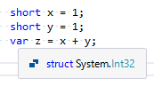

# 数値

## 概要
本項では、[組み込み型](st_embeddedtype.md)の補足として、[整数型](st_embeddedtype.md#integer)や[浮動小数点数型](st_embeddedtype.md#float)など、いわゆる「数値」がらみの少し細かい話をします。

## int型とdouble型
C#の数値型には、使用する記憶領域サイズ違いのものがいくつかあります。その中で代表的な位置づけにあるのは、整数では`int`型(4バイト)、浮動小数点数では`double`型(8バイト)です。

どう「代表的」かというと以下のような感じです。

- `int`型より小さいサイズの整数は、計算時にいったん`int`扱いされる
- 浮動小数点数は、計算時にいったん`double`扱いされる
- リテラルも、数字だけを書くと基本的に`int`、`double`扱い

例えば、下図のように、`short`型(2バイト)同士の計算をすると、結果が`int`型になります。

これは、大体必要とされる桁数が`int`型か`double`型で十分まかなえるため、これらの計算が一番高速になるようなCPUが多いという理由があります。
(実際にはいろんな要因がからんで、`int`型か`double`型を使っておけば安泰というわけでもなく、何が最適かは状況によります。
CPU構造の流行など、時代による差もあったりします。最近だと`double`型(8バイト)よりも`float`型の方が有利になる場面も多いです。)

## 10進数以外の数値
普通に整数リテラルを書くと10進数なわけですが、その他に、16進数と2進数で書くことができます。

16進数や2進数については「[コンピューターでよく使う数字](../../computer/digits/digitsincomputer.md#bin-oct-hex)」を参照してください。

### 16進数リテラル
普通に数字を並べると10進数扱いされますが、先頭に`0x`を付けると16進数で数値を書けるようになります(hexadecimal literals)。

<pre class="source" title="16進数リテラル">
<code>var x = 0xFF;       // 16進数のFF = 15×16 + 15 = 10進数だと 255
var y = 0XabcdABCD; // 0X や、A～F の記号は大文字・小文字どちらでもOK
</code></pre>

### 2進数リテラル
<h5 class="version version7">Ver. 7</h5>

C# 7で、2進数でもリテラルを書けるようになりました(binary literals)。
先頭に`0b`を付けると2進数リテラルになります。

<pre class="source" title="2進数リテラル">
<code>var x = 0b10010101; // 2進数の10010101 = 128 + 16 + 4 + 1 = 10進数だと 149
var y = 0B1111;     // b は大文字・小文字どちらでもOK
</code></pre>

よくある用途としては、「フラグ」があります。
以下のように、ビットごとに意味があって、ビットの組み合わせを表したい場合です。

<pre class="source" title="2進数リテラルのフラグ利用">
<code><reserved>enum ColorFlags
{
    Black = 0,

    Red = 1,
    Green = 0b10,
    Blue = 0b100,

    Yellow = Red | Green,
    Cyan = Green | Blue,
    Magenta = Blue | Red,

    White = Red | Green | Blue,
}
</code></pre>

この例では、1ビット目が赤(red)、2ビット目が緑(green)、3ビット目が青(blue)を表していて、
「赤と緑の組み合わせが黄色(yellow)」というのを、1ビット目と2ビット目が1なので、2進数で11(つまり、10進数で3)という数値で表しています。
こういう表し方を、特定の場所に旗(flag)を立てて目印にするのに例えて、「フラグ」と呼びます。

### 数値リテラルの先頭は 0～9
16進数リテラルも2進数リテラルも、どちらも0から始まります(それぞれ、`0x`か`0b`始まり)。
10進数リテラルも数字(0～9のいずれか)から始まるわけで、数値リテラルは常に数字始まりです。

一方で、C#では識別子(変数名などに使える名前)に数字始まりを認めていません。例えば0から始まる名前の変数は作れません。
最初の1文字だけを見て、それが識別子なのか数値リテラルなのかを判別できます。

C#で書かれたソースコードの解釈を高速に行うためにこういう仕様になっています。

## 数字区切り文字
<h5 class="version version7">Ver. 7</h5>

C# 7では、数値リテラルの数字と数字の間に、`_`で区切りを入れれるようになりました。
リテラルの桁数が大きい時に便利です。

<pre class="source" title="digit separators">
<code><reserved>var million = 1_000_000;
var abcd = 0b1010_1011_1100_1101; // 特に2進数リテラルで有用
var abcd2 = 0xab_cd;              // 16進数リテラルにも使える
var x = 1.123_456_789;            // 浮動小数点数リテラルにも使える
</code></pre>

特に2進数リテラルを使うと桁が大きくなりがちなので、[2進数リテラル](#binary)との組み合わせが便利でしょう。

ちなみに、末尾や先頭、小数点の前後に `_` を書くことはできません。以下のコードは全行でコンパイル エラーになります。

<pre class="source" title="_ を挟めない個所">
<code><reserved>var a = _10;
var b = 10_;
var c = 1._0;
var d = 1_.0;

// (以下の2つは C# 7.2 以降であれば書ける)
var e = 0x_10;
var f = 0b_10;
</code></pre>

### 先頭区切り文字
<h5 class="version version7_1">Ver. 7.2</h5>

C# 7.2で、`0b`、`0x`の直後に区切り文字の `_` を入れることができるようになりました。

<pre class="source" title="">
<code>// C# 7.0 から書ける
var b1 = 0b1111_0000;
var x1 = 0x0001_F408;

// C# 7.2 から書ける
// b, x の直後に _ 入れてもOKに
var b2 = 0b_1111_0000;
var x2 = 0x_0001_F408;
</code></pre>

C# 7.2で認められたのはあくまで `0b` と `0x` の直後だけです。
以下の4つは C# 7.2 であっても書けません。

<pre class="source" title="C# 7.2 でも _ を挟めない個所">
<code><reserved>var a = _10;
var b = 10_;
var c = 1._0;
var d = 1_.0;
</code></pre>

「C# 7.0時点では迷ったので、入れない方に倒した」程度のものです。
(後から機能を追加するのは簡単にできますが、
1度入れてしまった機能は問題があってもなくすことができないため。)
迷った理由は、「数字(digit)の区切り」という割には`b`や`x`が数字ではないためと、
`_10` と書くと識別子扱いされるので `0b_10`や`0x_10`を認めるのに多少抵抗があったためだそうです。

## 他、書く予定
(書きかけ)

- 科学表記リテラルについて多少詳しめに
- 浮動小数点数リテラルは `.` から始めてもOK
- 整数サフィックスの`L`, `U`は大文字小文字、順序自由: `U` `u` `L` `l` `UL` `Ul` `uL` `ul` `LU` `Lu` `lU` `lu` どれでもOK
  - 数字の1と紛らわしいので小文字の`l`はあんまり使わないけども
- [浮動小数点数](../../computer/digits/floatingpointnumber.md)に触れておく
  - 無限大とNaN
- IEEE 754規格
  - float, doubleはIEEE 754規格
  - decimalは規格に沿ってない(decimal向けのIEEE規格は、C#ができた当時にはなかった)
