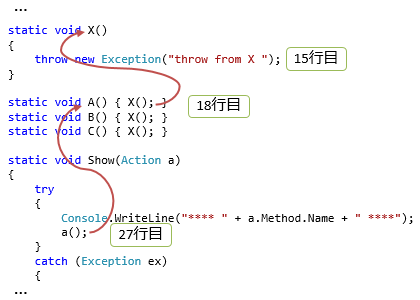

# \[雑記\] 例外のスタックトレース

##  概要

「[例外](oo_exception.md#exc)」のいいところの1つに、スタックトレース情報が残るという点が挙げられます。
ただし、「例外の投げ直し」を行いたい場合には少し注意が必要です。

##### ポイント

* デバッグ モードでコンパイルすると、行番号やスタックトレースなどの情報が得られる。

* 例外にはスタックトレースが保存されている。

* 例外を1度キャッチしてスローしなおしたい場合は throw; だけ書くか、新たに別の例外を作って throw する。

##  スタックトレースと例外

どの関数を、どういう階層をたどって呼び出したというような情報を、呼び出しスタック(call stack: 呼び出し(call)履歴が階層的につみあがっていくもの(stack))といいます。

プログラムをデバッグする際、実行時に何かエラーが出たとき、エラーが出た場所がわかるとデバッグが楽になります。
さらにいうと、呼び出しスタック(どういう呼び出し経路を通ってその場所にたどり着いたか)までわかると非常にありがたいわけですが、
このように、デバッグ用の呼び出しスタック情報を残しておくことを<strong id="stacktrace" class="keyword">スタックトレース</strong>(stack trace: スタックの追跡)といいます。

C# では、デバッグ モードでのコンパイルをすれば、元のソースコードのどの関数・どの行からコンパイルされたかという情報が残ります
(コンパイル時に生成される pdb という拡張子のファイルに記録されています)。
そして、例外が発生した場合、どこで発生したかがわかるように、Exception クラスの StackTrace プロパティにスタックトレース情報が保存されます。

例えば、以下のようなコードを実行したとします。

<pre class="source" title="スタックトレースの例" lang="">
<code>using System;

public class Program
{
    static void Main()
    {
        Show(X);
        Show(A);
        Show(B);
        Show(C);
    }

    static void X()
    {
        throw new Exception("throw from X ");
    }

    static void A() { X(); }
    static void B() { X(); }
    static void C() { X(); }

    static void Show(Action a)
    {
        try
        {
            Console.WriteLine("**** " + a.Method.Name + " ****");
            a();
        }
        catch (Exception ex)
        {
            Show(ex);
        }
    }

    static void Show(Exception ex)
    {
        Console.WriteLine("message: " + ex.Message);
        Console.WriteLine("stack trace: ");
        Console.WriteLine(ex.StackTrace);
        Console.WriteLine();
    }
}

</code></pre>

(デバッグ モードなら)以下のような実行結果が得られます。

<pre class="console" title="スタックトレースの例">
**** X ****
message: throw from X
stack trace:
   場所 Program.X() 場所 c:\temp\stacktrace1.cs:行 15
   場所 Program.Show(Action a) 場所 c:\temp\stacktrace1.cs:行 27

**** A ****
message: throw from X
stack trace:
   場所 Program.X() 場所 c:\temp\stacktrace1.cs:行 15
   場所 Program.A() 場所 c:\temp\stacktrace1.cs:行 18
   場所 Program.Show(Action a) 場所 c:\temp\stacktrace1.cs:行 27

**** B ****
message: throw from X
stack trace:
   場所 Program.X() 場所 c:\temp\stacktrace1.cs:行 15
   場所 Program.B() 場所 c:\temp\stacktrace1.cs:行 19
   場所 Program.Show(Action a) 場所 c:\temp\stacktrace1.cs:行 27

**** C ****
message: throw from X
stack trace:
   場所 Program.X() 場所 c:\temp\stacktrace1.cs:行 15
   場所 Program.C() 場所 c:\temp\stacktrace1.cs:行 20
   場所 Program.Show(Action a) 場所 c:\temp\stacktrace1.cs:行 27
</pre>

例えば、「**** A ****」から始まる数行を見てください。
図1に示すように、Show → A → X というような呼び出しの過程が見えます。
さらに、それぞれ、Show 内で A を、A 内で X を呼んだ場所や、X 内で例外を投げた場所の行番号がわかります。

<figure>
	
	<figcaption>呼び出しの過程(スタックトレース)</figcaption>
</figure>

##  例外の投げ直し

例外は、1度キャッチして、ログなどの記録だけして、実際の例外処理はさらに上位の呼び出し元に任せたい場合も多々あります。
こういう場合、catch 句の中で再度例外を throw することになりますが、この際には少し注意が必要です。

というのも、Exception クラスの StackTrace プロパティには、throw した時点のスタックトレースが記録されます。
catch 句の中での再 throw の場合、<em>その時点のスタックトレースで上書き</em>されてしまいます。
最初に throw された時点の本来のスタックトレースは紛失してしまうので、デバッグで場所を追いにくくなります。

スタックトレースを紛失する例と、その回避方法を見てみましょう。
以下のようなコードを書いたとします。

<pre class="source" title="再 throw とスタックトレース" lang="">
<code>using System;
using System.Runtime.CompilerServices;

public class Program
{
    static void Main()
    {
        Show(ThrowEx);
        Show(ThrowWithInnerException);
        Show(Rethrow);
    }

    static void ThrowEx()
    {
        try
        {
            X();
        }
        catch (Exception ex)
        {
            throw ex;  // 21 行目
        }
    }

    static void ThrowWithInnerException()
    {
        try
        {
            X();
        }
        catch (Exception ex)
        {
            throw new Exception("throw at line " + GetLineNumber(), ex); // 33 行目
        }
    }

    static void Rethrow()
    {
        try
        {
            X();
        }
        catch (Exception)
        {
            throw;   // 45 行目
        }
    }

    static void X()
    {
        throw new Exception("throw from X at line " + GetLineNumber()); // 51 行目
    }

    static int GetLineNumber([CallerLineNumber] int line = 0) { return line; }

    static void Show(Action a)
    {
        try
        {
            Console.WriteLine("**** " + a.Method.Name + " ****");
            a();
        }
        catch (Exception ex)
        {
            ShowRecursively(ex);
        }
    }

    static void ShowRecursively(Exception ex, int rank = 0)
    {
        Console.WriteLine("rank: " + rank);
        Console.WriteLine("message: " + ex.Message);
        Console.WriteLine("stack trace: ");
        Console.WriteLine(ex.StackTrace);
        Console.WriteLine();

        if (ex.InnerException != null)
            ShowRecursively(ex.InnerException, rank + 1);
    }
}
</code></pre>

このコードには、3種類の「キャッチして投げ直し」が含まれています。

* 21行目: throw ex; と書いて、元の例外を投げなおす。
    * スタックトレースを<em>紛失</em>する例。

* 33行目: 別の例外で包んで例外を投げなおす。
    * 新たに作った Exception クラスには、その時点のスタックトレースが入る。

    * 元の例外は<em>InnerException プロパティ</em>に入っていて、こちらの StackTrace プロパティを見れば、元のスタックトレースが追える。

* 45行目: throw; とだけ書く(再 throw (rethrow)専用構文)。
    * こうすると、その catch 句で拾った例外を元のまま throw しなおす。

    * <em>スタックトレースも元のまま残る</em>。

(デバッグ モードなら)実行結果は以下のようになります。

<pre class="console" title="スタックトレースの例">
**** ThrowEx ****
rank: 0
message: throw from X at line 51
stack trace:
   場所 Program.ThrowEx() 場所 c:\temp\stacktrace2.cs:行 23
   場所 Program.Show(Action a) 場所 c:\temp\stacktrace2.cs:行 61

**** ThrowWithInnerException ****
rank: 0
message: throw at line 33
stack trace:
   場所 Program.ThrowWithInnerException() 場所 c:\temp\stacktrace2.cs:行 35
   場所 Program.Show(Action a) 場所 c:\temp\stacktrace2.cs:行 61

rank: 1
message: throw from X at line 51
stack trace:
   場所 Program.X() 場所 c:\temp\stacktrace2.cs:行 51
   場所 Program.ThrowWithInnerException() 場所 c:\temp\stacktrace2.cs:行 29

**** Rethrow ****
rank: 0
message: throw from X at line 51
stack trace:
   場所 Program.X() 場所 c:\temp\stacktrace2.cs:行 51
   場所 Program.Rethrow() 場所 c:\temp\stacktrace2.cs:行 47
   場所 Program.Show(Action a) 場所 c:\temp\stacktrace2.cs:行 61
</pre>

最初の例(21行目、throw ex;)では、本来の例外の throw 場所である51行目の数字が失われています。
2つ目(33行目、他の例外で包む)では、InnerException まで追えば、51行目の情報が得られます。
そして、3つ目(45行目、throw;)では、元のままのスタックトレースが見えます(むしろ、throw しなおしたという痕跡が残りません)。

つまり、throw ex; というように、同じ例外を明示的に throw しなおすと、スタックトレース情報が紛失するのでやってはいけません。
1度 catch したことを残したいなら別の例外で包んで新たに throw、
残したくないなら throw; とだけ書きます(変数名(この例の場合でいう ex)を書かない)。

###  <a id="ExceptionDispatchInfo">ExceptionDispatchInfo</a>

`catch` 句の外で例外の再 throw を、スタックトレースを紛失せずに行えるよう、`ExceptionDispatchInfo` というクラスが追加されました。
([非同期メソッドの実装](../async/sp5_awaitable.md)に必要だったため、これと同世代の .NET Framework 4.5 の頃に追加されたものです。)

<pre class="source" title="ExceptionDispatchInfo">
<code>using System.Runtime.CompilerServices;
using System.Runtime.ExceptionServices;

Show(DispatchThrow);

static void DispatchThrow()
{
    Exception? exception = null;
    try
    {
        X();
    }
    catch (Exception e)
    {
        exception = e;
    }

    if (exception != null)
    {
        // 諸事情あって catch 内で throw; ができない場合、これを使う。
        ExceptionDispatchInfo.Throw(exception);
    }
}
</code></pre>
