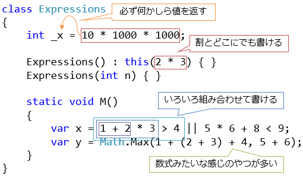
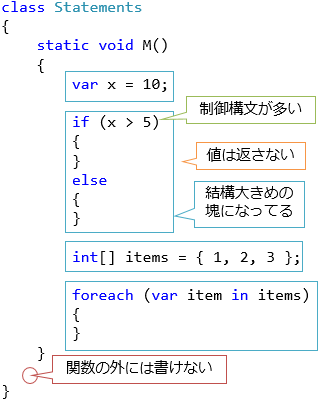

# \[雑記\] 式にまつわる補足

## 概要
「[変数と式](../start/st_variable.md)」で少し言葉としては出しましたが、
プログラミング言語の構文には大きく分けて式(expression)とステートメント(statement: 文、平叙文)という2種類のものがあります。

最近のプログラミング言語ほど式の比率が高くなっています。
C#でも、バージョンを重ねるごとに、式になっている構文が増えています。

## 式とステートメント
「[基礎](../index.md#start)」と「[構造化](../index.md#structured)」のセクションで、C#の式とステートメントの結構な割合を紹介しました。ここで1度、この式とステートメントの区別についての話をしておきます。

式とステートメントは、大まかに言うと以下のようなものです。

- <strong id="key-expression" class="keyword">式</strong>(expression): 割とどこにでも書ける代わりに戻り値が必須
- <strong id="key-statement" class="keyword">ステートメント</strong>(statement): 戻り値がなくてもいい代わりに書ける場所がブロック内に限られている

##### 式
式(expression: 表現、語句、(数学用語で)式)は、
以下のような特徴がある構文です。

- 書ける場所が多い
- 必ず何かしらの値を返す
- いろいろ組み合わせて書ける

名前からして数学用語の「式」がもとになっていますが、
名前通り、`x + 1` というような数式みたいなものが多いです。
いかにも数式っぽいもの以外にも、[`x.PropertyName`](../oop/oo_class.md#use)や[`await x`](../async/sp5_async.md) なども式です。

組み合わせて書けるというのは、例えば、
`await Task.Run(() => new[] { "abc" }[0].Length)` みたいなものも式になっています。
この式は、以下のような式を組み合わせた結果です。

- `"abc"` … [文字列リテラル](../start/st_variable.md#literal)
- "new [] { x }` [配列生成](st_array.md)
- `x[0]` … [インデックス アクセス](../oop/oo_indexer.md)
- `x.Length` … [メンバー アクセス](../oop/oo_class.md#use)
- `() => x` … [ラムダ式](../functional/sp3_lambda.md)
- `Task.Run` … [メンバー アクセス](../oop/oo_class.md#use)
- `x(y)` … [メソッド呼び出し](st_function.md)
- `await x` … [非同期処理の完了待ち](../async/sp5_async.md)

組み合わせて書ける分、1つ1つはシンプルなものが多いです。

##### ステートメント
一方、ステートメント(statement: 文、声明)は、
以下のような特徴がある構文です。

- ブロックの内側にしか書けない
- 組み合わせが効かない
- 1つ1つが大きい
- 戻り値がない

`if` などの条件分岐や、`for` などの反復処理をはじめ、[制御構文](st_control.md)が多いです。

式との比較をまとめます。

|式|ステートメント(文)|
|---|---|
|数式っぽい構文が多い|制御構文が多い|
|どこにでも書ける|ブロック内(関数本体の中など)にしか書けない|
|いろいろ組み合わせて書ける|そんなに組み合わせの幅はない|
|戻り値が必須|戻り値がない|

式やステートメント(文)の一覧は、「[C# の式と文の一覧](../cheatsheet/list_expression.md)」にまとめてあります。

## 式は増加傾向にある
近年では、ステートメントよりも式の方が好まれる傾向があります。
C# でも、バージョンアップを重ねるたびに、式の比率が増えています。

ステートメントだとそもそも書けない場所も多くて困ることがあります。
なので、以前でもステートメントを使って書けたものを、
式で書き直せるような構文の追加が結構あります。
また、式を使いやすくするような構文も増えています。

以下に例を挙げていきます。

##### C# 2.0
<table>
<tr>
<th>構文</th>
<th>新しい書き方</th>
<th>以前の書き方</th>
</tr>
<tr>
<td><a href="../resource/rm_nullusage.md#key-null-coalesce">null 合体演算子</a></td>
<td><pre class="source" title="">
<code>var y = x ?? &quot;&quot;;
</code></pre></td>
<td><pre class="source" title="">
<code>var y = x;
if (y == null) y = &quot;&quot;;
</code></pre></td>
</tr>
<tr>
<td><a href="../functional/sp_delegate.md#anonymous">匿名メソッド式</a></td>
<td><pre class="source" title="">
<code>static void Main()
{
    Func&lt;int, int&gt; f = delegate (int x)
    {
        return x * x;
    };
}
</code></pre></td>
<td><pre class="source" title="">
<code>static void Main()
{
    Func&lt;int, int&gt; f = M;
}
 
static int M(int x)
{
    return x * x;
}
</code></pre></td>
</tr>
</table>

##### C# 3.0
<table>
<tr>
<th>構文</th>
<th>新しい書き方</th>
<th>以前の書き方</th>
</tr>
<tr>
<td><a href="../cheatsheet/ap_ver3.md#functional">オブジェクト初期化子</a></td>
<td><pre class="source" title="">
<code>var p = new Point { X = 1, Y = 2 };
</code></pre></td>
<td><pre class="source" title="">
<code>var p = new Point();
p.X = 1;
p.Y = 2;
</code></pre></td>
</tr>
<tr>
<td><a href="../cheatsheet/ap_ver3.md#functional">コレクション初期化子</a></td>
<td><pre class="source" title="">
<code>var list = new List&lt;int&gt; { 1, 2 };
</code></pre></td>
<td><pre class="source" title="">
<code>var list = new List&lt;int&gt;();
list.Add(1);
list.Add(2);
</code></pre></td>
</tr>
<tr>
<td><a href="../functional/sp3_lambda.md">ラムダ式</a></td>
<td><pre class="source" title="">
<code>Func&lt;int, int&gt; f = x =&gt; x * x;
</code></pre></td>
<td><pre class="source" title="">
<code>Func&lt;int, int&gt; f = delegate (int x) { return x; };
</code></pre></td>
</tr>
<tr>
</table>

##### C# 6.0
<table>
<tr>
<th>構文</th>
<th>新しい書き方</th>
<th>以前の書き方</th>
</tr>
<tr>
<td><a href="../resource/rm_nullusage.md#key-null-conditional">null条件演算子</a></td>
<td><pre class="source" title="">
<code>var y = x?.Length;
</code></pre></td>
<td><pre class="source" title="">
<code>int? y;
if (x == null) y = null;
else y = x.Length;
</code></pre></td>
</tr>
<tr>
<td><a href="../cheatsheet/ap_ver6.md#index-initializer">インデックス初期化子</a></td>
<td><pre class="source" title="">
<code>var dic = new Dictionary&lt;string, int&gt;
{
    [&quot;one&quot;] = 1,
    [&quot;two&quot;] = 2
};
</code></pre></td>
<td><pre class="source" title="">
<code>var dic = new Dictionary&lt;string, int&gt;();
dic[&quot;one&quot;] = 1;
dic[&quot;two&quot;] = 2;
</code></pre></td>
</tr>
<tr>
<td><a href="../cheatsheet/ap_ver6.md#sec-expression-bodied">式形式メンバー</a></td>
<td><pre class="source" title="">
<code>static int M(int x) =&gt; x * x;
</code></pre></td>
<td><pre class="source" title="">
<code>static int M(int x)
{
    return x * x;
}
</code></pre></td>
</tr>
</table>

##### C# 7.0
<table>
<tr>
<th>構文</th>
<th>新しい書き方</th>
<th>以前の書き方</th>
</tr>
<tr>
<td><a href="st_function.md#sec-expression-bodied">式形式メンバー(追加)</a></td>
<td><pre class="source" title="">
<code>struct Point
{
    public int X, Y;
    public Point(int x, int y)
        =&gt; (X, Y) = (x, y);
}
</code></pre></td>
<td><pre class="source" title="">
<code>struct Point
{
    public int X, Y;
    public Point(int x, int y)
    {
        X = x;
        Y = y;
    }
}
</code></pre></td>
</tr>
<tr>
<td><a href="oo_exception.md#throwexpr">throw 式</a></td>
<td><pre class="source" title="">
<code>static string M(string s)
        =&gt; s ?? throw new Exception();
</code></pre></td>
<td><pre class="source" title="">
<code>static string M(string s)
{
    if (s == null) throw new Exception();
    return s;
}
</code></pre></td>
</tr>
<tr>
<td><a href="../resource/sp_ref.md#out-var">出力変数宣言</a></td>
<td><pre class="source" title="">
<code>static int M(string s)
         =&gt; int.TryParse(s, out var x) ? x : -1;
</code></pre></td>
<td><pre class="source" title="">
<code>static int M(string s)
{
    int x;
    if (int.TryParse(s, out x)) return x;
    else return -1;
}
</code></pre></td>
</tr>
<tr>
<td><a href="../datatype/patterns.md#declaration">宣言パターン</a></td>
<td><pre class="source" title="">
<code>static int M(object x)
        =&gt; x is string s ? s.Length : 0;
</code></pre></td>
<td><pre class="source" title="">
<code>static int M(object x)
{
    var s = x as string;
    if (s != null) return s.Length;
    return 0;
}
</code></pre></td>
</tr>
</table>

##### C# 8.0
<table>
<tr>
<th>構文</th>
<th>新しい書き方</th>
<th>以前の書き方</th>
</tr>
<tr>
<td><a href="#abstract">switch 式</a></td>
<td><pre class="source" title="">
<code>static int M(int? x, int? y)
    =&gt; (x, y) switch
    {
        (null, null) =&gt; 0,
        (null, { }) =&gt; 1,
        ({ }, null) =&gt; -1,
        (int i, int j) =&gt; i.CompareTo(j),
    };
</code></pre></td>
<td><pre class="source" title="">
<code>static int M(int? x, int? y)
{
    if (x is int i)
    {
        if (y is int j) return i.CompareTo(j);
        else return -1;
    }
    else
    {
        if (y is int) return 1;
        else return 0;
    }
}
</code></pre></td>
</tr>
</table>
