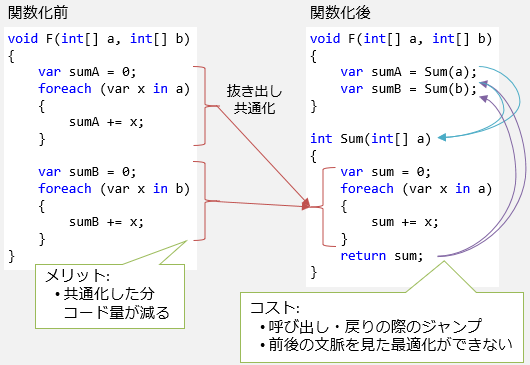
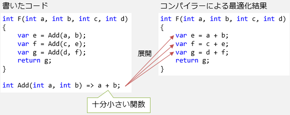

# \[雑記\] インライン化

## 概要
[前述](st_function.md)の通り、関数によって「同じ処理を何度も繰り返し書かない」、「意味のある単位で明確な名前を付ける」ということができ、プログラムを読みやすく・書きやすくすることができます。

一方で、ここでは、プログラムのパフォーマンスの面から関数を見てみましょう。関数呼び出しには多少のコストが掛かります。このコストをなくすため、コンパイラーによってインライン化という最適化が行われます。

## 関数呼び出しのコスト
読みやすさ・書きやすさの面は抜きにして、関数のパフォーマンス面だけを考えてみます。

まずメリットですが、関数化によって重複コードが消えることで、プログラム全体のサイズが小さくなります。
サイズの減少量にもよりますが、基本的には小さい方が、プログラム自身の読み込み速度などの面で、実行速度的にもメリットになります。

一方で、関数化することで、関数の呼び出しや戻り時のジャンプにコストが掛かります。
また、共通化した結果、処理の前後を見ての最適化はかけづらくなります。

特に、関数の中身が小さい時には、コードの共通化によってサイズが減るメリットがほとんどなく、
ただ単にコストが掛かるだけになってしまいます。

## インライン化
関数化にはコストが掛かるといっても、
パフォーマンス改善のために、関数化すべきところをわざわざ手作業でコピペ展開する必要はありません。
コンパイラーが自動的に最適化してくれます。

すなわち、「展開する方が確実に良い」と判定できる関数に対しては、関数の中身を呼び出しカ所に、コンパイラーが自動的に展開します。
この処理を<strong id="key-inlining" class="keyword">インライン化</strong>(inlining: in-lineに埋め込む)やインライン展開(inline expansion)と呼びます。

## C# のインライン化
C# の場合、C# コンパイラー自身はインライン化を全くしません。
.NET ランタイムが[IL](../../il/index.md)を解釈する際にインライン化が行われます。
すなわち、インライン化が掛かるタイミングは[JITコンパイル](../framework/fwjitcompilation.md#jit-compilation)時です。

実際にインライン化が掛かるかどうかはランタイムの実装依存で、仕様としては決まっていません。
現在インライン化が掛からない場合であっても、将来的には掛かるようになる可能性もあります。
公式にドキュメントがあるわけでもないのですが、非公式なブログ等の情報によると、以下のような判定を行うそうです。

- C# コンパイル結果の IL 命令が32バイトを超える場合、インライン化しない
- [反復処理](st_loop.md)を含む場合、インライン化しない
- [例外処理](oo_exception.md)を含む場合、インライン化しない

また、そもそも原理的にインライン化できない場合もあります。通常、[仮想呼び出し](../oop/oo_polymorphism.md#virtual)になっている関数をはインライン化できません。
その結果、[インターフェイス](../oop/oo_interface.md)や[デリゲート](../functional/sp_delegate.md)を介した関数呼び出しはインライン化できません。

.NET は、ある程度インライン化の有無を制御する手段も提供しています。
以下のように、`MethodImpl`[属性](../dynamic/sp_attribute.md)(`System.Runtime.CompilerServices`[名前空間](sp_namespace.md))を付けます。

<pre class="source" title="インライン化に関する属性">
<code>// 積極的にインライン化してもらいたい
[MethodImpl(MethodImplOptions.AggressiveInlining)]
static int SumAgressive(int[] a)
{
    var sum = 0;
    foreach (var x in a)
    {
        sum += x;
    }
    return sum;
}

// 全くインライン化させたくない
[MethodImpl(MethodImplOptions.NoInlining)]
static int SumNo(int[] a)
{
    var sum = 0;
    foreach (var x in a)
    {
        sum += x;
    }
    return sum;
}
</code></pre>

`AggressiveInlining`が付いている場合、前述の「32バイト」「反復処理・例外処理を含む」という条件が緩和されます。
あくまで「緩和」であって、無条件にインライン化されるわけではありません。
この例の場合は、「`foreach`ループを含んではいるものの、関数の中身自体は十分に小さい」という条件なので、
何も属性を付けなければインライン化されず、`AggressiveInlining`を付けるとインライン化されます。

一方、`NoInlining`を付けると絶対にインライン化されなくなります。
わざわざ最適化を阻害するものなので、かなり特殊な用途でしか使わないでしょう。

### インライン化によるパフォーマンス改善
このインライン化の有無によってどの程度性能が変わるかを見てみましょう。
以下に、計測用のコードを示します。

- [単純な加算](https://github.com/ufcpp/UfcppSample/blob/master/Chapters/StructuredProgramming/Inlining/SimpleAdd.cs)
- [単純な反復処理](https://github.com/ufcpp/UfcppSample/blob/master/Chapters/StructuredProgramming/Inlining/WithLoop.cs)

どちらもかなり関数の中身が小さいものなので、インライン化の有無が顕著に効いてきます。
単純な加算の方に至っては倍以上の速度差があります。

### 頻出経路の最適化
反復処理や例外処理でインライン化が阻害される性質を考えると、
阻害する部分だけを切り出してしまうことでプログラムを高速化できることがあります。

あくまで、以下のような限られた場面でしか使えないテクニックですし、高速化といっても数%程度のものではありますが、
実行速度が非常に重要になる場面では役立つでしょう。

- 引数としてわたってくるものの頻度を予測できる
- 高頻度で中身が単純な経路と、低頻度で中身が複雑な経路に分かれている

例えば以下のようなコードを見てみましょう。

- [サンプル](https://github.com/ufcpp/UfcppSample/blob/master/Chapters/StructuredProgramming/Inlining/CommonExecutionPath.cs)

<pre class="source" title="長さ1の時と2の時だけ特別扱いする総和">
<code>static int Sum(int[] a)
{
    // ほとんどの場合、Length == 1 または 2 のところを通るという想定
    if (a.Length == 1) return a[0];
    else if (a.Length == 2) return a[0] + a[1];
    else if (a.Length &gt;= 3)
    {
        // 反復がインライン化を阻害
        var sum = 0;
        foreach (var x in a)
        {
            sum += x;
        }
        return sum;
    }

    // 例外がインライン化を阻害
    throw new IndexOutOfRangeException();
}
</code></pre>

単に配列の総和を取るコードですが、
「ほとんどの場合長さ1か2の配列しか来ない」というような前提で、
その長さ1か2の場合を特別扱いしているものです。

この`Sum`メソッドは、反復処理と例外処理を含んでいるため、インライン化できません。
しかし、この反復処理と例外処理は、先ほどの前提から言うと、めったに通らない個所にあります。
そこで、以下のように書き換えます。

<pre class="source" title="めったに通らないくせにインライン化を阻害している部分を外に追い出す">
<code>static int OptimizedSum(int[] a)
{
    // ほとんどの場合、Length == 1 または 2 のところを通るという想定
    if (a.Length == 1) return a[0];
    else if (a.Length == 2) return a[0] + a[1];
    else if (a.Length &gt;= 3) return LongSum(a);
    ThrowIndexOutOfRange();
    return 0;
}

// インライン化を阻害しているものを外に追い出す
private static int LongSum(int[] a)
{
    var sum = 0;
    foreach (var x in a)
    {
        sum += x;
    }
    return sum;
}
private static void ThrowIndexOutOfRange() =&gt; throw new IndexOutOfRangeException();
</code></pre>

めったに通らないくせにインライン化を阻害していた`foreach`ループと例外の`throw`を外に追い出しています。
その結果、`OptimizedSum`メソッド自体にはインライン化が掛かるようになり、関数呼び出しのコストが消えます。
数%程度ですが、これで高速化します。
