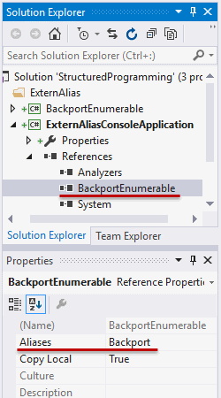

# 名前空間

## <a id="sec-generated-title-1"></a> <a id="abst"></a>概要

<strong id="namespace" class="keyword">名前空間</strong>（name space）とは、
ファイルを種類ごとにフォルダに分けて管理するのと同じように、
クラスを種類ごとに分けて管理するための機構です。


##### <a id="sec-generated-title-2"></a>ポイント

* namespace キーワードで名前空間を定義します。

* フォルダを掘ってファイルを整理するような感覚で、名前空間を作ってクラスを整理します。

* 例： namespace SampleNameSpace { class SampleClass {} }


## <a id="sec-generated-title-3"></a> <a id="about"></a>名前空間とは

名前空間は、ファイル整理のためにフォルダ分けすることに例えられます。

例えば、ウェブページを作成する場合、コンテンツごとにフォルダに分けて管理すると、サイトの管理がしやすくなります。
例えば、うちのサイトの場合、以下のようなフォルダ構成になっています。
（注：今は構成が変わっています。昔はこういう構成でした。）

```csharp
/--+-- memo           (ブログ的な何か)
   |
   +-- csharp         (このコーナー)
   |
   +-- study-------+  (院試勉強まとめ用)
                   |
                   +-- em      (電磁理論)
                   |
                   +-- math    (数学)
```


そして各フォルダの中にhtmlや画像ファイルがあります。
このようにコンテンツごとに分けることで、どこにどのファイルがあるのかが分かりやすくなりますし、
それぞれのフォルダに同じ名前のファイル(例えばindex.htmlやback.png)があっても問題はおきません。

プログラムを作成する場合でも、プログラムの規模が大きくなってきて、クラスの数が多くなってくると、
クラスを関連性のあるもの同士まとめて管理するような仕組みが必要になってきます。
そのような、クラスを階層的に分類するための機構が<em>名前空間</em>です。

例として、.NET frameworkの標準クラスライブラリを見てみましょう。
.NET frameworkの標準クラスライブラリ中のクラスの大半は<code>System</code>という名前空間に属しています。
<code>System</code>名前空間の下に、<code>Text</code>、<code>IO</code>、<code>Drawing</code>などの名前空間があります。
以下に、名前空間の階層構造と、各名前空間の説明および名前空間に属するクラスの一部を簡単に示します。

```csharp
System --+
         |
         +-- IO
         |   (ファイル入出力。File や Directory などが属する。)
         +-- Text -----+  (文章処理。Encoding などが属する。)
         |             |
         |             +-- RegularExpressions
         |                 (正規表現。Regex や Match などが属する。)
         |
         +-- Drawing --+  (GUI処理。Image や Font や Icon などが属する。)
                       |
                       +-- Imaging
                       |   (画像処理。ImageFormat や Encoder などが属する。)
                       +-- Printing
                           (印刷。PrintController などが属する。)
```


このように階層的に名前を管理することで、例えば、<code>System.Text.Encoding</code>クラス(Windowsのファイルシステムではフォルダの区切りに「 <code>\\</code> 」を使いますが、C#の名前空間の区切りには「 <code>.</code> 」を使います)は画像や音声のエンコード形式ではなくテキストの文字コードだと容易に見当が付きます。

C# では、名前空間の定義(= フォルダーを掘るようなものに) `namespace` キーワードを使います。

```csharp
namespace MyNamespace // ← MyNamespace という名前空間(フォルダーみたいなもの)を掘った状態
{
    // その中にクラスを置く
    class X { }
}
```

一方で、「パスを通す」(フルネームで書かなくても `File` や `Regex` だけでクラスなどを参照する)ための構文も持っていて、こちらには `using` キーワードを使います。

```csharp
using System;
using System.IO;

// System.IO の中に Directory がある。
// フルネームで書くなら System.IO.Directory.GetFiles()
var count = Directory.GetFiles(".").Length;

// System の中に Console がある。
// フルネームで書くなら System.Console()
Console.WriteLine($"フォルダーの下に {count} 個のファイルがあります");
```

ちなみに、名前空間に含まれない部分、ソースコードの一番上の部分を<strong id="global-namespace" class="keyword">グローバル名前空間</strong>(global namespace)と呼びます。

```csharp
// この辺りの事を「グローバル」(global)と呼ぶ。

namespace MyNamespace
{
    // この辺りは「名前空間の中」。
}
```

## <a id="sec-generated-title-4"></a> <a id="use"></a>名前空間の使い方

具体的に名前空間を使う方法を見ていきましょう。
ここでは例として、学校の課題で文字列クラス、リストクラス、可変長配列クラス、画像クラスを作れといわれたとします(これらのものは、標準ライブラリに初めから用意されていますが、プログラムの勉強のためにわざわざ自作してみることになった)。

### <a id="sec-generated-title-5"></a> <a id="namespace-declaration"></a>namespace (名前空間の定義)

まず、課題を出された各人の作ったクラスの名前が重ならないように、それそれ自分の名前を使って名前空間を作ります。
文字列クラス<code>String</code>はそのすぐ下に作りましょう。
そして、リストクラス<code>List</code>と可変長配列クラス<code>Vector</code>は、名前空間<code>Collections</code>を作ってその下に、画像クラス<code>Image</code>は名前空間<code>Drawing</code>を作ってその下に作ることにします。
階層構造は以下のようになります。

```csharp
Ufcpp --+-- String                    (文字列クラス)
        |
        +-- Collections --+-- List    (リストクラス)
        |                 |
        |                 +-- Vector  (可変長配列クラス)
        |
        +-- Drawing --------- Image   (画像クラス)
```


このような構造の名前空間を作るためには以下のように書きます。

```csharp
namespace Ufcpp
{
  class String{// String の内容}

  namespace Collections
  {
    class List{// List の内容}

    class Vector{// Vector の内容}
  }

  namespace Drawing
  {
    class Image{// Image の内容}
  }
}
```


名前空間を定義するためには<em>
        <code>namespace</code>
      </em>というキーワードを使います。
そしてその後に続く {} の中で定義したクラスや名前空間はすべてその名前空間に属することになります。
また、以下のように書いてもこれとまったく同じ意味になります。

```csharp
namespace Ufcpp
{
  class String{// String の内容}
}

namespace Ufcpp.Collections
{
  class List{// List の内容}
}

namespace Ufcpp.Collections
{
  class Vector{// Vector の内容}
}

namespace Ufcpp.Drawing
{
  class Image{// Image の内容}
}
```


つまり、名前空間を2つ以上の場所に分けて書くこともできますし、
「 <code>.</code> 」で区切ることで階層構造を指定できます。

次に、名前空間中に定義したクラスを参照する方法を説明します。
名前空間中に定義したクラスは、以下のように、階層構造を「 <code>.</code> 」で区切って指定することで参照できます。

```csharp
class NameSpaceTest
{
  static void Main()
  {
    Ufcpp.String str = new Ufcpp.String("test");

    Ufcpp.Collections.List list = new Ufcpp.Collections.List();
    Ufcpp.Collections.Vector vec = new Ufcpp.Collections.Vector();

    Ufcpp.Drawing.Image image = new Ufcpp.Drawing.Image("back.png");
  }
}
```


<code>Ufcpp.Collections.Vector</code>というように、名前空間をすべて指定した形式の名前を<em>完全修飾名</em>(fully qualified name)と言います。

### <a id="sec-generated-title-6"></a> <a id="file-scoped-namespace"></a>ファイル スコープ namespace

<h5 class="version version10">Ver. 10</h5>

C# 10.0 から `{}` なしの以下のような書き方で名前空間を指定できるようになりました。

```csharp
namespace Namespace;

class A { }
```

これで以下のコードと同じ意味になります。

```csharp
namespace Namespace
{
    class A { }
}
```

新しい `{}` なしで `;` を書いてしまう書き方はファイル全体を `namespace {}` でくくったのを同じ意味になります。
そういう意味でこの書き方を<strong id="key-file-scoped-namespace" class="keyword">ファイル スコープ名前空間</strong>(file-scoped namespace)と言います。

ファイル スコープ名前空間は1つの C# ファイルにつき1つだけ書けます。例えば以下のコードはコンパイル エラーになります。

```csharp
namespace Ns1;
namespace Ns2;

class A { }
```

また、ファイル スコープ名前空間はファイルの「ほぼ先頭」に書く必要があります。
ファイル スコープ名前空間よりも前に書けるものはかなり限られていて、

* [コメント](../start/st_comment.md)
* [プリプロセス命令](../misc/sp_preprocess.md#preprocess)
* 次節で説明する[using](#using-directive)
* [外部エイリアス](#extern)
* [assembly、module 対象の属性](../dynamic/sp_attribute.md#target)

くらいです。このうち頻繁に利用するのはコメントと using くらいでしょう。

```csharp
// コメントと using は namespace よりも前に書ける。
using System.Text;

namespace Ns1;

// using は後にも書ける。
using System.Text.Encodings;

class A { }
```

これで以下のコードと同じ意味になります。

```csharp
// コメントと using は namespace よりも前に書ける。
using System.Text;

namespace Ns1
{
    // using は後にも書ける。
    using System.Text.Encodings;

    class A { }
}
```

「インデントが1段減る」程度の小さなメリットですが、
一方でデメリットも「1ファイルに1つしか書けない」程度で、
ほとんどの人は制限を掛けられなくても最初から「1ファイルに1つしか書かない」ので特に問題にはならないでしょう。

### <a id="sec-generated-title-7"></a> <a id="using-directive"></a>using (名前空間の参照)

また、いちいち完全修飾名を書かなくても済むように、<strong id="using" class="keyword">using ディレクティブ</strong>というものが用意されています。

```csharp
using Ufcpp; // 名前空間 Ufcpp 内にあるクラスを修飾名なしで使えるようになる

class NameSpaceTest
{
  static void Main()
  {
    String str = new String("test"); // Ufcpp. が要らない

    Drawing.Image image = new Drawing.Image("back.png");
  }
}
```


```csharp
using Ufcpp;
using Ufcpp.Collections;
using Ufcpp.Drawing;

class NameSpaceTest
{
  static void Main()
  {
    String str = new String("test");     // Ufcpp. が要らない

    List list = new List();              // Ufcpp.Collections も要らない
    Vector vec = new Vector();

    Image image = new Image("back.png"); // Ufcpp.Drawing. も要らない
  }
}
```


先頭の<em>
        <code>using</code>
      </em>から始まる行がusingディレクティブです。
このように、usingディレクティブを使うことでコードの入力手間を省くことが出来ます。

ちなみに、 using ディレクティブはほぼファイルの先頭、もしくは、名前空間内の先頭にしか書けません。
(ファイルの先頭も「グローバル名前空間の先頭」という扱いなので、「名前空間内の先頭にだけ書ける」と考えて大丈夫です。)
using ディレクティブよりも前に書けるのは、
コメントや空白のようにプログラムに影響しないものか、
[プリプロセッサー](../misc/sp_preprocess.md)や[extern alias](#extern)などのめったに使わない構文だけです。

```csharp
// (コメントを除いて) using より前にはほぼ何も書けない。
using System;

Console.WriteLine(); // 何か書いてしまうと…

using System.IO; // この行はコンパイル エラー。
```

ただ、名前空間自体が入れ子に書けるので、「名前空間の先頭にしか書けない」といっても using ディレクティブも入れ子で書けます。

```csharp
using System;

namespace Ns1
{
    using System.IO;

    namespace Ns2
    {
        using System.Collections;
    }
}
```

また「using しすぎ」にはそこそこ注意が必要です。
名前の衝突を避けるために名前空間を掘っているのに、using するとその「名前空間分け」をなくすことになります。
例えば、以下のように「別名前空間の同名の型」を用意します。

```csharp
// 名前空間違いで同じ名前のクラスを用意しておく。
namespace A
{
    class X { }
}

namespace B
{
    class X { }
}
```

ここで、`using A` と `using B` を同時に書いてしまうと「どちらかわからない」というコンパイル エラーを起こします。
(こういうエラーを「名前があいまい」(ambiguous)と言います。)

```csharp
// A と B の using を同列に並べる。
using A;
using B;

class C
{
    X x; // A.X か B.X かわからないのでエラー。
}
```

ちなみに、[後述しますが](#priority)、
入れ子の場合は内側優先で名前解決します。

### <a id="sec-generated-title-8"></a> <a id="global-using"></a>global using

<h5 class="version version10">Ver. 10</h5>

C# 10.0 から `using` ディレクティブの前に `global` という修飾を付けることで、
[プロジェクト](../package/project.md#project)内全域に対して影響を及ぼす `using` (名前空間の参照)ができるようになりました。
(これを <strong id="key-global-using" class="keyword">global using ディレクティブ</strong>といいます。
俗称としては単に「global using」。)

例えば、プロジェクト内のどこか1つのファイルに以下のようなコードを書いたとします。

```csharp
global using System.Text.RegularExpressions;
```

これで、このプロジェクト内のすべてのファイルで、ファイルの先頭に `using System.Text.RegularExpressions` を書いたのと同じ状態になります。

例えば別のファイルに以下のようなコードを書いたとき、

```csharp
var line = Console.ReadLine();
var m = Regex.Match(line, @"\d+");
if (m.Success)
    Console.WriteLine(m.Value);
```

以下のコードと同じ扱いでコンパイルされます。
(この例の場合、`Regex` クラスが `System.Text.RegularExpressions` 名前空間内で定義されいているクラスなので、`using System.Text.RegularExpressions` が必要。)

```csharp
using System.Text.RegularExpressions;

var line = Console.ReadLine();
var m = Regex.Match(line, @"\d+");
if (m.Success)
    Console.WriteLine(m.Value);
```

同じキーワードを流用したため後述する [global エイリアス](#global)と紛らわしいですが別物です。

ちなみに、通常の using ディレクティブに加え、後述する [using static](#using-static) や [using エイリアス](#alias)に対しても同様に `global` 修飾を付けることでプロジェクト全域化できます。

```csharp
global using System.Text.RegularExpressions;
global using static System.Linq.Enumerable;
global using Date = System.DateOnly;
```

global using は通常の using ディレクティブの前にしか書けません。
例えば以下のコードはコンパイル エラーになります。

```csharp
using System;
global using System.Text.RegularExpressions;
```

using ディレクティブ自体が、ファイルの中でもかなり先頭の方にしか書けない構文なので、
必然的に global using よりも前に書けるものはほとんどなくなります。
[ファイル スコープ名前空間](#file-scoped-namespace)よりもさらに厳しくて、

* [コメント](../start/st_comment.md)
* [プリプロセス命令](../misc/sp_preprocess.md#preprocess)
* [外部エイリアス](#extern)

しか書けません。

#### <a id="sec-generated-title-9"></a> <a id="usage-global-using"></a>global using の用途

前節で「using しすぎ」に注意を促しましたが、プロジェクト全域に影響を及ぼす global using ではなおの事注意が必要です。
基本的には「むやみやたらと使うものではない」という認識でいいと思います。

その一方で、`System` 名前空間(標準ライブラリの名前空間)のように、
世の中の C# コードの過半数が using していて、
「それはさすがに global using しても誰も困らないだろう」というものもあります。

実際、例えば .NET 5 (Visual Studio 2019) 時点で、Visual Studio でテンプレート通りに C# のクラスを作ると、
初期状態で以下のようなコードが作られます。
`System`、`System.Collections.Generic` などの名前空間は「ほぼみんな使う」と判断されていて、初期状態で using が付いてきます。

```csharp
using System;
using System.Collections.Generic;
using System.Linq;
using System.Text;
using System.Threading.Tasks;

namespace ConsoleApp1
{
    class A
    {
    }
}
```

これを、[ファイル スコープ名前空間](#file-scoped-namespace)と併せて、
以下のようなコードにまでテンプレートの行数を減らしたいというのが global using の主な目的になります。

```csharp
namespace ConsoleApp1;

class A
{
}
```

この場合でも、開発者自らが global using を書くことは少なくて、
実際には「自動的に生成されているもの」なことが多くなると思います。
詳しくはブログの「[最初の C# プログラム](../../../blog/2021/8/newprojecttemplate/index.md)」で説明しています。

## <a id="sec-generated-title-10"></a> <a id="using-static"></a>補足: using static

<h5 class="version version6">Ver. 6</h5>

名前空間関連ではないんですが、名前空間の「[using ディレクティブ](#using)」と似たものなのでここで紹介だけしておきたい機能が、
静的メソッドに対する 「[using static](../oop/oo_static.md#key-using-static)」 です。
以下のように、静的メソッドの呼び出しに対して、クラス名を省略できるようになる機能です(C# 6からの機能)。

```csharp
using System;
using static System.Math;

class Program
{
    static void Main()
    {
        var pi = 2 * Asin(1);
        Console.WriteLine(PI == pi);
    }
}
```


詳しくは、「[静的メンバー](../oop/oo_static.md)」で説明します。

## <a id="sec-generated-title-11"></a> <a id="alias"></a>using エイリアス

先ほど自作した<code>String</code>のテストのために、比較対象として.NET frameworkに標準で用意されている<code>System.String</code>クラスを同時に使用したいとします。
もちろん、<code>Ufcpp.String</code>というように完全修飾名を用いれば、<code>System.String</code>と共存可能なのですが、<strong id="alias" class="keyword">エイリアス</strong>（alias：別名付け）という機能を使うことでも共存させることが出来ます。

エイリアスは以下のような書き方をします。

```csharp
using MyString = Ufcpp.String;
```


名前空間の先頭でこのような宣言をすることで、その名前空間中では<code>MyString</code>と書くことで<code>Ufcpp.String</code>を参照することが出来ます。

```csharp
using System;
using MyString = Ufcpp.String;           // クラスのエイリアス
using MyCollections = Ufcpp.Collections; // 名前空間のエイリアスも作れる

class NameSpaceTest
{
  static void Main()
  {
    String str = new String("test");
    //↑ System.String が参照される
    MyString str = new MyString("test");
    //↑ Ufcpp.String が参照される
    MyCollections.List list = new MyCollections.List();
    //↑ Ufcpp.Collections.List が参照される
  }
}
```


##### <a id="sec-generated-title-12"></a>サンプル

```csharp
using System;
 
/// <summary>
/// 自作クラス用の名前空間
/// </summary>
namespace Ufcpp
{
    /// <summary>
    /// 数学関数の自作
    /// </summary>
    public class Math
    {
        /// <summary>
        /// sin(x) の値を求める。
        /// この実装は甘い。
        /// 入力できる値は-0.1～0.1程度で、精度も4桁程度。
        /// </summary>
        public static double Sin(double x)
        {
            double xx = -x * x;
            double fact = 1;
            double sin = x;
 
            for (int i = 2; i < 100;)
            {
                fact *= i; ++i; fact *= i; ++i;
                x *= xx;
                sin += x / fact;
            }
            return sin;
        }
    }
}
 
namespace Sample
{
    using MyMath = Ufcpp.Math;
 
    class NameSpaceSample
    {
        static void Main()
        {
            Console.Write("   x, System.Math.Sin(x), Ufcpp.Math.Sin(x)\n");
            for (int i = 0; i < 10; ++i)
            {
                double x = 0.01 * i;
 
                double y = Math.Sin(x);   // System.Math.Sin呼び出し
                double z = MyMath.Sin(x); // Ufcpp.Math.Sin呼び出し
 
                Console.Write("{0:f2},           {1:f6},            {2:f6}\n", x, y, z);
            }
        }
    }
}
```


```console
   x, System.Math.Sin(x), Ufcpp.Math.Sin(x)
0.00,           0.000000,            0.000000
0.01,           0.010000,            0.010000
0.02,           0.019999,            0.019999
0.03,           0.029996,            0.029996
0.04,           0.039989,            0.039989
0.05,           0.049979,            0.049979
0.06,           0.059964,            0.059964
0.07,           0.069943,            0.069943
0.08,           0.079915,            0.079915
0.09,           0.089879,            0.089879
```


### <a id="sec-generated-title-13"></a> <a id="using-any-type">任意の型に対する using エイリアス</a>

<h5 class="version version12">Ver. 12</h5>

C# 12 から以下のようなコードをコンパイルできるようになりました。

```csharp
using Primitive = int;
using Array = int[];
using Nullable = int?;
using Tuple = (int, int);
```

要するに以下の2点が改善点です。

* `int` みたいなキーワードをそのまま using エイリアスの右辺に書けるようになった
* [配列](st_array.md)、[nullable 値型](../resource/sp2_nullable.md)、[タプル](../datatype/tuples.md)などを C# の専用構文を使って書けるようになった

C# 11 以前でも以下のように、キーワード・専用構文を使わない書き方はできていました。

```csharp
using Primitive = System.Int32;
using Nullable = System.Nullable<System.Int32>;
using Tuple = System.ValueTuple<System.Int32, System.Int32>;
//※ 配列を書く手段はなかった
```

また、少々不可解なことに、以下のようなコードも C# 11 以前から書けていました。

```csharp
using Primitive = System.ValueTuple<int>;
using Array = System.ValueTuple<int[]>;
using Nullable = System.ValueTuple<int?>;
using Tuple = System.ValueTuple<(int, int)>;
```

つまり、型引数(ジェネリック型 `X<T>` の `T` の部分)であればこれまでも `int` や `int[]` などが書けました。
C# 12 では、なぜか最上位レベルの時にだけかかっていた謎の制限を取り払ったことになります。
(実際、仕様書・実装ともに微々たる修正だったようです。)

ちなみに、C# 12 ではポインターや関数ポインターに対しても using エイリアスを使えるようになりました。
詳しくは「[unsafe 型に対する using エイリアス](../interop/sp_unsafe.md#unsafe-using)」で説明します。

## <a id="sec-generated-title-14"></a> <a id="alias_sp"></a>エイリアス修飾子

<h5 class="version version2">Ver. 2.0</h5>

前節で説明したとおり、
名前空間にはエイリアス（別名）を付けられます。

例えば、以下のように、ちょっと長めの名前空間名 Ufcpp.Test.Utilities に、
短いエイリアス Util を付けたとします。

```csharp
namespace Ufcpp.Test.Utilities
{
  class Image {}
}

namespace TestNamespace
{
  using Util = Ufcpp.Test.Utilities; // エイリアスをつける。

  class Program
  {
    static void Main(string[] args)
    {
      Util.Image img = new Util.Image();
    }
  }
}
```


このコード自体には特に問題もなく、ちゃんとコンパイルが通ります。
ところが、このプログラムを修正していくうちに、ちょっとした問題が生じる可能性があります。
例えば、複数人で開発しているものとして、
自分以外の誰かが、TestNamespace 内に Util というクラスを作ってしまったとしましょう。

```csharp
namespace Ufcpp.Test.Utilities
{
  class Image {}
}

namespace TestNamespace
{
  using Util = Ufcpp.Test.Utilities;

  class Program
  {
    static void Main(string[] args)
    {
      Util.Image img = new Util.Image();
    }
  }

  class Util {} // Util クラスを追加。エラーになる。
}
```


たったこれだけでこのコードはコンパイルエラーを起こします。
（エイリアス Util がクラス Util と衝突しましたと怒られるか、
Util と言う名前は既に存在しますと怒られるはず。）

この問題を緩和するため、C# 2.0 では、エイリアス修飾子というものが追加されました。
エイリアス修飾子は、<code>Alias.Class</code> という書き方の代わりに、
<code>Alias::Class</code> と言うように、<code>:</code> を2つ付けます。
このエイリアス修飾子 <code>::</code> は、基本的には <code>.</code> と同じ結果を生みますが、
ただ、エイリアスの後ろにしか付けられないという制限があります。
このため、<code>::</code> の付いている部分の直前はエイリアスであることが確定し、
エイリアスと同名のクラスが追加されても混乱が起こりません。

```csharp
namespace Ufcpp.Test.Utilities
{
  class Image {}
}

namespace TestNamespace
{
  using Util = Ufcpp.Test.Utilities;

  class Program
  {
    static void Main(string[] args)
    {
      Util::Image img = new Util::Image();
      //↑ この Util はエイリアスの Util とみなされる。
    }
  }

  class Util {} // Util と同名のクラスがあっても OK。
}
```

### <a id="sec-generated-title-15"></a> <a id="global"></a>global 名前空間エイリアス

<h5 class="version version2">Ver. 2.0</h5>

名前の付け方次第では、完全修飾名で書いても参照できない場合があります。
以下のように、名前空間の階層に同名の識別子がある場合です。

```csharp
using static System.Console;

namespace X.Y
{
    class Program
    {
        static void Main()
        {
            // 単に Y って書くと、名前空間 X.Y の方の意味になる
            Y.F(); // コンパイル エラー。名前空間 Y に F がいない
        }
    }
}

class Y { public static void F() => WriteLine("class Y"); }
```

階層違いで同名のものがあることが原因なので、必ず最上位(グローバル名前空間)からたどる手段があれば解決します。
そのために使うのが、`global`名前空間エイリアスです。
以下のように、`global::`から書き始めれば、最上位から名前をたどれます。

```csharp
using static System.Console;

namespace X.Y
{
    class Program
    {
        static void Main()
        {
            // global エイリアスを使えば、最上位から名前をたどれる
            global::Y.F();
        }
    }
}

class Y { public static void F() => WriteLine("class Y"); }
```

`global`は、`::`の前でだけキーワード扱いされる文脈キーワードです。
その他の場面では、`global`クラスを作ったり、`global`という名前の名前空間を作ったり、参照したりもできます。

## <a id="sec-generated-title-16"></a> <a id="extern"></a>外部エイリアス

<h5 class="version version2">Ver. 2.0</h5>

C# 2.0 では、using を使ってエイリアスを定義する代わりに、
コンパイルオプションでエイリアスを付けることが可能になりました（外部エイリアス）。

外部エイリアスを使うにはまず、
ソースファイル中に extern alias という宣言を書きます。

```csharp
extern alias X;

class Program
{
  static void Main(string[] args)
  {
    X::A a = new X::A();
  }
}
```


そして、ソースファイルのコンパイル時に、
以下のようなオプションを追加します。

```console
csc /r:X=Ufcpp.dll Test.cs
```


これで、Ufcpp.dll というライブラリ中で定義された <code>A</code> というクラスを、
<code>X::A</code> という名前で参照できるようになります。

Visual Studio 上では、図1のように、参照しているライブラリのプロパティを開いて、エイリアス(aliases)の行を編集します。

<figure>

[](../../../../assets/media/ufcpp2000/csharp/fig/ExternAliasInVs.png)

<figcaption>Visual Studio 上での外部エイリアス設定。</figcaption>
</figure>


サンプル: [ExternAliasConsoleApplication](https://github.com/ufcpp/UfcppSample/tree/master/Chapters/StructuredProgramming/ExternAliasConsoleApplication)

この外部エイリアスを使うと、2つの異なるライブラリに、完全に同名前空間・同名のクラスがあっても、参照し分けることができます。
例えば、上記のサンプルは以下のようなシナリオを想定したものです。

* .NET 2.0 で LINQ を使うために、Enumerable クラスや Extension 属性を自作した(BackportEnumerable.dll)

* その BackportEnumerable のテストのために、標準の LINQ と自作の LINQ を両方使って、実行結果を比べたい(ExternAliasConsoleApplication.exe)


以下のようなコードで呼び分けできます。

```csharp
namespace UsingStandard
{
    using System.Linq;

    class Sample
    {
        public static void Run()
        {
            var x = new[] { 1, 2, 3, 4, 5 };
            var y = x.Where(i => (i & 1) != 0).Select(i => i * i); // 標準の LINQ
            Console.WriteLine(string.Join(", ", y));
        }
    }
}

namespace UsingBackport
{
    extern alias Backport; // コンパイル オプションで BackportEnumerable.dll を指定
    using Backport::System.Linq;

    class Sample
    {
        public static void Run()
        {
            var x = new[] { 1, 2, 3, 4, 5 };
            var y = x.Where(i => (i & 1) != 0).Select(i => i * i); // 自作のパックポート LINQ
            Console.WriteLine(string.Join(", ", y));
        }
    }
}
```

## <a id="sec-generated-title-17"></a> <a id="priority"></a>名前解決の優先度

名前空間によって、同じ名前のものを複数作れます。
その同じ名前のものを使い分けたければ、ちゃんと完全修飾名を使う方のが一番ですが、
一応、`using`を並べた場合の優先度についても説明しておきます。

まず、`using`の使い過ぎなどでどちらか判別できない状況になると、コンパイル エラーになります。

```csharp
using static System.Console;
using A;
using B;

namespace MyApp
{
    class Program
    {
        static void Main()
        {
            Lib.F(); // コンパイル エラー。A, B 区別つかない
        }
    }
}

namespace A
{
    class Lib { public static void F() => WriteLine("A"); }
}
namespace B
{
    class Lib { public static void F() => WriteLine("B"); }
}
```

`using`や型定義を書く場所によって優先度が付いています。
優先度違いのものであれば、優先度が高い方が選ばれ、コンパイルできます。
逆に、同優先度のものがあるとエラーになります。

優先度ですが、以下のように、使う場所に近いほど優先、直接的なものほど優先です。

```csharp
using static System.Console;
using A;

// using よりは、直接定義されているものの方が優先 A < C, global
// エイリアスと型定義は同列 C = global
using Lib = C.Lib;
class Lib { public static void F() => WriteLine("global"); }

namespace MyApp
{
    using B; // 内側に using を書くと、外より優先 A, C, global < B

    // 同一名前空間内にあるものは1番高い優先度 B < MyApp
    class Lib { public static void F() => WriteLine("MyApp"); }

    class Program
    {
        static void Main()
        {
            // Lib は5つある
            // この場合 MyApp.Lib が使われる
            // 優先度 高 MyApp > B > global = C > A 低
            Lib.F();

            // ちゃんと呼び分けたければフルネームで書く
            A.Lib.F();
            B.Lib.F();
            C.Lib.F();
            MyApp.Lib.F();
            global::Lib.F();
        }
    }
}

namespace A
{
    class Lib { public static void F() => WriteLine("A"); }
}
namespace B
{
    class Lib { public static void F() => WriteLine("B"); }
}
namespace C
{
    class Lib { public static void F() => WriteLine("C"); }
}
```
