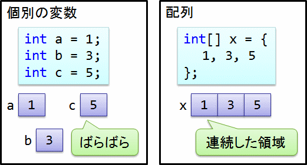
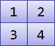
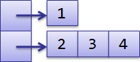

# 配列

## <a id="sec-generated-title-1"></a> <a id="abst"></a>概要

「複数の数値を入力してその和を求める」とかいうように、複数のデータを一まとめにして扱いたい場合があります。
C# などのプログラミング言語には、
複数のデータを一まとめにするための「配列」というものがあります。

<figure>

[](../../../../assets/media/ufcpp2000/csharp/fig/array.png)

<figcaption>配列</figcaption>
</figure>


##### <a id="sec-generated-title-2"></a>ポイント

* 配列: 複数のデータをひとまとめに

* x[n] で、x の n 番目の要素にアクセス


## <a id="sec-generated-title-3"></a> <a id="unless"></a>配列がなかったら

まずは、もし複数のデータを一まとめにせずにばらばらに扱おうとするとどうなるか考えてみましょう。
例として、5個の整数を入力して、それらの二乗和を求めることを考えます。
プログラムは以下のようになるでしょう。

```csharp {title="配列なしで複数のデータを扱う場合"}
int a, b, c, d, e; // 変数を入力したいデータの数だけ用意。

// 値の入力
a = int.Parse(Console.ReadLine());
b = int.Parse(Console.ReadLine());
c = int.Parse(Console.ReadLine());
d = int.Parse(Console.ReadLine());
e = int.Parse(Console.ReadLine());

// 値の計算
int square_sum = a*a + b*b + c*c + d*d + e*e;

// 値の出力
Console.Write("二乗和は {0} です", square_sum);
```


似たような文が何度も繰り返し出てきています。
これは書くのにも手間がかかりますし、修正が必要になった場合、何箇所も修正する必要が出てきます。
それに、入力するデータの数を5個から10個とかいうように変更したい場合にも、修正が大変になります。


## <a id="sec-generated-title-4"></a> <a id="use"></a>配列を使う

C# には複数のデータを一まとめにするために<strong id="array" class="keyword">配列</strong>というものが用意されています。
先ほどの例では、5個のデータを<code>a, b, c, d, e</code>という5つの変数に格納していましたが、
配列を使うことで<code>a[0], a[1], a[2], a[3], a[4]</code>というように、番号を振って管理出来ます。

配列は以下のようにして宣言します。
すなわち、<em>
        型名に <code>[]</code> を付けることで配列型を作ることができます
      </em>。

```csharp {title="配列の書式"}
型名[] 変数名;
```


配列は宣言しただけでは利用できず、まずは配列の実体を作成する必要があります。
実体の作成は <code>new</code> というキーワードを用いて以下のようにします。

```csharp {title="配列の作成"}
配列型変数 = new 型名[配列の長さ];
```


詳しくは「[クラス](../oop/oo_class.md)」で説明しますが、
配列型の変数というのは配列を格納するためのただの入れ物で、
配列の実体を作成して変数に格納してやる必要があります。
<code>new</code> はこの実体を作成するための演算子です。

先ほどの例を配列を使って書き直してみましょう。

```csharp {title="配列の例"}
int[] a = new int[5]; // 長さが5の整数型配列を用意。

// 値の入力
for(int i=0; i<a.Length; ++i) // a.Length は配列 a の長さ。これの例では5。
{
  a[i] = int.Parse(Console.ReadLine());
}

// 値の計算
int square_sum = 0;
for(int i=0; i<a.Length; ++i)
{
  square_sum += a[i]*a[i];
}

// 値の出力
Console.Write("二乗和は {0} です", square_sum);
```


配列を使うことで、手動で何度も繰り返し書いていた文が1つの for 文にまとまりました。
書く手間は1度ですみますし、修正も1箇所で済みます。
また、入力したいデータの数を変更したい場合にも、最初の1行を修正するだけで済みます。


##### <a id="sec-generated-title-5"></a>サンプル

```csharp {title="配列のサンプル"}
using System;

class ArraySample
{
  static void Main()
  {
    // フィボナッチ数列の20項目までを求める
    int[] sequence = new int[20];

    // 最初の2項を入力
    Console.Write("a1 = ");
    sequence[0] = int.Parse(Console.ReadLine());
    Console.Write("a2 = ");
    sequence[1] = int.Parse(Console.ReadLine());

    // 漸化式を使って20項目までを計算
    for(int i=2; i<sequence.Length; ++i)
    {
      sequence[i] = sequence[i-1] + sequence[i-2];
    }

    // 結果の出力
    Console.Write("{");
    for(int i=0; i<sequence.Length-1; ++i)
    {
      Console.Write(sequence[i] + ", ");
    }
    Console.Write(sequence[sequence.Length-1] + "}");
  }
}
```


```console
a1 = 2
a2 = 1
{2, 1, 3, 4, 7, 11, 18, 29, 47, 76, 123, 199, 322, 521, 843, 1364, 2207,
 3571, 5778, 9349}
```


また、配列は以下のようにして宣言時に初期化することも出来ます。

```csharp {title="配列の初期化"}
型名[] 変数名 = new 型名[] {値1, 値2, .....};
```


例えば、1, 3, 5, 7, 9 という初期値を持った int 型配列を作成するには以下のようにします。

```csharp {title="配列の初期化の例"}
int[] a = new int[] {1, 3, 5, 7, 9};
```


<em>変数宣言と同時に限り</em>、以下のような書き方も可能です。
（new[] を省略できる。）

```csharp {title="配列の初期化の例"}
int[] a = {1, 3, 5, 7, 9};
```

ちなみに、こういう`{}`で初期値を与える書き方のことを「<strong id="key-initializer" class="keyword">初期化子</strong>」(initializer)と呼びます。

また、初期化子内の最後には、コンマを付けてもつけなくても構いません。
以下の2行は同じ意味になります。

```csharp {title="初期化子末尾のコンマ" highlight-ranges="sha256:b08aab8213f596cf65fbd16b53e0b5243b7fc0c50fa452969a699cfa217ae849;2:36-2:37"}
int[] a = new int[] { 1, 3, 5, 7, 9 };
int[] b = new int[] { 1, 3, 5, 7, 9, };
```

ソースコード生成など機械的な処理で値を並べる場合には「最後だけ `,` を消さないといけない」みたいな処理の方が難しいので、末尾コンマを認めています。

<h5 class="version version12">Ver. 12</h5>

C# 12 からは配列の初期化を以下のように書くことができるようになりました。
これをコレクション式といいます。

```csharp
int[] a = [1, 3, 5, 7, 9];
```

`{}` を使った初期化子との差や、コレクション式のメリットなどは「[コレクション式](../datatype/collection-expression.md)」で説明します。

### <a id="sec-generated-title-6"></a> <a id="infer"></a>暗黙的型付け配列

<h5 class="version version3">Ver. 3.0</h5>

C# 3.0 では、
配列の初期化時の、「new 型名[]」の型名を省略することが可能に成りました。

```csharp {title="配列の初期化の例（暗黙的型付け）"}
var a = new[] {1, 3, 5, 7, 9};
```


配列の型は、{} の中身から推論されます。
この例の場合、{} の中身が <code>int</code> なので、<code>a</code> は <code>int[]</code> になります。


### <a id="sec-generated-title-7"></a> <a id="range"></a>範囲アクセス

<h5 class="version version8">Ver. 8.0</h5>

C# 8.0 で、`a[i..j]` という書き方で「i番目からj番目の要素を取り出す」というような操作ができるようになりました。

```csharp {title=".. 構文"}
using System;
 
class Program
{
    static void Main()
    {
        var a = new[] { 1, 2, 3, 4, 5 };
 
        // 前後1要素ずつ削ったもの
        var middle = a[1..^1];
 
        // 2, 3, 4 が表示される
        foreach (var x in middle)
        {
            Console.WriteLine(x);
        }
    }
}
```

詳しくは「[インデックス/範囲処理](../data/dataranges.md)」で説明します。

## <a id="sec-generated-title-8"></a> <a id="multid"></a>多次元配列

今までは1次元的に並んだデータを格納するための1次元配列について説明してきました。
しかし、画像の画素などのように、データが多次元的に並んでいる場合もあります。
C# ではそのような多次元データを格納するため、<strong id="multid" class="keyword">多次元配列</strong>が用意されています。


### <a id="sec-generated-title-9"></a> <a id="rectangular"></a>四角い多次元配列

C# の多次元配列は以下のようにして宣言します。
（次節で説明する「配列の配列」と区別するために、「四角い多次元配列」と呼んだりする場合もあります。
単に多次元配列という場合、こちらの四角い多次元配列を指します。）

```csharp {title="多次元配列の宣言" highlight-ranges="sha256:fb7f6981772aaa21aea8fb30c39f5255bd7a92f6a146b5409630a04685edbbac;1:3-1:6,2:3-2:7"}
型名[,] 変数名; // 2次元配列
型名[,,] 変数名; // 3次元配列
```


1次元配列のときと同じく、new キーワードを用いて配列を作成する必要があります。

```csharp {title="多元配列の作成"}
変数名 = new 型名[長さ1, 長さ2]; // 2次元配列の場合
変数名 = new 型名[長さ1, 長さ2, 長さ3]; // 3次元配列の場合
```


また、宣言時に値を初期化する場合には以下のようにします。

```csharp {title="多次元配列の初期化"}
型名[,] 変数名 = new 型名[,] {
  {値1-1, 値1-2, .....},
  {値2-1, 値2-2, .....},
  .....
};
```


例えば、2次元配列を行列に見立てて行列の掛け算を行うプログラムは以下のようになります。

```csharp {title="多元配列の例" highlight-text="c[i, j] += a[i, k] * b[k, j];"}
double[,] a = new double[,]{{1, 2}, {2, 1}, {0, 1}}; // 3行2列の行列
double[,] b = new double[,]{{1, 2, 0}, {0, 1, 2}};   // 2行3列の行列
double[,] c = new double[3, 3];                      // 3行3列の行列

for(int i=0; i<a.GetLength(0); ++i) // a.GetLength(0) は a の行数を表す。
{
  for(int j=0; j<b.GetLength(1); ++j) // b.GetLength(1) は b の列数を表す。
  {
    c[i, j] = 0;
    for(int k=0; k<a.GetLength(1); ++k) // a.GetLength(1) は a の列数を表す。
    {
      c[i, j] += a[i, k] * b[k, j];
    }
  }
}
```


### <a id="sec-generated-title-10"></a> <a id="jugged"></a>配列の配列

多次元のデータを扱うためには <code>array[x, y]</code> という構文で使用する多次元配列の他に、
「<strong id="jugged" class="keyword">配列の配列</strong>」を使う方法もあります。
「配列の配列」とはその名の通り、配列(<code>型名[]</code>)をさらに配列にしたもの(<code>型名[][]</code>)です。

例として、多次元配列のところで挙げた行列の掛け算を配列の配列を使って書き直すと以下のようになります。

```csharp {title="配列の配列の例" highlight-text="c[i][j] += a[i][k] * b[k][j];"}
double[][] a = new double[][]{  // 3行2列の行列
  new double[]{1, 2},
  new double[]{2, 1},
  new double[]{0, 1}
};
double[][] b = new double[][]{  // 2行3列の行列
  new double[]{1, 2, 0},
  new double[]{0, 1, 2}
};
double[][] c = new double[3][]; // 3行3列の行列
for(int i=0; i<c.Length; ++i)
  c[i] = new double[3];

for(int i=0; i<a.Length; ++i) // a.Length は a の行数を表す。
{
  for(int j=0; j<b[0].Length; ++j) // b[0].Length は b の列数を表す。
  {
    c[i][j] = 0;
    for(int k=0; k<a[0].Length; ++k) // a[0].Length は a の列数を表す。
    {
      c[i][j] += a[i][k] * b[k][j];
    }
  }
}
```


「多次元配列」は全ての行の列数が同じになりますが、
「配列の配列」は各列毎に列数が異なっていても構いません。
そのため、「多次元配列」のことを“<em>Rectangular Array</em>”(四角い配列)、
「配列の配列」のことを“<em>Jagged Array</em>” (ぎざぎざ配列)という言うこともあります。


### <a id="sec-generated-title-11"></a> <a id="compare"></a>比較

<table summary="「多次元配列」と「配列の配列」の比較">
	<caption>
		「多次元配列」と「配列の配列」の比較
	</caption>
	<tr>
		<td markdown="1"></td>
		<th>多次元配列</th>
		<th>配列の配列</th>
	</tr>
	<tr>
		<th>書き方</th>
		<td markdown="1">

```csharp {title="多次元配列の例"}
int[,] rect =
{
    { 1, 2 },
    { 3, 4 },
};
```

</td>
		<td markdown="1">

```csharp {title="多次元配列の例"}
int[][] jug =
{
    new[] { 1 },
    new[] { 2, 3, 4 },
};
```

</td>
	</tr>
	<tr>
		<th>イメージ</th>
		<td markdown="1">
<figure>

[](../../../../assets/media/ufcpp2000/csharp/fig/arrayrect.png)

</figure>

</td>
		<td markdown="1">
<figure>

[](../../../../assets/media/ufcpp2000/csharp/fig/arrayjug.png)

</figure>

</td>
	</tr>
	<tr>
		<th>利点</th>
		<td markdown="1">
* 初期化が楽（new[] が不要）

* 無駄にメモリを使わない

* 動作が高速<sup>†</sup>

</td>
		<td markdown="1">
* 行ごとに列数を変えれる

</td>
	</tr>
</table>


注意<sup>†</sup>： 仕組み上、「多次元配列」の方が「配列の配列」よりも要素の読み書きは速いはずなんですが、
最適化のかかり方次第では速度が逆になるようです。
（.NET Framework の 「[IL](../abstract/ab_dotnet.md#il)」 には1次元配列の要素アクセス用の専用命令があって、
下手に多次元配列にするよりも、配列の配列の方がいい命令が出ることがあるようで。）
## <a id="exercise"></a>演習問題

### <a id="exercise-array0"></a>問題 1


for 文を使って以下の漸化式の一般項 <span class="math">
            a<sub>n</sub>
          </span> を20項目まで求めるプログラムを作成せよ。 (<span class="math">
            a<sub>n</sub>
          </span> を配列で表す。)
<div class="math">
          a<sub>n ＋ 2</sub> ＝ 2 a<sub>n ＋ 1</sub> － 2 a<sub>n</sub>
        </div><div class="math">
          a<sub>0</sub> ＝ 3
        </div><div class="math">
          a<sub>1</sub> ＝ 1
        </div>

#### 解答例 1


```csharp {title="数列計算"}
using System;

class Exercise
{
  static void Main()
  {
    int[] a = new int[21];
    a[0] = 3;
    a[1] = 1;

    // 数列を求める。
    for (int i = 2; i < a.Length; ++i)
    {
      a[i] = 2 * a[i - 1] - 2 * a[i - 2];
    }

    // 求めた数列を表示。
    for (int i = 0; i < a.Length; ++i)
    {
      Console.Write("{0} ", a[i]);
    }
    Console.Write('\n');
  }
}
```


### <a id="exercise-array1"></a>問題 2


int 型の配列に格納されている値の最大値、最小値および平均値を求めよ。
できれば、配列の長さ n および n 個の整数値をユーザに入力してもらうようにすること。


#### 解答例 1


```csharp {title="配列の最大値、最小値、平均値"}
using System;

class Exercise
{
  static void Main()
  {
    // 配列長の入力
    Console.Write("配列の長さ: ");
    int n = int.Parse(Console.ReadLine());

    // 配列の値の入力
    int[] a = new int[n];
    for (int i = 0; i < n; ++i)
    {
      Console.Write("{0}: ", i);
      a[i] = int.Parse(Console.ReadLine());
    }

    // 最大値、最小値、平均値の計算
    int max = int.MinValue;
    int min = int.MaxValue;
    double average = 0;

    for (int i = 0; i < n; ++i)
    {
      if (max < a[i]) max = a[i];
      if (min > a[i]) min = a[i];
      average += a[i];
    }
    average /= n;

    Console.Write(
@"
最大値: {0}
最小値: {1}
平均値: {2}
"
    , max, min, average);
  }
}
```


### <a id="exercise-array2"></a>問題 3


double 型の2次元配列を行列に見立てて、行列の掛け算を行うプログラムを作成せよ。


#### 解答例 1


行列の次元は任意だけども、例として2×2行列の場合を示す。

```csharp {title="行列の積"}
using System;

class Exercise
{
  static void Main()
  {
    double[,] a = new double[,]
    {
      {1, 1},
      {1, 0},
    };
    double[,] b = new double[,]
    {
      {1, 2},
      {3, 4},
    };

    // ここより下は、a, b のサイズが任意の場合でも正しく動作する。
    double[,] c = new double[a.GetLength(0), b.GetLength(1)];

    // a×b を計算
    for (int i = 0; i < a.GetLength(0); ++i)
      for (int j = 0; j < b.GetLength(1); ++j)
        for (int k = 0; k < a.GetLength(1); ++k)
          c[i, j] += a[i, k] * b[k, j];

    // a を表示
    Console.Write("a =\n");
    for (int i = 0; i < a.GetLength(0); ++i)
    {
      for (int j = 0; j < a.GetLength(1); ++j)
        Console.Write("{0, 4} ", a[i, j]);
      Console.Write('\n');
    }

    // b を表示
    Console.Write("b =\n");
    for (int i = 0; i < b.GetLength(0); ++i)
    {
      for (int j = 0; j < b.GetLength(1); ++j)
        Console.Write("{0, 4} ", b[i, j]);
      Console.Write('\n');
    }

    // a×b を表示
    Console.Write("a×b =\n");
    for (int i = 0; i < c.GetLength(0); ++i)
    {
      for (int j = 0; j < c.GetLength(1); ++j)
        Console.Write("{0, 4} ", c[i, j]);
      Console.Write('\n');
    }
  }
}
```
