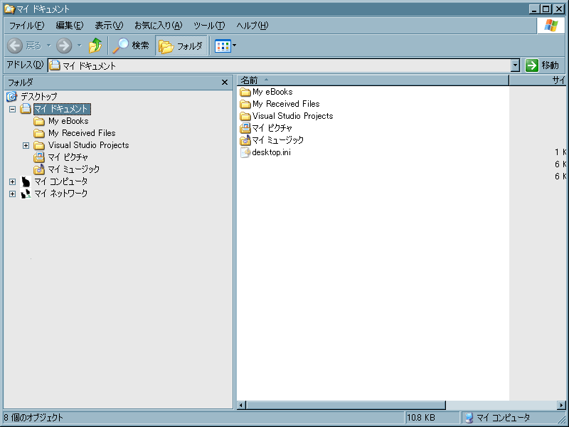
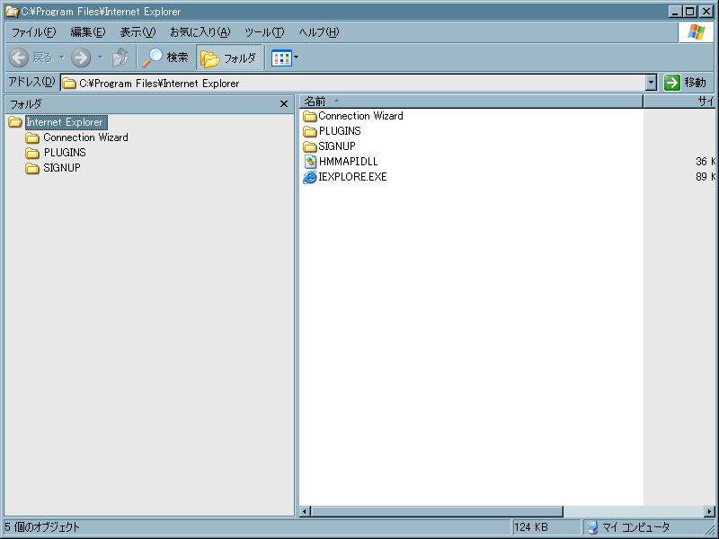

# コマンドライン引数

## <a id="sec-generated-title-1"></a> <a id="abst"></a>概要

C# にはコマンドライン引数は <code>Main</code> 関数の引数としてプログラムに渡されます。
ここでは、コマンドライン引数というものが何なのかを簡単に説明した後、
C# でコマンドライン引数を受け取る方法について説明します。


##### <a id="sec-generated-title-2"></a>ポイント

* コマンドライン引数: プログラム起動の際に渡されるオプションの値

* C# では、Main 関数の引数として受け取れる


## <a id="sec-generated-title-3"></a> <a id="cmd"></a>コマンドライン引数とは

コマンドプロンプト(Win9x の場合は「DOS プロンプト」と呼ばれる)上でファイルのコピーを行う場合、
copy というコマンドを利用します。copy は以下のようにして、コピー元のファイルとコピー先のディレクトリ(フォルダ)を指定することによってファイルのコピーを行います。

```console {title="copy コマンド"}
copy コピーするファイル コピー先のディレクトリ
```


このように、コマンドやプログラムを起動する際に、プログラム名の後に続けて入力した文字列はパラメータとしてプログラムに渡されます。
このようなプログラム起動時に渡されるパラメータのことを<em>コマンドライン引数</em>と呼びます。

また、コマンドライン引数はコンソールアプリケーション(コマンドプロンプトで呼び出される文字ベースのプログラム)だけでなく、GUI アプリケーションでも利用することが出来ます。
例えば、スタートメニューから [プログラム名を指定して実行] を選んで、
以下のように入力してみてください。

```csharp {title="エクスプローラ起動"}
explorer.exe
```


以下のようにエクスプローラのウィンドウが開くと思います。
(以下のものは Windows XP で実行した結果)

<figure>

[](../../../../assets/media/ufcpp2000/csharp/fig/explorer1.png)

<figcaption>エクスプローラ オプション無し</figcaption>
</figure>


同様にスタートメニューから[プログラム名を指定して実行]を選んで、今度は以下のように入力してみてください。

```csharp {title="オプション付きでエクスプローラ起動"}
explorer.exe /e,/root,"C:\Program Files\Internet Explorer"
```


以下のように、先ほどと内容の異なる形式でエクスプローラが起動します。

<figure>

[](../../../../assets/media/ufcpp2000/csharp/fig/explorer2.png)

<figcaption>エクスプローラ オプションあり</figcaption>
</figure>


「<code>/e,/root,"C:\Program Files\Internet Explorer"</code>」という文字列がコマンドライン引数としてエクスプローラに渡され、その結果としてエクスプローラの表示形式が変わったわけです。


## <a id="sec-generated-title-4"></a> <a id="arg"></a>C#でコマンドライン引数を利用する

今まで、<code>Main</code> 関数には引数を書いていませんでしたが、
コマンドライン引数を受け取りたい場合には、以下のように <code>Main</code> 関数に <code>string[]</code> 型の引数を書きます。

```csharp
static void Main(string[] args)
```


プログラムに与えた引数はこの <code>args</code> に格納されます。
(args は arguments (引数)の略で、慣習的にこの名前が良く用いられます。)
コマンドライン引数はスペースで区切って複数与えることが出来ます。
この際、コマンドライン引数は先に入力されたものから順に <code>args</code> に格納されていきます。
例えば、以下のようなプログラムを作成し、

```csharp {title="コマンドライン引数を受け取るプログラム"}
using System;

public class CommandLineSample
{
  public static void Main(string[] args)
  {
    for(int i=0; i<args.Length; ++i)
      Console.Write("{0}番目のコマンドライン引数は{1}です。\n", i, args[i]);
  }
}
```


以下のようにして(ただし、<code>test.exe</code>という名前で作成した実行ファイルを作成したとします)
実行すると、

```console
test aaa bbb ccc ddd
```


以下のような結果が得られます。

```console
0番目のコマンドライン引数はaaaです。
1番目のコマンドライン引数はbbbです。
2番目のコマンドライン引数はcccです。
3番目のコマンドライン引数はdddです。
```


## <a id="sec-generated-title-5"></a> <a id="return"></a>終了コード

コマンドライン引数の他に、プログラムには終了コードというものがあります。
終了コードとは、プログラムが正しく終了したかどうかなどの情報を得るために、
プログラム終了時に返す値のことです。

C# でプログラムを作る際、自分で終了コードを指定したい場合、<code>Main</code> 関数の戻り値の型を<code>int</code>型にします。
<code>Main</code> 関数の戻り値がそのままプログラムの終了コードになります。
例えば、以下のようなプログラムを書いた場合、終了コードは0になります。

```csharp {title="終了コードを返す例"}
public class CommandLineSample
{
  public static int Main()
  {
    return 0;
  }
}
```


習慣的に、正常終了したときに0を返し、それ以外のときには0以外の値(エラーの原因に応じて値を変える)を返すようにします。


##### <a id="sec-generated-title-6"></a>サンプル

```csharp {title="コマンドライン引数のサンプル"}
using System;
using System.IO;

public class CommandLineSample
{
  /// <summary>
  /// コマンドライン引数でファイル名を受け取り、そのファイルの中身を表示する。
  /// コマンドライン引数の数がおかしかった場合や、
  /// ファイルが見つからない場合や、ファイルのアクセス権限がない場合、
  /// 終了コード -1 を返して終了する。
  /// 正常終了した場合には終了コード 0 を返す。
  /// </summary>
  public static int Main(string[] args)
  {
    // 引数チェック
    if(args.Length != 1)
    {
      Console.Write("引数の数がおかしいです\n");
      return -1;
    }

    StreamReader reader = null;
    try
    {
      // ファイルを開いて中身を表示
      reader = new StreamReader(args[0]);
      string text = reader.ReadToEnd();
      Console.Write(text);
    }
    catch(Exception e)
    {
      // エラー処理
      // 詳しくは「例外処理」で説明します。
      // ファイルが存在しなかったり、アクセス権限がない場合にここが実行される。
      Console.Write(e.Message+"\n");
      return -1;
    }
    finally
    {
      // 後処理
      // これも「例外処理」で説明します。
      if(reader != null)
        reader.Close();
    }

    return 0;
  }
}
```


プログラムの実行ファイル名は<code>test.exe</code>とする。
<code>test.exe</code>は<code>C:\mydoc</code>にあるものとして、
同じディレクトリ中に<code>test.txt</code>というファイルがあって、
その中身が

```csharp {title="test.txt の中身"}
 test test test test
テスト テスト テスト
```


であるとき、実行結果は以下のようになる。

```console
C:\mydoc> test
引数の数がおかしいです
```


```console
C:\mydoc> test aaa
Could not find file "C:\mydoc\aaa".
```


```console
C:\mydoc> test test.txt
 test test test test
テスト テスト テスト
```
