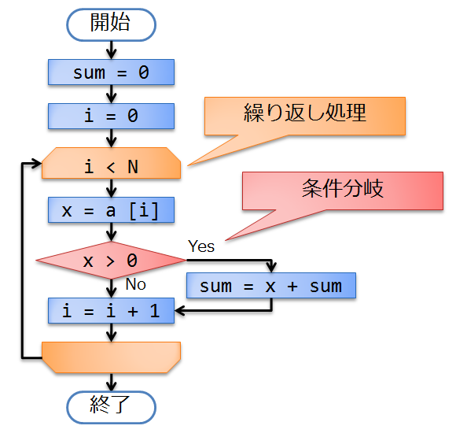
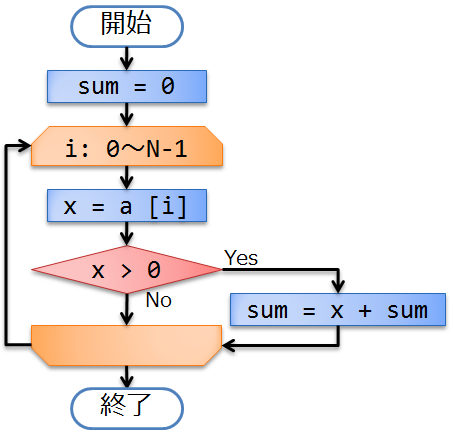
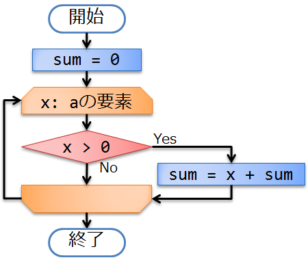

# 制御フロー

##  概要

このページの内容は、次からの3ページ（「[条件分岐](st_branch.md)」、「[反復処理](st_loop.md)」、「[配列](st_array.md)」）の要約になります。

C# などのプログラミング言語では、並べた文は上から順に実行されていくことになります（逐次処理）。
逐次処理に加えて、条件に応じて処理を分岐させたり、繰り返しを行ったり（反復処理）することでプログラムを作っていきます。

この分岐や反復などの、処理の流れを制御するための構文を制御フロー（control flow）構文と言ったりします。
C# では、if, switch（条件分岐）や while, for, foreach（反復）というような制御構文を持っています。

##  制御フロー

例えば、「n 個の整数の中から、正の数だけの和を求める」というような処理を行いたいとします。
この処理の流れ（フロー）を図で書くと以下のような感じです。

<figure>
	
	<figcaption>n 個の整数の中から、正の数だけの和を求める処理</figcaption>
</figure>

C# で書くと以下のようになります。

<pre class="source" title="n 個の整数の中から、正の数だけの和を求める処理" lang="">
<code>int sum = 0;
int i = 0;
while (i &lt; N)
{
    int x = a[i];
    if (x &gt; 0)
    {
        sum = x + sum;
    }
    i = i + 1;
}
</code></pre>

if は条件分岐、while は反復処理、 a[i] は配列というものです
（参考： 「[条件分岐](st_branch.md)」、「[反復処理](st_loop.md)」、「[配列](st_array.md)」）。

この例もそうですが、反復処理は「0 から N-1 まで」とか「1 から N まで」とか、
値を1ずつ増やして繰り返すという処理が多くなります。
こういう処理を行うための制御構文として、for 文というものがあります。

<figure>
	
	<figcaption>n 個の整数の中から、正の数だけの和を求める処理（for 文を利用）</figcaption>
</figure>

<pre class="source" title="n 個の整数の中から、正の数だけの和を求める処理（for 文を利用）" lang="">
<code>int sum = 0;
for (int i = 0; i &lt; N; ++i)
{
    int x = a[i];
    if (x &gt; 0)
    {
        sum = x + sum;
    }
}
</code></pre>

さらに言うと、「配列の各要素に対して処理を行う」というような反復が非常に多いです。
「各要素に対する処理」のための構文が foreach です。

<figure>
	
	<figcaption>n 個の整数の中から、正の数だけの和を求める処理（foreach 文を利用）</figcaption>
</figure>

<pre class="source" title="n 個の整数の中から、正の数だけの和を求める処理（foreach 文を利用）" lang="">
<code>int sum = 0;
foreach (int x in a)
{
    if (x &gt; 0)
    {
        sum = x + sum;
    }
}
</code></pre>

これらの構文の詳細は次節以降で行っていきます。
