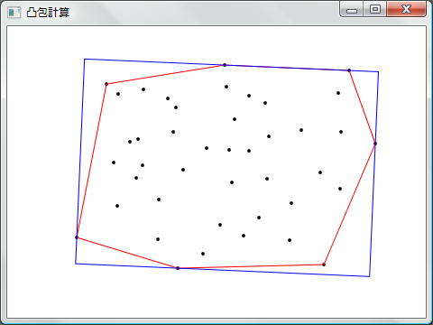
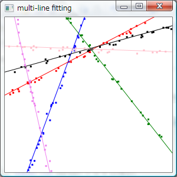
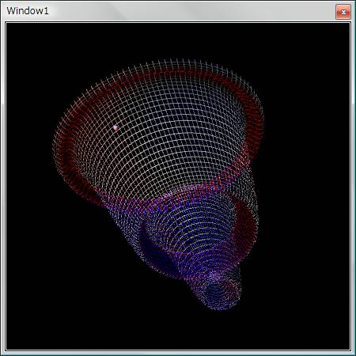

# サンプルプログラム

## <a id="sec-generated-title-1"></a> <a id="xaml"></a>XAML 雛形

ボタンを押したらメッセージボックスが表示されるだけの単純なものです。
Visual Studio を使わずに、コマンドラインで MSBuild を使って XAML Windows アプリケーションを作りたい場合の雛形にどうぞ。

[ファイル一式（ZIP 圧縮）](../../../../assets/sample/XamlApplication.zip)


## <a id="sec-generated-title-2"></a> <a id="lineart"></a>ラインアート

C# でもやってるんですけど（「[ラインアート](../../csharp/sample/ap_sample.md#lineart)」）、
僕は GUI 開発環境の提供されているプログラミング言語を新しく覚えるたびにラインアートを作っています。
（比較とか勉強のため、とりあえず作る。）

（でも、「[スクリーンセーバー](http://ja.wikipedia.org/wiki/%E3%82%B9%E3%82%AF%E3%83%AA%E3%83%BC%E3%83%B3%E3%82%BB%E3%83%BC%E3%83%90%E3%83%BC)っていったらラインアート」ってのも、
もうだいぶ昔の話ですが。
最近は 3D テキストか Windows ロゴ？
まあ、Windows の出荷時のデフォルト設定で、
「スクリーンセーバーを使用しない」にするだけで、
全世界で消費される電力がかなり減るって言うような話を聞いたこともあるんですが。）

で、コードなしの Loose XAML だけでラインアートを作れそうな感じがしたんでやってみました。


[LineArt.xaml](../../../../assets/media/ufcpp2000/dotnet/sample/LineArt.xaml)
。


## <a id="sec-generated-title-3"></a> <a id="bubble3d"></a>3次元バブルチャート（雛形）

バブルチャートの3次元版、ようするに、
値に応じた大きさのバブルを3次元に表示するプログラムが欲しかったので作ったもの。
現状の WPF の System.Windows.Media.Media3D では、三角メッシュしか使えないみたいなので、
バブルは球状じゃなくて正8面体で妥協。

今回使った機能は、以下のような感じ。

* 3D メッシュ MeshGeometry3D で正8面体を作成。

* ScaleTransform3D で正8面体の所望の大きさに拡大・縮小。

* TranslateTransform3D で正8面体を所望の場所に移動。

* 球状に配置されてるのが分かりやすく見えるように、中心に点光源 PointLight を配置。

* 裏面も見えるように環境光 AmbientLight を設定。

* 前後を分かりやすくするために、方向性光源 DirectionalLight で、前から赤い光、後ろから青い光を当てる。

* アニメーション機能 Storyboard ＆ DoubleAnimation を使ってカメラを回転。


[ソースファイル(zip形式書庫)](../../../../assets/sample/BubbleChart3D.zip) … テスト用に、球面上のランダムな位置にランダムな大きさの正8面体を200個ほど配置したもの。

[XAML ファイル](../../../../assets/sample/viewport3d.xaml) … コードビハインドなしの、XAML のみ。固定位置に同じサイズの正8面体を6つ配置したもの。（セキュリティ権限上、ブラウザ中で直接実行付加。一度ローカルに保存してください。）


## <a id="sec-generated-title-4"></a> <a id="convexclosure"></a>凸包計算プログラム

後輩に、「任意に与えられた点を全て囲む面積最小の長方形を求めたいんですが」と言われてノリで作ったもの。
せっかくだからサンプルプログラムとして公開。

[ファイル一式（ZIP 圧縮）](../../../../assets/sample/ConvexClosure.zip)

<figure>
	[](../../../../assets/media/ufcpp2000/dotnet/fig/convex.png)
	<figcaption>画面コピー</figcaption>
</figure>


### <a id="sec-generated-title-5"></a> <a id="algorithm"></a>計算アルゴリズム

「全点囲む最小の長方形」は以下の条件を満たしてそう。

* 与えられた点列の凸包を囲む面積最小の長方形を求めれば OK。

* 凸包を囲む長方形が面積最小のとき、長方形のどれか1辺は、凸包の少なくとも1辺に接している。


なので、以下のような処理で「全点囲む最小の長方形」を計算可能。

1. 与えられた点列の凸包を求める。

2. 1辺の方向を与えたときに、その向きで面積最小の長方形を求める。

3. 凸包の全ての辺の方向について、2. を計算。


1 は、Graham 走査という有名なアルゴリズムがあるのでそれを利用。
2 は、向きが決まっていれば、辺から点までの距離が法線との内積で求まるので、
面積最小の長方形は簡単に求まる。


### <a id="sec-generated-title-6"></a> <a id="gui"></a>GUI プログラム

↑のアルゴリズムの確認のために、
以下のような GUI プログラムを作成。

* ウィンドウ内を左クリックしたとき、その位置に新しい点を追加。

* 右クリックしたとき、その位置に一番近い点を削除。

* 点列に対して、凸包、全点を囲う最小の長方形を求めて、 それぞれをウィンドウ中に表示。


GUI の作成には Windows Presentation Foundation を使用。
点や凸包は、
System.Windows.Shapes 名前空間内の、
Ellipse や Polyline を使用。


### <a id="sec-generated-title-7"></a> <a id="ref"></a>参考

ちなみに、最初プログラムを作った目的は、
求めたい長方形が本当に凸包に接してるのか、証明するのが面倒だし、
総当りで試してみようというものです。
(長方形を0.01ラジアン刻みとかで回転させて、
その向きの面積最小の長方形を総当りで求めて、
最小のものを選択。)

その後、後輩が調べてきた所によると、
「全点囲む最小の長方形」はやっぱり凸包の辺に接してるみたい。
証明の書かれた論文あり↓

* H. Freeman, R. Shapira: "Determining the minimum-area encasing rectangle for an arbitrary closed curve," Communications of the ACM, Vol. 18, Issue 7, pp. 409 - 413, (July 1975).


あと、凸包を囲う長方形の求め方、
もっと効率いい方法がありそう↓

* N. Adlai, et. al.: "Algorthmic pradigms: examples in computational geometry II," ACM SIGCSE Bulletin archive, Vol. 22, Issue 1, pp. 186 - 191, (Feb. 1990).


## <a id="sec-generated-title-8"></a> <a id="fitting"></a>Multi-line fitting

最小二乗法でフィッティングできるようなデータ列が2種類異常混ざっているような場合に、
n 本の回帰直線を求めるプログラム。

[ファイル一式（ZIP 圧縮）](../../../../assets/sample/MultiLineFitting.zip)

<figure>
	[](../../../../assets/media/ufcpp2000/dotnet/fig/fitting.png)
	<figcaption>画面コピー</figcaption>
</figure>


注：
画面コピーは結構うまく行った例。
実際にうまく行くかどうかはデータ列次第です。
混ざってるのが2種類（回帰直線2本）くらいなら割とうまく行きますが、
6本でここまでうまく行くことはそう多くない。
あと、回帰直線を何本くらい使えばうまくクラスタリングできるかを自動計算したりという機能はないです。


### <a id="sec-generated-title-9"></a> <a id="fitting_algorithm"></a>計算アルゴリズム

クラスタリングと最小二乗法を組み合わせで実装しています。

要するに、
回帰直線をクラスタ重心と考えて、

* 各点に対して一番近い回帰直線を探して帰属情報を更新

* クラスタごとに最小二乗法で回帰直線を求めなおす


の2つの処理を反復。

でも、クラスタ重心が点の場合と比べると、局所解に陥りやすいみたいです。
それを解決するような研究報告例あり↓。

乾 健太郎，金子 俊一，五十嵐 悟：
“LMedSクラスタリングに基づく複数直線のロバスト回帰，”
Technical report of IEICE. PRMU,
Vol.99, No.449(19991119) pp. 81-86.


## <a id="sec-generated-title-10"></a> <a id="dynamics"></a>曲面上の物体の運動シミュレーション

せっかく Orcas（Visual Studio の次期バージョンのコードネーム）の新β版が出たことだし
（2007/4末）、
なにか WPF を使ったプログラミングをしてみたくて作ったもの。

ちょうど最近、
「[物理](../../physics/index.md)」の辺りを更新していたことだし、
3次元空間中の曲面上の物体の運動をシミュレーションして、
Viewport3D を使って3次元表示するプログラムを作ってみた。
（参考：「[曲面上の運動](../../physics/dynamics/surface.md)」。）

[ファイル一式（ZIP 圧縮）](../../../../assets/sample/Dynamics.zip)

Orcas で作ったので、Visual Studio 2005 だとコンパイルが通らないかも。
多分、using System.Linq とかをコメントアウトするくらいでコンパイルできると思いますが。


### <a id="sec-generated-title-11"></a> <a id="numerical"></a>数値計算

ソリューション内にいくつかのプロジェクトがあって、
数値計算がらみは MyMath プロジェクト中にまとめています。


##### <a id="sec-generated-title-12"></a>Lambda 計算

拘束面の式（
<span class="math">
          x<span class="paren" style="font-size:em;">(</span>u, v<span class="paren" style="font-size:em;">)</span><span class="normal">=</span><span class="normal">1.5</span> v <span class="normal">cos</span> u
        </span>
とか）だけ与えれば、
<span class="math">
          <table class="frac" summary="differential"><tr><td class="num">∂x</td></tr><tr><td>∂u</td></tr></table>
        </span> とか、
「[ハミルトニアン](../../physics/dynamics/hamilton.md#hamiltonian)」やその導関数は自動的に計算してくれるものを作りました。

そのために、
以下のような感じで使える Lambda 計算的なライブラリを作りました。
（MyMath.Lambda 名前空間内。）

```powershell
Variable u = new Variable("u");
Variable v = new Variable("v");
Function x = 1.5 * v Function.Cos(u);
Function x_u = x.Differentiate(u);

double uu = 0.1;
double vv = 2;
double xx = x_u.GetValue(u.Set(uu), v.Set(vv));
```


ただ、あまり賢くはないです。
<code>(u * v) / u</code> が約分されて <code>v</code> になってくれたりはしないので、
分母の値が小さくなりすぎて精度が落ちることがしばしばあります。
あと、分母分子が共に 0 になって、結果が NaN になることもたまにあります。


##### <a id="sec-generated-title-13"></a>微分方程式の数値解

4次のルンゲクッタ法を使ってハミルトンの微分方程式を解いています。
（MyMath.DifferentialEquation 名前空間内。）


### <a id="sec-generated-title-14"></a> <a id="plot3d"></a>3次元プロット

数値計算結果を3次元的に表示するユーザコントロールを作りました。
（Plot3D プロジェクト。）

Viewport3D（参考：「[3次元モデル](../wpf/wpf_uielement.md#Media3D)」）を使って、
拘束面と物体を表示します。

拘束面の裏面も見えるようにするために、
面と物体を回転させています。
コントロール上を右クリックすると、回転を一時停止・再開できます。
また、左クリックで、カメラの向きをある程度変化させることができます。


### <a id="sec-generated-title-15"></a> <a id="dynamics_sample"></a>サンプル GUI プログラム

実例として、下図に示すようなプログラムを作りました。

<figure>
	[](../../../../assets/media/ufcpp2000/dotnet/fig/Dynamics.jpg)
	<figcaption>実行画面</figcaption>
</figure>


この実行画面の例では、
拘束面の方程式を
<div class="math">
        x<span class="paren" style="font-size:em;">(</span>u, v<span class="paren" style="font-size:em;">)</span><span class="normal">=</span><span class="normal">1.5</span> v <span class="normal">cos</span> u
      </div><div class="math">
        y<span class="paren" style="font-size:em;">(</span>u, v<span class="paren" style="font-size:em;">)</span><span class="normal">=</span><span class="normal">1.5</span> v <span class="normal">sin</span> u
      </div><div class="math">
        z<span class="paren" style="font-size:em;">(</span>u, v<span class="paren" style="font-size:em;">)</span><span class="normal">=</span><span class="normal">exp</span> v
        <span class="normal">+</span><span class="normal">0.2</span><span class="normal">cos</span><span class="normal">5</span>πv
        <span class="normal">−</span><span class="normal">2</span>
      </div>
ポテンシャルを <span class="math">
          φ <span class="normal">=</span> z
        </span> として物体の運動をシミュレーションしています。

ちなみに、Lambda 計算の精度の問題で、
時々数値計算結果がおかしくなることがあります。
というか、拘束面の式にあまりに複雑なものを指定すると、
すぐにおかしくなります。
まあ、実用目的じゃなくてデモ用だと思ってご容赦ください。


### <a id="sec-generated-title-16"></a> <a id="new_version"></a>バージョンアップ

何点か改善 → 「[[サンプル] 式木を WPF で GUI 表示](../../csharp/sample/sm_treeview.md)」。
