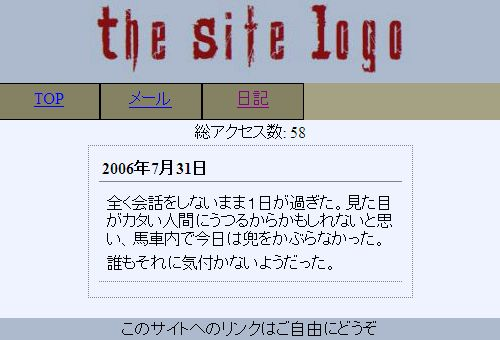
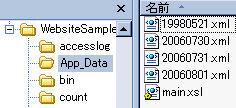

# ブログ表示（１）

## 概要
ブログっぽいものを作成。

一般に“ブログ”と呼ばれてるようなものほどちゃんとしたツールを作るつもりはなくて、
以下のような仕様のものを。

* Web フォーム自体に書き込み機能は持たせない。

* 記事は、ローカル上で（XML 形式で）書いたものを FTP などでサーバにアップする。

* 記事は、20070630.xml というように、日付に応じて yyyyMMdd.xml 形式のファイル名で保存。

* 日付に応じた XML を XSLT して表示するだけ。

* トラックバック機能はおろか、コメント機能すら作らない。

今どき、ブログのデータは（記事、コメント、トラックバック含め全部）データベースに持つのがいいと思うんですが、
自分のサイトにそこまでの機能が必要ないのと、
過去に自分の書きためてるものが XML 形式だったのでこういう仕様に。

技術的な面でいうと、ここで説明する内容は以下の通り。

1. Web コントロール

2. XSLT

3. クエリ文字列

4. HTTP リクエストのリライト・リダイレクト

5. RSS の作成

長く成りそうなので、3つに分割。
このページではまず、最新の日付のブログを表示するところまで。
技術面で言うと、1 と 2 を説明。

## 仕様
ブログもどきの仕様ですが、以下のような感じ。

* XML 形式で保存しておいたデータを読んで、XSLT を掛けた結果を表示するだけ。

* コメント機能もトラックバック機能もなし。

* XML は、2007年7月1日のブログなら 20070701.xml というように、 yyyyMMdd.xml という形式のファイル名を付ける。

以下のような XML データに対して、
図1のような結果を表示します。

<pre class="xsource" title="日記データ（20060731.xml）">
<code>&lt;?xml version="1.0" encoding="Shift_JIS"?&gt;
&lt;content&gt;

&lt;blog&gt;
&lt;p&gt;
全く会話をしないまま１日が過ぎた。
見た目がカタい人間にうつるからかもしれないと思い、
馬車内で今日は兜をかぶらなかった。
&lt;/p&gt;
&lt;p&gt;
誰もそれに気付かないようだった。
&lt;/p&gt;
&lt;/blog&gt;

&lt;/content&gt;
</code></pre>
<figure>
	
	<figcaption>表示結果</figcaption>
</figure>

ちなみに、ここで使った XSL スタイルシートはこんな感じ → [main.xsl](../../../../assets/media/ufcpp2000/dotnet/resources/main.xsl)。
XSL “Transformation” と言うほど賢い処理はしていなくて、
ほとんど HTML タグを素通ししてるだけ。

で、以下のような3つの Web フォームを作ります。

1. BlogLatest.aspx … クエリ文字列で「何日前か」を指定してブログを表示。

2. BlogDate.aspx … クエリ文字列で日付を指定してブログを表示。

3. BlogSelect.aspx … ページ中にドロップダウンリストやカレンダーコントロールを配置して、日付を選択してブログを表示。

また、これらの3つのページの共通部品として、
XML に XSLT を掛けた物を表示するだけの Web コントロールを作ります。

## Web コントロールの作成
Web コントロールというのは、
asp:Button や asp:Label などのように、
Web フォームページ中に配置する部品です。
System.Web.UI.UserControl を継承したクラスを作ることで自作することも可能です。

ここでは、
「[仕様](#spec)」で説明したような用途向けに、
XML 形式のデータを読み込んで、XSLT を掛けたものを表示するコントロールを作ってみます。

Web コントロール（拡張子 .ascx）の作り方は Web フォーム（.aspx）とほとんど同じです。
違いは、&lt;%@ Page %&gt; の変わりに &lt;%@ Control %&gt; ディレクティブを使うことと、
コードビハインド中のクラスの継承元が Page クラスから UserControl クラスに変わることです。

Visual Studio を使う場合、
ソリューションエクスプローラから、
[追加]→[新しい項目]→[Web ユーザコントロール] を選ぶことで雛形を作ってもらえます。

で、XML 表示コントロールですが、
まず、ascx ファイル中に、XSLT 結果を表示するための &lt;div&gt; タグを配置しておきます。
（ファイル名は ShowXml.ascx としておきます。）

<pre class="xsource" title="ShowXml.ascx">
<code>&lt;%@ Control Language="C#" AutoEventWireup="true"
  CodeBehind="ShowXml.ascx.cs" Inherits="WebsiteSample.ShowXml" %&gt;

&lt;div runat="server" id="content" /&gt;
</code></pre>
コードビハインド側は以下のような感じ。
（例外処理とかはサボっています。）

<pre class="source" title="ShowXml.ascx.cs" lang="">
<code>using System;
using System.Web;
using System.Xml;
using System.Xml.Xsl;
using System.IO;
using System.Text;

namespace WebsiteSample
{
  public partial class ShowXml : System.Web.UI.UserControl
  {
    #region プロパティ

    string xmlFileName = null;

    public string XmlFileName
    {
      get { return xmlFileName; }
      set { xmlFileName = value; }
    }

    string xslFileName = null;

    public string XslFileName
    {
      get { return xslFileName; }
      set { xslFileName = value; }
    }

    #endregion

    protected void Page_PreRender(object sender, EventArgs e)
    {
      if (this.xmlFileName == null || this.xslFileName == null
        || !File.Exists(this.xmlFileName)
        || !File.Exists(this.xslFileName)
        )
        return;

      XslCompiledTransform xslt = new XslCompiledTransform();
      xslt.Load(this.XslFileName);
      XmlDocument xml = new XmlDocument();
      xml.Load(this.xmlFileName);

      XmlNodeReader reader = new XmlNodeReader(xml);
      MemoryStream s = new MemoryStream();
      XmlTextWriter writer = new XmlTextWriter(s, Encoding.UTF8);
      xslt.Transform(reader, writer);

      s.Seek(0, SeekOrigin.Begin);
      StreamReader sr = new StreamReader(s);

      string result = sr.ReadToEnd();
      this.content.InnerHtml = result;

      s.Dispose();
    }
  }
}
</code></pre>

XML のファイル名と XSL のファイル名を public なプロパティにしておきます。
ShowXml コントロールを使う側では、これらのプロパティにファイル名を指定して使います。

XML がらみの処理自体は、System.Xml 名前空間中のクラスを使って XML / XSLT の処理をしているだけなので、
詳しくは System.Xml や System.Xml.Xsl あたりのヘルプを参照してください。
XSLT 結果は、単純に &lt;div id="content" /&gt; の InnerHtml として表示します。

1つ注意が必要なのは、
表示処理を行っているイベントが、
今までよく使っていた Page_Load ではなく、
Page_PreRender なことです。

ASP.NET の処理の順番は、
Page_Load → プロパティの値の設定 → Page_PreRender の順番になっているようで、
Page_Load に処理を書いても、プロパティの値の設定結果が反映されません。

ちなみに、ASP.NET にはデータテンプレートという、
XML やデータベース中から取り出してきたデータを任意の形式で表示するための機構が用意されてたりするんで、
（使い方次第ではあるけど）そちらを使ってみることも推奨。

## Web コントロールの利用
前節で作った XML 表示コントロールを使って、
ブログデータを表示する Web フォームを作ってみます。
とりあえず、まず最初に、
最新の日付のブログを表示するだけの物を作って見ます。

まず、
ブログデータや XSL ファイルですが、
App_Data フォルダに格納する事にします。

<figure>
	
	<figcaption>App_Data フォルダとその中身の例</figcaption>
</figure>

自作した Web コントロールの使い方ですが、
以下のようになります。

* &lt;%@ Register %&gt; でコントロールを登録。

* 登録したコントロールをページ中に配置。

自作した XML 表示コントロール（ファイル名 ShowXml.ascx）を使うなら、
aspx ファイル中に以下のように書きます。

<pre class="xsource" title="BlogLatest.aspx">
<code>&lt;%@ Page Language="C#"
  MasterPageFile="~/Site.Master" AutoEventWireup="true"
  CodeBehind="BlogLatest.aspx.cs" Inherits="WebsiteSample.BlogLatest"
  Title="日記" %&gt;
<em>&lt;%@ Register TagPrefix="local" TagName="ShowXml" Src="~/ShowXml.ascx" %&gt;</em>

&lt;asp:Content ID="Content1"
  ContentPlaceHolderID="ContentPlaceHolder1" runat="server"&gt;

&lt;div class="blogHead"&gt;
&lt;asp:Label runat="server" ID="head" /&gt;
&lt;/div&gt;

<em>&lt;local:ShowXml runat="server" ID="xmlContent" /&gt;</em>

&lt;/asp:Content&gt;
</code></pre>
で、最新の記事を表示したいなら、
コードビハインドファイルは以下のようにします。

<pre class="source" title="BlogLatest.aspx.cs" lang="">
<code>using System;
using System.Web;
using System.IO;
using System.Text.RegularExpressions;

namespace WebsiteSample
{
  public partial class BlogLatest : System.Web.UI.Page
  {
    internal static Regex yyyyMMdd =
      new Regex(@"(\d{4})(\d{2})(\d{2})\.xml");

    protected void Page_Load(object sender, EventArgs e)
    {
      string basePath = Context.Server.MapPath("~/App_Data");
      string[] files = Directory.GetFiles(basePath, "*.xml");
      Array.Sort(files);

      string xmlFile = files[files.Length - 1];
      string xslFile = basePath + @"\main.xsl";

<em>      this.xmlContent.XmlFileName = xmlFile;
      this.xmlContent.XslFileName = xslFile;</em>

      Match match = yyyyMMdd.Match(xmlFile);
      if (match.Success)
      {
        this.head.Text = string.Format("{0}年{1}月{2}日",
          match.Groups[1],
          match.Groups[2].ToString().TrimStart('0'),
          match.Groups[3].ToString().TrimStart('0'));
      }
    }
  }
}
</code></pre>

やっていることは、
App_Data フォルダ中から最新の日付の XML ファイルを探してきて、
それを ShowXml コントロールの XmlFileName プロパティに渡しているだけです。
（20070701.xml とかいう形式でデータを保存しているので、
ファイル名でソートすればそれがそのまま日付順でのソートになる。）

ついでに、日付を &lt;asp:Label ID="head"&gt; 中に表示。
