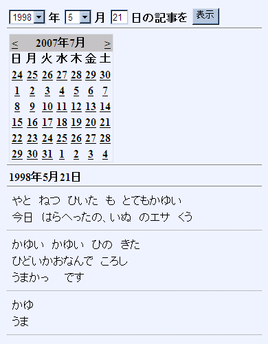

# ブログ表示（２）

## <a id="sec-generated-title-1"></a> <a id="abst"></a>概要

「[ブログ表示（１）](blog1.md)」の続き。

以下の3パターンの表示方法を実装します。

1. BlogLatest.aspx … クエリ文字列で「何日前か」を指定してブログを表示。

2. BlogDate.aspx … クエリ文字列で日付を指定してブログを表示。

3. BlogSelect.aspx … ページ中にドロップダウンリストやカレンダーコントロールを配置して、日付を選択してブログを表示。


ブログもどき自体はこれで完成です。
技術面でいうと、以下の内容のうちの 3 を説明。

1. Web コントロール

2. XSLT

3. クエリ文字列

4. HTTP リクエストのリライト・リダイレクト

5. RSS の作成


## <a id="sec-generated-title-2"></a> <a id="latest"></a>「何日前か」を指定して表示

まず、クエリ文字列で「何日前か」を指定してブログを表示するページを作ります。
「[Web コントロールの利用](blog1.md#use_control)」で作った BlogLatest.aspx を元に少し書き換え。

ASP.NET では、受け取ったクエリ文字列を Request.QueryString に格納します。
例えば、
“http://my.domain.jp/BlogLatest.aspx?days=3”と言うような URL で HTTP リクエストがあったとすると、
Request.QueryString["days"] とすることで、"3" という文字列が得られます。

で、Request.QueryString から値を取り出すために、
以下のようなクラスを用意しておきます。

```csharp
using System;
using System.Collections.Specialized;
using System.Text.RegularExpressions;

namespace WebsiteSample
{
  public class Util
  {
    internal static Regex yyyyMMdd =
      new Regex(@"(\d{4})(\d{2})(\d{2})\.xml");

    /// <summary>
    /// NameValueCollection から値を取り出す。
    /// 「キーに year がなければ y も試す」というように、
    /// 複数のキーのうちの最初に1つ合致したキーに対応する値を取得。
    /// 1つも合致しなければ defaultValue を返す。
    /// </summary>
    public static int GetIntFrom(
      NameValueCollection collection,
      int defultValue,
      params string[] keys)
    {
      foreach (string key in keys)
      {
        int val;
        string str = collection[key];
        if (!string.IsNullOrEmpty(str))
        {
          int.TryParse(str, out val);
          return val;
        }
      }
      return defultValue;
    }
  }
}
```


この GetIntFrom メソッドを使って、
BlogLatest の Page_Load イベントハンドラを以下のように書き換えます。

```html
protected void Page_Load(object sender, EventArgs e)
{
  int days = Util.GetIntFrom(Request.QueryString, 0, "days", "d");

  string basePath = Context.Server.MapPath("~/App_Data");
  string[] files = Directory.GetFiles(basePath, "*.xml");
  Array.Sort(files);

  string xmlFile = files[files.Length - 1 - days];
  string xslFile = basePath + @"\main.xsl";

  this.xmlContent.XmlFileName = xmlFile;
  this.xmlContent.XslFileName = xslFile;

  Match match = Util.yyyyMMdd.Match(xmlFile);
  if (match.Success)
  {
    this.head.Text = string.Format("{0}年{1}月{2}日",
      match.Groups[1],
      match.Groups[2].ToString().TrimStart('0'),
      match.Groups[3].ToString().TrimStart('0'));
  }
}
```


これで、BlogLatest.aspx?days=2 という呼び出し方をすることで、
最新から2日前のブログを表示できるようになります。


## <a id="sec-generated-title-3"></a> <a id="date"></a>日付を指定して表示

次は、日付を指定して表示する Web フォームを作ります。
ファイル名は BlogDate.aspx としておきます。

Page_Load イベントハンドラ内の処理が違うだけで、
他はほとんど BlogLatest の方と同じなので、
コードビハインドのみを示します。

```html
using System;
using System.Web;
using System.IO;

namespace WebsiteSample
{
  public partial class BlogDate : System.Web.UI.Page
  {
    protected void Page_Load(object sender, EventArgs e)
    {
      int day = Util.GetIntFrom(Request.QueryString, 0, "day", "d");
      int month = Util.GetIntFrom(Request.QueryString, 0, "month", "m");
      int year = Util.GetIntFrom(Request.QueryString, 0, "year", "y");

      string basePath = Context.Server.MapPath("~/App_Data");

      string xmlFile = basePath +
        string.Format(@"\{0}{1:00}{2:00}.xml", year, month, day);

      if (!File.Exists(xmlFile)) return;

      string xslFile = basePath + @"\main.xsl";

      this.xmlContent.XmlFileName = xmlFile;
      this.xmlContent.XslFileName = xslFile;

      this.head.Text = string.Format("{0}年{1}月{2}日",
        year, month, day);
    }
  }
}
```


これで例えば、BlogDate.aspx?year=1998&amp;month=5&amp;day=21 というような書き方で、
1998年5月21日の記事が表示されます。


## <a id="sec-generated-title-4"></a> <a id="control"></a>ドロップダウンリストやカレンダーコントロールで日付を選択

最後に、
クエリ文字列ではなく、
ページ中にドロップダウンリストやカレンダーコントロールを配置して、
選択した日付の記事を表示する Web フォームを作ります。

まず、年月日を選択するためのドロップダウンリスト・テキストボックスや、
カレンダーコントロールを aspx 中に記述します。


```html
<%@ Page Language="C#"
  MasterPageFile="~/Site.Master" AutoEventWireup="true"
  CodeBehind="BlogSelect.aspx.cs" Inherits="WebsiteSample.BlogSelect"
  Title="日記" %>

<%@ Register TagPrefix="local" TagName="ShowXml" Src="~/ShowXml.ascx" %>

<asp:Content ID="Content1"
  ContentPlaceHolderID="ContentPlaceHolder1" runat="server">

<div class="blogHead">
<asp:DropDownList runat="server" ID="listYear">
</asp:DropDownList>
年

<asp:DropDownList runat="server" ID="listMonth">
  <asp:ListItem Text="1" Value="1" />
  <asp:ListItem Text="2" Value="2" />
  <asp:ListItem Text="3" Value="3" />
  <asp:ListItem Text="4" Value="4" />
  <asp:ListItem Text="5" Value="5" />
  <asp:ListItem Text="6" Value="6" />
  <asp:ListItem Text="7" Value="7" />
  <asp:ListItem Text="8" Value="8" />
  <asp:ListItem Text="9" Value="9" />
  <asp:ListItem Text="10" Value="10" />
  <asp:ListItem Text="11" Value="11" />
  <asp:ListItem Text="12" Value="12" />
</asp:DropDownList>
月

<asp:TextBox runat="server" ID="textDay" Width="20" />
日の記事を
<asp:Button runat="server" ID="buttonShow" Text="表示"
  OnClick="buttonShow_Click" />
</div>

<div class="blogHead">
<asp:Calendar runat="server" ID="calendar"
  OnSelectionChanged="calendar_SelectionChanged" />
</div>

<div class="blogHead">
<asp:Label runat="server" ID="head" />
</div>
<local:ShowXml runat="server" ID="xmlContent" />

</asp:Content>
```
で、コードビハインド側では以下のような処理を行います。

* 初期化： ブログを付け始めた年から今年までをドロップダウンリストの項目として追加

* [表示] ボタン押下時の処理

* カレンダーで日付を選択したときの処理


ソースコードは以下のようになります。

```html
using System;
using System.Web;
using System.Web.UI;
using System.Web.UI.WebControls;
using System.IO;

namespace WebsiteSample
{
  public partial class BlogSelect : System.Web.UI.Page
  {
    protected override void OnInit(EventArgs e)
    {
      base.OnInit(e);

      const int startedYear = 1998;
      DateTime today = DateTime.Today;
      int year = today.Year;
      int month = today.Month;
      int day = today.Day;

      ListItem li;
      for (int y = startedYear; y <= year; ++y)
      {
        li = new ListItem();
        li.Text = y.ToString();
        li.Value = y.ToString();
        this.listYear.Items.Add(li);
      }
      this.listYear.SelectedIndex = year - startedYear;

      this.listMonth.SelectedIndex = month - 1;

      this.textDay.Text = day.ToString();
    }

    protected void buttonShow_Click(object sender, EventArgs e)
    {
      int y = int.Parse(this.listYear.SelectedItem.Value);
      int m = int.Parse(this.listMonth.SelectedItem.Value);
      int d = int.Parse(this.textDay.Text);

      this.Show(y, m, d);
    }

    protected void calendar_SelectionChanged(object sender, EventArgs e)
    {
      DateTime selected = this.calendar.SelectedDate;

      this.Show(selected.Year, selected.Month, selected.Day);
    }

    void Show(int year, int month, int day)
    {
      string basePath = Context.Server.MapPath("~/App_Data");

      string xmlFile = basePath +
        string.Format(@"\{0}{1:00}{2:00}.xml", year, month, day);

      if (!File.Exists(xmlFile)) return;

      string xslFile = basePath + @"\main.xsl";

      this.xmlContent.XmlFileName = xmlFile;
      this.xmlContent.XslFileName = xslFile;

      this.head.Text = string.Format("{0}年{1}月{2}日",
        year, month, day);
    }
  }
}
```


以下のような感じで、選択した日付の記事が表示されるはずです。

<figure>

[](../../../../assets/media/ufcpp2000/dotnet/resources/BlogSelect.png)

<figcaption>ドロップダウンリストなどで日付を選択</figcaption>
</figure>
