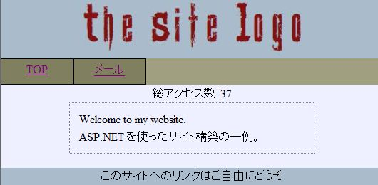
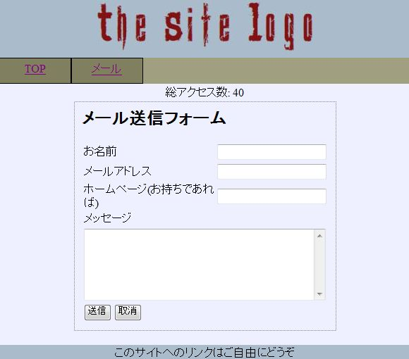

# メールフォーム

## <a id="sec-generated-title-1"></a> <a id="abst"></a>概要

ウェブサイト上にメールアドレスを掲載しちゃうと SPAM メールの餌食になるし、
ASP.NET ごしにメールしてもらうように、メールフォームを作成。

.NET Framework が、
System.Net.Mail の MailMessage とか SmtpClient とか、
メール送信機能も持っているので、
この辺りを利用。

ついでといってはなんですが、
マスタページを使って、他のページと見た目やメニューなどを統一してみる。


## <a id="sec-generated-title-2"></a> <a id="master"></a>マスタページ

サイト中の全てのページに対して、
そろえておきたい部分ってのがあります。
例えば、全ページにサイトのロゴを表示したいとか、
メニューを付けたいとか、そういうのです。

ASP.NET では、<strong id="master" class="keyword">マスタページ</strong>（master page）というものを使って、
複数のページに共通する部分をまとめておくことができます。

まあ、CGI アプリなんかでも、
以下のような HTML テンプレートを用意しておいて、
$$contents$$ の部分を置換して表示したりすることがありますが、
ASP.NET では、そういう仕組みが標準で用意されているわけです。


```html
<html>
<head>
 <link rel="stylesheet" type="text/css" href="main.css" />

 <title>$$title$$</title>
</head>
<body>
 <div class="head">
  
 </div>

 <div class="content">
  $$contents$$
 </div>

 <div class="foot">
  <p>
  このサイトへのリンクはご自由にどうぞ
  </p>
 </div>
</body>
</html>
```
ASP.NET のマスタページを作るには、
Visual Studio を使う場合、
ソリューションエクスプローラから [追加]→[新しい項目]→[マスタ ページ] を選びます。
まあ、結局中身はテキストファイルなので、
統合開発環境を使わないでも、
拡張子 .Master のファイルを作ってテキストエディタで中身を書いても OK。

例として、
「サイトのロゴ」「メニュー」「カウンタ」「フッタ」辺りを表示するマスタページを作ります。
ファイル名は仮に、Site.Master としておきます。


```xml
<%@ Master Language="C#" AutoEventWireup="true"
  CodeBehind="Site.master.cs" Inherits="WebsiteSample.Site" %>

<!DOCTYPE html PUBLIC "-//W3C//DTD XHTML 1.0 Transitional//EN"
  "http://www.w3.org/TR/xhtml1/DTD/xhtml1-transitional.dtd">

<html xmlns="http://www.w3.org/1999/xhtml" >
<head runat="server">

<link rel="stylesheet" type="text/css" href="main.css" />

    <title>無題のページ</title>
</head>
<body>

<form id="form1" runat="server">

  <p class="head">
  
  </p>
  <div class="menu">
    <span class="menuItem">
      <a href="Default.aspx">TOP</a>
    </span>
    <span class="menuItem">
      <a href="Mail.aspx">メール</a>
    </span>
  </div>

  <p class="counter">
    総アクセス数: <%= Session["count"] %>
  </p>

  <div class="content">
    <asp:ContentPlaceHolder ID="ContentPlaceHolder1" runat="server">
    </asp:ContentPlaceHolder>
  </div>

  <div class="foot">
  <p>
    このサイトへのリンクはご自由にどうぞ
  </p>
  </div>
</form>

</body>
</html>
```
&lt;asp:ContentPlaceHolder&gt; の部分に、ページごとのコンテンツが表示され、
残りの部分はこのマスタを適用する全ページに共通になります。

早速、このマスタを使う Web フォームページを作ってみましょう。
（Visual Studio を使うなら、
[追加]→[新しい項目]→[Web コンテンツフォーム] で雛形を作ってくれます。）
以下のように、
&lt;%@ Page %&gt; ディレクティブ中の
MasterPageFile のところに、上述のマスタページファイルの名前を書きます。


```html
<%@ Page Language="C#"
  MasterPageFile="~/Site.Master" AutoEventWireup="true"
  CodeBehind="Default.aspx.cs" Inherits="WebsiteSample.Default"
  Title="My Website トップページ" %>
<asp:Content ID="Content1"
  ContentPlaceHolderID="ContentPlaceHolder1" runat="server">

<p>
Welcome to my website.
</p>
<p>
ASP.NET を使ったサイト構築の一例。
</p>

</asp:Content>
```
&lt;asp:Content&gt; の中身が、マスタページの &lt;asp:ContentPlaceHolder&gt; のところに展開されます。

ロゴとか CSS ファイルを用意して
（サンプル: [ロゴ](../../../../assets/resources/logo.jpg)、[CSS](../../../../assets/resources/main.css)）、
このページを表示すると、以下のようになります。

<figure>
	[](../../../../assets/media/ufcpp2000/dotnet/resources/Default_aspx.jpg)
	<figcaption>マスタページの適用結果の例</figcaption>
</figure>


## <a id="sec-generated-title-3"></a> <a id="mailform"></a>メールフォーム

マスタページもできたところで、本題のメールフォームを作ってみましょう。

とりえあえず、Web コンテンツフォームの &lt;asp:Content&gt; の中に、
テキストボックスやボタンを適当に配置。


```html
<%@ Page Language="C#"
  MasterPageFile="~/Site.Master" AutoEventWireup="true"
  CodeBehind="Mail.aspx.cs" Inherits="WebsiteSample.Mail"
  Title="メールフォーム" %>

<asp:Content ID="Content1"
  ContentPlaceHolderID="ContentPlaceHolder1" runat="server">
  <h2>メール送信フォーム</h2>
  <table>
    <tr>
    <td>お名前</td>
    <td><asp:TextBox runat="server" ID="textName"></asp:TextBox></td>
    </tr>
    <tr>
    <td>メールアドレス</td>
    <td><asp:TextBox runat="server" ID="textAddress"></asp:TextBox></td>
    </tr>
    <tr>
    <td>ホームページ(お持ちであれば)</td>
    <td><asp:TextBox runat="server" ID="textSiteUrl"></asp:TextBox></td>
    </tr>
    <tr>
    <td colspan="2">メッセージ</td>
    </tr>
    <tr>
    <td colspan="2">
    <asp:TextBox runat="server" ID="textMessage"
      TextMode="MultiLine" Rows="6" Columns="80"></asp:TextBox>
    </td>
    </tr>
    <tr>
    <td colspan="2">
    <asp:Button runat="server" ID="buttonOk" Text="送信"
      OnClick="buttonOk_Click" />
    <asp:Button runat="server" ID="buttonCancel" Text="取消"
      OnClick="buttonCancel_Click" />
    </td>
    </tr>
  </table>
  <div>
  <asp:Label runat="server" ID="labelResult"></asp:Label>
  </div>
</asp:Content>
```
で、コードビハインド側に、[送信]・[取消]ボタンが押されたときのイベントハンドラを書きます。
.NET Framework では、
メールの送受信機能は System.Web.Mail 名前空間にまとまっています。

（メールアドレスや、SMTP サーバ名はソース中に書くんじゃなくて、
設定ファイルとかに書いておくのがいいんですが、
ちょっと手抜き。）

```html
using System;
using System.Web;
using System.Net.Mail;
using System.Text.RegularExpressions;

namespace WebsiteSample
{
  public partial class Mail : System.Web.UI.Page
  {
    Regex regex = new Regex(@"^[-_\.a-zA-Z0-9]+\@[-_\.a-zA-Z0-9]+$");

    protected void buttonOk_Click(object sender, EventArgs e)
    {
      Match m = regex.Match(this.textAddress.Text);
      if (!m.Success)
      {
        this.labelResult.Text = "エラー: メールアドレスが不正です";
        return;
      }

      if (string.IsNullOrEmpty(this.textName.Text))
      {
        this.labelResult.Text = "エラー: お名前が入力されていまません";
        return;
      }

      try
      {
        MailAddress addrFrom = new MailAddress(
          this.textAddress.Text, this.textName.Text);
        MailAddress addrTo = new MailAddress(
          "webmaster@xxx.aaa.jp");
        MailMessage msg = new MailMessage(addrFrom, addrTo);

        msg.Subject = "Chaos Dimension メールフォームからのメール";
        msg.Body =
          "名前: " + this.textName.Text + "\n" +
          "メールアドレス: " + this.textAddress.Text + "\n" +
          "ウェブサイト: " + this.textSiteUrl.Text + "\n\n" +
          this.textMessage.Text;

        SmtpClient client = new SmtpClient("mail.xxx.aaa.jp");
        client.Send(msg);

        this.labelResult.Text = "送信完了";
      }
      catch (Exception exc)
      {
        this.labelResult.Text = "送信エラー: " + exc.Message;
      }
    }

    protected void buttonCancel_Click(object sender, EventArgs e)
    {
      this.textName.Text = string.Empty;
      this.textAddress.Text = string.Empty;
      this.textSiteUrl.Text = string.Empty;
      this.textMessage.Text = string.Empty;
    }
  }
}
```


これで、以下のようなページができあがるはずです。

<figure>
	[](../../../../assets/media/ufcpp2000/dotnet/resources/Mail_aspx.jpg)
	<figcaption>メールフォームの例</figcaption>
</figure>
