# コレクションの内部実装

##  概要

コレクションにはいろいろあって、それぞれ特徴があり、目的に応じて使い分ける必要があります。
コレクションの内部的な実装方法を知ることは、それぞれの特徴を把握する（＝使い分けができるようになる）のの手助けになるでしょう。

そこで、ここでは、簡単にですが、コレクションの内部的な実装方法について説明します。

具体的なコードを伴った詳細は、別途「[コレクション](../../algorithm/index.md#collection)」で説明しています。

##  配列リスト

個数不定のデータを持つための一番手っ取り早い方法は、事前に配列を確保しておいて、状況に応じて確保しなおす方法です。
このような方式を<strong id="array-list" class="keyword">配列リスト</strong>（array list）と呼びます。

List&lt;T&gt; やStack&lt;T&gt; で内部的にやってることはほぼこれだけです。その他のコレクションでも、この手の仕組みはよく使います。

要は、配列と、実際に何個目まで要素が詰まっているかを表す変数countを持ちます（図1）。

<figure>
	[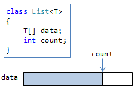](../../../../assets/media/ufcpp2000/dotnet/fig/col-array-list1.png)
	<figcaption>配列リストのデータ構造。</figcaption>
</figure>

そして、要素を追加するたびに、count の値を増やします（図2）。

<figure>
	[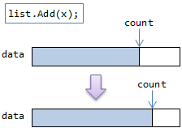](../../../../assets/media/ufcpp2000/dotnet/fig/col-array-list2.png)
	<figcaption>要素の追加。</figcaption>
</figure>

もし配列がいっぱいになったら、新しい配列を確保して要素をコピーします（図3）。

<figure>
	[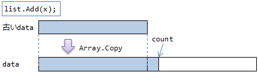](../../../../assets/media/ufcpp2000/dotnet/fig/col-array-list3.png)
	<figcaption>配列の再確保。</figcaption>
</figure>

要素のコピーはそれなりに高負荷なので、要素の最大数がだいたいわかってる場合は、事前に確保する配列の長さをコンストラクターに渡しておきます（capacity引数）。

##  循環バッファー

配列リストは、内部的にはあくまでただの配列で、末尾以外の場所に対して要素の追加/削除をしようとすると、
要素を1つずつ後ろ/前にずらして空きを作る/埋める作業が発生します。
Stack&lt;T&gt; のように、末尾以外見ないコレクションの場合ならこれでいいんですが、
Queue&lt;T&gt; （挿入は末尾、削除は先頭）の場合に性能が出ずに困ります。

そこで、末尾と先頭に対する要素の挿入/削除を高速に行うために考えられるのが、
<strong id="circular-buffer" class="keyword">循環バッファー</strong>（circular buffer）というものです。

循環バッファーは、データ構造的には配列リストとほぼ同じですが、
要素数countの代わりに、どこから（first）どこまで（last）要素が入っているかを表す変数を持ちます（図4）。

<figure>
	[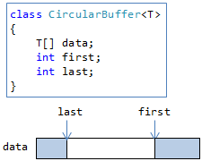](../../../../assets/media/ufcpp2000/dotnet/fig/col-circular1.png)
	<figcaption>循環バッファーのデータ構造。</figcaption>
</figure>

要素をインデックスで取り出す際には、dataの長さで剰余を取ることで、配列の両端をつないだかのように扱います（図5）。

<figure>
	[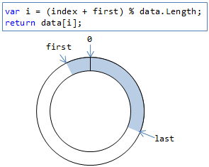](../../../../assets/media/ufcpp2000/dotnet/fig/col-circular2.png)
	<figcaption>インデックスの剰余を取ることで、バッファーの両端をつなぐ。</figcaption>
</figure>

配列の長さが足りなくなったら再確保するのは配列リストと同じです。

##  連結リスト

配列リストなどでは、事前に大き目の配列を確保する必要があります。
これに対して、必要な分だけメモリを確保するために使うのが<strong id="linked-list" class="keyword">連結リスト</strong>（linked list）です。
.NET には、そのまま LinkedList&lt;T&gt; という名前のクラスがあって、連結リストを使って実装されています。

連結リストでは、ノード（node: 節）をつないでリストを作ります（図6）。

<figure>
	[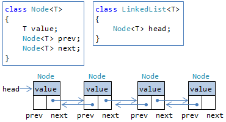](../../../../assets/media/ufcpp2000/dotnet/fig/col-linked-list1.png)
	<figcaption>連結リスト。</figcaption>
</figure>

（正確にいうと、この例のように、前後両方のノードへの参照を持つやり方は双方向連結リストと言います。
後のノードだけを参照する片方向連結リストもありますが、用途は限られています。）

要素が増えるたびに必要な分だけメモリを確保します。
しかし、インデックスを使ったアクセスはできなくなります（前から順に数えていく効率の悪いやり方しかできない）。

##  ハッシュ テーブル

<strong id="hash-table" class="keyword">ハッシュ テーブル</strong>は、要素の検索を高速に行うために使うデータ構造です。

メモリがふんだんに使えて、
実際に必要とする要素数よりもかなり大き目の領域を確保しておけるならという条件付きでですが、
検索をきわめて効率良くできる実装方法です。

###  ハッシュ値

キーに対応する何らかの整数値を作れれば、普通の配列を使って辞書を実現できます。
その「何らかの整数値」というのがハッシュ値（hash value: 直訳だと「ごちゃまぜにした値」）です。

.NETの場合、object型がGetHashCodeという、ハッシュ値を得るためのメソッドを持っています。
ハッシュ テーブルのキーにしたい型は、このGetHashCodeを“適切に”実装する必要があります。

###  ハッシュ テーブルの原理

さて、ハッシュ値を使ったコレクション（Dictionary&lt;TKey, TValue&gt; や HashSet&lt;T&gt; など）を作るにあたって、
2つ問題があります。

* 通常、ハッシュ値は被ります
    * int 型よりも広い範囲になるものを、int型に落とし込んで一意になるはずがありません

* int.MaxValue （int 型の最大値）の長さの配列は大きすぎて、常時確保しておくわけにはいきません

そこで、以下のような手法を使います（図7）。

* ハッシュ値を、確保した配列（バケツ（bucket）と呼びます）の長さで割った余りを使う

* 被っていた場合、他の空いている場所を使うルール（たとえば順次隣を見ていくとか、バケツの末尾から見ていくとか）を設ける

<figure>
	[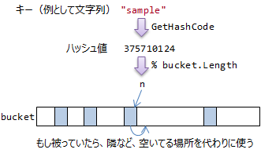](../../../../assets/media/ufcpp2000/dotnet/fig/col-hash-table1.png)
	<figcaption>ハッシュ テーブルの原理。</figcaption>
</figure>

もちろん、被れば被るほど、検索性能が落ちます。
“適切な”GetHashCode実装が必要と言ったのはこのためで、可能な限り被りが起きなくなるように実装する必要があります。

（例えば、たまたま、bucket.Lengthの倍数しか生成しないような実装になっていた場合、100%ハッシュ値が被ることになります。
なので、.NETのDictionary実装では、bucket.Lengthを常に素数（たまたまで倍数になりくい）にしているようです。
まあ、GetHashCodeが定数を返すようなよっぽどダメな実装をしない限りはたいてい大丈夫です。）

また、確保するバケツのサイズは十分大きくなければいけません。
事前に大き目の領域を取れない場合、被りやすくなり、性能を落とします。

##  二分探索ツリー（平衡ツリー）

ハッシュ テーブルは、メモリをふんだんに使える状況でないとなかなか性能が出ません。
（逆に、メモリに余裕があって、かなり大き目の領域を確保しておくなら、かなり高速です。）
これに対して、必要な分だけメモリを使いつつ、要素の検索を高速に行うために使うデータ構造として、
<strong id="binary-tree" class="keyword">二分探索ツリー</strong>（binary search tree）というものがあります。

###  ツリー

二分探索ツリーの話に入る前に、ツリーについても簡単に説明を。

ツリーは、連結リストと同じように、ノードを作ってつないで作ります。ただし、連結リストとは違って、図8のようなつなぎ方をします。

<figure>
	[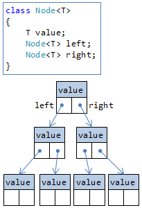](../../../../assets/media/ufcpp2000/dotnet/fig/col-tree.png)
	<figcaption>ツリー データ構造。</figcaption>
</figure>

正確にいうと、これは二分ツリー（各ノードから、それぞれ2本ずつ枝が伸びてる）と呼ばれます。
より一般的には、循環のない有向グラフのことをツリーと呼びます。

###  二分探索ツリー

ツリーを使ってデータを持つとして、以下のような制約を付けると、高速な検索ができるようになります。

* 左側の子孫ノードには、必ず自分より小さい値を入れる

* 右側の子孫ノードには、必ず自分より大きい値を入れる

このような制約を保つため、要素の挿入にも以下のルールを設けます。

* 現在のノードの値より小さければ左側の子をたどる

* 現在のノードの値より大きければ右側の子をたどる

* 末端まで来たら、そこに新しいノードを作る

具体例を挙げてみましょう。
このルールを使って、たとえば、3, 6, 7, 2, 4, 1, 8, 5 の順で値を挿入したとします。
すると、図9のような手順でツリーが構築されるはずです。

<figure>
	[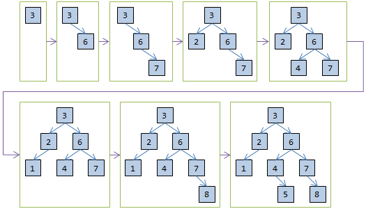](../../../../assets/media/ufcpp2000/dotnet/fig/col-binary-tree1.png)
	<figcaption>二分探索ツリーの構築例（理想的状況）。</figcaption>
</figure>

ルールがはっきりしているので、要素の検索が容易です。

検索にかかる時間はおおむねツリーの高さに比例しますが、平均的には、要素数nに対して、ツリーの高さは log2 n になります。
つまり、O(log n) での検索ができます。

###  平衡ツリー

上記の例はかなり良い例で、実はうまくツリーの高さが log n にならない場合があります。
たとえば、1, 2, 3, 4, 5の順で要素を挿入すると、図19に示すような偏りが生じて、ツリーの高さが n になります。

<figure>
	[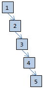](../../../../assets/media/ufcpp2000/dotnet/fig/col-binary-tree2.png)
	<figcaption>二分探索ツリーの構築例（好ましくない状況）。</figcaption>
</figure>

このような偏りを避けるため、挿入時に適宜ツリーを組み替えるアルゴリズムがいくつか知られています。
このような仕組みを平衡化（barancing）と呼び、平衡化した二分探索ツリーを<strong id="balanced-tree" class="keyword">平衡ツリー</strong>（baranced tree）と呼びます。

ここでは詳細は割愛しますが、.NET の SortedDictionary&lt;T&gt; や SortedSet&lt;T&gt; などは、<strong id="red-black-tree" class="keyword">赤黒ツリー</strong>（red black tree: 2色に塗り分けるというニュアンスしかないです。
日本人的な感覚でいうと白黒や紅白と表現すべきかも）という平衡化アルゴリズムを使っています。

##  整列済み配列

配列を整列済みに保っておけば、二分探索という高速な検索アルゴリズムが使えます。

これを応用したコレクションが SortedList&lt;TKey, TValue=&gt; クラスです。

###  二分探索

整列済みの配列に対して、以下のような手順で、要素の検索を高速に行えます（図11）。

* ど真ん中を見る

* 探したい値が、ど真ん中の値よりも大きければ右を、小さければ左を見る

* そのさらにど真ん中（1/4のところか3/4のところ）というように、繰り返し調べる

<figure>
	[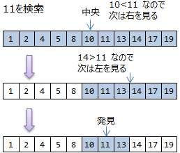](../../../../assets/media/ufcpp2000/dotnet/fig/col-binary-search1.png)
	<figcaption>二分探索の例。</figcaption>
</figure>

この方法を<strong id="binary-search" class="keyword">二分探索</strong>（binary search）と言います。
二分探索使えば、最悪でも 
          log
            2
           n
         回の繰り返しで要素を検索できます。

これを使って辞書を作る場合、以下のようなことが言えます。

* 検索は極めて高速です

* 要素の挿入時には、整列済みになるように、中途半端な位置に要素を入れる必要があるので、O(n)かかります

* 削除時も同様

* 要は配列リストなので、確保した配列で足りなくなった場合、再確保とコピーが必要です
