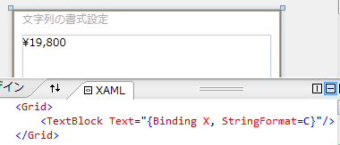

# 文字列の書式設定

## <a id="sec-generated-title-1"></a> <a id="abst"></a>概要

数値を整形して表示したいことがあります。
例えば、19800 という数値に対して、

* 数字のみ: 19800

* 3ケタごとにコンマ区切り: 19,800

* 指数表記: 1.98e4


など、いろんな表示の仕方があります。

.NET では、ToString メソッドや、string.Format 静的メソッドなどに対して、書式を与えることで、数値の表示の仕方を変えることができます。
また、WPF や Silverlight のデータ バインディングでも、書式設定ができます。

<figure>

[](../../../../assets/media/ufcpp2000/dotnet/fig/BindingStringFormat.png)

<figcaption>データ バインディングにおける書式設定。</figcaption>
</figure>


参考:

* [MSDN: 型の書式設定](http://msdn.microsoft.com/ja-jp/library/26etazsy.aspx)


## <a id="sec-generated-title-2"></a> <a id="ToString"></a>ToString メソッド

C#では、数値などから文字列への型変換は、そのままではできません。しかし、objectクラスがToStringというメソッドを持っていて、これで文字列化できます。

自作の型を文字列化したい場合は、以下のように、ToStringメソッドをオーバーライドします。


<div class="tab-container">
<ul>
	<li>C#</li>
	<li>VB</li>
	<li>C++</li>
</ul>
<div>

```csharp
class Point
{
    public int X { get; set; }
    public int Y { get; set; }
 
    public override string ToString()
    {
        return "(" + X + ", " + Y + ")";
    }
}
```


</div>
<div>

```vbnet
Class Point
    Public Property X As Integer
    Public Property Y As Integer

    Public Overrides Function ToString() As String
        Return "(" & X & ", " & Y & ")"
    End Function
End Class
```


</div>
<div>

```cpp
ref class Point
{
public:
  property int X;
  property int Y;

  virtual String^ ToString() override
  {
    return "(" + X + ", " + Y + ")";
  }
};
```


</div>
</div>


以下のように利用できます。


<div class="tab-container">
<ul>
	<li>C#</li>
	<li>VB</li>
	<li>C++</li>
</ul>
<div>

```csharp
var p = new Point { X = 10, Y = 20 };
Console.WriteLine(p);
```


</div>
<div>

```vbnet
Dim p = New Point With {.X = 10, .Y = 20}
Console.WriteLine(p)
```


</div>
<div>

```cpp
auto p = gcnew Point();
p->X = 10;
p->Y = 20;
Console::WriteLine(p);
```


</div>
</div>


```console
(10, 20)
```


## <a id="sec-generated-title-3"></a> <a id="ToString-format"></a>書式設定付きの ToString メソッド

intやDateTimeなど、主要な型には、書式設定が可能なバージョンのToStringメソッドが提供されています。書式を、ToStringの引数として渡します。

```csharp
var n = 1980;
Console.WriteLine(n.ToString("d")); // 1980
Console.WriteLine(n.ToString("x")); // 7bc
 
var x = 0.12;
Console.WriteLine(x.ToString("f")); // 0.12
Console.WriteLine(x.ToString("e")); // 1.200000e-001
```


<code>"d"</code> などが書式です。
書式の書き方については後程改めて説明します。


## <a id="sec-generated-title-4"></a> <a id="string-format"></a>複合書式（string.Format）

stringクラスのFormat静的メソッドで、複数の値をまとめて書式設定することができます。

```csharp
var x = 7;
var y = 13;
var line = string.Format("{0} × {1} = {2}", x, y, x * y);
Console.WriteLine(line); // 7 × 13 = 91
```


1つ目の引数が書式で、2つ目以降の引数を、それぞれ、<code>{0}</code>、<code>{1}</code>、<code>{2}</code> の部分に展開します。
<code>{}</code> 内の数字は、何番目の引数を参照するかのインデックス（0 始まり）を表します。

Console.Writeや、StreamWriter.Writeなど、内部的にstring.Formatを呼び出してくれる（＝文字列整形の挙動は string.Format と同じ）ものもあります。

```csharp
Console.WriteLine("({0}, {1})", 1, 2); // (1, 2)
```


インデックスに続けて、<code>,</code>（コンマ）で区切って幅を指定することもできます。この時、正の数を指定すると右詰め、負の数を指定すると左詰めになります。

```csharp
Console.WriteLine("({0,-5}) ({1,5})", 1, 1); // (1    ) (    1)
```


また、インデックスに続けて、<code>:</code> （コロン）で区切って、個別の書式（＝ ToString メソッドに渡す書式）を指定できます。

```csharp
Console.WriteLine("{0:x}, {1:c}", 123, 123); // 7b, \123
//↑ "{0}, {1}", 123.ToString("x"), 123.ToString("c") と同じ扱い
```


それでは、個別の書式についてみていきましょう。


## <a id="sec-generated-title-5"></a> <a id="num-format-std"></a>数値書式（標準）

##### <a id="sec-generated-title-6"></a>整数

dは10進数、xは16進数を表します。xを大文字にするか小文字にするかで、16進数のa～fの大小を選べます。

```csharp
// d：10進数、0詰め桁数指定
Console.WriteLine("{0:d}, {0:d4}", 5); // 5, 0005
// x: 16進数、0詰め桁数指定
Console.WriteLine("{0:x}, {0:X}, {0:x4}, {0:X4}", 140); // 8c, 8C, 008c, 008C
```


##### <a id="sec-generated-title-7"></a>浮動小数点数

fで固定小数点表示、eで指数表記を表します。また、gで、fとeのどちらか、簡潔な方を自動選択してくれます。

```csharp
// f: 小数点、小数点以下の桁数指定
Console.WriteLine("{0:f}, {0:f5}", 0.1234); // 0.12, 0.12340
// e: 指数表記、精度指定
Console.WriteLine("{0:e}, {0:e2}, {0:E2}", 0.1234); // 1.234000e-001, 1.23e-001, 1.23E-001
// g: f か e かを自動選択
Console.WriteLine("{0:g}, {1:g}", 1200000000000000.0, 0.12); // 1.2e+15, 0.12
```


##### <a id="sec-generated-title-8"></a>その他

適宜桁区切り、通貨記号などをはさんでくれるn、cや、精度を自動判定してくれるr、パーセント化してくれるpなども利用できます。

```csharp
// n: 適宜、桁区切りなどを挿入、小数点以下の桁数指定
Console.WriteLine("{0:n}, {0:n0}", 1234567); // 1,234,567.00, 1,234,567
// c: 通貨
Console.WriteLine("{0:c}", 1234567); // \1,234,567
// r: 復元するのに十分な桁数で出力
Console.WriteLine("{0:r}", 0.1234567890123456789f); // 0.123456791
// p: パーセント表示、小数点以下の桁数指定
Console.WriteLine("{0:p1}", 0.1234); // 12.30%
```


* 参考:[標準の数値書式指定文字列](http://msdn.microsoft.com/ja-jp/library/dwhawy9k.aspx)


## <a id="sec-generated-title-9"></a> <a id="num-format-custom"></a>数値書式（カスタム）

数値は、0や#（ナンバー記号）などを使って、かなり自由な書式を作れます。

```csharp
// 桁数を明示。0. の 0 は省略
Console.WriteLine("{0:#.##}", 0.2345); // .23
// 0詰め4ケタ.4ケタ
Console.WriteLine("{0:0000.0000}", 1.23); // 0001.2300
// 3ケタ区切り、小数点以下0詰め2ケタ
Console.WriteLine("{0:#,#.00}", 1234567); // 1,234,567.00
```


* 参考:[カスタム数値書式指定文字列](http://msdn.microsoft.com/ja-jp/library/0c899ak8.aspx)


## <a id="sec-generated-title-10"></a> <a id="datetime-format"></a>日付の書式

DateTime 型、DateTimeOffset 型に対しても、標準書式（<code>"d"</code>など）や、カスタム書式（<code>"y/M/d"</code> など）を設定できます。

```csharp
var d = new DateTime(2008, 5, 4, 8, 30, 0);
Console.WriteLine(d.ToString("d")); // 2008/05/04
Console.WriteLine(d.ToString("D")); // 2008年5月4日
```


* 参考:[標準の日付と時刻の書式指定文字列](http://msdn.microsoft.com/ja-jp/library/az4se3k1.aspx)


```csharp
var d = new DateTime(2008, 5, 4, 8, 30, 0);
Console.WriteLine(d.ToString("y/M/d h:m:s")); // 8/5/4 8:30:0
Console.WriteLine(d.ToString("hh:mm:ss"));    // 08:30:00
Console.WriteLine(d.ToString("yy/MM/dd"));    // 08/05/04 8:30:0
Console.WriteLine(d.ToString("yyyy/MM/dd"));  // 2008/12/04
Console.WriteLine(d.ToString("ddd dddd"));    // 日 日曜日
```


* 参考:[カスタムの日付と時刻の書式指定文字列](http://msdn.microsoft.com/ja-jp/library/8kb3ddd4.aspx)


カスタム書式で、 <code>/</code> や <code>:</code> などの記号は自由な位置に挿入できます。
その他、以下の文字は特別な意味を持ちます。

<table summary="">

	<tr>
		<th>記号</th>
		<th>意味</th>
	</tr>
	<tr>
		<td markdown="1">y, yy, yyyy</td>
		<td markdown="1">年。それぞれ、下2桁（2桁目が0なら1ケタ）、下2桁（2桁目は0詰め）、4ケタ表示。</td>
	</tr>
	<tr>
		<td markdown="1">M, MM</td>
		<td markdown="1">月。2文字並べた場合、0を挿入して2ケタにする（以下の、dd などでも同様）。</td>
	</tr>
	<tr>
		<td markdown="1">d, dd</td>
		<td markdown="1">日。</td>
	</tr>
	<tr>
		<td markdown="1">h, hh</td>
		<td markdown="1">時（12時間形式）。</td>
	</tr>
	<tr>
		<td markdown="1">H, HH</td>
		<td markdown="1">時（24時間形式）。</td>
	</tr>
	<tr>
		<td markdown="1">m, mm</td>
		<td markdown="1">分。</td>
	</tr>
	<tr>
		<td markdown="1">s, ss</td>
		<td markdown="1">秒。</td>
	</tr>
	<tr>
		<td markdown="1">f</td>
		<td markdown="1">秒の小数点以下。欲しい桁数分、f を並べる。</td>
	</tr>
	<tr>
		<td markdown="1">ddd, dddd</td>
		<td markdown="1">曜日。ddd が省略名（mon とか 月 とか）、dddd が完全名（Monday とか 月曜日 とか）。</td>
	</tr>
	<tr>
		<td markdown="1">MMM, MMMM</td>
		<td markdown="1">月名。MMM が省略名（Jun とか 1 とか）、MMMM が完全名（Junuary とか 5月 とか）。</td>
	</tr>
	<tr>
		<td markdown="1">t, tt</td>
		<td markdown="1">AM か PM か。日本語カルチャーで t （省略名）を使うと残念なことに（午前でも午後でも「午」と表示）。</td>
	</tr>
	<tr>
		<td markdown="1">g</td>
		<td markdown="1">年号。</td>
	</tr>
	<tr>
		<td markdown="1">K</td>
		<td markdown="1">タイム ゾーン。</td>
	</tr>
</table>


## <a id="sec-generated-title-11"></a> <a id="culture"></a>書式とカルチャー

注意点として、文字列の書式設定の結果は、カルチャーに依存します。

例えば、金額表示（通貨書式 <code>"c"</code> を使う）を考えてみましょう。
世界各国の通販サイトでも覗いていただけるとわかるんですが、以下のような部分が、国によってすべて異なります。

* 小数点以下の有無

* 小数点に使う記号

* 3ケタずつの区切りに使う記号

* 通貨記号

* 負の数の表し方


<code>"c"</code> 書式を使うと、金額に対して、カルチャーごとに最適な整形を掛けてくれます。

```csharp
using System;
using System.Globalization;

class Program
{
    static void Main()
    {
        var cultures = new[] { "ja-jp", "zh-cn", "en-us", "en-gb", "fr-fr", "de-de", "pt-br", "tr-tr", "he-il" };
        var price = 9800;

        foreach (var c in cultures)
        {
            var culture = new CultureInfo(c);
            var plus = price.ToString("c", culture);
            var minus = (-price).ToString("c", culture);
            Console.WriteLine("{0,-11} / {1,-12} ({2})", plus, minus, culture.DisplayName);
        }
    }
}
```


```console
¥9,800      / -¥9,800      (日本語 (日本))
￥9,800.00   / ￥-9,800.00   (中国語 (中華人民共和国))
$9,800.00   / ($9,800.00)  (英語 (米国))
£9,800.00   / -£9,800.00   (英語 (英国))
9 800,00 €  / -9 800,00 €  (フランス語 (フランス))
9.800,00 €  / -9.800,00 €  (ドイツ語 (ドイツ))
R$ 9.800,00 / -R$ 9.800,00 (ポルトガル語 (ブラジル))
9.800,00 TL / -9.800,00 TL (トルコ語 (トルコ))
₪ 9,800.00  / ₪-9,800.00   (ヘブライ語 (イスラエル))
```


ちなみに、特にカルチャーを指定しなかった場合、OS 設定のカルチャー（日本語 Windows を使っているなら、デフォルトでは当然日本語）に基づいて整形します。

通貨に限らず、小数点や区切り文字、日付の書式などは文化の影響を受けます。
