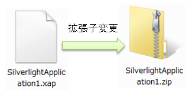
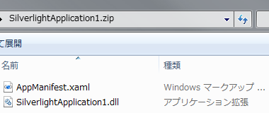
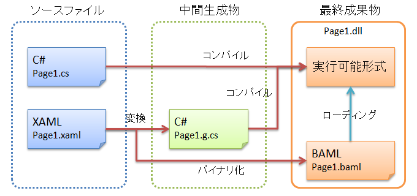
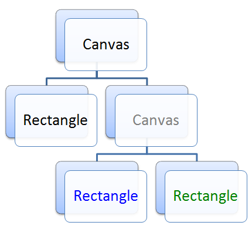
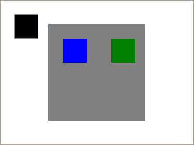
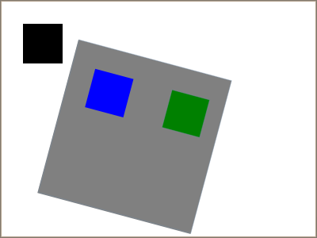
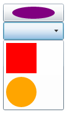
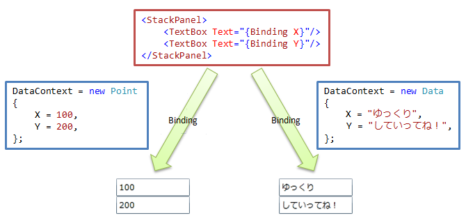
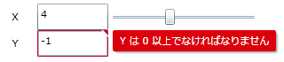

# Silverlight の開発モデル

## <a id="sec-generated-title-1"></a> <a id="abst"></a>概要

Silverlight アプリは、以下のようなモデルに基づいて開発することになります。

* XAML ＋ C#

* Visual Tree

* データ駆動


## <a id="sec-generated-title-2"></a> <a id="xaml"></a>XAML ＋ C

Silvelight では、<strong id="xaml" class="keyword">XAML</strong>（Xml Application Markup Language）と呼ばれるマークアップ言語と C# を用いてアプリ開発を行います。

XAML は、XML 形式でビュー（view： アプリの見た目に関する部分）を記述するための言語です。
XAML で書いたビューに加えて、ロジックが必要な部分には C# などのプログラミング言語を用います。

（ロジックは VB.NET や F# などを使うこともできます。
ただ、新しい環境が出た直後には、C# 用の開発環境しか用意されない場合もあります。
例えば、Windows Phone 7 向けの Silverlight は、プレビュー版の時点では C# での開発にのみ対応しています。）

<table summary="">

	<tr>
		<td markdown="1">

##### <a id="sec-generated-title-3"></a>XAML

以下のような XML でビューを記述します。


<pre class="xsource" title="XAML の例"><code class="language-xml">&lt;Grid&gt;
    &lt;Button
         Content=&quot;hello&quot;
         Click=&quot;Button_Click&quot; /&gt;
&lt;/Grid&gt;</code></pre></td>
		<td markdown="1">

##### <a id="sec-generated-title-4"></a>C

イベント処理などを行う場合は C# で記述します。

<pre class="source" title="C# でイベント処理" lang=""><code class="language-csharp">private void Button_Click(
    object sender, RoutedEventArgs e)
{
    MessageBox.Show(&quot;初めての Silverlight&quot;);
}</code></pre>

</td>
	</tr>
</table>


##### <a id="sec-generated-title-5"></a>XAML 利用の利点

XAML の利用には、以下のような利点があります。

* デザイナー向けのツール（例えば、Microsoft から Expression Blend というツールが提供されています）での編集が容易。 （XML 形式はツールでの読み書きがしやすい。）

* ビューの部分だけが分離されているので、デザイナーとプログラマーの協業がしやすい。

* ウェブサイト作成で一般的に使われいる HTML ＋ JavaScript と似たような感覚でアプリを作れる。

* C# だけでは書けない、あるいは、書きにくい記述が簡単に書ける。 （親要素のプロパティ値の継承や、データバインディングなど。）

* UI の階層が深くなった場合、C# の {} よりは、XML の閉じタグの方が幾分か開き・閉じの対応が解りやすい。


### <a id="sec-generated-title-6"></a> <a id="xap"></a>xap ファイル

##### <a id="sec-generated-title-7"></a>実態は ZIP

Silverlight アプリのビルド結果は xap という拡張子のファイルになります。
xap は、実は単なる ZIP 形式書庫になっていて、
xap の中には、dll など、いくつかのファイルが入っています。

<figure>

[](../../../../assets/media/ufcpp2000/dotnet/fig/xaptozip.png)

<figcaption>xap の実態は ZIP 形式書庫</figcaption>
</figure>


<figure>

[](../../../../assets/media/ufcpp2000/dotnet/fig/xapcontents.png)

<figcaption>xap の中身の例</figcaption>
</figure>


##### <a id="sec-generated-title-8"></a>ビルドの流れ

XAML と C# で書いたアプリは、下図のような手順で dll 化されます。
xap ファイル中に入っている dll はこのようにして作られたものです。

<figure>

[](../../../../assets/media/ufcpp2000/dotnet/fig/xapcompile.png)

<figcaption>Silverlight のビルドの流れ</figcaption>
</figure>


図中に出てくる BAML というのは Binary Application Markup Language と呼ばれるもので、
XAML と同じ内容をバイナリで表現したものです。
ファイルサイズを小さくするのと、ローディングにかかる手間を軽減するためにバイナリ化されています。
また、中間生成物の .g.cs は、XAML 中で定義した要素（ボタンやテキストボックスなど）を C# 側から参照するためにコードや、
BAML をローディングするためのコードが含まれています。


##### <a id="sec-generated-title-9"></a>Silverlight を実行

作成した xap ファイルを HTML ページ中に埋め込むには object タグを使います。


```html {title="xap ファイルを HTML ファイル中に埋め込み"}
<object data="data:application/x-silverlight-2," type="application/x-silverlight-2">
    <param name="source" value="SilverlightApplication1.xap"/>
    <param name="onError" value="onSilverlightError" />
    <param name="background" value="white" />
    <param name="minRuntimeVersion" value="4.0.50303.0" />
    <param name="autoUpgrade" value="true" />
</object>
```

## <a id="sec-generated-title-10"></a> <a id="vtree"></a>Visual Tree

Silverlight でビューの作成に使える視覚要素（ボタンなどのコントロールや、矩形・円など）は、階層構造を持っています。
例えば、以下のような XAML を書くと、


```xml {title="階層的な XAML の例"}
<Canvas Width="400" Height="300">
    <Rectangle Canvas.Left="30" Canvas.Top="30" Width="50" Height="50" Fill="Black"/>

    <Canvas Canvas.Left="100" Canvas.Top="50" Width="200" Height="200" Background="Gray">
        <Rectangle Canvas.Left="30" Canvas.Top="30" Width="50" Height="50" Fill="Blue"/>
        <Rectangle Canvas.Left="130" Canvas.Top="30" Width="50" Height="50" Fill="Green"/>
    </Canvas>
</Canvas>
```
<figure>

[](../../../../assets/media/ufcpp2000/dotnet/fig/hierarchy.png)

<figcaption>視覚要素の階層構造</figcaption>
</figure>


以下のような表示結果が得られます。

<figure>

[](../../../../assets/media/ufcpp2000/dotnet/fig/visualtree.png)

<figcaption>XAML の表示結果の例</figcaption>
</figure>


視覚要素の親子関係によって、以下のようなことが起こります。

* 平行移動などの変形は、直近の親要素からの相対位置に基づいて行われます。

* 変形は自分自身と子要素すべてにかかります。

* FontSize など、いくつかのプロパティ値は親要素から継承されます。 （最上位で FontSize を指定すると、ページ全体のフォントサイズが変わります。）


例えば、上記の例で、灰色の Canvas に15度の回転を書けると、以下のような表示結果になります。

<figure>

[](../../../../assets/media/ufcpp2000/dotnet/fig/rotation.png)

<figcaption>灰色の Canvas を15度回転</figcaption>
</figure>


ちなみに、Canvas のような要素だけではなく、Button や ComboBox など、あらゆる要素が任意の子要素を持てます。
ボタンの中に円を描画したりすることもできます。

<figure>

[](../../../../assets/media/ufcpp2000/dotnet/fig/control.png)

<figcaption>ボタンの中に円を描画</figcaption>
</figure>


## <a id="sec-generated-title-11"></a> <a id="data"></a>データ駆動

Silverlight では、<strong id="binding" class="keyword">データバインディング</strong>（data binding）という仕組みを使って、データ駆動なアプリを簡単に記述することができます。

データバインディングでは、
ビュー側には「ここにこのデータを表示したい」というような印だけ入れておいて、
実際のデータは外部から与えます。

<figure>

[](../../../../assets/media/ufcpp2000/dotnet/fig/binding.png)

<figcaption>データバインディング</figcaption>
</figure>


詳細は別途説明しますが、
元データが変更されたことを通知したり、
ユーザーに入力してもらったデータの妥当性検証をする仕組みも提供されています。

例えば、下図の例では、
X の値はテキストボックスとスライダーコントロールで共有されていて、片方が変更されると他方に変更が反映されます。
また、Y の値は 0 以上になるように検証を行っていて、もし検証に違反するようならエラーメッセージが表示されるようになっています。

<figure>

[](../../../../assets/media/ufcpp2000/dotnet/fig/validation.png)

<figcaption>データの変更通知と検証</figcaption>
</figure>
