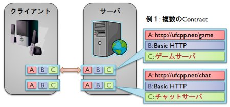
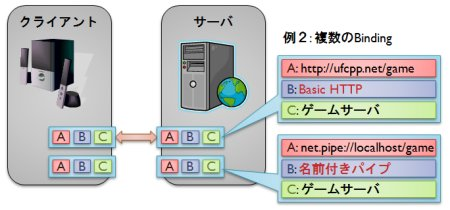
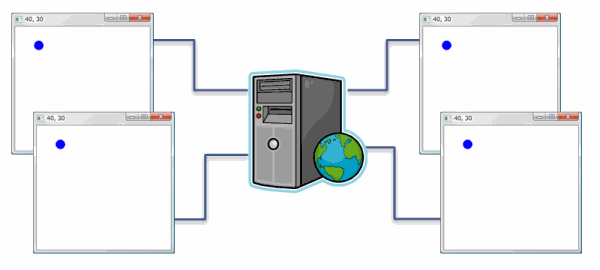

# Windows Communication Foundation 概要（WCF）

## <a id="sec-generated-title-1"></a> <a id="abst"></a>概要

<strong id="wcf" class="keyword">Windows Communication Foundation</strong> は .NET Framework 3.0 で追加された3つの主軸ライブラリの1つで、
サービス志向の通信基盤ライブラリです。
<strong id="wcf0" class="keyword">WCF</strong> と略します。

WCF を使えば、開発者はどうやって通信を行うか（how）を意識せず、何をサービスとして提供するか（what）にだけ集中することができます。
C# 3.0 の 「[LINQ](../../csharp/data/sp3_linq.md#linq)」 にしてもそうなんですが、
「how から what へ」というのが .NET Framework 3.0 / 3.5 の1つのテーマです。

具体的には、
普通のクラスライブラリに所定の属性を付けるだけで実装した機能を WCF サービスとして公開することができます。


## <a id="sec-generated-title-2"></a> <a id="service"></a>サービス指向アーキテクチャ

サービス指向アーキテクチャ（<strong id="soa" class="keyword">SOA</strong>: service oriented architecture）というのが何かは、
詳しくはネットで検索してもらうとして、要点だけあげると以下のような感じです。

* 情報システムに求められる機能が複雑化していて、 全ての機能を一枚岩のシステムに実装するのが難しくなってきている。

* 機能をある程度まとまった単位ごとに小分けにして、 小分けになった機能（これを<strong id="service" class="keyword">サービス</strong>と呼ぶ）同士を連携させることで全体のシステムを作る。

* 異なるベンダーのサービス連携も視野に入れて、 標準化された方式を使ってサービス間の通信を行う。


ASP.NET を使った XML ウェブサービスなどは SOA の具体例の1つです。

サービスが小分けにされていて、サービス間の通信方式を標準化しているので、
サービス間の依存性が低くて、
あるサービスの変更が他のサービスに与える影響が小さくなっています。
このような特徴は、SOA の利点の1つで、loosely-coupled（緩結合）と呼んだりします。


### <a id="sec-generated-title-3"></a> <a id="abc"></a>サービスの ABC

サービスを作る際に考えるべき要素として、以下の3つのものがあります。

* <span style="color:#800000">Address</span>
    * （where）どこで公開するか

    * 要はサービスの URI

    * http://ufcpp.net/Services, net.pipe://localhost/Services など


* <span style="color:#000080">Binding</span>
    * （how）どうやって公開するか

    * 要するに、どういうプロトコルで通信するか

    * WS-*、basic HTTP、TCP、名前付きパイプなど


* <span style="color:#008000">Contract</span>:
    * （what）何を公開するか

    * 提供する機能は何か

    * 商取引、金融、ゲーム、チャット、IM など


これら3つを合わせて「ABC」と言ったりもします。

このうち、サービスを実装する際に1番注力したいのは Contract（what）の部分です。
Address や Binding に関しては、以下のような要望があります。

* Address, Binding の部分はできる限りコードは書きたくない。

* 設定をちょこっと変えるだけで Address, Binding が変更できるとうれしい。

* ときには、同じ Contract をいろんな Address, Binding で公開したいときもある。


ということで、
WCF は Contract に注力できるように設計されています。


### <a id="sec-generated-title-4"></a> <a id="endpoint"></a>エンドポイント

前節で上げたサービスの ABC の組み合わせを<strong id="endpoint" class="keyword">エンドポイント</strong>（endpoint: 接続の端点）といいます。
サーバ・クライアント間の通信をケーブルに見立てたとき、ケーブルの差し込み口に相当するのがエンドポイントです。

1つのサーバが複数のエンドポイントを持てる。

<figure>

[](../../../../assets/media/ufcpp2000/dotnet/fig/wcf_endpoint1.jpg)

<figcaption>エンドポイントの例1</figcaption>
</figure>


<figure>

[](../../../../assets/media/ufcpp2000/dotnet/fig/wcf_endpoint2.jpg)

<figcaption>エンドポイントの例2</figcaption>
</figure>


## <a id="sec-generated-title-5"></a> <a id="wcf"></a>WCF

WCF では

* Contract に注力。 Binding, Address はライブラリ側で面倒を見てもらえる。 設定は App.config, Web.config に。

* インターフェースに属性を付けるだけで Contract になる。

* そのインターフェースを実装したクラスがサービスの実体になる。


```csharp
[ServiceContract(
    CallbackContract = typeof(IGameCharacterCallback),
    SessionMode = SessionMode.Required)]
public interface IGameCharacter
{
    /// <summary>
    /// キャラを動かします。
    /// </summary>
    /// <param name="movement">移動量。</param>
    [OperationContract(IsOneWay = true)]
    void Move(System.Windows.Vector movement);
}

[ServiceContract]
public interface IGameCharacterCallback
{
    /// <summary>
    /// キャラの現在位置を設定します。
    /// </summary>
    /// <param name="location">キャラの現在位置。</param>
    [OperationContract(IsOneWay = true)]
    void SetLocation(System.Windows.Point location);
}
```


サンプル： 
[WcfGameSample.zip](../../../../assets/media/ufcpp2000/csharp/source/WcfGameSample.zip)


次節以降で、サンプルの中身にそって WCF を解説

キャラクターの位置をサーバ側で管理。
複数のクライアントで位置を共有。

<figure>

[](../../../../assets/media/ufcpp2000/dotnet/fig/wcf_gamesample.png)

<figcaption>サンプル（ゲームひな形）</figcaption>
</figure>


## <a id="sec-generated-title-6"></a> <a id="plan"></a>予定

```text
クライアント側
  - Contract は単なるクラスライブラリなので、
    WCF を通さず、スタンドアローンでも使える
  - WCF クライアントにしたければ、ChannelFactory クラスなどを使う

サーバ側
  - デバッグ用のホストプログラム
  - IIS によるホスト
  - セルフホスト
 

[要約資料（pptx）](/media/ufcpp2000/csharp/slide/WcfDemo.pptx)
```
