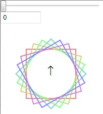
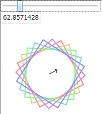
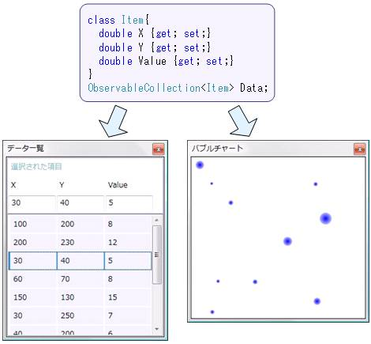
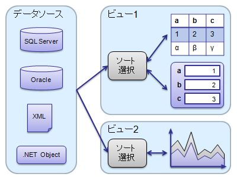

# データバインディング（WPF）

## <a id="sec-generated-title-1"></a> <a id="abst"></a>概要

「[WPF](wpf_abst.md#wpf0)」 には、データバインディング（data bining）機能があります。
（WPF に限らず、最近の GUI 開発フレームワークにはたいていこの機能がありますが。）
データバインディングは、単にバインディングとか、和訳してデータ結合とか言ったりする場合もあります。


## <a id="sec-generated-title-2"></a> <a id="about"></a>データバインディングとは

データバインディングというのは、
例えば、あるコントロールのプロパティとプロパティを結びつけたり、
データベースなどに格納されたデータとリストコントロールを結びつけたりする機構です。

「結びつける」というのは、具体的に言うと、
あるコントロール、例えばテキストボックスの中身が変更されたときに、
その中身と同期して、他のコントロールの中身を変更したりということです。

例えば、図1および2を見てください。

<figure>

[](../../../../assets/media/ufcpp2000/dotnet/fig/BindingControl1.jpg)

<figcaption>初期状態</figcaption>
</figure>


<figure>

[](../../../../assets/media/ufcpp2000/dotnet/fig/BindingControl2.jpg)

<figcaption>スライダーを動かすと・・・</figcaption>
</figure>


これの詳細については後々改めて説明しますが、
ポイントとしては、
スライダーを動かすと、それと連動して、
テキストボックスの中身が変化したり、キャンバスが回転したりします。

また、図3のように、同じデータを異なる複数の方法で表示するいうことも考えられます。

<figure>

[](../../../../assets/media/ufcpp2000/dotnet/fig/BindingData.jpg)

<figcaption></figcaption>
</figure>


さて、このような仕組みを、
もし WPF の提供するバインディング機構を使わずに実装しようと思うと、
例えば以下のような手順を踏む必要があります。

1. スライダーコントロールの ValueChanged イベントを拾う

2. ValueChanged イベントハンドラ中でテキストボックスの中身やキャンバスの回転角を設定する。

3. もし必要なら、テキストボックスの TextChanged イベントの方でも同様の処理を行う。


この例の場合、ただ1つの値を3つのコントロールで共有するだけなので、
このような手順を踏むのもたいした労力ではないですが、
同期が必要なコントロールの数が増えてきたり、
データ数が多くなってくると、とてもじゃないですが、
自前で処理を書きたくはありません。

また、ユーザインターフェース（ビジュアル（視覚・表示）デザイン）とビジネスロジック（ロジック（処理内容）デザイン）の分離の観点から言っても、
イベントハンドラ処理を自前で書く必要のないバインディング機構が望まれます。


## <a id="sec-generated-title-3"></a> <a id="bindingExt"></a>Binding マークアップ拡張

WPF では、Binding クラスまたは Binding 「[マークアップ拡張](wpf_xamladv.md#extension)」を使ってデータバインディングを行います。

例えば、
「[Attribute Syntax](wpf_xamlbasic.md#attribute)」 と Binding 「[マークアップ拡張](wpf_xamladv.md#extension)」 を使って、以下のように書きます。


```xml {title="バインディングの簡単な例（attribute syntax）" highlight-text="Text=&quot;{Binding ElementName=slider1, Path=Value}&quot;"}
<StackPanel
  xmlns="http://schemas.microsoft.com/winfx/2006/xaml/presentation"
  xmlns:x="http://schemas.microsoft.com/winfx/2006/xaml">

  <Slider Name="slider1" Width="200"/>
  <TextBox Width="80"
    Text="{Binding ElementName=slider1, Path=Value}"/>
</StackPanel>
```
あるいは、「[Property Element Syntax](wpf_xamlbasic.md#property)」 と Binding クラスを使うなら、以下のような感じ。


```xml {title="バインディングの簡単な例（property syntax）"}
<StackPanel
  xmlns="http://schemas.microsoft.com/winfx/2006/xaml/presentation"
  xmlns:x="http://schemas.microsoft.com/winfx/2006/xaml">

  <Slider Name="slider1" Width="200"/>
  <TextBox Width="80">
    <Binding ElementName="slider1" Path="Value"/>
  </TextBox>
</StackPanel>
```
これで、スライダーの値とテキストボックス中のテキストが結び付けられます。
スライダーを動かすとテキストボックスの中身が変化しますし、
その逆もまたしかりです。

（ちなみに、Binding マークアップ拡張の設定次第では、
片方向の同期も可能。）

イベントハンドラなどを自前で書く必要はなく、これで全てです。
（試しに表示させて見たいならこちら →

[BindingSlider.xaml](../../../../assets/media/ufcpp2000/dotnet/sample/BindingSlider.xaml)
。）
XAML だけで完結したデータバインディング記述が可能です。

また、
ASP.NET のように、
&lt;%# Eval("source") %&gt; というような特殊な記法も必要ないですし、
データの同期をしたいタイミングでプログラマが明示的に DataBind() メソッド呼び出す必要もありません。

WPF のデータバインディングでは、
データが変更されたことを、
そのデータを参照する全てのコントロールに通知する仕組みを持っています。
（
ただし、この仕組みを活用するためには、
同期したいデータのクラスに System.ComponentModel.INotifyPropertyChanged インターフェースを実装する必要があります。
）


## <a id="sec-generated-title-4"></a> <a id="simpleBinding"></a>単純データバインディング

Binding だけで、
いろんなタイプのデータバインディングが実現できます。
まずは、一番簡単なものということで、
単純なデータのバインディングについて説明します。

要するに、前節の例でも挙げたコントロールのプロパティ間のデータ同期のように、
1つのデータを複数のコントロールで同期するものです。
前節と似たようなものですが、再び例を挙げてみましょう。


```xml {title="テキストブロックの中身をテキストボックスの中身と同期" highlight-text="&lt;Binding ElementName=&quot;textBox&quot; Path=&quot;Text&quot; /&gt;"}
<StackPanel
  xmlns="http://schemas.microsoft.com/winfx/2006/xaml/presentation"
  xmlns:x="http://schemas.microsoft.com/winfx/2006/xaml">

  <TextBox Name="textBox" FontSize="18pt"
    Text="テキストを入力してください"/>

  <TextBlock FontSize="18pt">
    <TextBlock.Text>
      <Binding ElementName="textBox" Path="Text" />
    </TextBlock.Text>
  </TextBlock>

</StackPanel>
```
この XAML コードによって、
テキストボックスとテキストブロックの中身が同期します。
すなわち、テキストボックス内のテキストが変更されたときに、
変更結果がテキストブロックの中身に反映されるようになります。

この例のように、
コントロール間の同期に Binding を使う場合、
Binding の ElementName プロパティに同期対象のコントロールの Name を、
Path プロパティに同期したいプロパティの名前を指定します。


## <a id="sec-generated-title-5"></a> <a id="convert"></a>データの変換・確認

「[Binding マークアップ拡張](#bindingExt)」で例に挙げた、
スライダーコントロールの値とテキストボックスの中身を結びつけるコードをもう1歩捻って、
スライダーコントロールの値に応じてキャンバスを回転させるような物を作ってみましょう。

完成品は、
[図1](../../../../assets/fig/BindingControl1.jpg)、
[図2](../../../../assets/fig/BindingControl2.jpg)に示すようなものになります。
完成品のソース一式はこちら → [BindingDependencyProperty.zip](../../../../assets/sample/BindingDependencyProperty.zip)。

以下に示す XAML ファイルでは、簡単化のために、キャンバスの中身ははしょってあります。


```xml {title="Windows1.xaml"}
<Window x:Class="BindingDependencyProperty.Window1"
  xmlns="http://schemas.microsoft.com/winfx/2006/xaml/presentation"
  xmlns:x="http://schemas.microsoft.com/winfx/2006/xaml"
  Title="Binding デモ" Height="300" Width="300"
  >

  <WrapPanel>
    <Slider Name="slider1" Width="200"/>

    <TextBox Width="80"
      Text="{Binding ElementName=slider1, Path=Value}"/>

    <Canvas Width="200" Height="200">
      <Canvas.RenderTransform>
        <RotateTransform CenterX="100" CenterY="100"
          Angle="{Binding ElementName=slider1, Path=Value}"/>
      </Canvas.RenderTransform>

      <Label Canvas.Left="84" Canvas.Top="75" FontSize="20">↑</Label>

    </Canvas>
  </WrapPanel>
</Window>
```

##### <a id="sec-generated-title-6"></a>値の変換

これで、スライダーの位置に応じてキャンバスが回転するんですが、
1つ問題があります。
Slider の Value プロパティの値の範囲は 0～10 なので、
最大で10度ほどしかキャンバスが回転しません。
（WPF では、回転などの角度のスケールは1周360度。）

これを例えば、スライダーの端から端でちょうど1周するようにしたければ、
0～10 の範囲を 0～360 に変換する仕組みが必要になります。

この手の変換を実現するのが、Binding.Converter プロパティ（System.Windows.Data.IValueConverter 型）です。
まず、IValueConverter を実装する変換クラスを作ります。

```csharp {title="値の変換用のクラス"}
using System.Windows.Data;

namespace BindingDependencyProperty
{
  /// <summary>
  /// スライダーコントロールの Value （0～10）を角度（0 ～ 360）に変換。
  /// </summary>
  [ValueConversion(typeof(double), typeof(string))]
  public class SliderAngleConverter : IValueConverter
  {
    const double FACTOR = 360.0 / 10.0;

    public object Convert(object value, System.Type targetType,
      object parameter, System.Globalization.CultureInfo culture)
    {
      double v = (double)value;
      return v * FACTOR;
    }

    public object ConvertBack(object value, System.Type targetType,
      object parameter, System.Globalization.CultureInfo culture)
    {
      string s = (string)value;
      double v;
      if (!double.TryParse(s, out v))
        return 0;
      return v / FACTOR;
    }
  }
}
```


で、XAML 側では、以下のようにして Binding に Converter を設定します。


```xml {title="Converter の設定" highlight-ranges="sha256:5b4e874344729671a57ecef15e613f05922bde2587a0aa1d397d4f52ec74c4d3;8:5-8:52,16:9-16:49,22:13-22:53"}
<Window x:Class="BindingDependencyProperty.Window1"
  xmlns="http://schemas.microsoft.com/winfx/2006/xaml/presentation"
  xmlns:x="http://schemas.microsoft.com/winfx/2006/xaml"
  xmlns:c="clr-namespace:BindingDependencyProperty"
  Title="Binding デモ" Height="300" Width="300"
  >
  <Window.Resources>
    <c:SliderAngleConverter x:Key="dateConverter"/>
  </Window.Resources>

  <WrapPanel>
    <Slider Name="slider1" Width="200"/>

    <TextBox Width="80"
      Text="{Binding ElementName=slider1, Path=Value,
        Converter={StaticResource dateConverter}}"/>

    <Canvas Width="200" Height="200">
      <Canvas.RenderTransform>
        <RotateTransform CenterX="100" CenterY="100"
          Angle="{Binding ElementName=slider1, Path=Value,
            Converter={StaticResource dateConverter}}"/>
      </Canvas.RenderTransform>

      <Label Canvas.Left="84" Canvas.Top="75" FontSize="20">↑</Label>

    </Canvas>
  </WrapPanel>
</Window>
```

##### <a id="sec-generated-title-7"></a>値の有効性の確認

もう1点、
テキストボックスには数値以外の文字列を入力することもできます。
上述の Conveter では、無効な文字列が入力された場合には 0 に変換していますが、
無効な文字列の確認やエラーの表示などを行いたい場合もあります。

WPF の Binding では、値の有効性の確認機能もあります。
値の確認には、Binding.ValidationRules プロパティ（System.Windows.Controls.ValidationRule 型のコレクション）を使います。

まず、ValidationRule を継承する確認用のクラスを作ります。
不正な入力があった場合には、ValidationResult のコンストラクタの第一引数を false に設定します。

```csharp {title="値の確認用のクラス"}
using System.Windows.Controls;

namespace BindingDependencyProperty
{
  public class AngleRangeRule : ValidationRule
  {
    public override ValidationResult Validate(object value,
      System.Globalization.CultureInfo cultureInfo)
    {
      double result;

      if (!double.TryParse(value as string, out result))
        return new ValidationResult(false, "文字列が不正です");

      if (result < 0 || result > 360)
        return new ValidationResult(false, "値の範囲が不正です");

      return new ValidationResult(true, null);
    }
  }
}
```


XAML 側では、以下のようにして Binding に ValidationRules を設定します。


```xml {title="ValidationRules の設定" highlight-lines="18-20"}
<Window x:Class="BindingDependencyProperty.Window1"
  xmlns="http://schemas.microsoft.com/winfx/2006/xaml/presentation"
  xmlns:x="http://schemas.microsoft.com/winfx/2006/xaml"
  xmlns:c="clr-namespace:BindingDependencyProperty"
  Title="Binding デモ" Height="300" Width="300"
  >
  <Window.Resources>
    <c:SliderAngleConverter x:Key="dateConverter"/>
    <c:AngleRangeRule x:Key="angleRule"/>
  </Window.Resources>

  <WrapPanel>
    <Slider Name="slider1" Width="200"/>

    <TextBox Width="80">
      <Binding ElementName="slider1" Path="Value"
               Converter="{StaticResource dateConverter}">
        <Binding.ValidationRules>
          <c:AngleRangeRule />
        </Binding.ValidationRules>
      </Binding>
    </TextBox>

    <Canvas Width="200" Height="200">
      <Canvas.RenderTransform>
        <RotateTransform CenterX="100" CenterY="100"
          Angle="{Binding ElementName=slider1, Path=Value,
            Converter={StaticResource dateConverter}}"/>
      </Canvas.RenderTransform>

      <Label Canvas.Left="84" Canvas.Top="75" FontSize="20">↑</Label>

    </Canvas>
  </WrapPanel>
</Window>
```
これで値の有効性の確認が行われるようになります。
デフォルトの動作では、無効な入力があった場合、
テキストボックスの淵が赤くなります。

無効な入力があった場合の動作を変更したい場合、
テキストボックスに Validation.ErrorTemplate 依存プロパティ（ControlTemplate 型）を設定します。
（コントロールテンプレートに関しては、「[テンプレート（WPF）](wpf_template.md)」で説明。）


```xml {title="Validation.ErrorTemplate" highlight-lines="22-28"}
<Window x:Class="BindingDependencyProperty.Window1"
  xmlns="http://schemas.microsoft.com/winfx/2006/xaml/presentation"
  xmlns:x="http://schemas.microsoft.com/winfx/2006/xaml"
  xmlns:c="clr-namespace:BindingDependencyProperty"
  Title="Binding デモ" Height="300" Width="300"
  >
  <Window.Resources>
    <c:SliderAngleConverter x:Key="dateConverter"/>
    <c:AngleRangeRule x:Key="angleRule"/>
  </Window.Resources>

  <WrapPanel>
    <Slider Name="slider1" Width="200"/>

    <TextBox Width="80">
      <Binding ElementName="slider1" Path="Value"
               Converter="{StaticResource dateConverter}">
        <Binding.ValidationRules>
          <c:AngleRangeRule />
        </Binding.ValidationRules>
      </Binding>
      <Validation.ErrorTemplate>
        <ControlTemplate>
          <Border BorderBrush="#ffff00" BorderThickness="3">
            <AdornedElementPlaceholder/>
          </Border>
        </ControlTemplate>
      </Validation.ErrorTemplate>
    </TextBox>

    <Canvas Width="200" Height="200">
      <Canvas.RenderTransform>
        <RotateTransform CenterX="100" CenterY="100"
          Angle="{Binding ElementName=slider1, Path=Value,
            Converter={StaticResource dateConverter}}"/>
      </Canvas.RenderTransform>

      <Label Canvas.Left="84" Canvas.Top="75" FontSize="20">↑</Label>

    </Canvas>
  </WrapPanel>
</Window>
```
もしくは、Validation.HasError プロパティをトリガーにしたり、
Validation.Error イベントを拾ってイベント処理する方法もあります。


## <a id="sec-generated-title-8"></a> <a id="plan"></a>予定

（書きかけ）


### <a id="sec-generated-title-9"></a> <a id="notify"></a>双方向データバインディングと変更の通知

INotifyPropertyChanged


### <a id="sec-generated-title-10"></a> <a id="complexBinding"></a>複合データバインディング

[図3のソース](../../../../assets/sample/BindingCollectionData.zip)をベースに説明

DataProvider

FrameworkElement クラスの
DataContext プロパティ

<figure>

[](../../../../assets/media/ufcpp2000/dotnet/fig/BindingModelView.png)

<figcaption>データとビュー</figcaption>
</figure>


##### <a id="sec-generated-title-11"></a>CollectionViewSource

データに対して、
ソート・グループ化・項目選択などの機能を行うラッパー。

図4の「ソート・選択」の部分を担うのが CollectionViewSource。


##### <a id="sec-generated-title-12"></a>Object

ObjectDataSource で階層構造のあるデータをバインドする場合、Path


##### <a id="sec-generated-title-13"></a>XML

XML をバインディング
XmlDataSouce とバインド→XPath


```xml {title="XML データをバインド"}
<Page
  xmlns="http://schemas.microsoft.com/winfx/2006/xaml/presentation"
  xmlns:x="http://schemas.microsoft.com/winfx/2006/xaml"
  >

  <Page.Resources>
    <XmlDataProvider x:Key=" LagoonCompany">
      <x:XData>
        <Members xmlns="">
          <Member>Duch</Member> 
          <Member>Benny</Member> 
          <Member>Levy</Member> 
          <Member>Rock</Member> 
        </Members>
      </x:XData>
    </XmlDataProvider>
  </Page.Resources>

  <ListBox Width="200" Height="300" 
           ItemsSource="{Binding Source={StaticResource LagoonCompany}, 
           XPath=/Members/Member}">
  </ListBox>

</Page>
```
ListBox が XML 中のデータを表示する機能を持っているので、
Binding マークアップ拡張を使って ItemsSource と XML を同期させています。


##### <a id="sec-generated-title-14"></a>ADO.NET

ADO.NET のデータをバインディング


### <a id="sec-generated-title-15"></a> <a id="codebehind"></a>コード中でのデータバインディング設定

コードビハインド中でのバインディング設定
```csharp
Binding myNewBindDef = new Binding("TheDate");

myNewBindDef.Mode = BindingMode.OneWay;
myNewBindDef.Source = myChangedData;
myNewBindDef.Converter = TheConverter;
myNewBindDef.ConverterCulture = new CultureInfo("en-US");

// myDatetext is a TextBlock object that is the binding target object
BindingOperations.SetBinding(myDateText,
  TextBlock.TextProperty, myNewBindDef);

BindingOperations.SetBinding(myDateText,
  TextBlock.ForegroundProperty, myNewBindDef);
```

### <a id="sec-generated-title-16"></a> <a id="sample"></a>サンプル

[図1, 2のソース](../../../../assets/sample/BindingDependencyProperty.zip)

[図3のソース](../../../../assets/sample/BindingCollectionData.zip)

```csharp
class Item
{
  public double X { get; set; }
  public double Y { get; set; }
  public double Value { get; set; }
}

ObservableCollection<Item> Data;
```


[一覧表示](../../../../assets/fig/BindingTableView.jpg)、
[バブルチャート](../../../../assets/fig/BindingChartView.jpg)
