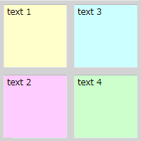
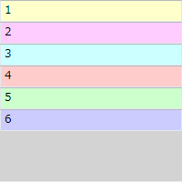
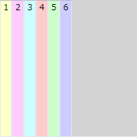
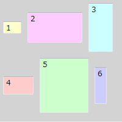
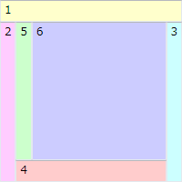
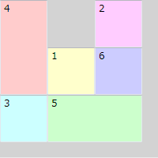

# WPF のコンテナ（WPF）

## <a id="sec-generated-title-1"></a> <a id="abst"></a>概要

WPF では、
コントロール（ボタンやテキストボックス）などの配置を容易にするために、
配置制御のためのコンテナがいくつか用意されています。


## <a id="sec-generated-title-2"></a> <a id="Canvas"></a>Canvas

まず、一番分かりやすいのは Canvas でしょうか。
Canvas では、
Canvas の左上からの相対座標を直接指定して子要素を配置します。

座標は、以下のように、Canvas.Left, Canvas.Top を使って指定します。


```xml
<Canvas
  xmlns="http://schemas.microsoft.com/winfx/2006/xaml/presentation"
  xmlns:x="http://schemas.microsoft.com/winfx/2006/xaml"
  Width="200" Height="200"
  Background="LightGray"
  >

  <TextBox
    Canvas.Left="5" Canvas.Top="5"
    Width="90" Height="90"
    Text="text 1" Background="#ffffcc"/>

  <TextBox
    Canvas.Left="5" Canvas.Top="105"
    Width="90" Height="90"
    Text="text 2" Background="#ffccff"/>

  <TextBox
    Canvas.Left="105" Canvas.Top="5"
    Width="90" Height="90"
    Text="text 3" Background="#ccffff"/>

  <TextBox
    Canvas.Left="105" Canvas.Top="105"
    Width="90" Height="90"
    Text="text 4" Background="#ccffcc"/>

</Canvas>
```
<figure>
	[](../../../../assets/media/ufcpp2000/dotnet/fig/wpf_canvas.png)
	<figcaption>Canvas の例</figcaption>
</figure>


## <a id="sec-generated-title-3"></a> <a id="StackPanel"></a>StackPanel

StackPanel による配置はいたってシンプルで、
上から順に、幅いっぱいに詰め込んでいくだけです。


```xml
<StackPanel
  xmlns="http://schemas.microsoft.com/winfx/2006/xaml/presentation"
  xmlns:x="http://schemas.microsoft.com/winfx/2006/xaml"
  Width="200" Height="200"
  Background="LightGray"
  >

  <TextBox Text="1" Background="#ffffcc"/>
  <TextBox Text="2" Background="#ffccff"/>
  <TextBox Text="3" Background="#ccffff"/>
  <TextBox Text="4" Background="#ffcccc"/>
  <TextBox Text="5" Background="#ccffcc"/>
  <TextBox Text="6" Background="#ccccff"/>

</StackPanel>
```
<figure>
	[](../../../../assets/media/ufcpp2000/dotnet/fig/wpf_stackpanel.png)
	<figcaption>StackPanel の例</figcaption>
</figure>


<code>Orientation="Horizontal"</code> という属性値を入れると、
左から右に並べることもできます。


```xml
<StackPanel
  xmlns="http://schemas.microsoft.com/winfx/2006/xaml/presentation"
  xmlns:x="http://schemas.microsoft.com/winfx/2006/xaml"
  Width="200" Height="200"
  Background="LightGray" Orientation="Horizontal"
  >

  <TextBox Text="1" Background="#ffffcc"/>
  <TextBox Text="2" Background="#ffccff"/>
  <TextBox Text="3" Background="#ccffff"/>
  <TextBox Text="4" Background="#ffcccc"/>
  <TextBox Text="5" Background="#ccffcc"/>
  <TextBox Text="6" Background="#ccccff"/>

</StackPanel>
```
<figure>
	[](../../../../assets/media/ufcpp2000/dotnet/fig/wpf_stackpanelh.png)
	<figcaption>StackPanel（左から右） の例</figcaption>
</figure>


## <a id="sec-generated-title-4"></a> <a id="WrapPanel"></a>WrapPanel

WrapPanel は、HTML みたいに、
左詰で子要素を配置していき、
右端で折り返します。
WrapPanel がリサイズされた場合、
折り返し位置が変化します。


```xml
<WrapPanel
  xmlns="http://schemas.microsoft.com/winfx/2006/xaml/presentation"
  xmlns:x="http://schemas.microsoft.com/winfx/2006/xaml"
  Width="200" Height="200"
  Background="LightGray" Orientation="Horizontal"
  >

  <TextBox Text="1" Background="#ffffcc"
    Width="30" Height="20" Margin="5"/>
  <TextBox Text="2" Background="#ffccff"
    Width="90" Height="50" Margin="5"/>
  <TextBox Text="3" Background="#ccffff"
    Width="40" Height="80" Margin="5"/>
  <TextBox Text="4" Background="#ffcccc"
    Width="50" Height="30" Margin="5"/>
  <TextBox Text="5" Background="#ccffcc"
    Width="80" Height="90" Margin="5"/>
  <TextBox Text="6" Background="#ccccff"
    Width="20" Height="60" Margin="5"/>

</WrapPanel>
```
<figure>
	[](../../../../assets/media/ufcpp2000/dotnet/fig/wpf_wrappanel.png)
	<figcaption>WrapPanel の例</figcaption>
</figure>


## <a id="sec-generated-title-5"></a> <a id="DockPanel"></a>DockPanel

DockPanel を使うと、
<code>Dock</code> 属性で指定した方向に子要素を貼り付けることができます。
例えば、<code>Dock="Top"</code> とすれば上側に張り付いて、左右いっぱいに表示されます。
DockPanel がリサイズされた場合、
<code>Dock</code> で指定した方向に張り付いたまま、子要素も自動的にリサイズされます。

例えば、左側にメニュー、
右上に広告欄、右下に本文を表示したりといったようなレイアウトにしたいときに使います。


```xml
<DockPanel
  xmlns="http://schemas.microsoft.com/winfx/2006/xaml/presentation"
  xmlns:x="http://schemas.microsoft.com/winfx/2006/xaml"
  Width="200" Height="200"
  Background="LightGray"
  >

  <TextBox Text="1" Background="#ffffcc" DockPanel.Dock="Top"/>
  <TextBox Text="2" Background="#ffccff" DockPanel.Dock="Left"/>
  <TextBox Text="3" Background="#ccffff" DockPanel.Dock="Right"/>
  <TextBox Text="4" Background="#ffcccc" DockPanel.Dock="Bottom"/>
  <TextBox Text="5" Background="#ccffcc" DockPanel.Dock="Left"/>
  <TextBox Text="6" Background="#ccccff" DockPanel.Dock="Right"/>

</DockPanel>
```
<figure>
	[](../../../../assets/media/ufcpp2000/dotnet/fig/wpf_dockpanel.png)
	<figcaption>DockPanel の例</figcaption>
</figure>


## <a id="sec-generated-title-6"></a> <a id="Grid"></a>Grid

Grid を使うと、
行の高さ、列の幅を指定して、
テーブル上に子要素を配置できます。

行や列の定義は <code>Grid.RowDefinitions</code>, <code>Grid.ColumnDefinitions</code> で行います。
どの子要素を何行何列目に置くかは、
<code>Grid.Row</code>, <code>Grid.Column</code> 属性で指定します（行、列の番号は 0 から始まる）。


```xml
<Grid
  xmlns="http://schemas.microsoft.com/winfx/2006/xaml/presentation"
  xmlns:x="http://schemas.microsoft.com/winfx/2006/xaml"
  Width="200" Height="200"
  Background="LightGray"
  >
  <Grid.ColumnDefinitions>
    <ColumnDefinition Width="60"/>
    <ColumnDefinition Width="60" />
    <ColumnDefinition Width="60" />
  </Grid.ColumnDefinitions>
  <Grid.RowDefinitions>
    <RowDefinition Height="60"/>
    <RowDefinition Height="60"/>
    <RowDefinition Height="60"/>
  </Grid.RowDefinitions>

  <TextBox Text="1" Background="#ffffcc"
    Grid.Row="1" Grid.Column="1"/>
  <TextBox Text="2" Background="#ffccff"
    Grid.Row="0" Grid.Column="2"/>
  <TextBox Text="3" Background="#ccffff"
    Grid.Row="2" Grid.Column="0"/>
  <TextBox Text="4" Background="#ffcccc"
    Grid.Row="0" Grid.Column="0" Grid.RowSpan="2"/>
  <TextBox Text="5" Background="#ccffcc"
    Grid.Row="2" Grid.Column="1" Grid.ColumnSpan="2"/>
  <TextBox Text="6" Background="#ccccff"
    Grid.Row="1" Grid.Column="2"/>

</Grid>
```
<figure>
	[](../../../../assets/media/ufcpp2000/dotnet/fig/wpf_grid.png)
	<figcaption>Grid の例</figcaption>
</figure>


## <a id="sec-generated-title-7"></a> <a id="other"></a>その他

UniformGrid や TabPanel、ToolbarPanel なんてのもあるみたい。
