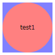
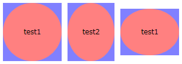
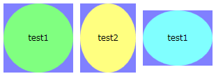
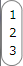
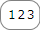
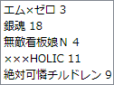
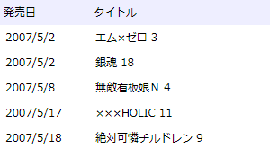

# テンプレート（WPF）

## <a id="sec-generated-title-1"></a> <a id="abst"></a>概要

「[スタイル](wpf_xamladv.md#style)」で説明したように、
WPF では、
HTML に対する CSS と同じ要領で UI 要素のスタイルを指定できます。

スタイルに加えて、
コントロール（ボタンやラベル、リストボックスなど）に対しては、
テンプレートと機能を使って、さらに柔軟なカスタマイズが可能です。
テンプレートを使えば、
背景色や文字サイズどころか、
コントロールの表示方法そのものを変更することが可能です。


## <a id="sec-generated-title-2"></a> <a id="ControlTemplate"></a>コントロールテンプレート

Contorl クラス（Button などの親クラス）は Template という名前のプロパティ（ControlTemplate 型）を持っています。
この Template プロパティを設定することで、コントロールの表示方法を変更することができます。

例えば、以下のように書くことで、ボタンの見た目を四角と丸に変化させることができます。


```xml
<WrapPanel
  xmlns="http://schemas.microsoft.com/winfx/2006/xaml/presentation"
  xmlns:x="http://schemas.microsoft.com/winfx/2006/xaml"
  >
  <Button Margin="5"
    Width="100" Height="100" Content="test1">
    <Button.Template>
      <ControlTemplate TargetType="Button">
        <Grid>
          <Rectangle Fill="#8080ff"/>
          <Ellipse Fill="#ff8080"/>
        </Grid>
      </ControlTemplate>
    </Button.Template>
  </Button>
</WrapPanel>
```
<figure>

[](../../../../assets/media/ufcpp2000/dotnet/fig/template01.png)

<figcaption>コントロールテンプレート</figcaption>
</figure>


このような機能を<strong id="ControlTemplate" class="keyword">コントロールテンプレート</strong>（ControlTemplate）といいます。

Button や Label など、
多くのコントロールは中身（Content）を持っています。
上の例では、ボタンの中身である "test1" が表示されていません。
これを表示させるためには、ControlTemplate 中に、ContentPresenter というものを書き加えます。


```xml
<WrapPanel
  xmlns="http://schemas.microsoft.com/winfx/2006/xaml/presentation"
  xmlns:x="http://schemas.microsoft.com/winfx/2006/xaml"
  >
  <Button Margin="5"
    Width="100" Height="100" Content="test1">
    <Button.Template>
      <ControlTemplate TargetType="Button">
        <Grid>
          <Rectangle Fill="#8080ff"/>
          <Ellipse Fill="#ff8080"/>
          <ContentPresenter HorizontalAlignment="Center"
                            VerticalAlignment="Center"/>
        </Grid>
      </ControlTemplate>
    </Button.Template>
  </Button>

</WrapPanel>
```
<figure>

[](../../../../assets/media/ufcpp2000/dotnet/fig/template02.png)

<figcaption>ContentPresenter</figcaption>
</figure>


ControlTemplate は、リソース中に 書くこともできます。


```xml
<WrapPanel
  xmlns="http://schemas.microsoft.com/winfx/2006/xaml/presentation"
  xmlns:x="http://schemas.microsoft.com/winfx/2006/xaml"
  >
  <WrapPanel.Resources>
    <ControlTemplate x:Key="buttonTemplate" TargetType="Button">
      <Grid>
        <Rectangle Fill="#8080ff"/>
        <Ellipse Fill="#ff8080"/>
        <ContentPresenter HorizontalAlignment="Center"
                          VerticalAlignment="Center"/>
      </Grid>
    </ControlTemplate>
  </WrapPanel.Resources>

  <Button Margin="5"
    Width="100" Height="100" Content="test1"
    Template="{StaticResource buttonTemplate}"/>
</WrapPanel>
```
全てのボタンに対して一律テンプレートを適用したければ、スタイルと併用します。


```xml
<WrapPanel
  xmlns="http://schemas.microsoft.com/winfx/2006/xaml/presentation"
  xmlns:x="http://schemas.microsoft.com/winfx/2006/xaml"
  >
  <WrapPanel.Resources>
    <ControlTemplate x:Key="buttonTemplate" TargetType="Button">
      <Grid>
        <Rectangle Fill="#8080ff"/>
        <Ellipse Fill="#ff8080"/>
        <ContentPresenter HorizontalAlignment="Center"
                          VerticalAlignment="Center"/>
      </Grid>
    </ControlTemplate>
    <Style TargetType="{x:Type Button}">
      <Setter Property="Template" Value="{StaticResource buttonTemplate}"/>
    </Style>
  </WrapPanel.Resources>

  <Button Margin="5"
    Width="100" Height="100" Content="test1"/>
  <Button Margin="5"
    Width="80" Height="100" Content="test2"/>
  <Button Margin="5"
    Width="100" Height="80" Content="test1"/>
</WrapPanel>
```
<figure>

[](../../../../assets/media/ufcpp2000/dotnet/fig/template03.png)

<figcaption>全てのボタンにテンプレートを適用</figcaption>
</figure>


また、テンプレートの適用先のプロパティ値をテンプレートに反映させるためには、
TemplateBinding マークアップ拡張を用います。


```xml
<WrapPanel
  xmlns="http://schemas.microsoft.com/winfx/2006/xaml/presentation"
  xmlns:x="http://schemas.microsoft.com/winfx/2006/xaml"
  >
  <WrapPanel.Resources>
    <ControlTemplate x:Key="buttonTemplate" TargetType="Button">
      <Grid>
        <Rectangle Fill="#8080ff"/>
        <Ellipse Fill="{TemplateBinding Background}"/>
        <ContentPresenter HorizontalAlignment="Center"
                          VerticalAlignment="Center"/>
      </Grid>
    </ControlTemplate>
    <Style TargetType="{x:Type Button}">
      <Setter Property="Template" Value="{StaticResource buttonTemplate}"/>
    </Style>
  </WrapPanel.Resources>

  <Button Margin="5" Background="#80ff80"
    Width="100" Height="100" Content="test1"/>
  <Button Margin="5" Background="#ffff80"
    Width="80" Height="100" Content="test2"/>
  <Button Margin="5" Background="#80ffff"
    Width="100" Height="80" Content="test1"/>
</WrapPanel>
```
<figure>

[](../../../../assets/media/ufcpp2000/dotnet/fig/template04.png)

<figcaption>TemplateBinding マークアップ拡張</figcaption>
</figure>


サンプル→

[VistaLikeButton.xaml](../../../../assets/media/ufcpp2000/dotnet/sample/VistaLikeButton.xaml)
。
Windows Vista ライクなボタンの見た目にする。
XP で実行しても Vista っぽい見た目になるはず。


## <a id="sec-generated-title-3"></a> <a id="ItemsPanelTemplate"></a>アイテムコントロールのテンプレート

中身（Content）のないコントロールか、
中身が1つだけのコントロール（ContentControl）に加えて、
ListBox や ComboBox のように、複数の項目を一覧表示するためのコントロール（ItemsControl）もあります。

本題は次節の「[データテンプレート](#DataTemplate)」なんですが、
ItemsControl には、「[コントロールテンプレート](#ControlTemplate)」中で ContentPresenter の代わりに ItemsPresenter を使わないといけないというような違いがある他、
ItemsPanelTemplate というテンプレート機構もあるので、
先に軽く説明しておきます。

まず、最初に挙げたように、
ItemsControl の場合、ControlTemplate 中には ContentPresenter ではなく、
ItemsPresenter を記述します。
例えば、角を丸めた ListBox を作りたければ以下のようにします。


```xml
<WrapPanel
  xmlns="http://schemas.microsoft.com/winfx/2006/xaml/presentation"
  xmlns:x="http://schemas.microsoft.com/winfx/2006/xaml"
  >
  <ListBox>
    <ListBox.Template>
      <ControlTemplate TargetType="{x:Type ListBox}">
        <Border CornerRadius="10" BorderBrush="#808080" BorderThickness="1">
          <ItemsPresenter Margin="5"/>
        </Border>
      </ControlTemplate>
    </ListBox.Template>
    <ListBoxItem>1</ListBoxItem>
    <ListBoxItem>2</ListBoxItem>
    <ListBoxItem>3</ListBoxItem>
  </ListBox>
</WrapPanel>
```
<figure>

[](../../../../assets/media/ufcpp2000/dotnet/fig/template05.png)

<figcaption>ItemsPresenter</figcaption>
</figure>


で、この ItemsPresenter の中身そのものの表示方法を変えたければ、
ItemsPanel プロパティ（ItemsPanelTemplate 型）を設定します。
例えば、ListBox の項目を、水平に並べたければ以下のようにします。


```xml
<WrapPanel
  xmlns="http://schemas.microsoft.com/winfx/2006/xaml/presentation"
  xmlns:x="http://schemas.microsoft.com/winfx/2006/xaml"
  >
  <ListBox>
    <ListBox.Template>
      <ControlTemplate TargetType="{x:Type ListBox}">
        <Border CornerRadius="10" BorderBrush="#808080" BorderThickness="1">
          <ItemsPresenter Margin="5"/>
        </Border>
      </ControlTemplate>
    </ListBox.Template>
    <ListBox.ItemsPanel>
      <ItemsPanelTemplate>
        <StackPanel Orientation="Horizontal"/>
      </ItemsPanelTemplate>
    </ListBox.ItemsPanel>
    <ListBoxItem>1</ListBoxItem>
    <ListBoxItem>2</ListBoxItem>
    <ListBoxItem>3</ListBoxItem>
  </ListBox>
</WrapPanel>
```
<figure>

[](../../../../assets/media/ufcpp2000/dotnet/fig/template06.png)

<figcaption>ItemsPanel</figcaption>
</figure>


## <a id="sec-generated-title-4"></a> <a id="DataTemplate"></a>データテンプレート

ListBox などの ItemsControl の類のクラスは、
ListBoxItem などを使ってアイテムを表示する方法の他に、
データバインディング機能を使って XML や データベース中のデータを一覧表示する機能も持っています。

ListBoxItem を使う場合、
各項目のテンプレートは、ListBoxItem の Template プロパティに ControlTemplate を指定すればできます。
一方で、データバインディングを使う場合には、
<strong id="DataTemplate" class="keyword">データテンプレート</strong>（DataTemplate）というものを使います。

まずは復習ですが、
ListBox では、
ItemsSource プロパティに XmlDataProvider を指定することで、
XML からデータを読み込んで一覧表示することができます。


```xml
<WrapPanel
  xmlns="http://schemas.microsoft.com/winfx/2006/xaml/presentation"
  xmlns:x="http://schemas.microsoft.com/winfx/2006/xaml"
  >
  <WrapPanel.Resources>
    <XmlDataProvider x:Key="comics">
      <x:XData>
        <comics xmlns="">
          <item date="2007/5/2">エム×ゼロ 3</item>
          <item date="2007/5/2">銀魂 18</item>
          <item date="2007/5/8">無敵看板娘Ｎ 4</item>
          <item date="2007/5/17">×××HOLIC 11</item>
          <item date="2007/5/18">絶対可憐チルドレン 9</item>
        </comics>
      </x:XData>
    </XmlDataProvider>
  </WrapPanel.Resources>

  <ListBox
    ItemsSource="{Binding Source={StaticResource comics},
      XPath=/comics/item}">
  </ListBox>
</WrapPanel>
```
<figure>

[](../../../../assets/media/ufcpp2000/dotnet/fig/template07.png)

<figcaption>XML データを ListBox 中に一覧表示</figcaption>
</figure>


ここで、
XML の各項目に対してテンプレートを適用したければ、
以下のように、ItemTemplate プロパティに DataTemplate を設定します。


```xml
<WrapPanel
  xmlns="http://schemas.microsoft.com/winfx/2006/xaml/presentation"
  xmlns:x="http://schemas.microsoft.com/winfx/2006/xaml"
  >
  <WrapPanel.Resources>
    <XmlDataProvider x:Key="comics">
      <x:XData>
        <comics xmlns="">
          <item date="2007/5/2">エム×ゼロ 3</item>
          <item date="2007/5/2">銀魂 18</item>
          <item date="2007/5/8">無敵看板娘Ｎ 4</item>
          <item date="2007/5/17">×××HOLIC 11</item>
          <item date="2007/5/18">絶対可憐チルドレン 9</item>
        </comics>
      </x:XData>
    </XmlDataProvider>
  </WrapPanel.Resources>

  <ListBox
    ItemsSource="{Binding Source={StaticResource comics},
      XPath=/comics/item}">
    <ListBox.ItemTemplate>
      <DataTemplate>
        <StackPanel Orientation="Horizontal">
          <Label Width="100" Content="{Binding XPath=@date}"/>
          <Label Width="200" Content="{Binding XPath=text()}"/>
        </StackPanel>
      </DataTemplate>
    </ListBox.ItemTemplate>
    <ListBox.Template>
      <ControlTemplate TargetType="{x:Type ListBox}">
        <StackPanel>
          <StackPanel  Orientation="Horizontal" Background="#eeeeff">
            <Label Width="100" Content="発売日"/>
            <Label Width="200" Content="タイトル"/>
          </StackPanel>
          <ItemsPresenter/>
        </StackPanel>
      </ControlTemplate>
    </ListBox.Template>
  </ListBox>
</WrapPanel>
```
<figure>

[](../../../../assets/media/ufcpp2000/dotnet/fig/template08.png)

<figcaption>XML データを ListBox 中に一覧表示</figcaption>
</figure>


見ての通り、
DataTemplate 中で XML 中の何を表示するかは、
Binding マークアップ拡張の XPath 属性を使って指定します。
