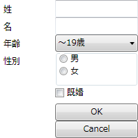
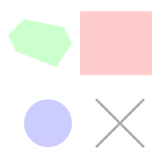
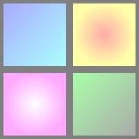
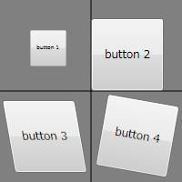
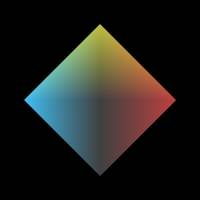

# WPF の GUI 要素（WPF）

## <a id="sec-generated-title-1"></a> <a id="abst"></a>概要

WPF で最初から用意されている GUI 要素や機能は膨大で、とても全部を紹介することはできませんが、
代表的なものをいくつか紹介します。


## <a id="sec-generated-title-2"></a> <a id="Controls"></a>コントロール

System.Windows.Controls 名前空間内に、
ボタン、テキストボックス、チェックボックス、ラジオボタンなど、
ユーザからの入力操作を受け付けるためのコントロール類が定義されています。


```xml {title="コントロールの例"}
<Grid
  xmlns="http://schemas.microsoft.com/winfx/2006/xaml/presentation"
  xmlns:x="http://schemas.microsoft.com/winfx/2006/xaml"
  Width="200" Height="200">

  <Grid.RowDefinitions>
    <RowDefinition Height="25" />
    <RowDefinition Height="25" />
    <RowDefinition Height="25" />
    <RowDefinition Height="50" />
    <RowDefinition Height="25" />
    <RowDefinition Height="25" />
    <RowDefinition Height="25" />
  </Grid.RowDefinitions>
  <Grid.ColumnDefinitions>
    <ColumnDefinition Width="80" />
    <ColumnDefinition Width="120" />
  </Grid.ColumnDefinitions>

  <Label Grid.Row="0" Grid.Column="0">姓</Label>
  <TextBox Grid.Row="0" Grid.Column="1"></TextBox>

  <Label Grid.Row="1" Grid.Column="0">名</Label>
  <TextBox Grid.Row="1" Grid.Column="1"></TextBox>

  <Label Grid.Row="2" Grid.Column="0">年齢</Label>
  <ComboBox Grid.Row="2" Grid.Column="1" SelectedIndex="0">
    <ComboBoxItem >～19歳</ComboBoxItem>
    <ComboBoxItem>20代</ComboBoxItem>
    <ComboBoxItem>30代</ComboBoxItem>
    <ComboBoxItem>40代</ComboBoxItem>
    <ComboBoxItem>それ以上</ComboBoxItem>
  </ComboBox>

  <Label Grid.Row="3" Grid.Column="0">性別</Label>
  <GroupBox Grid.Row="3" Grid.Column="1">
    <StackPanel>
      <RadioButton Height="18">男</RadioButton>
      <RadioButton Height="18">女</RadioButton>
    </StackPanel>
  </GroupBox>

  <CheckBox Grid.Row="4" Grid.Column="1">既婚</CheckBox>

  <Button Grid.Row="5" Grid.Column="1">OK</Button>
  <Button Grid.Row="6" Grid.Column="1">Cancel</Button>
</Grid>
```
<figure>

[](../../../../assets/media/ufcpp2000/dotnet/fig/ui_controls.png)

<figcaption>コントロールの例</figcaption>
</figure>


## <a id="sec-generated-title-3"></a> <a id="Shapes"></a>図形

System.Windows.Shapes 名前空間内に、
直線、円、多角形などの図形が定義されています。
これらの図形はベクタグラフィックになっていて、
拡大・縮小してもふちがギザギザになったりしません。


```xml {title="図形の例"}
<Canvas
  xmlns="http://schemas.microsoft.com/winfx/2006/xaml/presentation"
  xmlns:x="http://schemas.microsoft.com/winfx/2006/xaml"
  Width="200" Height="200">

  <Rectangle Canvas.Left="100" Canvas.Top="10"
    Width="90" Height="80" Fill="#ffcccc"/>

  <Ellipse Canvas.Left="30" Canvas.Top="120"
    Width="60" Height="60" Fill="#ccccff"/>
    
  <Polygon Canvas.Left="10" Canvas.Top="10"
    Points="20 10 70 20 80 40 60 70 10 50 0 30"
    Fill="#ccffcc"
  />

  <Line Stroke="#aaaaaa" StrokeThickness="3"
    X1="120" Y1="120" X2="180" Y2="180"/>
  <Line Stroke="#aaaaaa" StrokeThickness="3"
    X1="180" Y1="120" X2="120" Y2="180"/>

</Canvas>
```
<figure>

[](../../../../assets/media/ufcpp2000/dotnet/fig/ui_shapes.png)

<figcaption>図形の例</figcaption>
</figure>


## <a id="sec-generated-title-4"></a> <a id="Media"></a>メディア

System.Windows.Media 名前空間内には多彩な機能が用意されています。

まず、
コントロールや図形の背景にグラデーションをかけたり画像を表示したり、
回転・拡大・平行移動などの変形を施す機能があります。

また、System.Windows.Shapes で定義されている基本的な図形に加えて、
ベジエ曲線等を用いた複雑な図形の描写機能があります。

さらに、静止画、音声、動画などを再生・表示する機能があります。


```xml {title="グラデーションの例"}
<Canvas
  xmlns="http://schemas.microsoft.com/winfx/2006/xaml/presentation"
  xmlns:x="http://schemas.microsoft.com/winfx/2006/xaml"
  Width="200" Height="200" Background="#808080">

  <Rectangle Canvas.Left="5" Canvas.Top="5" Width="90" Height="90">
    <Rectangle.Fill>
      <LinearGradientBrush>
        <GradientStop Color="#aaaaff" Offset="0" />
        <GradientStop Color="#aaffff" Offset="1" />
      </LinearGradientBrush>
    </Rectangle.Fill>
  </Rectangle>

  <Rectangle Canvas.Left="105" Canvas.Top="5" Width="90" Height="90">
    <Rectangle.Fill>
      <RadialGradientBrush>
        <GradientStop Color="#ffaaaa" Offset="0" />
        <GradientStop Color="#ffffaa" Offset="1" />
      </RadialGradientBrush>
    </Rectangle.Fill>
  </Rectangle>

  <Rectangle Canvas.Left="5" Canvas.Top="105" Width="90" Height="90">
    <Rectangle.Fill>
      <RadialGradientBrush>
        <GradientStop Color="#ffffff" Offset="0" />
        <GradientStop Color="#ffaaff" Offset="1" />
      </RadialGradientBrush>
    </Rectangle.Fill>
  </Rectangle>

  <Rectangle Canvas.Left="105" Canvas.Top="105" Width="90" Height="90">
    <Rectangle.Fill>
      <LinearGradientBrush>
        <GradientStop Color="#aaffaa" Offset="0" />
        <GradientStop Color="#aaaaaa" Offset="1" />
      </LinearGradientBrush>
    </Rectangle.Fill>
  </Rectangle>

</Canvas>
```
<figure>

[](../../../../assets/media/ufcpp2000/dotnet/fig/ui_gradation.jpg)

<figcaption>グラデーションの例</figcaption>
</figure>


```xml {title="回転・拡大・傾斜・平行移動の例"}
<Canvas
  xmlns="http://schemas.microsoft.com/winfx/2006/xaml/presentation"
  xmlns:x="http://schemas.microsoft.com/winfx/2006/xaml"
  Width="200" Height="200" Background="#808080">

  <Line X1="100" Y1="0" X2="100" Y2="200" Stroke="Black"/>
  <Line X1="0" Y1="100" X2="200" Y2="100" Stroke="Black"/>

  <Button Canvas.Left="10" Canvas.Top="10" Width="80" Height="80">
    <Button.RenderTransform>
      <ScaleTransform CenterX="45" CenterY="45" ScaleX="0.5" ScaleY="0.5"/>
    </Button.RenderTransform>
    button 1
  </Button>

  <Button Canvas.Left="110" Canvas.Top="10" Width="80" Height="80">
    <Button.RenderTransform>
      <TranslateTransform X="-10" Y="10"/>
    </Button.RenderTransform>
    button 2
  </Button>

  <Button Canvas.Left="10" Canvas.Top="110" Width="80" Height="80">
    <Button.RenderTransform>
      <SkewTransform CenterX="45" CenterY="45" AngleX="10"/>
    </Button.RenderTransform>
    button 3
  </Button>

  <Button Canvas.Left="110" Canvas.Top="110" Width="80" Height="80">
    <Button.RenderTransform>
      <RotateTransform CenterX="45" CenterY="45" Angle="10"/>
    </Button.RenderTransform>
    button 4
  </Button>

</Canvas>
```
<figure>

[](../../../../assets/media/ufcpp2000/dotnet/fig/ui_transform.jpg)

<figcaption>回転・拡大・傾斜・平行移動の例</figcaption>
</figure>


### <a id="sec-generated-title-5"></a> <a id="Media3D"></a>3次元モデル

特に、
System.Windows.Media.Media3D 名前空間内には、
3次元モデルの表示機能があります。

カメラの向きを設定して、
光源を置いて、
3次元モデルを置く感じで、割と簡単に作れます。

3次元モデルの作り方は、
いわゆるメッシュ（多面体の頂点と、頂点のつなぎ方を指定して物体を作る）構造がメインのようです。
（以下の例では、頂点の座標を全部 XAML 中に打っていますが、
3次元モデル生成アプリで作ったデータを読んだりもできるようです。）

以下の例では、
正8面体を作って、3方向から指向性の光を当てています。
（本当は手抜きしてて、8面体の表から見える側だけ作ってる。）


```xml {title="3次元モデル表示の例"}
<Canvas
  xmlns="http://schemas.microsoft.com/winfx/2006/xaml/presentation"
  xmlns:x="http://schemas.microsoft.com/winfx/2006/xaml"
  Width="200" Height="200" Background="Black">

  <Viewport3D Width="200" Height="200">
    <!-- カメラ -->
    <Viewport3D.Camera>
      <PerspectiveCamera Position="0,0,15" FieldOfView="10"
        LookDirection="0,0,-1" UpDirection="0, 1, 0"/>
    </Viewport3D.Camera>

    <!-- 物体 -->
    <ModelVisual3D>
      <ModelVisual3D.Content>
        <GeometryModel3D>
          <GeometryModel3D.Geometry>
            <MeshGeometry3D
              Positions="1 0 0, 0 1 0, -1 0 0, 0 -1 0, 0 0 1"
              TriangleIndices="0 1 4, 1 2 4, 2 3 4, 3 0 4"
              />
          </GeometryModel3D.Geometry>
          <GeometryModel3D.Material>
            <DiffuseMaterial>
              <DiffuseMaterial.Brush>
                <SolidColorBrush Color="White"/>
              </DiffuseMaterial.Brush>
            </DiffuseMaterial>
          </GeometryModel3D.Material>
        </GeometryModel3D>
      </ModelVisual3D.Content>
    </ModelVisual3D>

    <!-- 光源 -->
    <ModelVisual3D>
      <ModelVisual3D.Content>
        <Model3DGroup>
          <AmbientLight Color="#404040" />
          <DirectionalLight Color="#ff0000" Direction="-1,-1,0" />
          <DirectionalLight Color="#0000ff" Direction="1,0,0" />
          <DirectionalLight Color="#00ff00" Direction="1,-1,0" />
        </Model3DGroup>
      </ModelVisual3D.Content>
    </ModelVisual3D>
  </Viewport3D>

</Canvas>
```
<figure>

[](../../../../assets/media/ufcpp2000/dotnet/fig/ui_viewport3d.jpg)

<figcaption>3次元モデル表示の例</figcaption>
</figure>


その他のサンプル →

[viewport3d.xaml](../../../../assets/media/ufcpp2000/dotnet/sample/viewport3d.xaml)
。
正8面体を6個置いて、カメラを回して写しています。
