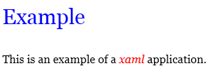

# XAML 概要（WPF）

## <a id="sec-generated-title-1"></a> <a id="abst"></a>概要

「[Windows Presentation Foundation](wpf_abst.md#wpf)」 では、
これまでと同様の C# コードベースの GUI 構築もできますが、
それと同時に、
XAML と呼ばれるマークアップ言語による GUI 構築手段を提供しています。

<strong id="xaml" class="keyword">XAML</strong>（eXtensible Application Markup Language、発音的には zamel と読んでくれとのこと）は、
GUI アプリケーションを記述するための XML フォーマットです。
例えば、以下のように記述します。


```xml
<Page
  xmlns="http://schemas.microsoft.com/winfx/2006/xaml/presentation"
  xmlns:x="http://schemas.microsoft.com/winfx/2006/xaml"
  Background="White"
  >

  <FlowDocument>

  <Paragraph FontSize="30" Foreground="Blue">
  Example
  </Paragraph>

  <Paragraph>
  This is an example of
  a <Span FontStyle="Italic" Foreground="Red">xaml</Span>
  application.
  </Paragraph>

  </FlowDocument>
</Page>
```
Page タグから始まる XAML ファイルは、ブラウザ中で実行する事ができます。
.NET Framework 3.0 をインストールした状態で、
上記の内容を、拡張子 .xaml を付けたファイルに書き込み、
ダブルクリックすると、ブラウザ中に以下のような内容が表示されます。

<figure>
	[](../../../../assets/media/ufcpp2000/dotnet/fig/xaml0.png)
	<figcaption>XAML の実行例</figcaption>
</figure>


### <a id="sec-generated-title-2"></a> <a id="encoding"></a>文字コードに関して

XAML 中に日本語を使いたければ [UTF-8](http://ja.wikipedia.org/wiki/UTF-8) でないと駄目っぽいです。


## <a id="sec-generated-title-3"></a> <a id="merit"></a>利点

XAML の利点は大きく分けて2つあります。
1つは、GUI 開発とマークアップ言語（XML）の親和性の高さで、
もう1つは、インターフェースとロジックの分離です。


##### <a id="sec-generated-title-4"></a>XML による GUI 開発

1つ目の、XML であることによる利点ですが、
これはまあ、実例を挙げてみれば分かりやすいんで、
例として、パネルの中に2つのテキストボックスを表示することを考えて見ましょう。
C# 中に直接 GUI 部品構築のコードを記述する場合、
以下のようになります。

```csharp
WrapPanel panel = new WrapPanel();

TextBox textbox1 = new TextBox();
textbox1.Width = 100;
textbox1.FontSize = 30;
textbox1.Background = Colors.White;
textbox1.Foreground = Colors.Blue;
textbox1.Text = "text 1";

panel.Children.Add(textbox1);

TextBox textbox2 = new TextBox();
textbox2.Width = 100;
textbox2.FontSize = 30;
textbox2.Background = Colors.White;
textbox2.Foreground = Colors.Green;
textbox2.Text = "text 2";

panel.Children.Add(textbox2);
```


これで何が面倒かと言うと、
「パネルの中に2つのテキストボックスがある」という階層構造が分かりにくいことにあります。
まだこの程度の例なら簡単なもんなんですが、
「パネルの中に、グループがいくつかあって、
あるグループにはテキストボックスが xx 個、
またあるグループにはチェックボックスとラジオボタンがいくつか・・・」
とか、だんだん複雑になるにつれ、
プログラミング言語中に直接 GUI 開発コードを埋め込むのが大変になってきます。

これが、XAML を使うとどうなるかというと、
以下のように変わります。


```xml
<Page
  xmlns="http://schemas.microsoft.com/winfx/2006/xaml/presentation"
  xmlns:x="http://schemas.microsoft.com/winfx/2006/xaml"
  Background="White"
  >

  <WrapPanel>
    <TextBox 
      Width = "100" FontSize = "30" Text = "text 1"
      Background = "White" Foreground = "Blue" />
    <TextBox 
      Width = "100" FontSize = "30" Text = "text 2"
      Background = "White" Foreground = "Green" />
  </WrapPanel>
</Page>
```
まあ、XML は元々階層的に記述するものなので、
当たり前なんですが、
非常に階層構造が分かりやすくなります。


##### <a id="sec-generated-title-5"></a>インターフェースとロジックの分離

もう1つの、インターフェースとロジックの分離という奴に関しては、
インターフェースってのは、ボタンとかテキストボックスなどのユーザが直接触れる部分で、
ロジックってのは、実際に処理を行う部分のことです。

インターフェースとロジックは、
切り離して考えるべきです。
というのも、同じ処理をしたい場合（同じロジックを持っている場合）でも、
利用者や利用状況が変わると、使いやすいインターフェースも変わってきます。
同じ処理を、
マウスを使ってボタンなどをぽちぽち操作したい場合もあれば、
コマンドラインからスクリプトを使って一斉操作したい場合もあります。
さらに、ブラウザを使ってウェブ越しに操作したい場合もあれば、
Windows アプリをローカルで実行したい場合もあります。

また、インターフェースの設計に必要なスキルと、
ロジックの設計に必要なスキルは異なっていたりもします。
ロジックは、純粋に処理性能が高かったり、
プログラムの可読性がよかったりすればいいわけですが、
インターフェース部分では、ユーザの使いやすさを意識したり、
あるいは、見た目のよさ、芸術的な美しさなんかが求められたりもします。

「[Windows Presentation Foundation](wpf_abst.md#wpf)」 では、
ロジック部分（ボタンが押されたときの実際の処理内容など）は C# などのプログラミング言語で記述し、
インターフェース部分（ボタンなどを画面上のどこに配置するか）は XAML で記述するということが可能です。
すなわち、ロジック部分はプログラミングの得意な人に設計してもらう一方で、
インターフェース部分は美的センスのある人に（直感的に分かりやすい XAML を使って）設計してもらうということも可能です。


## <a id="sec-generated-title-6"></a> <a id="loose"></a>Loose XAML

XAML 中には、C# などのプログラミング言語のコードを埋め込むこともできるのですが、
この場合には、次節で説明するようなコンパイル作業が必要になります。
対して、プログラムコードを含まず、
XAML 単体で完結している場合、
.xaml という拡張子をつけたファイルをダブルクリックするだけで、
ブラウザ中に XAML で記述した GUI を表示することができます。
このような、ブラウザ中で（インタープリット方式で）表示する、
コンパイルしていない状態の XAML ファイルを <strong id="loose" class="keyword">Loose XAML</strong> と呼びます。

例えば、以下の XAML は、コードを含みませんので、
拡張子に .xaml を付けた適当な名前のファイルに保存して、
（.NET Framework 3.0 の実行環境がインストールされた状態で）ダブルクリックすれば、
ブラウザ中に GUI が表示されるはずです。


```xml
<Page
  xmlns="http://schemas.microsoft.com/winfx/2006/xaml/presentation"
  xmlns:x="http://schemas.microsoft.com/winfx/2006/xaml"
  Background="White"
  >

  <WrapPanel>
    <TextBox 
      Width = "100" FontSize = "30" Text = "text 1"
      Background = "White" Foreground = "Blue" />
    <TextBox 
      Width = "100" FontSize = "30" Text = "text 2"
      Background = "White" Foreground = "Green" />
  </WrapPanel>
</Page>
```

## <a id="sec-generated-title-7"></a> <a id="compile"></a>XAML のコンパイル

XAML にプログラムコードを埋め込む場合、
MSBuild を用いてコンパイルする必要があります。

MSBuild は、.NET Framework 付属のビルドツールで、
以下の例のような XML 形式で書かれた設定を読み込んで、
適切なコンパイラを呼び出し、アプリケーションをビルドしてくれます。


```xml
<Project xmlns="http://schemas.microsoft.com/developer/msbuild/2003" >
  <PropertyGroup>
    <AssemblyName>XamlApplication</AssemblyName>
    <OutputType>winexe</OutputType>
  </PropertyGroup>
  <ItemGroup>
    <Reference Include="System" />
    <Reference Include="WindowsBase" />
    <Reference Include="PresentationCore" />
    <Reference Include="PresentationFramework" />
  </ItemGroup>
  <ItemGroup>
    <ApplicationDefinition Include="App.xaml" />
    <Compile Include="App.xaml.cs" />
    <Page Include="MainWindow.xaml" />
    <Compile Include="MainWindow.xaml.cs"/>
  </ItemGroup>
  <Import Project="$(MSBuildBinPath)\Microsoft.CSharp.targets" />
  <Import Project="$(MSBuildBinPath)\Microsoft.WinFX.targets" />
</Project>
```
詳しくは、MSBuild のヘルプを見てもらうとして、
ポイントだけ。
XAML を含む WPF アプリケーションのビルドは、
&lt;Page&gt; タグに XAML ファイルを、
&lt;Reference&gt; に PresentationCore と PresentationFramework、
&lt;Import Project&gt; に $(MSBuildBinPath)\Microsoft.WinFX.targets を指定すれば OK です。

とりあえず、MSBuild でビルド可能な最小限の例として、
「[XAML 雛形](../appendix/sample.md#xaml)」に、
ボタンを押したらメッセージボックスが表示されるだけの簡単なプログラムを用意しました。

ちなみに、MSBuild のおいてあるパスは、
\Windows\Microsoft.NET\Framework\v2.0.50727
（最後の v2.0.50727 の部分は .NET Framework のバージョンによって異なる場合あり）
です。
