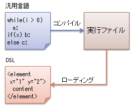
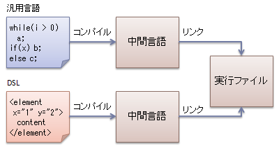
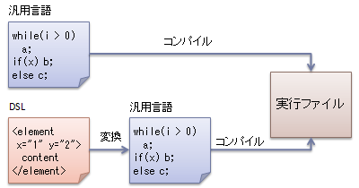
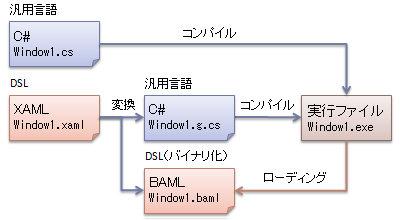
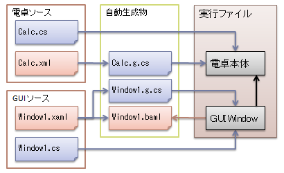

# DSL へのアプローチ（外部言語）

## <a id="sec-generated-title-1"></a> <a id="abst"></a>概要

前節では、「DSL を作ってから、それを使って開発」というのがはやりつつありますが、
言語作りといってもそれほど大げさな話ではないというような話をしました。
また、DSL のアプローチとして、
「ちょっと凝った設定ファイル」とか「ちょっと凝ったライブラリ」というような流れがあるということも話しました。
 
このページでは、「ちょっと凝った設定ファイル」の方、
すなわち、外部言語的なアプローチを、
具体例を挙げて紹介します。


## <a id="sec-generated-title-2"></a> <a id="outer"></a>外部言語

ユーザが自由に変えれる設定や、
ユーザには触らせないにしてもプログラム完成後にこまごまと調整したい部分は、
たいていは、設定ファイルとしてプログラムから分離します。
 
その設定ファイルですが、
単に値を記録しておくとかだけではなく、
条件分岐やらなんやら、凝ったことがしたい場合が時々あって、
そうなってくると、徐々に1つのプログラミング言語的なものになってきます。
ある意味、新しい言語を作ってから、
その新言語でプログラミングしているようなものです。
なんでわざわざ新言語を作ることになってしまうかというと、
「設定を記録する」という用途にしぼって考えると、
汎用プログラミング言語の構文に従うよりも書きやすい構文ってのがあるから。
 
このように、用途を絞ること（ドメイン特化）で書きやすい構文を作ろうというのがドメイン特化言語（DSL）の考え方。
 
で、設定ファイルの1つの理想は、1度作ったプログラムは後はもう変えない、
以後は設定ファイルの方をいじるだけでプログラムのカスタマイズがかなり効く、
というような使い方です。
 
DSL を設定ファイルの延長と考えた場合、
DSL の場合でもこれと同じような使い方が考えられます。
最初に DSL を作って、
その後は DSL だけで開発する方法。
 
対して、プログラム自体も、設定ファイルも変えつつ開発というのも考えられます。
DSL で考えると、
汎用言語で書いてる部分の修正もしつつ、
DSL で書いてる部分も修正。
汎用言語 ＋ DSL の混在開発になります。
 
（時には、DSL の言語仕様自体も変えつつ、
DSL 記述も修正しつつ、
汎用言語で書いている部分も修正しつつ）・・・、
というような開発パターンも考えられます。）
 
このような、
汎用言語と DSL の言語混在開発というアプローチは今後増えていきそうな雰囲気です。
特に、
「[スクリプト言語](../../powershell/intro/scriptlang.md#script)」では「[メタプログラミング](dslapproachi.md#meta_prog)」的アプローチが結構はやっているのに対して、
「[システムプログラミング言語](../../powershell/intro/scriptlang.md#system)」では、
汎用言語 ＋ DSL の混在開発が好まれる傾向があります。


## <a id="sec-generated-title-3"></a> <a id="method"></a>方式

汎用言語＋DSL の混在開発のやり方にはいくつかの方式が考えられます。


##### <a id="sec-generated-title-4"></a>動的ローディング

まずは、DSL を「ちょっと凝ったことのできる設定ファイル」と考えたとき、
一番素直に思いつく方式。
図1のように、実行ファイルから DSL を動的にローディングして使います。

<figure>

[](../../../../assets/media/ufcpp2000/dsl/fig/mixed01.png)

<figcaption>動的ローディング</figcaption>
</figure>


ASP.NET の .aspx ファイルなんかはこんな風に動的にローディングして使っているはず。
あと、最近はやってるらしい DI（Dependency Injection）も、
「ファクトリパターンのすごい版を外部設定ファイルを使ってやろう」という感じなので、
このアプローチに近い気が。
 
動的にローディングするためには、当然、ローダーを書かなきゃいけないんで、
手間的にはコンパイラを作るのとそれほど変わらなかったり。
普通は、特別なパーサが必要になるような DSL は作らず、
XML のような標準的なライブラリで読める構文を利用します。


##### <a id="sec-generated-title-5"></a>コンパイラ作成

次は、ほんとに DSL のコンパイラを作っちゃう場合。
せっかく .NET Framework や Java VM みたいなインフラがあるんだから、
それの IL（中間言語）をはいてやって、
汎用言語のコンパイル結果とリンクさせて1つの実行ファイルを作る。
図2みたいな感じ。

<figure>

[](../../../../assets/media/ufcpp2000/dsl/fig/mixed02.png)

<figcaption>コンパイル</figcaption>
</figure>


最近、パーサ（構文解析器）のライブラリは充実していて、
DSL をパースするところまではそれほど苦労なく作れたりするんですよね。
でも、IL を吐く部分が結構面倒で。
IL の仕様も覚えないといけないってのがまた大変ですし。
やっぱり、コンパイラから作ろうという人はあまりいないと思います。
 
DLR（Dynamic Language Runtime）や C# 3.0 の「[式木](../../csharp/functional/sp3_lambda.md#exp_tree)」を使って、コンパイラ作りが簡単にならないか、ちょっと期待しているんですが。


##### <a id="sec-generated-title-6"></a>コード変換

で、コンパイラを作るよりは多少簡単に作れそうなのが、
図3に示すような、
DSL → 汎用言語へのコード変換です。

<figure>

[](../../../../assets/media/ufcpp2000/dsl/fig/mixed03.png)

<figcaption>ソース変換</figcaption>
</figure>


これが一番、かかる労力と得られる成果のバランスがいいと思います。
 
ただ、一般的に、こういう変換作業を経ずに直接コードを生成する方が最適化が効きやすいです。
例えば、C++ は昔は一度 C 言語に変換してから、C 言語コンパイラを使ってコンパイルしていたんですが、
C++ 専用のコンパイラを作った方がコードの最適化がしやすいという理由で、
今では専用のコンパイラを使うのが普通です。


##### <a id="sec-generated-title-7"></a>混在方式

ちなみに、これらの方式の混在も考えられます。
具体例としては、「[WPF](../../dotnet/wpf/wpf_abst.md#wpf0)」 が図4のような方式を取っています。

<figure>

[](../../../../assets/media/ufcpp2000/dsl/fig/mixedxaml.png)

<figcaption>ソース変換＋動的ローディングの例（WPF、XAML）</figcaption>
</figure>


WPF の XAML（XML Application Markup Language）は GUI 記述用の XML ベース言語です。
「ボタンを押されたときの処理」などの、いわゆるイベントハンドラを C# などの汎用言語を使って記述します。
 
ビルド時には、XAML ファイルは .g.cs という名前の付いた C# ファイルと、
BAML（Binary Application Markup Language）というファイルに変換されます。
BAML は、実行パフォーマンスの観点から、単に XAML をバイナリ化しただけのものです。
（要するに、持っている情報としては XAML と同じ。抽象定義的には XAML と同一。）
一方、.g.cs ファイルには XAML 中で定義した変数の宣言（ボタンやテキストボックスなどを C# 側から参照できるように）や、
BAML の動的ローディングのためのコードなどが自動生成されています。
 
そして、.cs ファイルと .g.cs ファイルをコンパイルして実行ファイルを生成し、
BAML ファイルは動的にローディングします。


## <a id="sec-generated-title-8"></a> <a id="translator"></a>コード変換プログラム

コンパイラ作りのハードルの高さは論外として、
DSL → 汎用言語への変換も大変そうだと思うかもしれません。
まあ、でも、やり方次第で結構楽できるもので、
ここではそういう楽なやり方の例をあげておきます。


##### <a id="sec-generated-title-9"></a>XSLT

ある XML 形式を別の XML 形式に変換するための XSLT（Extensible Stylesheet Language Transformations）という機構があります。
 
自分で決めた形式を、何かのツールで読める形式の XML に変換するというのは、
DSL → 汎用言語の変換と通じるものがあります。
 
まあ、簡単なものですが、例として、
自分で決めた形式を XAML（風の）形式に変換するものを用意してみました。

* 変換元:[SimpleClass.xml](../../../../assets/src/SimpleClass.xml)

* xsl:[ClassToXaml.xsl](../../../../assets/src/ClassToXaml.xsl)

* 変換後:[SimpleClass.xaml](../../../../assets/src/SimpleClass.xaml)


あと、このページも、実は（自分で定めた形式の）XML で書いて、
XSLT で HTML に変換しています。
（主な目的は、数式を書くこと、目次自動生成、章やキーワードの参照など。）
詳しくは「[勉強用ページの XSL](../../xml/index.md)」参照。


##### <a id="sec-generated-title-10"></a>スクリプト言語の便利な機能

最近のスクリプト言語は XML を簡単に読み書きする機能とか、
ヒア文字列、文字列中の変数展開とかの機能を持ってるので、
それを使うと割ときれいに変換処理がかけます。
 
また
「[PowerShell](../../powershell/intro/abstract.md#powershell)」 を使って説明しますが、
PowerShell には以下のような機能があります。
 
まず、XML の読み出しですが、文字列を [xml] 型にキャストするだけで読み出せます。
Get-Content（ファイルからの文字列の読み出し）と併せて、以下のような感じ。

```powershell
$xml = [xml](Get-Content $filename)
```


で、XML の要素に対して、
プロパティと同じ構文でアクセスできます。
例えば、以下のような XML があったとして、


```xml
<?xml version="1.0" encoding="UTF-8"?>
<class name="Sample">
  <var name="x" type="double"/>
  <var name="y" type="double"/>
</class>
```
これらの XML 要素を以下のようにして読み出せます。

```csharp
$xml.class.name

foreach($var in $xml.class.var)
{
  $var.type
  $var.name
}
```


で、ヒア文字列（複数行にわたるテキストをソース中に埋め込む）と、
文字列中の変数展開を使って、
以下のような感じで C# などの汎用言語に変換します。
（参考： 「[文字列](../../powershell/syntax/string.md)」。）

```powershell
@"
class $($xml.class.name)
{
"@

中略

@"
}
"@
```


完成品は以下の通り。

* 変換元:[SimpleClass.xml](../../../../assets/src/SimpleClass.xml)

* 変換スクリプト:[Translate.ps1](../../../../assets/src/Translate.ps1)

* 変換後:[SimpleClass.cs](../../../../assets/src/SimpleClass.cs)


## <a id="sec-generated-title-11"></a> <a id="osample"></a>例：ステートマシン記述

もう少し具体的な例ということで、
ステートマシン記述用の DSL でも作ってみましょう。


##### <a id="sec-generated-title-12"></a>概要

構文解析プログラムを書くのが面倒なので、
前節で説明したような、XML で書いて PowerShell を使って C# に変換という方式を取ることにします。
 
ステートマシンを使った例というと、
電卓がメジャーでしょうか。
「ステートマシンを使った演習課題を出せ」って言われたら、
自分なら、安易ですけどとりあえず電卓を作らせますかね。
 
ここで作るのは Windows 電卓にしましょう。
当然、GUI プログラムです。
せっかくなので、GUI 部分は「[WPF](../../dotnet/wpf/wpf_abst.md#wpf0)」を使います。
ということで、
図5に示すような構成をとります。

<figure>

[](../../../../assets/media/ufcpp2000/dsl/fig/mixedcalc.png)

<figcaption>電卓プログラムのソースファイル構成</figcaption>
</figure>


電卓の状態遷移は、考えるのが面倒だったのでこちら→「[電卓アプリの状態遷移図](http://blogs.wankuma.com/aqua/archive/2007/07/11/84720.aspx)」のをそのまま使わせていただきます。
[＝] ボタンを連続で押したときの挙動がちょっと変なんですけど、
そこは気にしない方向で。
ぶっちゃけ、電卓の動作的にはこちら→「[15Calc電卓](http://blogs.wankuma.com/wm/archive/2007/08/03/88558.aspx)」と同じ。
 
ここで説明するサンプルのソース一式はこちら → [Calculator.zip](../../../../assets/src/Calculator.zip)。


##### <a id="sec-generated-title-13"></a>手順1：ステートマシンの実装

まず、ステートマシンそのものの実装方法について。
ステートマシンだけで1つのクラスにしてみます。
クラス名はまんま StateMachine で。

```csharp
namespace StateMachine
{
  /// <summary>
  /// 有限ステートマシン実行エンジン。
  /// </summary>
  /// <typeparam name="State">ステートの型</typeparam>
  /// <typeparam name="Event">イベントの型</typeparam>
  public class StateMachine<State, Event>
    where State : IComparable
    where Event : IComparable
  {
    略
  }
}
```


ステートマシンってのは、結局のところ、
（現状態，イベント）→（次状態，アクション）の対応表なので、
辞書クラス（SortedDictionary）を使って表現します。
あと、現在の状態を表すメンバーも必要ですね。

```csharp
    State current;
    SortedDictionary<Pair<State, Event>, Transition> table;
```


で、（現状態，イベント）→（次状態，アクション）の登録用のメソッドを用意。

```csharp
    /// <summary>
    /// 状態遷移を遷移テーブルに登録。
    /// </summary>
    /// <param name="current">現状態</param>
    /// <param name="e">イベント</param>
    /// <param name="next">遷移先の状態</param>
    /// <param name="action">遷移時のアクション</param>
    public void RegisterTransition(
      State current, Event e,
      State next, Action<object> action)
    {
      this.table[new Pair<State, Event>(current, e)]
        = new Transition(next, action);
    }
```


実際のイベント処理は以下のような感じ。

```csharp
    /// <summary>
    /// イベントを発生させる。
    /// </summary>
    /// <param name="e">イベント</param>
    /// <param name="parameter">イベントに付随するパラメータ</param>
    /// <remarks>
    /// パラメータは、例えば、Digit(n) （10進数字 n が入力された）
    /// みたいなイベントを表すときに使う。
    /// </remarks>
    public void Raise(Event e, object parameter)
    {
      var pair = new Pair<State, Event>(this.current, e);

      if (this.table.ContainsKey(pair))
      {
        Transition t = this.table[pair];
        this.current = t.Next;
        if (t.Action != null)
          t.Action(parameter);
      }
    }
```


##### <a id="sec-generated-title-14"></a>手順2：電卓の実装

ここまでは C# のみで書いています。
ここからが本題。
 
ステートマシンは作ったので、
あとは電卓の状態遷移をステートマシンに登録すれば OK です。
以下のようなコードがひたすら10数組続きます。

```csharp
      this.fsm.RegisterTransition(
        StateType.Initial, EventType.Digit,
        StateType.InputDigit,
        x => {
          dspValue = (double)x;
        });
```


まあ、今回は、そんなに高機能な電卓は想定していないので、
状態遷移は10数組に収まっています。
でも、もう少しできのいい電卓を作ろうと思うと、
状態数もイベント数も膨れ上がって、
だんだん上記のようなコードを書くのがうっとうしくなってきます。
 
ということで、これの入力手間を多少軽減するために、
以下のような XML を書いてみます。


```xml
<Fsm Namespace="CalcForm" Class="Calculator" InitialState="Initial">
  <States TypeName="StateType">
    <State Name="Initial"/>
    中略
  </States>

  <Events TypeName="EventType">
    <Event Name="Digit" OptionType="double"/>
    中略
  </Events>

  <Transitions>
    <Transition From="Initial" Event="Digit"
      To="InputDigit" Param="x">
      dspValue = x;
    </Transition>
    <Transition From="Initial" Event="Operator"
      To="Compute" Param="x">
      CalKey();
      op = x;
    </Transition>
    中略
  </Transitions>
</Fsm>
```
で、これを PowerShell を使って C# に変換。
他のソースコードと併せて改めてコンパイルします。
 
まあ、この例だと、対して開発効率がよくなってなかったりするんですが。
そんなにタイピング数が少なくなっているわけでもなければ、
XML で書くことによってコードが見やすくなってたりもあんまりしないですし。
（サンプルということでご容赦を。）
 
ただ、ステートマシン記述用の XML からコードを自動生成しているので、
C# による実装方法を後から変更できたりします。
例えば、今回は SortedDictionary を使ったテーブルで状態遷移を表していましたが、
これを switch 文を使ったものに変更したりということも可能です。
 
（普通に C# でステートマシンを書くよりも抽象度が1段高い。
「具体的な実装方法にとらわれない」というのが抽象度の高いモデルを使った開発の1つのメリット。
）
 
（まあ、この例の場合、よく見たら、XML 中に C# のコードが埋め込まれてたりするんですが。
「実装には C# を使う」ということが前提になっていて「抽象度を高めたい」という点から考えると微妙。
とはいえ、これが一番書きやすい方法だったのでこうしました。
抽象度を高めるのが目標ではなく、あくまで開発の効率アップが目的なので。）
 
また、テキストエディタで XML を書いている分には対して効率はよくないですが、
XML エディタの類を使ったり、
ステートマシン生成用の GUI ツールを作ったりすることで効率は上がります。
 
最近の流行的には、「こういうツールまで含めて1つの言語」という雰囲気みたいです。
ただ単にテキスト上の文法を定めるだけでは言語として未完成。
```text
余談：C# の partial キーワード
元々 partial は、tool-generated コード＋人手で書いたコードでの開発用機能。
DSL ＋ GPL 混在開発でかなり活躍
  (例)
    Window1.xaml → Window1.g.cs を作って、
    Window1.cs ＋ Window1.g.cs をコンパイル
```
