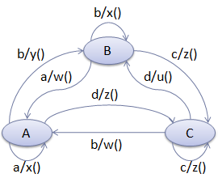
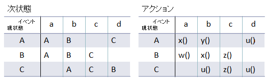

# DSL がらみのその他諸々

## <a id="sec-generated-title-1"></a> <a id="abst"></a>概要

執筆途中。

その他、直接的ではないにしても DSL とも関連しそうな話題。

ビジュアル言語と言語ワークベンチ。

汎用言語＋DSL 混在開発すると面白そうなもの。


## <a id="sec-generated-title-2"></a> <a id="offline"></a>オフライン処理

設定ファイルや画像・音声などのリソースファイルの形式には、
「編集しやすい形式」と「プログラムから読み込みやすい形式」があります。
また、編集時にのみ必要になる

で、実行時のパフォーマンスの観点から、
プログラムのビルド時に「編集しやすい形式」→「読み込みやすい形式」の変換したり、
編集時にのみ必要な情報を削除する場合があります。

このとき、
ビルド時にやってしまう処理をオフライン処理、
プログラム実行時行う部分をオンライン処理と呼びます。

DSL ベース開発においても、
前節の「[方式](dslapproacho.md#method)」で言うところの動的ローディングするタイプの DSL の場合、
オフライン処理による実行時のパフォーマンス向上を考えたりすることがあります。
（実際、「[WPF](../../dotnet/dotnet3/abstract.md#wpf)」 の 「[XAML](../../dotnet/wpf/wpf_xaml.md#xaml)」 がこういう処理をしています。）


### <a id="sec-generated-title-3"></a> <a id="offline_demand"></a>オフライン処理の必要性

「[抽象定義と具象定義](dsl.md#abstraction)」で説明したように、
持ってる情報としてはまったく同じ（抽象形式的には同じ）でも、
具体的な表現方法（具象形式）は変えることができます。

で、
抽象形式（どういう情報を持ちたいか）は決まっていて、
具象形式をどうするかをこれから決めるとき、
「作成・編集しやすい形式」と「プログラムから読みやすい形式」という2つの選択肢があります。

もちろん、その中間というか、折中案・妥協案として、
「人手の編集もそこそこしやすいし、プログラムからの読み込みもそこそこしやすい」というような形式を考えることもできます。
XML なんかは、理念的にはこの折中案。

でも、分野によっては、
こういう折中案すら取りたくないくらいパフォーマンスにシビアなものもあります。
その場合、
「編集しやすい形式」と「読み込みやすい形式」の両方を決めておいて、
開発時には前者で書いて、
後者に変換してから使うというような方式を取ります。

また、往々にして、編集時に必要な情報というのは、
実行時に必要な情報と比べると多くなります。
例えば、編集用 GUI のレイアウト情報などは、実行時には必要ない場合が多いです。
こういう場合には、プログラムのビルド時に、
編集時にしか必要ない情報を削除してしまうのが普通です。


### <a id="sec-generated-title-4"></a> <a id="offline_sample"></a>オフライン処理の例

いくつか、オフライン処理の例を挙げてみます。


##### <a id="sec-generated-title-5"></a>テキスト → バイナリ

まあ、わかりやすい例で言うと、
テキスト形式で書いて、バイナリ形式に変換しておくというのがあります。

例えば、何らかの数値を設定ファイルに記録してあったとします。
テキスト形式の場合、読み出しは以下のような感じになります。

```csharp {title="テキスト形式のファイルから数値を読み出し"}
int x = int.Parse(reader.ReadLine());
```


これでも簡単な例（1つの行に1つの数値しかかかれてないという前提）なんですが、
それでも、
ReadLine では「改行文字を探して、改行文字までの文字列を取り出す」、
Parse では「文字列を解析して数値に変換」というような処理をしています。

一方、バイナリ形式で保存するなら、以下のような感じ。

```csharp {title="バイナリ形式のファイルから数値を読み出し"}
int x = reader.ReadInt32();
```


こちらは、4バイト読み出すだけ。
複雑な処理は一切ありません。

「[WPF](../../dotnet/dotnet3/abstract.md#wpf)」 の 「[XAML](../../dotnet/wpf/wpf_xaml.md#xaml)」 がこういう処理をしています。
編集時には、XML 形式である XAML になっていて、
ビルド時にバイナリ形式である BAML に変換して、
プログラムの実行時には BAML をロードして使います。


##### <a id="sec-generated-title-6"></a>編集用のメタデータ

データには、編集するときにはあった方がいいけど、
実行時には不要になるデータというのもあります。

例えば、「[WF](../../dotnet/dotnet3/abstract.md#wf)」 のワークフローを Visual Studio を使って作るとすると GUI ツールでアシストをしてもらえるわけですが、
「どのアクティビティを GUI ツール上のどこに置くか」というようなレイアウト情報は、
開発時には必要ですが実行時には必要ありません。

こういう開発時にしか使わない情報は、実行時には残すだけ無駄です。
なので、オフライン処理で削除してしまおうというのも自然な発想です。

例えば、Visual Studio での WF 開発の場合、
ワークフローの情報は、
実行時に必要な情報は .xoml ファイル、
レイアウト情報は .layout という別ファイルに持っておいて、
プログラムのビルドには .xoml だけを使います。
（この場合、オフライン処理で不要な情報を削除してるというか、
はなっから別ファイルに分離されていますが。）


##### <a id="sec-generated-title-7"></a>ロスレス → 準ロスレス

ゲームなどでは、画像や音声データをよく使います。
で、この手のデータは、編集時には、編集のたびにデータが劣化していては話にならないので、
ロスレス（完全に可逆な）データ形式で保存します。

一方で、画像などの場合、
ロスレスデータはファイルサイズが非常に大きくなりますので、
視覚上・聴覚上わからない程度の劣化を許すことでサイズを大幅に圧縮します（準ロスレス圧縮）。
（
画像も音声も、
完全なロスレスの場合、1/2 程度に圧縮できればいい方。
準ロスレスなら、10～20分の1程度まで圧縮できます。
）


### <a id="sec-generated-title-8"></a> <a id="content_pipeline"></a>コンテントパイプライン

Microsoft のゲーム開発環境 [XNA](http://www.microsoft.com/japan/msdn/xna/) は、
コンテントパイプラインという仕組みを持っています。
```text
      （書きかけ）
      - XNA の Content Pipeline

      3D モデル、画像、音などを、

      1. Contents（人間の編集しやすい形式）ファイル
      ↓importer（ファイルIO）
      2. Contents の中身
      ↓processor（変換）
      3. Assets（コンピュータの読み出しやすい形式）
      ↓manager（ロード）
      4. 実行・表示・再生

      1 → 2 → 3 をオフライン処理
      3 → 4 をオンライン処理

      XNA 開発の便利なところは、1, 2 のところを作って、
      Visual Studio のプロパティウィンドから作ったモジュールが登録できて、
      特に Makefile の類を書かなくても1→3の処理ができること。
    
```

## <a id="sec-generated-title-9"></a> <a id="language_workbench"></a>言語ワークベンチ

```text
      （書きかけ）

      ・ビジュアル言語 VS テキスト言語
      （「[ドメイン特化型モデル駆動開発](/study/dsl//dsltools)」の方に書いた方がいいのかも。）
      - DSL は、1度覚えたら楽、でも、毎度毎度覚えなおす必要があって大変
      - ビジュアルノーテーション＆ツールアシスト
      ↓
      DSL 作るなら graphical 言語がいいんじゃないか
      ↓
      ビジュアルノーテーションや、GUI ツール込みで言語と考える


      汎用のテキスト言語 ＋ ビジュアル DSL の混在開発
    
```
言語ワークベンチ …
intentional programming。
テキスト形式のソースファイルを基本とするんじゃなくて、
抽象形のコードを基本に。
用途に合わせてテキストあるいは図にして可視化。

やっぱ、ソースがテキストじゃないと気持ち悪いという人もいるかも。
ツールに依存するのがいやって人もいまだ多いし。
あと、抽象形 → テキスト化って、それは逆コンパイル？
抽象度の高い言語の場合はテキスト化しずらそう。

(例)
ステートマシンは、
ダイアグラムで書きたいときもあれば、表にしたいときもある。

* 図
    * ダイアグラム

    * 表


* テキスト
    * ハッシュテーブル

    * switch 文


<figure>

[](../../../../assets/media/ufcpp2000/dsl/fig/fsmdiagram.png)

<figcaption>ダイアグラムでステートマシンを表現</figcaption>
</figure>


<figure>

[](../../../../assets/media/ufcpp2000/dsl/fig/fsmtable.png)

<figcaption>ダイアグラムでステートマシンを表現</figcaption>
</figure>


ハッシュテーブルによる表現

```csharp {title="ハッシュテーブルによるステートマシンの表現"}
fsm[new Pair(State.A, Event.a)] = new Pair(State.A, x);
fsm[new Pair(State.A, Event.b)] = new Pair(State.B, y);
fsm[new Pair(State.A, Event.d)] = new Pair(State.C, u);

fsm[new Pair(State.B, Event.a)] = new Pair(State.A, w);
fsm[new Pair(State.B, Event.b)] = new Pair(State.B, x);
fsm[new Pair(State.B, Event.c)] = new Pair(State.C, z);

fsm[new Pair(State.C, Event.b)] = new Pair(State.A, u);
fsm[new Pair(State.C, Event.c)] = new Pair(State.C, z);
fsm[new Pair(State.C, Event.d)] = new Pair(State.B, u);
```


switch 文による表現

```csharp {title="switch 文によるステートマシンの表現"}
switch(currentState)
{
case State.A:
  switch(event)
  {
  case Event.a: x(); currentState = State.A; break;
  case Event.b: y(); currentState = State.B; break;
  case Event.d: u(); currentState = State.C; break;
  }
  break;
case State.B:
  switch(event)
  {
  case Event.a: w(); currentState = State.A; break;
  case Event.b: x(); currentState = State.B; break;
  case Event.c: z(); currentState = State.C; break;
  }
  break;
case State.C:
  switch(event)
  {
  case Event.b: u(); currentState = State.A; break;
  case Event.c: z(); currentState = State.C; break;
  case Event.d: u(); currentState = State.B; break;
  }
  break;
}
```
