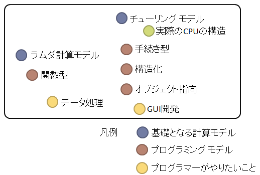
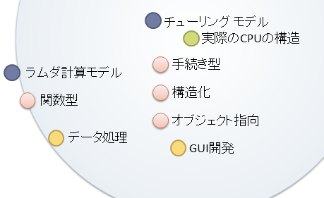
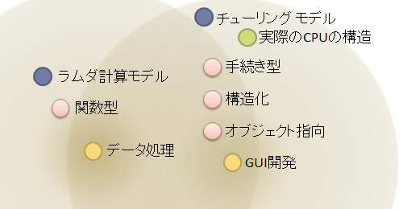

# 汎用言語の進化

## <a id="sec-generated-title-1"></a> <a id="abst"></a>概要

これまでにも説明したように、
DSL を作るのではなく、汎用言語自身を進化させるという選択肢もあります。

汎用プログラミング言語は年々「intentional」になっていると言います。
また、類する言葉も色々ありますが、これらの言葉の意味するところは、以下のような感じ（いずれも意味するところはほぼ同じ）：

* intentional（意図的な、計画的な）： プログラマーが意図したことをそのまま意図通りに書ける。

* how から what へ： プログラムを「どうやって書くか」ではなく「何をしたいか」に注力できる。

* declative（宣言的な）： 意図を宣言すればそれがそのまま動く。


汎用的なプログラミング言語にもまだまだ改良の余地があり、intentional な方向に向かって「モデル」が進化しています。


## <a id="sec-generated-title-2"></a> <a id="intention"></a>意図通りに書く

how（どうやって： 手順を逐一書く）から what（何を： 意図をそのまま書く）への変化は今に始まったわけでもなく、
古くからこれの繰り返しです。

例えば、手続き型言語に今のようなフロー制御構文が入る前（if と goto しかなかった時代がある）、処理のフローは以下のように書いていました。
ぱっと見で何をしているのかまるで分らないと思います。

```csharp
int[] a = new[] { -1, 1, -2, 2, -3, 3, -4, 4, -5, 5, };
int N = a.Length;

int sum = 0;
int i = 0;
LOOP_BEGIN:
if (!(i < N))
    goto LOOP_END;
int x = a[i];
if (!(x > 0))
    goto NOT_MATCH;
sum = x + sum;
NOT_MATCH:
i = i + 1;
goto LOOP_BEGIN;
LOOP_END: ;
```


while 構文の導入以来、普通は以下のように書きます。
少なくとも、何か反復処理していることはわかるようになりました。

```csharp
int[] a = new[] { -1, 1, -2, 2, -3, 3, -4, 4, -5, 5, };
int N = a.Length;

int sum = 0;
int i = 0;

while (i < N)
{
    int x = a[i];

    if (x > 0)
    {
        sum = x + sum;
    }
    i = i + 1;
}
```


要するに、配列の要素の列挙です。
今なら、だいたいのプログラミング言語に列挙用の専用構文（foreach）が用意されているので、以下のようになるでしょう。
どういう意図で反復処理をしていたのかがはっきりします。

```csharp
int[] a = new[] { -1, 1, -2, 2, -3, 3, -4, 4, -5, 5, };

int sum = 0;

foreach (var x in a)
{
    if (x > 0)
    {
        sum += x;
    }
}
```


今の C# （バージョン 3.0 で導入された「[LINQ](../../csharp/data/sp3_linq.md#linq)」を使う）なら、さらに意図をそのまま書きやすくなっています。
この例のように、配列の和を求めたいなら、以下のように書けます。

```csharp
int[] a = new[] { -1, 1, -2, 2, -3, 3, -4, 4, -5, 5, };

int sum = a.Where(x => x > 0).Sum();
```


「配列 a の 0 以上の項の和」を「a.Where(x =&gt; x &gt; 0).Sum()」と書ける。
これが意図をそのまま書く、「how から what へ」というものです。


## <a id="sec-generated-title-3"></a> <a id="general"></a>汎用言語の進化の方向性

汎用言語であるからには、何でもかんでも新機能を追加するわけにはいかず、以下のようなことが求められます。

* それなりに需要が高い。

* ライブラリとして提供すると、記述があまりに冗長で大変。


「需要が高い割に大変」なものだけが汎用言語の「新文法」となりえます。
どういう機能がこれに該当するかというと、その代表格は GUI 開発とデータ処理でしょう。

オブジェクト指向の普及の裏には GUI 開発を楽にしたいという要求が少なからずあったと思います。
最近、関数型言語が注目を集めているのは、それがデータ処理に向いているからというのがあります。


##### <a id="sec-generated-title-4"></a>注意： 目的はあくまで「意図通りに書ける」

大まかにですが、プログラミングモデルの位置づけのようなものを見てみましょう。

<figure>

[](../../../../assets/media/ufcpp2000/dsl/fig/model1.png)

<figcaption>プログラミングモデルの位置づけ</figcaption>
</figure>


（これは僕の主観が大分入っていますし、本当に大まかなものです。
プログラミングモデルの分類は、厳密にいうとこんな2次元的に見れるものでもなくて、もっと多次元的なものだと思いますが、
説明のために簡素化していると思ってください。）

こういう図を出したのは、1点注意したいことがあるからです。
まれに、「実際の CPU の構造から離れていればいるほどすごい」という意見がありますが、
これは必ずしも正しくありません。
本当に大切なのは「プログラマーがやりたいことを素直に書ける」、すなわち、「意図通りに書ける」ということです。

前者のあまりよくない解釈（実際の CPU の構造から離れるほどすごい）を基に考えると下図の青い円の中心から離れれば離れるほど良いということになります。

<figure>

[](../../../../assets/media/ufcpp2000/dsl/fig/model2.png)

<figcaption>CPU の構造から離れる</figcaption>
</figure>


関数型言語がすごいと言われる由縁はこの辺りにあるように思います。

ところが、大切なのは後者、「やりたいこと」からの距離です。
下図の黄色っぽい2つの円の中心に近ければ近いほど良いということになります。

<figure>

[](../../../../assets/media/ufcpp2000/dsl/fig/model3.png)

<figcaption>やりたいことに近づける</figcaption>
</figure>


そこで、実際のところ、最近の汎用プログラミング言語の向かう先は「関数型とオブジェクト指向のハイブリッド型」という感じになっています。
今後、汎用言語でやりたいことが増えれば増えるほど、色んなプログラミングモデルが取り込まれ、より一層ハイブリッド化が進むと思われます。
