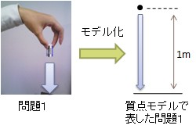
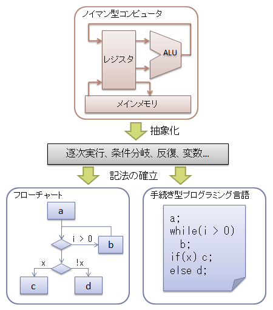
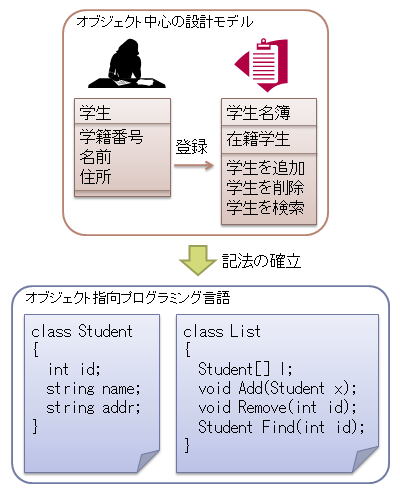

# モデル化

## <a id="sec-generated-title-1"></a> <a id="abst"></a>概要

まずはじめに、｢モデル化って何？」って話から。


## <a id="sec-generated-title-2"></a> <a id="modeling"></a>モデル化とは

モデル化とは、
現実の問題から、問題解決に必要な部分だけを抜き出して<em>簡単化・抽象化</em>することです。

例えば、物理学なんかでは、物体の運動を考える場合に、
質点（体積 0 の動く点）というものを考えます。
物体の回転や空気抵抗などを無視して考える（逆に言うと無視しても十分な精度が得られる）場合、
物体の体積を考える必要はないので、
体積は無視してしまおうということです。
これが物事の簡単化・抽象化、すなわちモデル化です。

もし物体の回転も考慮する必要がでてくれば、
剛体（どんな力をかけても絶対に変形しない物体）を使ってモデル化します。
さらに、物体の変形や流動性まで考慮する必要があるなら、流体モデルを使います。

質点 → 剛体 → 流体と、
右側に行くほど扱える物理現象の幅は広がりますが、
理論も計算も難しくなります。
回転も変形も抵抗も無視できるのに流体モデルで運動を計算すると無駄な労力を使うことになります。

この例からわかるように、
<em>「よいモデル化」というのは、
      問題の要件を必要十分に、過不足なく表せるモデルを作ることです</em>。
情報は多すぎても少なすぎてもダメ。
簡単化しすぎると扱える問題が狭くなりますし、
逆に、何でもかんでも扱おうとすると理論・計算が煩雑になります。


## <a id="sec-generated-title-3"></a> <a id="paradigm"></a>モデリングパラダイム

モデルとかモデル化って言葉にもう少し具体的なイメージを持ってもらうために、
前節の物理学における物体の運動の例に関して、
以下のような具体的な問題を考えてみます。

<blockquote markdown="1">
問題１:
1kg の物体を高さ 1m から真下に静かに落とすとき、
空気抵抗が無視できるものとして、物体が地面に付く瞬間の速度を求めたい。

</blockquote>
高校で物理を習ったことのある人なら、質点の概念を使ってこの問題を解くと思います。
（物理を習ったことのない人はごめんなさい。）
これは、「問題１を質点モデルを使ってモデル化した」と考えることができます。

<figure>

[](../../../../assets/media/ufcpp2000/dsl/fig/pointmass.jpg)

<figcaption>物体の運動を質点モデルでモデル化</figcaption>
</figure>


「左側の実写から、右側みたいなシンプルな絵を起こす」というのがモデル化の肝。
「摩擦も大きさも無視するんなら、点で描けばいいじゃん」ってことです。

このとき、問題１、質点モデル、モデル化という言葉の関係性は以下のようになります。

* 問題１ … 解きたい問題。ドメイン（domain: モデル化の対象領域）。

* 質点モデル … モデリングパラダイム（modeling paradigm: モデル化のための方法論）。


まあ、しっかりした言葉の定義があるわけではないんですが、
単に「モデル」っていうと、この例のように、
モデリングパラダイムをさす場合が多いと思います。

「モデル化」とか「モデリング」って言葉は意味が広すぎるので、
こういう意図を指し示す場合には「ドメインモデリング」って言葉を使った方がいい気もします。


## <a id="sec-generated-title-4"></a> <a id="programming_model"></a>プログラミングモデル

ようやくプログラミングの話に入ります。
ソフトウェアのモデル化というと難しく聞こえますが、
まあ、普通のプログラミング言語だってモデル（モデリングパラダイム）の一種です。

例えば、C 言語は「手続き型プログラミングモデル」を表すための言語です。
図2に示すように、
まず、ノイマン型コンピュータの動作から、
「逐次実行、条件分岐、反復、変数」などの抽象的な概念を抜き出したものが
手続き型プログラミングモデルです。
そして、フローチャートや C 言語などは、
手続き型プログラミングモデルの表記方法の一種になります。

<figure>

[](../../../../assets/media/ufcpp2000/dsl/fig/mdd01.png)

<figcaption>手続き型プログラミングモデル</figcaption>
</figure>


出発点が「ノイマン型コンピュータの動作」なことからもわかるように、
手続き型プログラミングモデルは、かなりコンピュータよりの視点のモデルです。
マシン語をそのまま書くのに比べればかなり人間の直感に近いですが、
最近主流のプログラミング言語と比べればずいぶんとコンピュータよりです。

これに対して、よりいっそう人間の直感に近いプログラミングモデルとして提唱されたのが、
最近主流のオブジェクト指向モデルです。
（といっても、純粋なオブジェクト指向モデルではなく、
手続き型とオブジェクト指向の混合モデルが主流。）

オブジェクト指向という概念に関しては、
別ページで解説しているのでここでは概要のみにとどめますが、
図3に示すように、オブジェクト（データ・物）中心にプログラムを設計する手法です。
そして、C# や C++、Java などの言語はこのオブジェクト指向モデルに基づいたプログラミング言語です。

<figure>

[](../../../../assets/media/ufcpp2000/dsl/fig/mdd02.png)

<figcaption>オブジェクト指向プログラミングモデル</figcaption>
</figure>


プログラミングの分野では、
コンピュータよりの概念を「抽象度が低い」・「低級」などと呼び、
人間の直感に近いものを「抽象度が高い」・「高級」と呼びます。
これまでの例でいうと、マシン語 → 手続き型言語 → オブジェクト指向言語の順で「高級」になります。


## <a id="sec-generated-title-5"></a> <a id="modeling_lang"></a>モデリング言語

さて、時代は流れて、情報関連技術もずいぶんと高度になりました。
情報関連技術を用いて解決したい問題はまずます複雑に、そして多種多様になっています。
こういう背景から、オブジェクト指向モデルよりもさらに人間の直感に近い、
抽象的なモデリングパラダイムが求められるようになってきました。

また、問題解決の実現方法も多岐にわたります。
すべてソフトウェアで解決するか部分的に専用ハードウェアを作るか、
ソフトウェアだけで解決するにしても OS などを何にするか、
スタンドアローンかネットワーク越しか、
いろいろな選択肢があって、
それぞれ最適なプログラミング環境はことなります。

ということで、
人間の直感により近い形で、実装方法に依存することなく、問題を直接モデル化するような言語が求められています。
このような、抽象度の高いモデル化のための言語を<strong id="modeling_language" class="keyword">モデリング言語</strong>（modeling language）といいます。


##### <a id="sec-generated-title-6"></a>ビジュアル言語

手続き型モデルにせよ OOP モデルにせよ、
C 言語や Java など、テキストベースの言語で表現されます。
このくらいの抽象度なら、下手に図で表すよりも、
文字だけの方がよっぽど書きやすいし読みやすいので、
このレベルのモデルを図で表そうという試みはない、あるいは、あまり流行っていません。
（手続き型プログラミングにフローチャートを使う人がいないように。）

一方で、抽象度が高くなってくると、
徐々に文字だけでの情報伝達が困難になってきます。
そのため、モデリング言語といわれるようなものの多くは、
図を使った言語、すなわちビジュアル言語になっています。

プログラマーにとって、言語というと C 言語のような文字ベースのものを思い浮かべるかもしれませんが、
意思疎通のためのしっかりとしたルールがあれば、
表現メディアは問わず（文字でも図でも音でもなんでも）、
言語といって差し支えありません。
要するに、
ビジュアル言語というのは「規則があって、あいまい性なく情報を伝達できる図」と言えます。


##### <a id="sec-generated-title-7"></a>モデリング言語の歴史的背景

少し話は変わりますが、元々明確にモデリング言語の概念があったわけではありません。

よいプログラマというのは不精者で、無駄な労力をとにかく嫌います。
ドキュメントを書くなんてのは無駄だからやりたくないなんて人も多いんですが、
これはまあ、半分は正解で半分は間違い。

前節で述べた通り、
プログラミング言語もある意味モデリング手段の1つなわけで、
結構な表現力を持っています。
なので、プログラムコードで記述できることは改めてドキュメント化するなんて無意味。
少なくとも、プログラムコードから自動生成すべきです。

でも、プログラミング言語の表現力では不十分だからドキュメントを書く必要性が残る。
特に、図はプログラミング言語では表現できない（表現しても結局、視覚化しないと意思疎通の手段としてはわかりづらい）。
だから、ドキュメントには図を書くわけですね。

でも、何の決まりもなく図を書くと、人によって解釈が異なる場合があります。
人によって解釈が異なると、技術討論や仕様の伝達の際に困ります。
なので、図を補うようにして、長々と文章を書くことになる。
しかも、文章を付けたからといって完全ではなくて、自然言語のあいまい性のせいでまだ解釈の相違が生まれる。

そこで、図に厳格な意味を持たせようとして生まれたのがモデリング言語だったりします。


##### <a id="sec-generated-title-8"></a>UML

そして、
組織ごとに決められていた図の記法を統一して、
世界中で通じるモデリング言語を作ろうということで生まれたのが <strong id="uml" class="keyword">UML</strong>（Unified Modeling Language）です。

UML の詳細に関しては、いろんなサイトで解説されているのでここで改めて説明はしません。
（細かいところまで説明できるほどは詳しくないですし。）

後々説明するような excutable UML（UML だけ書けば成果物を生成できる）的な考え方はに関してはさすがに懐疑的な意見が多いんですが、
少なくとも、
検討段階の討論や仕様書書きなどの用途では、UML が必須の言語だといわれています。


## <a id="sec-generated-title-9"></a> <a id="howtouse"></a>モデリング言語の使い方

モデリング言語の使い方としては、いくつかの段階があったりします。


##### <a id="sec-generated-title-10"></a>ドロー（drawing）

まず最初。
設計段階やミーティングの場、あるいは仕様書の中で、図による意思疎通を目的としてビジュアルなモデリング言語を使う。

UML は主にこの用途に使われるものです。
（UML からコード生成とか、UML を直接実行するっていうようなので、
あまり成功している話は聞かないです。）


##### <a id="sec-generated-title-11"></a>モデル支援開発（model-assisted development）

モデリング言語から汎用プログラミング言語のソースコードを生成したり、
テスト用のデータを生成したり。


##### <a id="sec-generated-title-12"></a>モデル駆動開発（model-driven development）

モデリング言語で記述したものを直接実行。


## <a id="sec-generated-title-13"></a> <a id="plan"></a>予定

```text
      モデル駆動開発（MDD: Model Driven Development）
      - モデリング言語を使って開発
      - 上述の通り、モデリング言語のほとんどはビジュアル言語なので、
      ビジュアル言語ベースの開発になる
      ↑
      なので、「モデル駆動開発＝ビジュアル開発」と誤解されがち
      （2000年代前半は特にそういう空気が強かった。
        2000年代後半からは、テキストベースのモデリング言語にも再度焦点が。）
      結局そうなる場合が多いけども、
      より抽象度の高いモデルを使った開発というのが本質

      MDD の1つの解として UML ベース開発が
      - OMG の提唱する MDA（Model Driven Architecture）
      - excutable UML
      理想を言うと、UML だけ書けば自動的に成果物が生成される
      それは無理でも少なくとも、UML を書けば設計の妥当性を検証できるようにしたい
      - PIM ＋ プラットフォーム定義 → PSM
      （PIM: Platform Indipendent Model, PSM: Platform Specific Model）
      ↓
      でも、プラットフォーム非依存にこだわるあまりかえって複雑に
      UML は汎用性・拡張性が高すぎて、煩雑

      ↓
      DSL ベース開発
      - ドメイン（開発対象の領域）に特化したモデルを立てて開発
    
```

## <a id="sec-generated-title-14"></a> <a id="summary"></a>まとめ

* モデル化とは： 現実の問題から問題解決に必要な部分だけを抜き出して簡単化・抽象化すること

* 極論を言うと、C 言語などのプログラミング言語もモデリングパラダイムの一種

* モデリング言語とは： プログラミング言語よりも抽象度が高く、人間の直感により近い形で、実装方法に依存することなく、問題を直接モデル化するような言語

* 以下のような背景から、モデリング言語と呼ばれるもののほとんどはビジュアル言語
    * テキストベースの言語では表現力が弱い

    * ドキュメントなどに描く図に厳格な意味を持たせることから始まった


* LL （light-weight language）とか DLR （dynamic language runtime）とかが流行りだしてから、 テキストベースのモデリング言語も再び注目されるようになってきた。
