# IL 命令の実行例

## 概要
.NETの仮想マシンは、スタック型と呼ばれるタイプの構造をしています。

スタック型の命令は、コンパイラー作りの基本だったりします。
.NET の IL 命令は、実 CPU の命令セットと比べるとシンプルで読みやすく、
コンパイラーというものの勉強がてらに眺めてみるのもいいのではないかと思います。

ここでは、サンプル コードを示しつつ、それが実際どういう手順で実行されているかを説明します。

## 例1: 2 * (x + y)
例として、以下のような C# コードを考えてみます。

<pre class="source" title="C# の例1" lang="">
<code>static int X(int x, int y)
{
    return 2 * (x + y);
}
</code></pre>

これをコンパイルすると、以下のような IL が得られます。

<pre class="source" title="例1のコンパイル結果の IL" lang="">
<code>.method private hidebysig static int32  X(int32 x,
                                          int32 y) cil managed
{
  .maxstack  8
  IL_0000:  ldc.i4.2
  IL_0001:  ldarg.0
  IL_0002:  ldarg.1
  IL_0003:  add
  IL_0004:  mul
  IL_0005:  ret
}
</code></pre>

この例で出てきた IL 命令を簡単に説明すると、表1のようになります。

<table summary="例1に出てきた IL 命令の説明">
	<caption>
		例1に出てきた IL 命令の説明
	</caption>
	<tr>
		<th>IL アセンブリ命令</th>
		<th>IL マシン語（16進数）</th>
		<th>説明</th>
	</tr>
	<tr>
		<td markdown="1">ldc.i4.2</td>
		<td markdown="1">18</td>
		<td markdown="1">int 型の定数 2 をスタックに読み込む（load constant integer(4byte) 2）。</td>
	</tr>
	<tr>
		<td markdown="1">ldarg.0</td>
		<td markdown="1">02</td>
		<td markdown="1">最初の引数の値をスタックに読み込む（load argument 0）。</td>
	</tr>
	<tr>
		<td markdown="1">ldarg.1</td>
		<td markdown="1">03</td>
		<td markdown="1">2つ目の引数の値をスタックに読み込む（load argument 1）。</td>
	</tr>
	<tr>
		<td markdown="1">add</td>
		<td markdown="1">58</td>
		<td markdown="1">加算。スタック上の2つの値を消費して、加算結果をスタックの最上位に積む。</td>
	</tr>
	<tr>
		<td markdown="1">mul</td>
		<td markdown="1">5A</td>
		<td markdown="1">乗算（multiply）。スタック上の2つの値を消費して、乗算結果をスタックの最上位に積む。</td>
	</tr>
	<tr>
		<td markdown="1">ret</td>
		<td markdown="1">2A</td>
		<td markdown="1">メソッド呼び出し元に戻る（return）。</td>
	</tr>
</table>

「スタック」という言葉が各所に出てきます。
積み重ねたもの（stack）という意味の単語ですが、文字通り、計算に使うための値を積み上げておくための記憶領域です。

スタックのイメージをつかんでもらうために、
この IL 命令列がどう実行されていくか、スタックの状態も含めて図示していきましょう。
たとえば、引数として、x = 1, y = 3 を与えたとすると、以下のようになります。

<figure>
	[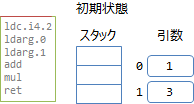](../../../../assets/media/ufcpp2000/il/fig/il-sample1-1.png)

</figure>

<figure>
	[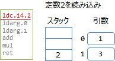](../../../../assets/media/ufcpp2000/il/fig/il-sample1-2.png)

</figure>

<figure>
	[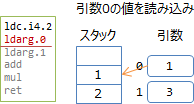](../../../../assets/media/ufcpp2000/il/fig/il-sample1-3.png)

</figure>

<figure>
	[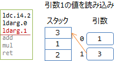](../../../../assets/media/ufcpp2000/il/fig/il-sample1-4.png)

</figure>

<figure>
	[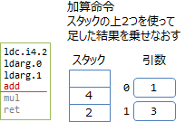](../../../../assets/media/ufcpp2000/il/fig/il-sample1-5.png)

</figure>

<figure>
	[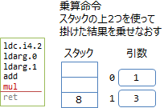](../../../../assets/media/ufcpp2000/il/fig/il-sample1-6.png)

</figure>

## 例2: 値を2つ入力して、和を出力
もう1つ、ローカル変数やメソッド呼び出しも行う例を示しましょう。
以下のような C# コードを考えてみます。

<pre class="source" title="C# の例2" lang="">
<code>static void Main()
{
    var x = int.Parse(Console.ReadLine());
    var y = int.Parse(Console.ReadLine());
    Console.WriteLine("{0} + {1} = {2}", x, y, x + y);
}
</code></pre>

これをコンパイルすると、以下のような IL が得られます。

<pre class="source" title="例2のコンパイル結果の IL" lang="">
<code>.method private hidebysig static void  Main() cil managed
{
  .entrypoint
  .maxstack  5
  .locals init ([0] int32 x,
           [1] int32 y)
  IL_0000:  call       string [mscorlib]System.Console::ReadLine()
  IL_0005:  call       int32 [mscorlib]System.Int32::Parse(string)
  IL_000a:  stloc.0
  IL_000b:  call       string [mscorlib]System.Console::ReadLine()
  IL_0010:  call       int32 [mscorlib]System.Int32::Parse(string)
  IL_0015:  stloc.1
  IL_0016:  ldstr      "{0} + {1} = {2}"
  IL_001b:  ldloc.0
  IL_001c:  box        [mscorlib]System.Int32
  IL_0021:  ldloc.1
  IL_0022:  box        [mscorlib]System.Int32
  IL_0027:  ldloc.0
  IL_0028:  ldloc.1
  IL_0029:  add
  IL_002a:  box        [mscorlib]System.Int32
  IL_002f:  call       void [mscorlib]System.Console::WriteLine(string,
                                                                object,
                                                                object,
                                                                object)
  IL_0034:  ret
}
</code></pre>

いくつか新しい IL 命令が出てきました。これらの意味は、表2の通りです。

<table summary="例2に出てきた IL 命令の説明">
	<caption>
		例2に出てきた IL 命令の説明
	</caption>
	<tr>
		<th>IL アセンブリ命令</th>
		<th>IL マシン語（16進数）</th>
		<th>説明</th>
	</tr>
	<tr>
		<td markdown="1">call</td>
		<td markdown="1">28</td>
		<td markdown="1">メソッドを呼び出す（call）。非仮想メソッド用。</td>
	</tr>
	<tr>
		<td markdown="1">ldloc.0 / ldloc.1</td>
		<td markdown="1">06 / 07</td>
		<td markdown="1">最初 / 2つ目のローカル変数の値をスタックに読み込む(load local)。</td>
	</tr>
	<tr>
		<td markdown="1">stloc.0 / stloc.1</td>
		<td markdown="1">0A / 0B</td>
		<td markdown="1">スタックの一番上の値を、最初 / 2つ目のローカル変数に書きだす（store local）。</td>
	</tr>
	<tr>
		<td markdown="1">ldstr</td>
		<td markdown="1">72</td>
		<td markdown="1">文字列定数をスタックに読み込む（load string）。</td>
	</tr>
	<tr>
		<td markdown="1">box</td>
		<td markdown="1">8C</td>
		<td markdown="1">値型を object 型にボックス化（boxing）する。</td>
	</tr>
</table>

こちらも、スタックの状態込みで、IL 命令列がどう実行されていくかを見ていきましょう。

<figure>
	[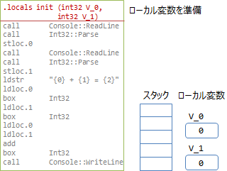](../../../../assets/media/ufcpp2000/il/fig/il-sample2-1.png)

</figure>

<figure>
	[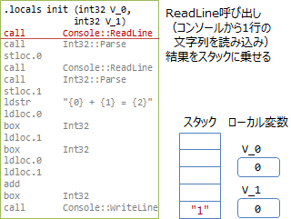](../../../../assets/media/ufcpp2000/il/fig/il-sample2-2.png)

</figure>

<figure>
	[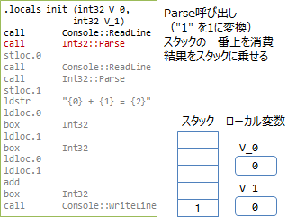](../../../../assets/media/ufcpp2000/il/fig/il-sample2-3.png)

</figure>

<figure>
	[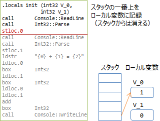](../../../../assets/media/ufcpp2000/il/fig/il-sample2-4.png)

</figure>

<figure>
	[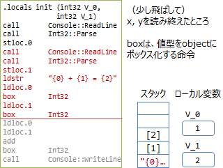](../../../../assets/media/ufcpp2000/il/fig/il-sample2-5.png)

</figure>

<figure>
	[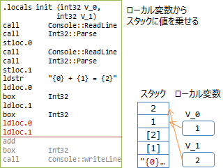](../../../../assets/media/ufcpp2000/il/fig/il-sample2-6.png)

</figure>

<figure>
	[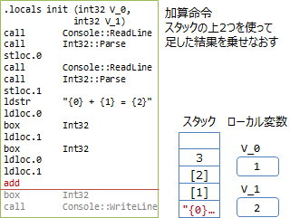](../../../../assets/media/ufcpp2000/il/fig/il-sample2-7.png)

</figure>
