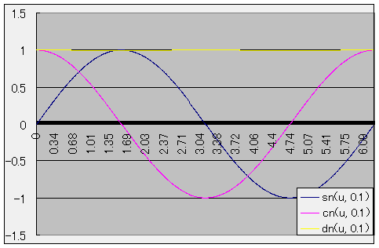
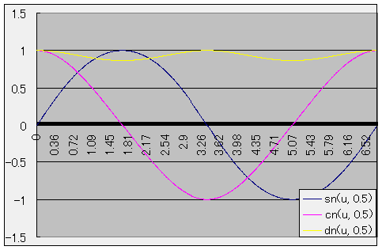
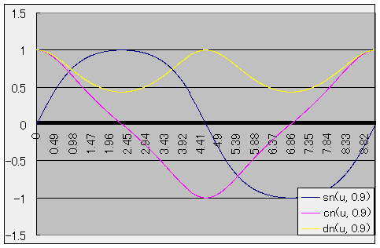

# ヤコビの楕円関数

## ヤコビの楕円関数
第1種不完全楕円積分 F(φ, k) の逆関数として定義される楕円関数群を<strong id="jacobi" class="keyword">ヤコビの楕円関数</strong>（Jacobian elliptic functions）と呼びます。

* φ(u, k) ＝ F-1(φ, k)このφを（ヤコビの楕円関数の）振幅（amplitude）と呼ぶ。

* sn(u, k) ＝ sin(φ)

* cn(u, k) ＝ cos(φ)

* dn(u, k) ＝ √(1 － k2sn2(u, k))

## 執筆予定
<pre>
ヤコビの楕円関数の公式
θ（テータ）関数
テータ関数とヤコビの楕円関数との関係
</pre>

## メモ
<h3>諸定数</h3><pre>
k  … ヤコビの楕円関数の率（modulus、複数形 moduli。母数、法と訳す場合も）。
k' … 補率（complementary modulus）。k' ＝ √(1 － k^2)

数値計算ライブラリなどでは、
m ＝ k^2, m' ＝ k'^2 = 1 - m というように、
率・補率の2乗をパラメータとして使う場合も多い。
(k は公式中のほとんどの箇所で、k^2 の形で出てくるため、
 m ＝ k^2 を使った方が計算効率がいい。)

K  ＝ K(k)  … 率 k の完全楕円積分。ヤコビの楕円関数の周期の1つになる。
K' ＝ K(k') … 率 k' の完全楕円積分。これもヤコビの楕円関数の周期の1つになる。

Legendre は
 k  ＝ sinα
 k' ＝ cosα
となるような値αを定義し、率角（modular angle）と呼んだ。
</pre><h3>グラフ</h3>
<figure>
	
	<figcaption>ヤコビの楕円関数（k=0.1）</figcaption>
</figure>

<figure>
	
	<figcaption>ヤコビの楕円関数（k=0.5）</figcaption>
</figure>

<figure>
	
	<figcaption>ヤコビの楕円関数（k=0.9）</figcaption>
</figure>

<h3>簡単な性質</h3><pre>
sn(-u) = -sn(u)
sn(2K - u) = sn(u)

cn(-u) = cn(u)

sn^2 + cn^2 = 1
k^2 sn^2 + dn^2 = 1
dn^2 - k^2 cn^2 = k'^2
</pre><h3>周期</h3><pre>
sn(u ＋ 2mK ＋ 2niK', k) ＝ (－1)^m     sn(u, k)
cn(u ＋ 2mK ＋ 2niK', k) ＝ (－1)^(m+n) cn(u, k)
dn(u ＋ 2mK ＋ 2niK', k) ＝ (－1)^n     dn(u, k)
</pre>
<table summary="ヤコビの楕円関数の周期">
	<caption>
		ヤコビの楕円関数の周期
	</caption>
	<tr>
		<td markdown="1"></td>
		<th>周期</th>
		<th>零点</th>
		<th>極</th>
	</tr>
	<tr>
		<td markdown="1">sn</td>
		<td markdown="1">4K, 2i K'</td>
		<td markdown="1">2mK ＋ 2n i K'</td>
		<td markdown="1">2m K ＋ (2n＋1) i K'</td>
	</tr>
	<tr>
		<td markdown="1">cn</td>
		<td markdown="1">4K, 2(K + iK')</td>
		<td markdown="1">(2m＋1)K ＋ 2n i K'</td>
		<td markdown="1">2m K ＋ (2n＋1) i K'</td>
	</tr>
	<tr>
		<td markdown="1">dn</td>
		<td markdown="1">2K, 4i K'</td>
		<td markdown="1">(2m＋1)K ＋ (2n＋1) i K'</td>
		<td markdown="1">2m K ＋ (2n＋1) i K'</td>
	</tr>
</table>

<table summary="上から順に sn, cn, dn の値">
	<caption>
		上から順に sn, cn, dn の値
	</caption>
	<tr>
		<td markdown="1">Im(u)＼Re(u)</td>
		<th>0</th>
		<th>K</th>
		<th>2K</th>
		<th>3K</th>
	</tr>
	<tr>
		<th rowspan="3">0</th>
		<td markdown="1">0</td>
		<td markdown="1">1</td>
		<td markdown="1">0</td>
		<td markdown="1">-1</td>
	</tr>
	<tr>
		<td markdown="1">1</td>
		<td markdown="1">0</td>
		<td markdown="1">-1</td>
		<td markdown="1">0</td>
	</tr>
	<tr>
		<td markdown="1">1</td>
		<td markdown="1">k'</td>
		<td markdown="1">1</td>
		<td markdown="1">k'</td>
	</tr>
	<tr>
		<th rowspan="3">K'</th>
		<td markdown="1">∞</td>
		<td markdown="1">1/k</td>
		<td markdown="1">∞</td>
		<td markdown="1">-1/k</td>
	</tr>
	<tr>
		<td markdown="1">∞</td>
		<td markdown="1">-ik'/k</td>
		<td markdown="1">∞</td>
		<td markdown="1">ik'/k</td>
	</tr>
	<tr>
		<td markdown="1">∞</td>
		<td markdown="1">0</td>
		<td markdown="1">∞</td>
		<td markdown="1">0</td>
	</tr>
	<tr>
		<th rowspan="3">2K'</th>
		<td markdown="1">0</td>
		<td markdown="1">1</td>
		<td markdown="1">0</td>
		<td markdown="1">-1</td>
	</tr>
	<tr>
		<td markdown="1">-1</td>
		<td markdown="1">0</td>
		<td markdown="1">1</td>
		<td markdown="1">0</td>
	</tr>
	<tr>
		<td markdown="1">-1</td>
		<td markdown="1">-k'</td>
		<td markdown="1">-1</td>
		<td markdown="1">-k'</td>
	</tr>
	<tr>
		<th rowspan="3">3K'</th>
		<td markdown="1">∞</td>
		<td markdown="1">1/k</td>
		<td markdown="1">∞</td>
		<td markdown="1">-1/k</td>
	</tr>
	<tr>
		<td markdown="1">∞</td>
		<td markdown="1">ik'/k</td>
		<td markdown="1">∞</td>
		<td markdown="1">-ik'/k</td>
	</tr>
	<tr>
		<td markdown="1">∞</td>
		<td markdown="1">0</td>
		<td markdown="1">∞</td>
		<td markdown="1">0</td>
	</tr>
</table>

<h3>特別な場合（k=0, 1）</h3><pre>
k = 0 のとき、
sn(u, 0) = sin u
cn(u, 0) = cos u
dn(u, 0) = 1

k = 1 のとき、
sn(u, 0) = tanh u
cn(u, 0) = 1 / cosh u
dn(u, 0) = 1 / cosh u
</pre><h3>sc, dc など</h3><pre>
sn = sinφ(u)
cn = cosφ(u)
dn = √(1 - k^2 sn^2)

に加え、

ns = 1 / sn
nc = 1 / cn
nd = 1 / dn

sc = sn / cn
cs = cn / sn

cd = cn / dn
dc = dn / cn

ds = dn / sn
sd = sn / dn

あわせて12個の楕円関数を定義する。
↑
要するに、1文字目が零点、2文字目が極の分布を表していて、

s …     2m K ＋      2n i K'
c … (2m＋1)K ＋      2n i K'
d … (2m＋1)K ＋ (2n＋1) i K'
n …     2m K ＋ (2n＋1) i K'
</pre><h3>加法定理</h3><pre>
denom = 1 - k^2 sn^2(u) sn^2(v) とおくと、

sn(u + v) = sn(u) cn(v) dn(v) + cn(u) dn(u) sn(v)
            -------------------------------------
            denom

cn(u + v) = cn(u) cn(v) - sn(u) dn(u) sn(v) dn(v)
            -------------------------------------
            denom

dn(u + v) = dn(u) dn(v) - sn(u) cn(u) sn(v) cn(v)
            -------------------------------------
            denom
</pre><h3>虚数</h3><pre>
sn(iu, k) = i sn' / cn' = i sc(u, k')
cn(iu, k) =     1 / cn' =   nc(u, k')
dn(iu, k) =   dn' / cn' =   dc(u, k')
</pre><h3>シフト</h3><pre>
sn(u + K) =     cn(u) / dn(u) =     cd
cn(u + K) = -k' sn(u) / dn(u) = -k' sd
dn(u + K) =  k'     1 / dn(u) =  k' nd

sn(u + iK') =  (1/k)     1 / sn(u) =   (1/k) ns
cn(u + iK') = -(1/k) dn(u) / sn(u) = -i(1/k) ds
dn(u + iK') = -i     cn(u) / sn(u) = -i      cs
</pre><h3>k ＞ 1 の場合への拡張</h3><pre>
sn(u, 1/k) = k sn(u/k, k)
cn(u, 1/k) =   dn(u/k, k)
dn(u, 1/k) =   cn(u/k, k)
</pre><h3>複素数</h3><pre>
定義域が複素数、すなわち sn(u + iv, k) （u, v∈R） の場合。

sn = sn(u, k), sn' = sn(v, k')
cn = cn(u, k), cn' = cn(v, k')
dn = dn(u, k), dn' = dn(v, k')
と置くと、

加法定理および虚数の場合の公式から

denom = cn'^2 + k^2 sn＾2 sn'^2
      = 1 - dn^2 sn'^2

sn(u + iv, k) = sn dn' + i cn dn sn' cn'
                ------------------------
                denom

cn(u + iv, k) = cn cn' - i sn dn sn' dn'
                ------------------------
                denom

dn(u + iv, k) = dn cn' dn' - i k^2 sn cn sn'
                ----------------------------
                denom
</pre><h3>倍周期・半周期公式</h3><pre>
加法定理より、

倍周期公式
denom = 1 - k^2 sn^4(u)

sn(2u) = 2 sn(u) cn(u) dn(u)
         -------------------
         denom

cn(2u) = 1 - 2 sn^2(u) + k^2 sn^4(u)
         ---------------------------
         denom

cn(2u) = 1 - 2 k^2 sn^2(u) + k^2 sn^4(u)
         -------------------------------
         denom

半周期公式
sn^2(u/2) = 1 - cn(u)
            ---------
            1 + dn(u)

cd^2(u/2) = dn(u) + cn(u)
            -------------
            1 + dn(u)

cd^2(u/2) = dn(u) + cn(u)
            -------------
            1 + cn(u)

u = K/2 のときの値
sn(K/2) = 1 / √(1 + k')
cn(K/2) = √(k' / (1 + k'))
dn(K/2) = √(k')
</pre><h3>微分</h3><pre>
(d/du)sn = cn dn
(d/du)cn = - sn dn
(d/du)dn = -k^2 sn cn
</pre>

## メモ（theta 関数）
<pre>
・テータ関数

以下の4つの関数を、Jacobi のテータ関数（Jacobian theta function）という。

θ1(z, q) = Σ_-∞^∞ (-1)^(n - 1/2) q^((n+1/2)^2) exp((2n + 1) i z)
θ2(z, q) = Σ_-∞^∞                q^((n+1/2)^2) exp((2n + 1) i z)
θ3(z, q) = Σ_-∞^∞                q^(n^2)       exp(2n i z)
θ4(z, q) = Σ_-∞^∞ (-1)^n         q^(n^2)       exp(2n i z)

θの異字体（LaTeX で言う所の \vartheta）を使う方が一般的。
写植の都合で、θあるいはΘを使うこともあり。
ここでは、θで表記。

q をθ関数のノーム（nome、州という意味の単語）という

準二重周期関数を持つ。

θ1(z ＋ π) ＝ －θ1(z)
θ2(z ＋ π) ＝ －θ2(z)
θ3(z ＋ π) ＝   θ3(z)
θ4(z ＋ π) ＝   θ4(z)

θ1(z ＋ τπ) ＝ －N θ1(z)
θ2(z ＋ τπ) ＝   N θ2(z)
θ3(z ＋ τπ) ＝   N θ3(z)
θ4(z ＋ τπ) ＝ －N θ4(z)

q ＝ exp(iπτ)
N ＝ q^-1 exp(-2 i z)

・楕円関数との関係

Jacobi の楕円関数 sn, cn, dn との間に、

           θ3 θ1(u / θ3^2, q)
sn(u, k) = ---------------------
           θ4 θ4(u / θ3^2, q)

           θ4 θ2(u / θ3^2, q)
cn(u, k) = ---------------------
           θ2 θ4(u / θ3^2, q)

           θ4 θ3(u / θ3^2, q)
dn(u, k) = ---------------------
           θ3 θ4(u / θ3^2, q)
（ただし、θi ＝ θi(0)  （i ＝ 1～4））

q = exp(－π K'(k) / K(k))

という関係あり。
</pre>
