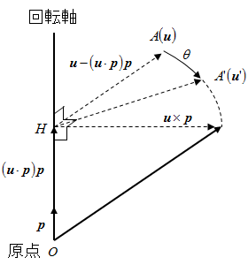

# 環・体

## 概要
「[群とは](group.md#group)」では算法を1つ持つ代数系の分類について説明しました。
ここでは、加法と乗法の2つを持つ代数系の分類について説明します。
このような代数系の分類として、環・体などがあります。

## 環・体とは
ある代数系
        (
          A,{＋, ×}
        )
      に対して、以下の条件を考えます。
（＋ を加法、× を乗法と呼びます。）

1. 加法に関して「[アーベル群](group.md#abelian)」をなす。

2. 加法と乗法の間に「[分配法則](algebraic.md#distributive)」が成り立つ。

3. 乗法に関して「[半群](group.md#semigroup)」をなす。

4. 加法に関する「[単位元](algebraic.md#unity)」（零元）を除いて、乗法に関して「[群](group.md#group)」をなす。

代数系Aが
1. 2. 3. を満たすとき、<strong id="ring" class="keyword">環</strong>(ring)とよび、
1. 2. 4. を満たすとき、<strong id="field" class="keyword">体</strong>(field)と呼びます。
また、これらは、乗法に関して可換であるとき、可換環・可換体と呼びます。
（ただし、可換なもののみを体と呼び、非可換なものは斜体と呼ぶ流儀もあります。）
慣例的に、環は R で、体は K で表すことが多いです。
（体の K はドイツ語の Körper の頭文字から取ったものらしい。）

加法に関する単位元を<strong id="zero" class="keyword">零元</strong>（zero element）と呼び、0 で表します。
また、環・体は、加法もしくは乗法のどちらか一方のみに注目する場合、以下のような書き方をします。

      A＋ ＝ {A, ＋}
    

      A× ＝ {A, ×}
    

さらに、
        A×
       から零元を除いたものを 
        A＊
       と表します。

      A＊ ＝ {
        A － {0}, ×
      }
    

代数系 A が体をなすとき、
        A＊
       は群をなします。

環 R の非0の元 x に対して、ある非0元 y があって、
xy ＝ 0 を満たすとき、x を<strong id="d54e160" class="keyword">零因子</strong>（zero divisor）と呼びます。
環 R が零因子を持たないとき、R を<strong id="integral" class="keyword">整域</strong>（integral domain）と呼びます。

## 環・体の簡単な例
よく知られている集合のうちで、環・体になっているものをいくつか例に挙げて紹介します。
<h4>整数・有理数・実数・複素数</h4>
整数 
        Z
       は可換環になります。
整数は乗法に関する逆元が存在しない（1 / 2 は整数ではない）ので、
体になりません。

有理数 
        Q
      、
実数 
        R
      、
複素数 
        C
      
はいずれも可換体になります。

自然数は加法に関しても逆元が存在しないので、環にもなりません。
<h4>正方行列</h4>
n 次元正方行列 
        M(n)
       は非可換環になります。

        a, b, c ∈ M(n)
       とすると、

* 
          a ＋ b ∈ M(n)
        

* 
          M(n)
        の零元は零行列O

* aの加法に関する逆元は
          －a ∈ M(n)
        

* 
          a × b ∈ M(n)
        

* 
          M(n)
        の単位元は単位行列I

* a × b ≠ b × a

* aの乗法に関する逆元は必ずしも存在しない。 （aが正則な場合に限り、逆元
          a－1
        が存在。）

* 
          c ×(a ＋ b)
          ＝
          c a ＋ c b
          ∈ M(n)
        

<h4>線形写像（積として関数の合成を使う）</h4>
（体 → 体 の任意の線形写像でも構わないんですが、話を簡単にするため、）
実数 → 実数 の線形写像 
        F(
          R
        )
       を考えます。

        f, g ∈ F(
          R
        )
       の加法・乗法を、

      f + g ＝ f(x) ＋ g(x)
    

      f × g ＝ f(
        g(x)
      )　　（写像の合成）
    

で定めると、これは非可換環になります。
写像の合成は結合法則を満たしますし、
線形写像の場合、

        f × (
          g1 ＋ g2
        )
        ＝
        f(
          g1(x) ＋ g2(x)
        )
        ＝
        f(
          g1(x)
        )
        ＋
        f(
          g2(x)
        )
        ＝
        f × g1 ＋ f × g2
      
が成り立つので、分配法則も成り立ちます。
また、
零元は 
        f(x) ＝ 0
      、
単位元は恒等写像 
        f(x) ＝ x
       です。
<h4>超関数（積として畳込み積を使う）</h4>
「[超関数](../distribution/distribution-e_distribution.md#distribution)」
f, g に対して加法および乗法を、

      f + g ＝ f(x) ＋ g(x)
    

      f × g ＝ f * g
      ＝
      ∫<table class="integral" summary="integral"><tr><td class="intsup"> </td></tr><tr><td style="font-size:30%;"> </td></tr><tr><td class="intsub"></td></tr></table>f(ξ) g(x － ξ)dξ
      　　（畳込み積）
    

で定義すると、可換体になります。
零元は 
        f(x) ＝ 0
      、
単位元はδ関数です。
<h4>正の実数（和として×、積として冪を使う）</h4>
正の実数 
        P ＝ {
          x | x ∈ R ∧ x ＞ 0
        }
       に対して、
加法 
        ＋P
       および乗法 
        ×P
       を

      a ＋P b ＝ a × b
    

      a ×P b ＝ a
        log b
      
    

で定義すると可換体となります。

ちなみに、この体

        {
          P, {
            ＋P, ×P
          }
        }
      
は写像 
        f(x) ＝ log x
       によって、

      f(P) ＝ R
    

      f(
        a ＋P b
      )
      ＝
      log(a × b)
      ＝
      log(a)
      ＋
      log(b)
      ＝
      f(a)
      ＋
      f(b)
    

      f(
        a ×P b
      )
      ＝
      log(
        a
          log b
        
      )
      ＝
      log a × log b
      ＝
      f(a)
      ×
      f(b)
    

となるので、実数体

        {
          R, {＋, ×}
        }
      
と同型になります。

## その他の体の例
有理数や実数など以外にも、様々な体が存在します。
このような体の例をいくつか紹介します。

### ハミルトンの四元数体
複素数は、
          i2 ＝ －1
         となる数 i と、2つの実数 a, b を使って a ＋ i b となるような数を作ったものです。
これと同様に、
          j2 ＝ －1
         となる数 j と、2つの複素数 α, β を使って 
          α ＋ jβ\*
         となるような数を作ることができます。
（
          x\*
         は x の共役複素数。）
このような数はハミルトンの四元数（Hamiltonian quaternion、ハミルトンは人名）、あるいは単に<strong id="quaternion" class="keyword">四元数</strong>（quaternion）と呼ばれています。
<em>四元数は非可換体</em>になります。

四元数は、2つの虚数単位 i, j および4つの実数 a, b, c, d を使って、
a ＋ i b ＋ j c ＋ ij d とも書き表すことができます。
あるいは、k ＝ ij と置いて、
a ＋ i b ＋ j c ＋ k d と書き表します。
i, j, k の間には以下のような関係式が成り立っています。

        i2 ＝ j2 ＝ k2 ＝ －1
      

        ij ＝ k, ki ＝ j, jk = i
      

        ji ＝ －k, ik ＝ －j, kj = －i
      

四元数という言葉は、4つの実数（4元）から作られた数という意味です。

#### ベクトルを使った表現
四元数 a ＋ i b ＋ j c ＋ k d は、
1つのスカラー x ＝ a と
1つのベクトル 
            u ＝ (b, c, d)
           を使って、

            (
              x, u
            )
           と書き表すことがあります。
x の部分を<em>スカラー部</em>、

            u
           の部分を<em>ベクトル部</em>と呼びます。
ベクトル部が 
            0
           のとき、
四元数 
            (
              x, 0
            )
           を実数と同一視し、
単に x で書き表します。
このような形式を用いることで、以下に述べるように、
加減乗除などの計算が簡単に書き表すことができます。

まず、四元数の加減算は非常に単純で、以下のようになります。
<em>
          

            (
              x, u
            ) ± (
              y, v
            )
            ＝
            (
              x ± y, u ± v
            )
          

        </em>
次に、乗算ですが、

          (a + i b + j c + k d) × (e + i f + j g + k h)
        

          ＝
          (ae － bf － cg － dh)
          ＋
          i(af ＋ be ＋ ch － dg)
        

          ＋
          j(ag ＋ ce ＋ df － bh)
          ＋
          k(ah ＋ de ＋ bg － cf)
        

なので、ベクトル表現では以下のようになります。
<em>
          

            (
              x, u
            ) × (
              y, v
            )
            ＝
            (
              xy － u ・ v,
              x v ＋ y u ＋ u × v
            )
          

        </em>
ただし、ベクトル間にある ・ はベクトルの内積、
× は外積を表します。

            u × v
           の部分が非可換なので、
四元数の積は非可換になります。

#### 絶対値・共役
四元数 
            α ＝ (
              x, u
            )
           に対して、
実数 
            √
              x2 ＋ |
                u
              |2
            
           を
α の絶対値と呼び、

            |α|
           で表します。

また、四元数 
            α ＝ (
              x, u
            )
           に対して、

            (
              x, －u
            )
           で表される四元数を、
<em>共役</em>な四元数と呼び、
            α\*
           で表します。

四元数 α とその共役四元数を掛け合わせると、

          αα\*
          ＝
          (
            x, u
          ) × (
            x, －u
          )
          ＝
          (
            x2 － u ・ (
              －u
            ),
            x u － x u ＋ u × (
              －u
            )
          )
        

          ＝
          (
            x2 ＋ |
              u
            |2, 0
          )
          ＝
          x2 ＋ |
            u
          |2
        

というように、絶対値の2乗になります。

このことから、

          α×<table class="frac" summary="fraction"><tr><td class="num">
              α\*
            </td></tr><tr><td>
              |α|
              2
            </td></tr></table>
          ＝
          <table class="frac" summary="fraction"><tr><td class="num">
              α\*
            </td></tr><tr><td>
              |α|
              2
            </td></tr></table>×α
          ＝
          1
        

となるので、α が非 0 のとき、
必ず逆数が存在し、
            <table class="frac" summary="fraction"><tr><td class="num">
                α\*
              </td></tr><tr><td>
                |α|
                2
              </td></tr></table>
           と表せます。
したがって、四元数は非可換体になります。

#### 3次元空間上の回転
複素数を使って2次元空間上の（原点中心の）回転を表すことができました。
すなわち、複素数 a ＋ ib を2次元ベクトル a, b とみなし、

            cosθ ＋ isinθ
           を掛けることで角度 θ の回転計算を行うことができます。
これと同様に、四元数を使うと、3次元空間上の（原点を含む軸中心の）回転を表すことができます。

まず、3次元空間上の回転というものがどういう式で表されるかについて説明します。
3次元空間上の回転を表すためには、回転軸ベクトル 
            p
           と回転角度 θが必要になります。
回転軸ベクトルの絶対値は意味を持たないので、
            |
              p
            | ＝ 1
           であるものとしてます。

座標ベクトル 
            u
           で表される点 A を、回転軸 
            p
           を中心に角度 θ 回転した点 A' の座標ベクトル 
            u'
           は、以下のような計算で求めることができます。
<em>
          

            u'
            ＝
            sinθ u×p
            ＋
            cosθ (
              u － (
                u・p
              )p
            )
            ＋
            (
              u・p
            )p
          

        </em>
ちなみに、この式の導出の仕方ですが、下図のようになります。

<figure>
	
	<figcaption>3次元ベクトルの回転</figcaption>
</figure>

原点を O、点 A から回転軸におろした垂線の足を H とすると、

          <Vec>OH</Vec> ＝ (
            u・p
          )p
        

          <Vec>HA</Vec> ＝ u － (
            u・p
          )p
        

となります。
また 
            u×p
           は、

            p
           および 
            <Vec>HA</Vec>
           に垂直で、
絶対値が 
            |
              <Vec>HA</Vec>
            |
           と等しいベクトルになります。

            <Vec>HA'</Vec>
           は、

          <Vec>HA'</Vec> ＝ cosθ <Vec>HA</Vec> ＋ sinθ u×p
        

と表すことができるので、先ほど示した式を導き出すことができます。

#### 四元数を使った回転
以上のことを踏まえた上で、本題の四元数を使った回転の話に入ります。
まず、絶対値が 1 になるような四元数を用意します。
絶対値が 1 の四元数 Σ は以下のように、
絶対値 1 の3次元ベクトル 
            p
           と角度 θ を用いて表すことができます。

          Σ ＝
          (
            cos<table class="frac" summary="fraction"><tr><td class="num">θ</td></tr><tr><td>2</td></tr></table>,
            sin<table class="frac" summary="fraction"><tr><td class="num">θ</td></tr><tr><td>2</td></tr></table>p
          )
        

そして、この四元数を以下のようにして他の四元数 
            α ＝ (
              x, u
            )
           に掛けます。

          Σ\*αΣ
          ＝
          (
            cos<table class="frac" summary="fraction"><tr><td class="num">θ</td></tr><tr><td>2</td></tr></table>,
            －sin<table class="frac" summary="fraction"><tr><td class="num">θ</td></tr><tr><td>2</td></tr></table>p
          )
          ×α×
          (
            cos<table class="frac" summary="fraction"><tr><td class="num">θ</td></tr><tr><td>2</td></tr></table>,
            sin<table class="frac" summary="fraction"><tr><td class="num">θ</td></tr><tr><td>2</td></tr></table>p
          )
        

このままだと少し計算が面倒なので、いったん 
            Σ ＝ (
              y, v
            )
           と置いて計算します。

          Σ\*αΣ
          ＝
          (
            y, －v
          )(
            x, u
          )(
            y, v
          )
          ＝
          (
            xy ＋ u・v,
            yu － xv － v×u
          )(
            y, v
          )
        

          ＝
          (
            x (
              y2 ＋ |
                v
              |2
            ),
            2y u×v
            ＋ (
              y2 － |
                v
              |2
            )u
            ＋ 2 (
              u・v
            )v
          )
        

この式に、

          (
            y2 ＋ |
              v
            |2
          )
          ＝ sin2<table class="frac" summary="fraction"><tr><td class="num">θ</td></tr><tr><td>2</td></tr></table>
          ＋ cos2<table class="frac" summary="fraction"><tr><td class="num">θ</td></tr><tr><td>2</td></tr></table> ＝ 1
        

          (
            y2 － |
              v
            |2
          )
          ＝ cos2<table class="frac" summary="fraction"><tr><td class="num">θ</td></tr><tr><td>2</td></tr></table>
          － sin2<table class="frac" summary="fraction"><tr><td class="num">θ</td></tr><tr><td>2</td></tr></table>
          ＝ cosθ
        

          2 y v
          ＝
          2 cos<table class="frac" summary="fraction"><tr><td class="num">θ</td></tr><tr><td>2</td></tr></table>sin<table class="frac" summary="fraction"><tr><td class="num">θ</td></tr><tr><td>2</td></tr></table>p
          ＝
          sinθ
          p
        

          2 sin2<table class="frac" summary="fraction"><tr><td class="num">θ</td></tr><tr><td>2</td></tr></table>
          ＝ 1 － cosθ
        

などの関係式を代入すると、
<em>
          

            Σ\*
            (
              x, u
            )
            Σ
            ＝
            (
              x,
              sinθ u×p
              ＋
              cosθ u
              ＋
              (
                1 － cosθ
              )(
                u・p
              )p
            )
          

        </em>
となります。
この式のベクトル部ですが、先ほど説明した3次元ベクトルの回転の式と一致しています。
すなわち、絶対値 1 の四元数 Σ を用意し、
<em>
            
              Σ\* α Σ
            
          </em> という計算をすることで、
3次元ベクトルの回転をすることができます。

#### 余談
四元数そのものはそれほど使い道のあるものではないんですが、
四元数の発見は歴史的には大きな意味のあるものだったそうです。

まず、四元数は非可換体です。
四元数が発見される以前、有理数・実数・複素数などの体はいずれも可換なものでした。
また、後述する整数の剰余環なども可換体です。
初めて見つかった非可換な体ということで、そのインパクトは非常に大きなものがあります。

さらに、四元数の研究を通じてさまざまな分野が発展しました。
まず、四元数のベクトル部の研究からベクトル代数・ベクトル解析というものが生まれました。
また、四元数の非可換性の研究から行列式などが派生しました。

ちなみに、複素数から四元数を作った手順と同様の手順で8元数や16元数と呼ばれる数を作ることもできます。
名前の通り、8元数は8つの実数から、16元数は16個の実数からなる数です。
ただし、8元数および16元数は積に関して結合法則がなりたたないため体ではありません。
さらに、16元数は零因子も持っています。

#### 余談2
回転軸と回転角度を指定するんじゃなくて、
球面上の点 
            a
           を別の点 
            b
           に移すような回転を考えるなら、以下のような式でできます。

簡単化のため、

            a, b
           は単位球面上の点
（
            |
              a
            | = |
              b
            | = 1
          ）
とします。
回転軸 
            p
           は

          p
          =
          <table class="frac" summary="fraction"><tr><td class="num">
              a
              ×
              b
            </td></tr><tr><td>
              |
                a
                ×
                b
              |
            </td></tr></table>
        

回転角 θ は

          cos θ = a ⋅ b
        

          sin θ = |
            a
            ×
            b
          |
        

になるので、結局、
所望の変換 
            u → u'
           は、

          c = a ⋅ b
        

          d
          =
          a
          ×
          b
        

とおいて、

          u'
          =
          u
          ×
          d
          +
          c u
          +
          <table class="frac" summary="fraction"><tr><td class="num">1</td></tr><tr><td>
            1 + c
          </td></tr></table>(
            u
            ⋅
            d
          )d
        

になります。

### 有限体
整数は環、有理数や実数などは体となりますが、
これらはいずれも無限集合です。
これに対して、有限集合となるような体も存在します。
このような体を<strong id="d54e2069" class="keyword">有限体</strong>（finite field）またはガロア体（Galois field）と呼びます。
（ガロアは人名。現在の群論・体論・代数論の基礎を築いた数学者。
情報系の分野ではガロア体と呼ばれる場合が多い。）

ここでは、この有限体の例として、
整数の剰余環を紹介します。

#### 整数の剰余環
0 から N－1 までの整数 a, b に対して、以下のようにして加法と乗法を定めます。

* 加法:
              a ＋ b (
                mod N
              )
            

* 乗法:
              a × b (
                mod N
              )
            

mod N は N で割ったあまりを表します。
このようにして作った代数系を<em>整数の剰余環</em>と呼び、

            Z/NZ
           と表します。
（この記法がどういう意味なのかは、剰余体を説明する際に述べます。）

例として、
            Z/4Z
           の加算および乗算の結果の表を示します。

<table summary="Z/4Z 加算表">
	<caption>
		Z/4Z 加算表
	</caption>
	<tr>
		<td markdown="1"></td>
		<th>0</th>
		<th>1</th>
		<th>2</th>
		<th>3</th>
	</tr>
	<tr>
		<th>0</th>
		<td markdown="1">0</td>
		<td markdown="1">1</td>
		<td markdown="1">2</td>
		<td markdown="1">3</td>
	</tr>
	<tr>
		<th>1</th>
		<td markdown="1">1</td>
		<td markdown="1">2</td>
		<td markdown="1">3</td>
		<td markdown="1">0</td>
	</tr>
	<tr>
		<th>2</th>
		<td markdown="1">2</td>
		<td markdown="1">3</td>
		<td markdown="1">0</td>
		<td markdown="1">1</td>
	</tr>
	<tr>
		<th>3</th>
		<td markdown="1">3</td>
		<td markdown="1">0</td>
		<td markdown="1">1</td>
		<td markdown="1">2</td>
	</tr>
</table>

<table summary="Z/4Z 乗算表">
	<caption>
		Z/4Z 乗算表
	</caption>
	<tr>
		<td markdown="1"></td>
		<th>1</th>
		<th>2</th>
		<th>3</th>
	</tr>
	<tr>
		<th>1</th>
		<td markdown="1">1</td>
		<td markdown="1">2</td>
		<td markdown="1">3</td>
	</tr>
	<tr>
		<th>2</th>
		<td markdown="1">2</td>
		<td markdown="1">0</td>
		<td markdown="1">2</td>
	</tr>
	<tr>
		<th>3</th>
		<td markdown="1">3</td>
		<td markdown="1">2</td>
		<td markdown="1">1</td>
	</tr>
</table>

            Z/NZ
           は「[環](#ring)」になっています。
加法・乗法ともに「[結合法則](algebraic.md#associative)」が成り立ち、「[単位元](algebraic.md#unity)」が存在しています。
加法に関しては、任意の元 a に対して －a ＝ N － a となり、逆元がただ1つ必ず存在します。
乗法に関しては、必ずしも逆元を持つとは限ず、零因子は持つ場合もあります。
先ほど例に挙げた 
            Z/4Z
           では、2 が零因子になっています（
            2×2 (
              mod 4
            ) ＝ 4 (
              mod 4
            ) ＝ 0
          ）。

#### 整数の剰余環の逆元

            Z/NZ
           の元 a が逆元を持つための条件を考えるために、まず、以下のような定理を紹介します。

<blockquote markdown="1">
整数係数 a, b, c を持つ不定方程式、

ax ＋ by ＝ c

が整数解を持つための必要十分条件は、

              gcd(a, b) ＝ c
             となることである。
（ただし、
              gcd
              (a, b)
             は a, b の最大公約数。）

</blockquote>
この定理の証明は省略しますが、
a, b がともにある整数 n の倍数のとき、
x, y の値が何であろうと、ax ＋ by の値も必ず n の倍数になるので、直感的になんとなく分かってもらえるのではないかと思います。

ここで、この定理の式を少し書き換えて見ます。
まず、b を N で置き換え、c は1に固定します。

          ax ＋ Ny ＝ 1
        

そして、両辺、N で割ったあまりを取ります。

          ax ≡ 1 (
            mod N
          )
        

結果的に何が言えるかというと、
a と N が互いに素（最大公約数が1）のときに限り、
不定方程式 
            ax ≡ 1 (
              mod N
            )
           が解を持つということになります。

この解 x は、
            Z/NZ
           における a の乗法に関する逆元ということになりますので、
<em>
            a は N と互いに素な場合にのみ逆元を持つ
          </em>という結論が得られます。

#### 整数の剰余体

            Z/NZ
           の元は、N と互いに素な場合にのみ乗法に関する逆元を持ちます。
これは言い換えると、N が素数 p である場合には、

            Z/pZ
           のすべての元が乗法に関する逆元を持つことになります。
すなわち、
            Z/pZ
           （p は素数）は体をなします。
このようにして得られた体を整数の<em>剰余体</em>（residual field）と呼びます。

例として、剰余体 
            Z/3Z
          、
            Z/5Z
          、
            Z/7Z
           の乗算結果の表を示します。

<table summary="Z/3Z 乗算表">
	<caption>
		Z/3Z 乗算表
	</caption>
	<tr>
		<td markdown="1"></td>
		<th>1</th>
		<th>2</th>
	</tr>
	<tr>
		<th>1</th>
		<td markdown="1">1</td>
		<td markdown="1">2</td>
	</tr>
	<tr>
		<th>2</th>
		<td markdown="1">2</td>
		<td markdown="1">1</td>
	</tr>
</table>

<table summary="Z/5Z 乗算表">
	<caption>
		Z/5Z 乗算表
	</caption>
	<tr>
		<td markdown="1"></td>
		<th>1</th>
		<th>2</th>
		<th>3</th>
		<th>4</th>
	</tr>
	<tr>
		<th>1</th>
		<td markdown="1">1</td>
		<td markdown="1">2</td>
		<td markdown="1">3</td>
		<td markdown="1">4</td>
	</tr>
	<tr>
		<th>2</th>
		<td markdown="1">2</td>
		<td markdown="1">4</td>
		<td markdown="1">1</td>
		<td markdown="1">3</td>
	</tr>
	<tr>
		<th>3</th>
		<td markdown="1">3</td>
		<td markdown="1">1</td>
		<td markdown="1">4</td>
		<td markdown="1">2</td>
	</tr>
	<tr>
		<th>4</th>
		<td markdown="1">4</td>
		<td markdown="1">3</td>
		<td markdown="1">2</td>
		<td markdown="1">1</td>
	</tr>
</table>

<table summary="Z/7Z 乗算表">
	<caption>
		Z/7Z 乗算表
	</caption>
	<tr>
		<td markdown="1"></td>
		<th>1</th>
		<th>2</th>
		<th>3</th>
		<th>4</th>
		<th>5</th>
		<th>6</th>
	</tr>
	<tr>
		<th>1</th>
		<td markdown="1">1</td>
		<td markdown="1">2</td>
		<td markdown="1">3</td>
		<td markdown="1">4</td>
		<td markdown="1">5</td>
		<td markdown="1">6</td>
	</tr>
	<tr>
		<th>2</th>
		<td markdown="1">2</td>
		<td markdown="1">4</td>
		<td markdown="1">6</td>
		<td markdown="1">1</td>
		<td markdown="1">3</td>
		<td markdown="1">5</td>
	</tr>
	<tr>
		<th>3</th>
		<td markdown="1">3</td>
		<td markdown="1">6</td>
		<td markdown="1">2</td>
		<td markdown="1">5</td>
		<td markdown="1">1</td>
		<td markdown="1">4</td>
	</tr>
	<tr>
		<th>4</th>
		<td markdown="1">4</td>
		<td markdown="1">1</td>
		<td markdown="1">5</td>
		<td markdown="1">2</td>
		<td markdown="1">6</td>
		<td markdown="1">3</td>
	</tr>
	<tr>
		<th>5</th>
		<td markdown="1">5</td>
		<td markdown="1">3</td>
		<td markdown="1">1</td>
		<td markdown="1">6</td>
		<td markdown="1">4</td>
		<td markdown="1">2</td>
	</tr>
	<tr>
		<th>6</th>
		<td markdown="1">6</td>
		<td markdown="1">5</td>
		<td markdown="1">4</td>
		<td markdown="1">3</td>
		<td markdown="1">2</td>
		<td markdown="1">1</td>
	</tr>
</table>

#### ブール体
2 も素数ですから、
            Z/2Z
           も剰余体になります。

            Z/2Z
           の元は 0 と 1 の2つだけで、
加算および乗算は以下のようになります。

<table summary="Z/2Z の加算・乗算">
	<caption>
		Z/2Z の加算・乗算
	</caption>
	<tr>
		<th>a</th>
		<th>b</th>
		<th>a ＋ b</th>
		<th>a × b</th>
	</tr>
	<tr>
		<td markdown="1">0</td>
		<td markdown="1">0</td>
		<td markdown="1">0</td>
		<td markdown="1">0</td>
	</tr>
	<tr>
		<td markdown="1">1</td>
		<td markdown="1">0</td>
		<td markdown="1">1</td>
		<td markdown="1">0</td>
	</tr>
	<tr>
		<td markdown="1">0</td>
		<td markdown="1">1</td>
		<td markdown="1">1</td>
		<td markdown="1">0</td>
	</tr>
	<tr>
		<td markdown="1">1</td>
		<td markdown="1">1</td>
		<td markdown="1">0</td>
		<td markdown="1">1</td>
	</tr>
</table>

情報系の方ならこの表に見覚えがあるんじゃないでしょうか。
1 を真（true）、0 を偽（false）とみなせば、

            Z/2Z
           の加算は XOR、
乗算は AND 演算になっています。

<table summary="XOR と AND">
	<caption>
		XOR と AND
	</caption>
	<tr>
		<th>a</th>
		<th>b</th>
		<th>a XOR b</th>
		<th>a AND b</th>
	</tr>
	<tr>
		<td markdown="1">0</td>
		<td markdown="1">0</td>
		<td markdown="1">0</td>
		<td markdown="1">0</td>
	</tr>
	<tr>
		<td markdown="1">1</td>
		<td markdown="1">0</td>
		<td markdown="1">1</td>
		<td markdown="1">0</td>
	</tr>
	<tr>
		<td markdown="1">0</td>
		<td markdown="1">1</td>
		<td markdown="1">1</td>
		<td markdown="1">0</td>
	</tr>
	<tr>
		<td markdown="1">1</td>
		<td markdown="1">1</td>
		<td markdown="1">0</td>
		<td markdown="1">1</td>
	</tr>
</table>

要するに、論理値 {true, false} に対して、XOR で和を、AND で積を定義した代数系は
剰余体 
            Z/2Z
           と同型な体になります。
このような体は、情報分野ではよく使われていて、
<strong id="bool" class="keyword">ブール体</strong>（Boolean field）などと呼ばれ、
            B
           で表されます。
（論理代数の考案者 George Boole の名から付いた名前。）

## 環・体に関する諸概念
### 位数
群の「[位数](group.md#order)」と同様に、
環・体に対しても、
その元の数（正確には「[濃度](../set/cardinality.md#cardinality)」）を<strong id="order" class="keyword">位数</strong>（order）と呼び、

          |K|
         というように表します。

### 同型
これも「[群同型](group.md#g_isomorphic)」と同様、
環・体にも同型の概念があります。
環として同型であることを<strong id="r_isomorphic" class="keyword">環同型</strong>（ring isomorphic）、
体として同型であることを<strong id="f_isomorphic" class="keyword">体同型</strong>（field isomorphic）と呼びます。

同型の条件はもちろん、
集合として同値であり、
さらに、算法の結果にも1対1の対応が取れることです。
すなわち、環の場合には、
二つの環

          {
            R, {
              ＋R, ×R
            }
          }
          ,
          {
            S, {
              ＋S, ×S
            }
          }
        
の間に、
「[全単写](../set/map.md#bijection)」f : R → S で、
任意の

          a, b, c ∈ R
        
に対して、
条件

        f(
          a ＋R b
        )
        ＝
        f(a) ＋S f(b)
      

        f(
          c ×R(
            a ＋R b
          )
        )
        ＝
        f(c)
        ×S(
          f(a) ＋S f(b)
        )
      

を満たすものが存在するとき、2つの環は環同型であるといいます。
体の場合も同様です。

## 執筆予定
<pre>
      有限体関係の説明は別ページに移動。
      リンクを張る。
    </pre>
