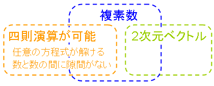

# 複素数

## <a id="sec-generated-title-1"></a> <a id="abst"></a>概要

高校の課程では「複素数と方程式」みたいな所でならうけど、
発展的にはあらゆる数学の分野で出てくる。
 
実数の範囲でだけ見ていてはよく分からなかったことが、複素数の範囲に広げてみると非常に見通しがよくなったりする。


## <a id="sec-generated-title-2"></a> <a id="variety"></a>複素数のいろんな側面

複素数には、図1に示すようないろいろな側面があります。

<figure>

[](../../../../assets/media/ufcpp2000/math/fig/complex01.png)

<figcaption>複素数</figcaption>
</figure>


ちゃんとした数学の言葉で言い表すと、これらは

* 四則演算が出来る ＝ 体を成す

* 任意の代数方程式が解ける ＝ 代数的閉体

* 隙間無く埋まってる ＝ 完備体

* 2次元ベクトル ＝ 実数上の2次の代数拡大体


複素数は、可換な「[体](../group/field.md#field)」（四則演算が全部できる数）としては最も大きなもの。
いろいろな性質が詰め込まれています。
代数的に閉、かつ、ユークリッド距離に関して完備。
 
実数係数の代数方程式の解は実数の範囲にはない場合があります。
例えば、
<span class="math">x<sup><span class="normal">2</span></sup><span class="normal">=</span><span class="normal">−</span><span class="normal">1</span></span> の解は虚数になりますね。
整数とか有理数の場合も同様で、
整数係数の代数方程式の解は整数の範囲にはないですし、
有理数係数の代数方程式も複素数解を持つ場合があります。
ですが、複素数の場合には、
複素数係数の代数方程式は、かならず複素数の範囲に解を持ちます。
このような性質を、<em>代数的に閉</em>であるといいます。
 
ちなみに、複素数が代数的に閉である、
言い換えると、「複素係数の代数方程式は（重複度を含めると）必ず次数と同じ数だけの解を持つ」というやつなんですが、
これは「代数学の基本定理」と呼ばれています。
 
完備というのは、任意の2つの数の間を連続に繋ぐことが出来るということです。
これは、実数の性質をそのまま受け継いだものです。
実数ってのは、数直線を使ってイメージされますが、数直線にはどこにも隙間がないと思います。
一方、有理数なんかは、数と数の間が飛び飛びなイメージ。
 
あと、複素数は実数上の2次元ベクトルになっていたりします。
「複素数 ＝ 2次元ベクトル」ではないんですが、
複素数が2次元ベクトルとしての性質も持っているということです。
これは、複素数が、実数の2次の「[代数拡大](../group/extensionfield.md#algebraic)」だからなんですが、
これは大学でも、数学科とかに入らないと習わなかったりします。
 
ただし、複素数が2次元ベクトルになるのは、実数倍と和に関して。
積に関しては、少し違う様相を示します。
新課程（2004年度入学以降の課程）ではなくなってしまったみたいですが、
ド・モアブルの定理という定理によって、
複素数の積が拡大と回転をつかさどるものだということが分かります。
（「拡大」と「回転」は実は極めて似た性質を持つ物だったりします。）


## <a id="sec-generated-title-3"></a> <a id="deMoivre"></a>ド・モアブルの定理

新課程では範囲外なようなので、
ド・モアブル（de Moivre）の定理について説明しておくと、以下のようなものです。
<div class="math">
      <span class="paren" style="font-size:em;">(</span>
        <span class="normal">cos</span>a <span class="normal">+</span> i <span class="normal">sin</span>a<span class="paren" style="font-size:em;">)</span>
      <span class="paren" style="font-size:em;">(</span>
        <span class="normal">cos</span>b <span class="normal">+</span> i <span class="normal">sin</span>b<span class="paren" style="font-size:em;">)</span>
      <span class="normal">=</span>
      <span class="normal">cos</span>
      <span class="paren" style="font-size:em;">(</span>a <span class="normal">+</span> b<span class="paren" style="font-size:em;">)</span>
      <span class="normal">+</span> i <span class="normal">sin</span><span class="paren" style="font-size:em;">(</span>a <span class="normal">+</span> b<span class="paren" style="font-size:em;">)</span></div>
証明は、左辺を展開して加法定理を使うだけです。
が、まあ、逆に言うと、この式を覚えておくと、加法定理が導出できます。
加法定理を覚えるよりは、こちらを覚えておく方が楽なので、
是非とも覚えておくべき。
 
ちなみに、この式を再帰的に使うことによって、
<span class="math">n</span> は自然数として下式が導出できます。
<div class="math">
      <span class="paren" style="font-size:em;">(</span>
        <span class="normal">cos</span>θ <span class="normal">+</span> i <span class="normal">sin</span>θ<span class="paren" style="font-size:em;">)</span>
      <sup>n</sup>
      <span class="normal">=</span>
      <span class="normal">cos</span>nθ <span class="normal">+</span> i <span class="normal">sin</span>nθ
</div>
（大学でならう知識まで動員するなら、
実は、<span class="math">n</span> は任意の複素数について成立します。）
 
さて、虚数単位 <span class="math">i</span> は <span class="math"><span class="normal">−</span><span class="normal">1</span></span> の平方根（の1つ）なわけですが、
じゃあ、<span class="math">i</span> の平方根は何でしょう？
これも、ド・モアブルの定理を使うと簡単に求まります。
<div class="math">
i
<span class="normal">=</span><span class="normal">cos</span><table class="frac" summary="fraction"><tr><td class="num">π</td></tr><tr><td>2</td></tr></table><span class="normal">+</span> i
<span class="normal">sin</span><table class="frac" summary="fraction"><tr><td class="num">π</td></tr><tr><td>2</td></tr></table><span class="normal">=</span><span class="paren" style="font-size:2em;">(</span><span class="normal">cos</span><table class="frac" summary="fraction"><tr><td class="num">π</td></tr><tr><td>4</td></tr></table><span class="normal">+</span> i
<span class="normal">sin</span><table class="frac" summary="fraction"><tr><td class="num">π</td></tr><tr><td>4</td></tr></table><span class="paren" style="font-size:2em;">)</span><sup>2</sup></div>
なので、
<span class="math">i</span> の平方根は、
<span class="math"><table class="frac" summary="fraction"><tr><td class="num"><span class="normal">1</span></td></tr><tr><td><span class="normal" style="font-size:em;">√</span><span class="bar"><span class="normal">2</span></span></td></tr></table><span class="normal">+</span> i<table class="frac" summary="fraction"><tr><td class="num"><span class="normal">1</span></td></tr><tr><td><span class="normal" style="font-size:em;">√</span><span class="bar"><span class="normal">2</span></span></td></tr></table></span>
（と、これにマイナス付けた奴の2つ）になります。
（
まあ、
<span class="math"><span class="paren" style="font-size:em;">(</span>a <span class="normal">+</span> i b<span class="paren" style="font-size:em;">)</span><sup><span class="normal">2</span></sup><span class="normal">=</span>
a<sup><span class="normal">2</span></sup><span class="normal">−</span> b<sup><span class="normal">2</span></sup><span class="normal">+</span> i
<span class="normal">2</span>ab
</span>
から、
<span class="math">a<sup><span class="normal">2</span></sup><span class="normal">−</span> b<sup><span class="normal">2</span></sup><span class="normal">=</span><span class="normal">0</span></span>
と
<span class="math"><span class="normal">2</span>ab <span class="normal">=</span><span class="normal">1</span></span>
という式を立てて、これを解いても同じ結果を得られますけど。
）
 
ド・モアブルの定理を使えば、
<span class="math">i</span> の平方根だけでなく、
<span class="math">i</span> を何乗しても何分の1乗（n 乗根）してもやっぱり複素数の範囲に収まることが分かります。
実数では、平方根を求めるのに虚数が必要になりましたが、
複素数では、もうこれ以上新しい数を考える必要がないわけです。


## <a id="sec-generated-title-4"></a> <a id="polar"></a>極形式

任意の複素数 <span class="math">α <span class="normal">=</span> a <span class="normal">+</span> i b</span> （<span class="math">a, b</span> は実数）は、
<div class="math">
r <span class="paren" style="font-size:em;">(</span><span class="normal">cos</span>θ <span class="normal">+</span> i <span class="normal">sin</span>θ<span class="paren" style="font-size:em;">)</span></div>
と書くこともできます。
ただし、
<span class="math">r <span class="normal">=</span><span class="normal" style="font-size:em;">√</span><span class="bar">a<sup><span class="normal">2</span></sup><span class="normal">+</span> b<sup><span class="normal">2</span></sup></span></span>
,
<span class="math">θ <span class="normal">=</span><span class="normal">tan</span><sup><span class="normal">−</span><span class="normal">1</span></sup><span class="paren" style="font-size:em;">(</span>b/a<span class="paren" style="font-size:em;">)</span></span>
です。
（数IIの方で、三角関数に慣れてくると、この発想も割と自然に受け入れられます。）
このとき、
<span class="math">r</span> を <span class="math">α</span> の絶対値、
<span class="math">θ</span> を <span class="math">α</span> の偏角と呼びます。
絶対値は <span class="math">r <span class="normal">=</span><span class="normal">|</span>α<span class="normal">|</span></span> と書き、
偏角は <span class="math">θ <span class="normal">=</span><span class="normal">arg</span>α</span> や
<span class="math">θ <span class="normal">=</span><span class="normal">∠</span>α</span> 等と書きます。
 
こんな風に書くことにどういうメリットがあるかというと、
ド・モアブルの定理のおかげで、
<div class="math">
r<sub>α</sub><span class="paren" style="font-size:em;">(</span><span class="normal">cos</span>θ<sub>α</sub><span class="normal">+</span> i <span class="normal">sin</span>θ<sub>α</sub><span class="paren" style="font-size:em;">)</span>
×
r<sub>β</sub><span class="paren" style="font-size:em;">(</span><span class="normal">cos</span>θ<sub>β</sub><span class="normal">+</span> i <span class="normal">sin</span>θ<sub>β</sub><span class="paren" style="font-size:em;">)</span><span class="normal">=</span>
r<sub>α</sub> r<sub>β</sub><span class="paren" style="font-size:1.5em;">(</span><span class="normal">cos</span><span class="paren" style="font-size:em;">(</span>θ<sub>α</sub><span class="normal">+</span> θ<sub>β</sub><span class="paren" style="font-size:em;">)</span><span class="normal">+</span>
i <span class="normal">sin</span><span class="paren" style="font-size:em;">(</span>θ<sub>α</sub><span class="normal">+</span> θ<sub>β</sub><span class="paren" style="font-size:em;">)</span><span class="paren" style="font-size:1.5em;">)</span></div>
ということができるので、
複素数の掛け算が、
絶対値の乗算1回と、偏角の加算1回でできるようになります。
（元のままで掛け算するなら、乗算4回と加減算2回。）
 
もう1歩思い切って、
絶対値の方も対数を取ってしまいましょう。
<div class="math">
g<sub>α</sub><span class="normal">=</span><span class="normal">log</span><span class="normal">|</span>α<span class="normal">|</span></div>
すると、任意の複素数は
<div class="math">
      <span class="normal">e</span>
      <sup>g</sup>
      <span class="paren" style="font-size:em;">(</span>
        <span class="normal">cos</span>θ <span class="normal">+</span> i <span class="normal">sin</span>θ<span class="paren" style="font-size:em;">)</span>
    </div>
と書けるわけですが、
こうすると、2つの複素数の間の掛け算は
<div class="math">
      <span class="normal">e</span>
      <sup>g<sub>α</sub></sup>
      <span class="paren" style="font-size:em;">(</span>
        <span class="normal">cos</span>θ<sub>α</sub><span class="normal">+</span> i <span class="normal">sin</span>θ<sub>α</sub><span class="paren" style="font-size:em;">)</span>
×
<span class="normal">e</span><sup>g<sub>β</sub></sup><span class="paren" style="font-size:em;">(</span><span class="normal">cos</span>θ<sub>β</sub><span class="normal">+</span> i <span class="normal">sin</span>θ<sub>β</sub><span class="paren" style="font-size:em;">)</span><span class="normal">=</span><span class="normal">e</span><sup><span class="paren" style="font-size:em;">(</span>g<sub>α</sub><span class="normal">+</span> g<sub>β</sub><span class="paren" style="font-size:em;">)</span></sup><span class="paren" style="font-size:1.5em;">(</span><span class="normal">cos</span><span class="paren" style="font-size:em;">(</span>θ<sub>α</sub><span class="normal">+</span> θ<sub>β</sub><span class="paren" style="font-size:em;">)</span><span class="normal">+</span>
i <span class="normal">sin</span><span class="paren" style="font-size:em;">(</span>θ<sub>α</sub><span class="normal">+</span> θ<sub>β</sub><span class="paren" style="font-size:em;">)</span><span class="paren" style="font-size:1.5em;">)</span></div>
となって、対数絶対値と偏角の和がそれぞれ1回ずつになります。
 
この結果なんですが、
よくよく考えみると、
指数関数と <span class="math"><span class="normal">cos</span>θ <span class="normal">+</span> i <span class="normal">sin</span>θ</span>、
対数関数と <span class="math"><span class="normal">arg</span>α</span> に何らかの関連性があるんじゃないかと思えてきます。
実際、大学に入ると習うんですが、これらの間には極めて強い関連性があります。
（詳しくは「[三角関数](sincos.md)」の方で書こうかと。）


## <a id="sec-generated-title-5"></a> <a id="figure"></a>回転のできる2次元ベクトル

新課程（2004年度入学以降の課程）だと、ド・モアブルの定理とかは課程外なんでしたっけ？
複素数は、「回転のできる2次元ベクトル」として“も”使えるんで、
旧課程（1995～2003年度入学の人の課程）だと複素数を使った図形の問題なんかもありました。
 
まあ、複素数を使った幾何をなくしたい気持ちも分からなくはないんですよね。
「数」のはずの複素数でなんで図形の問題を解けるんだろう？って混乱する学生も結構いるみたいですし。
あと、回転は、複素数じゃなくても、ベクトルと行列を使ってできますから。
というか、複素数だと2次元しか扱えませんが、
行列なら何次元でも扱えますし。
（3次元の場合なら、四元数という物を使う手もありますが。
参考： 「[ハミルトンの四元数体](../group/field.md#quaternion)」。）
 
でも、ド・モアブルの定理自体をなくすのはちょっとどうかと思うんですけど。
ド・モアブルの定理は、
「高校数学の中で最も美しい定理」なんていう人もいたくらいで。
それに、これを覚えてると、三角関数の公式を忘れにくくなるし。
（まあ、逆に、三角関数の方の知識がないとド・モアブルの定理が理解しづらいってのもありますけど。）
 
そのさらに前の旧課程（1994年度入学以前）でも、
複素数がらみは課程に入ってなかったんですけど、
課程が変わって、
「ド・モアブルの定理が追加されたのはすばらしいけど、
複素数平面まで追加したのはやりすぎ」
とよく言われていました。
 
まあ、とにかく、「複素数は回転のできる2次元ベクトルとしても使える」とか
「行列でも同じ事ができる」という部分について、少し触れておきましょう。
 
以下のように、複素数の計算とベクトル・行列の計算を比べてみましょう。
まずは足し算から。
<div class="math">
      <span class="paren" style="font-size:em;">(</span>a <span class="normal">+</span> i b<span class="paren" style="font-size:em;">)</span>
      <span class="normal">+</span>
      <span class="paren" style="font-size:em;">(</span>c <span class="normal">+</span> i d<span class="paren" style="font-size:em;">)</span>
      <span class="normal">=</span>
      <span class="paren" style="font-size:em;">(</span>a <span class="normal">+</span> c<span class="paren" style="font-size:em;">)</span>
      <span class="normal">+</span> i <span class="paren" style="font-size:em;">(</span>b <span class="normal">+</span> d<span class="paren" style="font-size:em;">)</span></div><div class="math">
      <span class="paren" style="font-size:em;">(</span>a, b<span class="paren" style="font-size:em;">)</span>
      <span class="normal">+</span>
      <span class="paren" style="font-size:em;">(</span>c, d<span class="paren" style="font-size:em;">)</span>
      <span class="normal">=</span>
      <span class="paren" style="font-size:em;">(</span>
a <span class="normal">+</span> c, b <span class="normal">+</span> d
<span class="paren" style="font-size:em;">)</span>
    </div><div class="math">
      <span class="paren" style="font-size:3em;">[</span><table class="matrix" summary="matrix"><tr><td>a</td><td>
            <span class="normal">−</span>b</td></tr><tr><td>b</td><td>a</td></tr></table><span class="paren" style="font-size:3em;">]</span>
      <span class="normal">+</span>
      <span class="paren" style="font-size:3em;">[</span><table class="matrix" summary="matrix"><tr><td>c</td><td>
            <span class="normal">−</span>d</td></tr><tr><td>d</td><td>c</td></tr></table><span class="paren" style="font-size:3em;">]</span>
      <span class="normal">=</span>
      <span class="paren" style="font-size:3em;">[</span><table class="matrix" summary="matrix"><tr><td>a<span class="normal">+</span>c</td><td>
            <span class="normal">−</span>
            <span class="paren" style="font-size:em;">(</span>b<span class="normal">+</span>d<span class="paren" style="font-size:em;">)</span>
          </td></tr><tr><td>b<span class="normal">+</span>d</td><td>a<span class="normal">+</span>c</td></tr></table><span class="paren" style="font-size:3em;">]</span>
    </div>
お次は掛け算。
<div class="math">
      <span class="paren" style="font-size:em;">(</span>a <span class="normal">+</span> i b<span class="paren" style="font-size:em;">)</span>
      <span class="paren" style="font-size:em;">(</span>c <span class="normal">+</span> i d<span class="paren" style="font-size:em;">)</span>
      <span class="normal">=</span>
      <span class="paren" style="font-size:em;">(</span>ac <span class="normal">−</span> bd<span class="paren" style="font-size:em;">)</span>
      <span class="normal">+</span> i <span class="paren" style="font-size:em;">(</span>ad <span class="normal">+</span> bc<span class="paren" style="font-size:em;">)</span></div><div class="math">
      <span class="paren" style="font-size:3em;">[</span><table class="matrix" summary="matrix"><tr><td>a</td><td>
            <span class="normal">−</span>b</td></tr><tr><td>b</td><td>a</td></tr></table><span class="paren" style="font-size:3em;">]</span>
      <span class="paren" style="font-size:3em;">[</span><table class="matrix" summary="matrix"><tr><td>c</td></tr><tr><td>d</td></tr></table><span class="paren" style="font-size:3em;">]</span>
      <span class="normal">=</span>
      <span class="paren" style="font-size:3em;">[</span><table class="matrix" summary="matrix"><tr><td>ac <span class="normal">−</span> bd</td></tr><tr><td>ad <span class="normal">+</span> bc</td></tr></table><span class="paren" style="font-size:3em;">]</span>
    </div><div class="math">
      <span class="paren" style="font-size:3em;">[</span><table class="matrix" summary="matrix"><tr><td>a</td><td>
            <span class="normal">−</span>b</td></tr><tr><td>b</td><td>a</td></tr></table><span class="paren" style="font-size:3em;">]</span>
      <span class="paren" style="font-size:3em;">[</span><table class="matrix" summary="matrix"><tr><td>c</td><td>
            <span class="normal">−</span>d</td></tr><tr><td>d</td><td>c</td></tr></table><span class="paren" style="font-size:3em;">]</span>
      <span class="normal">=</span>
      <span class="paren" style="font-size:3em;">[</span><table class="matrix" summary="matrix"><tr><td>ac <span class="normal">−</span> bd</td><td>
            <span class="normal">−</span>
            <span class="paren" style="font-size:em;">(</span>ad <span class="normal">+</span> bc<span class="paren" style="font-size:em;">)</span>
          </td></tr><tr><td>ad <span class="normal">+</span> bc</td><td>ac <span class="normal">−</span> bd</td></tr></table><span class="paren" style="font-size:3em;">]</span>
    </div>
右辺に同じような結果が得られていますね。
<span class="math"><span class="paren" style="font-size:3em;">[</span><table class="matrix" summary="matrix"><tr><td>a</td><td><span class="normal">−</span>b</td></tr><tr><td>b</td><td>a</td></tr></table><span class="paren" style="font-size:3em;">]</span></span>
というような形をした行列によって、ベクトルの拡大と回転を表現できます。
また、この行列は、
<div class="math">
I
<span class="normal">=</span><span class="paren" style="font-size:3em;">[</span><table class="matrix" summary="matrix"><tr><td><span class="normal">1</span></td><td><span class="normal">0</span></td></tr><tr><td><span class="normal">0</span></td><td><span class="normal">1</span></td></tr></table><span class="paren" style="font-size:3em;">]</span></div><div class="math">
J
<span class="normal">=</span><span class="paren" style="font-size:3em;">[</span><table class="matrix" summary="matrix"><tr><td><span class="normal">0</span></td><td><span class="normal">−</span><span class="normal">1</span></td></tr><tr><td><span class="normal">1</span></td><td><span class="normal">0</span></td></tr></table><span class="paren" style="font-size:3em;">]</span></div>
とおくと、<span class="math">aI <span class="normal">+</span> bJ</span> と書けるわけですが、
これは、足し算に関しても掛け算に関しても、
複素数 <span class="math">a <span class="normal">+</span> i b</span> と全く同じ計算法則に従います。
 
数学の世界では、見た目が全然違っても、
「同じ法則に従う物は同じとみなす」ことがあるんですが、
こういう、同じ法則に従う2つの物を「互いに同値」とか「同型」と呼びます。
そういう立場から見ると、
行列 <span class="math">aI <span class="normal">+</span> bJ</span> と複素数 <span class="math">a <span class="normal">+</span> i b</span> は互いに同値な関係にあります。


## <a id="sec-generated-title-6"></a> <a id="plan"></a>執筆予定

```text
現実に存在しない？
実際、物理量として観測されるものはほぼ実数。
うまく出来てる物で、物理法則を示す公式中に複素数が出てきても、
実際に観測値に相当する結果の部分は実数になる。

でも、道具としては非常に有用。
有用なものは、実在するかどうかとか関係なく使うのが数学。
```
関連：
「[3次以上](m1.md#highorder)」、
「[虚数解の場合](sequence.md#imaginary)」。
 
大学の範囲になるけど、関連：
「[虚数解の場合](../analysis/diffsecond.md#imaginary)」、
「[回転： 共役複素数解の場合](../linear/eigen.md#roteta)」。
