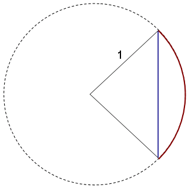
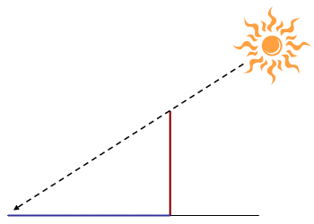
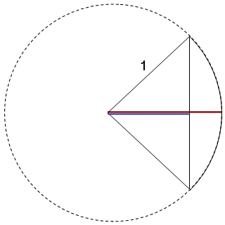
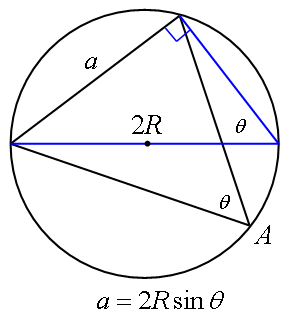
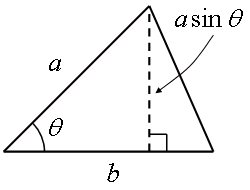
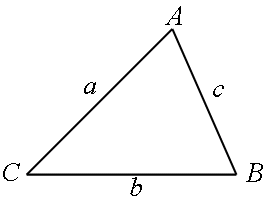

# 数学I

##  方程式と不等式

* 数と式 - 実数、式の展開、因数分解

* 一次不等式

* 二次方程式

* 二次不等式

不等式とかは、理屈が難しいということは全然ないはず。
ほんとにもう、ひたすら問題といて暗算で1瞬で解けるようになるように。

###  因数分解 ≒ 方程式の解を求める問題

「解と係数の関係」を習うと分かるように、
方程式の因数分解ってのは、方程式の解を求める問題とほぼ等価。
 
係数がたまたま分かりやすい物の場合は簡単に解けるし、
2次関数の場合、解の公式があるので100％解ける。
でも、3次、4次の場合、解の公式は複雑だし、
5次以上になると、一般的には解けなくなる。
 
因数分解の練習をひたすらさせられるのは、
（係数がきれいな場合の）2次方程式の解を求めるのを高速化するためと、
一般的には解けない/解きづらい3次以上の方程式の解が場合によっては簡単に求められるようにするため。

###  3次以上

3次方程式の解法について知りたければ、「カルダノの公式」をキーワードに調べてみるといい。
5次以上の方程式が一般的に解けないことを証明したのは[アーベル](http://ja.wikipedia.org/wiki/%E3%83%8B%E3%83%BC%E3%83%AB%E3%82%B9%E3%83%BB%E3%82%A2%E3%83%BC%E3%83%99%E3%83%AB)。
どういうときに解けて、どういうときに解けないのかを明らかにしたのは[ガロア](http://ja.wikipedia.org/wiki/%E3%82%AC%E3%83%AD%E3%82%A2)。
 
ちなみに、カルダノの公式を使うと、
実数解しか持たない場合でも、
解法の途中の段階で複素数が出てきてしまう。
複素数という、現実には存在しないといわれる数の存在を認めるかどうか悩んでいた当時の学者達にとって、
これは結構衝撃的なことだったみたい。
結局、現実に存在するかどうかというのは数学にとってはたいした問題ではなくて、
理論を展開する上で有益かどうかが問題。

###  因“数”？

そういえば、多項式に対して因“数”分解っていうのはちょっと違和感があるかも。
多項式だから、“数”ではないし。
しいて言うなら、因多項式分解？
英語だと foctoring か factorization なんですけどね。
因子分解です。
整数に対して prime factoring を素因数分解と呼ぶんで、その影響。
 
素元分解という呼び方なら、多項式の既約多項式分解も素元分解になるんですが。
既約多項式は、整数に対する素数みたいなもの。
正確には、既約元と素元はちょっと異なる概念なんですが、
整数とか実係数の多項式の場合は一致します。
 
まあ、因数分解という言葉もまったく的外れな言葉でもなくて、
多項式ってのは整数と、
有理式ってのは有理数と似たような法則性に従う部分があるんで、
多項式もある種の“数”の一種だと考えられなくもない。
（参考： 「[数学](../index.md)」）

##  二次関数

* 二次関数とそのグラフ

* 二次関数の値の変化

2次だし、簡単。
3次以上になるととたんに複雑になるんですが、
まあ、応用上、2次式が現れる理論は多いですし、
基本的な発想は3次以上の場合でも変わらないことが多い。

###  高次元の場合でも同じ発想

例えば、ある領域内での関数の最大値・最小値を求める問題
（例えば、0≦ x ≦1
における x2+ x +3 の最小値を求めるとか）
の場合、
領域の両端
（さっきの例の場合、
x =0
か
x =1）
か、頂点の位置（2次関数の場合。一般には極値と呼ばれる位置。）のどちらかに最小値がある。
 
この発想は2次関数以外の場合でもあんまり変わりません。
たいていは、領域の両端か、頂点（極値）のどこかに最大・最小が来ます。
 
極値というのは、数II、数III で習う「微分」というものが 0 になる点のことなんで、
数II、数III の内容を先にかじってみると面白いかも。

###  多変数の場合でも同じ発想

さらに言うと、自由変数の数が増えても同様です。
領域の境界上か、極値の位置のどこかに最大値・最小値が来ます。
例えば、
x2+ 5xy + 3y2≦5 という領域内における
x y3+ 2x2 y + 3x + y
の最小値を求めよとか言われた場合は、
領域内の x y3+ 2x2 y + 3x + y の極値と、
境界の式
x2+ 5xy + 3y2=5
という条件付きでの極値を求めて、その値の中から最小のものを選ぶことになります。
 
多変数の場合の極値問題は、「偏微分」という考え方が必要で、
条件付き極値問題には「ラグランジュの未定定数法」という解法があります
（大学の1年くらいで習う内容）。
興味があるなら調べてみてください。

##  図形と計量

* 三角比 - 正弦・余弦・正接、三角比の相互関係

* 三角比と図形 - 正弦定理、余弦定理、図形の計量

数IIで習う「三角関数」への布石でしかなかったり。
数IIの方を先にちょっと眺めてみると世界が広がるかも。

###  sine, cosine

tangent は辞書を引くと「接する、接線」とかいう意味が出てくるんでまだマシですけど、
sine, cosine ってのはよく分からない単語ですね。
多分、英和辞書を引いても、正弦関数・余弦関数としか出てこないと思います。
 
sine の語源はラテン語の sinus（曲線、曲がりくねった湾）らしい。
元々はインドの言葉で弦を表す jiva という単語で呼ばれていたものが、
（アラビア語訳を経て）ラテン語化するときに sinus と訳されたらしい。
（アラビア語訳の時点で、入り江を表す jayb に変わっていたみたい。←誤訳らしい？）
なので、大元の jiva から直訳するなら「弦関数」。
cosine の方との対比で、正弦と呼ばれます。
 
「弦関数」の意味どおり、元々は円の弧の長さ（図1中、赤線）と弦の長さ（図1中、青線）の間の関係式として考案されたものです。
円弧は中心角に比例しますので、結局は角度と弦の間の関係式になります。
（今では、弦の上半分だけの長さを考えますが元々は弦全体。）

<figure>

<figcaption>sine の元々のニュアンス</figcaption>
</figure>

cosine は、要するに co-sine で、
co- は complementary （相補的な、補完的な）の意味。
余角（co-angle、足して直角になる角度）の sine ということで co-sine。
complementary の意味の co- は「余」と訳すので、余弦関数。

###  tangent

tangent は、元々の由来は sine, cosine の方とは別で、
日時計に由来するらしい。
要するに、日時計の棒の長さ（図2中、赤線）と影の長さ（図2中、青線）の関係式が tangent。

<figure>

<figcaption>tangent</figcaption>
</figure>

tangent という単語は接線を表すんですが、
この言葉を使うのは、
図2みたいに日の光が棒の先端に接するようなイメージからですかね。
で、意訳して「接関数」。
これも cosine と同じく余角の tangent である co-tangent と区別して、
正接と余接。
 
また、tangent という言葉は、
「接線 → 曲線の局所的な傾き」
という連想から傾斜とか勾配という意味合いも持ちます。
この意味どおり、
三角形の傾きが大きいほど、三角関数の tan の値も大きくなります。
 
ちなみに、余角の tangent である co-tangent （式中では cot と表記）の方は、

        cotθ
=tan(90°− θ)=<table class="frac" summary="fraction"><tr><td class="num">sin(90°− θ)</td></tr><tr><td>cos(90°− θ)</td></tr></table>=<table class="frac" summary="fraction"><tr><td class="num">cosθ</td></tr><tr><td>sinθ</td></tr></table>=<table class="frac" summary="fraction"><tr><td class="num">1</td></tr><tr><td>tanθ</td></tr></table>

となって、
tan を使って表せるので、不要といえば不要。
なので、もう高校の課程では習わないはず。

###  secant

現在では、直角三角形の辺の比として sine, cosine, tangent の概念を覚えますが、
前節でも説明したとおり、元々は円弧と弦の関係や、日時計の棒と影の関係を表すものでした。
 
で、昔はもう1個、図3に示すような、
円の半径（図3中、赤線）と割線（図3中、青線。円の半径を弦で分割した線）の比である
secant（セカント、単語の意味は「分割」）というものも使っていました。
secant の意味が「分割」なので、和訳は正割。

<figure>

<figcaption>secant</figcaption>
</figure>

まあ、結局、secant（式中では sec と表記）は、
secθ =<table class="frac" summary="fraction"><tr><td class="num">1</td></tr><tr><td>cosθ</td></tr></table>
と表すことができるので、
cot と同じく不要で、
現在は高校の課程では習いません。
（というか習った所で使いません。）
 
あと、まあ、co-sine や co-tangent の話から察せられる通り、
こいつにも余角の secant である co-secant（余割。式中では cosec あるいは csc）があって、
cosecθ =<table class="frac" summary="fraction"><tr><td class="num">1</td></tr><tr><td>sinθ</td></tr></table>。

###  正弦定理

正弦定理は、図1みたいな作図で証明するんですが、
式を覚えるよりも、この図を丸々覚える方がいいです。
図的に覚えられるものは全部図で覚えましょう。
式で覚えるよりも忘れにくいです。
 
図4の青い方の直角三角形を見れば分かるように、
a = 2R sinA。
円周角が等しいという幾何学の定理を利用。

<figure>

<figcaption>正弦定理</figcaption>
</figure>

あるいは、三角形の面積の公式

S
=<table class="frac" summary="fraction"><tr><td class="num">1</td></tr><tr><td>2</td></tr></table>ab sinC
=<table class="frac" summary="fraction"><tr><td class="num">1</td></tr><tr><td>2</td></tr></table>bc sinA
=<table class="frac" summary="fraction"><tr><td class="num">1</td></tr><tr><td>2</td></tr></table>ca sinB

で覚えてもいいかも。
この式は、図5で証明。
面積 ＝ 1/2 ×底辺×高さ。

<figure>

<figcaption>三角形の面積と sin</figcaption>
</figure>

###  余弦定理

余弦定理は、ベクトルの概念覚えてれば実は暗記の必要なし。
なので、数Bを先に眺めてみてもいいと思う。
 
（ウェブサイト上で文字の上の矢印は出しづらいんで、大学式の記法になって申し訳ないけど）
ベクトルを a, b と太字アルファベットで表して、

        |
          a
          −
          b
        |
        2
        =
        |
          a
        |
        2
        +
        |
          b
        |
        2
        −
2 a⋅b

なので、図6のような三角形で、
CA ベクトルを a、
CB ベクトルを b と考えると、

c2=
a2+
b2−
2 ab cosC

        cosC
=<table class="frac" summary="fraction"><tr><td class="num">
a2+
b2−
c2</td></tr><tr><td>
2 ab 
</td></tr></table>

<figure>

<figcaption>三角形の3頂点と3辺</figcaption>
</figure>
