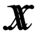
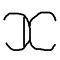

# ベクトル

## <a id="sec-generated-title-1"></a> <a id="abst"></a>概要

```text
これの概念が分かってるだけで物理がすごく簡単に。
高校の物理なんて、ベクトルと
m (d^2/dt^2)x = f
だけ分かってればほとんど分かったも同然（特に力学）。

空間になっても、やることは平面と全く同じ。
紙の上に作図しずらいからってびびらないように。
でも、計算手間的には大変。
```

## <a id="sec-generated-title-2"></a> <a id="char"></a>ベクトルに使う文字

高校では、ベクトルを表すために、
アルファベットの上に矢印を書きますが、
この記法は大学に入ったとたんに使われなくなります。
大学以降では、
<span class="math"><span class="vector">x</span></span> というように、
太字アルファベットで表すことが多い。
今では使われませんけど、
昔は、同じ文字を2重に重ねたものを使っていたりもしたらしい（図1）。

<figure>

[](../../../../assets/media/ufcpp2000/math/fig/mb01.png)

<figcaption>2重文字</figcaption>
</figure>


まあ、線の太さだけだとちょっと区別がしずらいですが、
文脈で判断できる場合も多いので、あまり気にしないことが多いです。
ちなみに、
スカラーとの混在がなかったり、
ベクトルであることが100％明白であるような場合には、
普通のアルファベットで書く場合すらあります。
<span class="math">
x
<span class="normal">=</span><span class="paren" style="font-size:em;">(</span>x<sub>1</sub> , x<sub>2</sub><span class="paren" style="font-size:em;">)</span></span>
みたいに、添え字がないのがベクトルで、
添え字付きがその要素。
 
でも、習い始めの頃は、
スカラーとベクトルを明確に区別できないと陥りがちなミスってのがありますから、
もう、あからさまに別物であることが分かる矢印記法が採用されているんだと思います。
（例えば、
<span class="math"><span class="normal">|</span>ab<span class="normal">|</span><span class="normal">=</span><span class="normal">|</span>a<span class="normal">|</span><span class="normal">|</span>b<span class="normal">|</span></span>
と
<span class="math"><span class="vector">a</span><span class="normal">⋅</span><span class="vector">b</span><span class="normal">=</span><span class="normal">|</span>a<span class="normal">|</span><span class="normal">|</span>b<span class="normal">|</span><span class="normal">cos</span>θ</span>
とか、
ベクトルとスカラーの違いを意識しないとまずい。）
 
あと、印刷物の場合、文字の上に矢印を出すのは結構めんどくさいですからね。
電子文書を書く場合なんかでも、
太字アルファベットの方が出すのが楽です。
 
一方で、手書きで書く場合には、太字というのはなかなか表現しづらいですからね。
鉛筆を持ち換えるわけにも行きませんし。
これも、高校で太字記法を使わない理由の1つだと思います。
 
太字というのをどうやって表現するかと言うと、
図2みたいに、線を1本増やす方法を採ります。
これ、慣れないうちはなかなか綺麗に書けないんですよね。
まさか高校の数学の授業で書き取りの練習させるわけにも行かないですし、
かといって、
判別できない文字を書かれたら採点ができないですから。
あと、どこに線を1本増やすのかは、結構人によって流儀がまちまちだったりも。

<figure>

[](../../../../assets/media/ufcpp2000/math/fig/mb02.png)

<figcaption>手書きの場合の太字記法</figcaption>
</figure>


## <a id="sec-generated-title-3"></a> <a id="cross"></a>外積

教科書には出てこないけども、参考書などで頻出するものに、
3次元ベクトルの外積（outer product）というものがあります。
以下のようなもの。
<div class="math">
      <span class="paren" style="font-size:em;">(</span>x<sub><span class="normal">1</span></sub>, y<sub><span class="normal">1</span></sub>, z<sub><span class="normal">1</span></sub><span class="paren" style="font-size:em;">)</span>
      <span class="normal">×</span>
      <span class="paren" style="font-size:em;">(</span>x<sub><span class="normal">2</span></sub>, y<sub><span class="normal">2</span></sub>, z<sub><span class="normal">2</span></sub><span class="paren" style="font-size:em;">)</span>
      <span class="normal">=</span>
      <span class="paren" style="font-size:em;">(</span>
 y<sub><span class="normal">1</span></sub>z<sub><span class="normal">2</span></sub><span class="normal">−</span>
 z<sub><span class="normal">1</span></sub>y<sub><span class="normal">2</span></sub>
 ,
 z<sub><span class="normal">1</span></sub>x<sub><span class="normal">2</span></sub><span class="normal">−</span>
 x<sub><span class="normal">1</span></sub>z<sub><span class="normal">2</span></sub>
 ,
 x<sub><span class="normal">1</span></sub>y<sub><span class="normal">2</span></sub><span class="normal">−</span>
 y<sub><span class="normal">1</span></sub>x<sub><span class="normal">2</span></sub><span class="paren" style="font-size:em;">)</span>
    </div>
内積には・記号を、外積には×記号を使うので、
それぞれ、ドット積（dot product）、クロス積（cross product）と呼ぶ場合もあります。
 
大学で習う行列式（「[行列式](../linear/determinant.md)」参照）という物を使って、
以下のように覚える方法もあり。
（ただし、
<span class="math"><span class="vector">i</span><sub>x</sub>,
<span class="vector">i</span><sub>y</sub>,
<span class="vector">i</span><sub>z</sub></span>
は、それぞれ <span class="math">x, y, z</span> 軸方向の単位ベクトル。）
<div class="math">
      <span class="paren" style="font-size:4em;">|</span>
        <table class="matrix" summary="array"><tr><td>
              <span class="vector">i</span>
              <sub>x</sub>
            </td><td>
              <span class="vector">i</span>
              <sub>y</sub>
            </td><td>
              <span class="vector">i</span>
              <sub>z</sub>
            </td></tr><tr><td>x<sub><span class="normal">1</span></sub></td><td>y<sub><span class="normal">1</span></sub></td><td>z<sub><span class="normal">1</span></sub></td></tr><tr><td>x<sub><span class="normal">2</span></sub></td><td>y<sub><span class="normal">2</span></sub></td><td>z<sub><span class="normal">2</span></sub></td></tr></table>
      <span class="paren" style="font-size:4em;">|</span>
    </div>
証明は抜きにして、
外積の性質だけを述べてしまうなら、以下の通り。

* <span class="math">
          <span class="vector">x</span>
          <span class="normal">×</span>
          <span class="vector">y</span>
        </span>は<span class="math"><span class="vector">x</span></span>とも<span class="math"><span class="vector">y</span></span>とも垂直。

* <span class="math">
          <span class="vector">x</span>
          <span class="normal">×</span>
          <span class="vector">y</span>
        </span>の絶対値は、<span class="math"><span class="vector">x</span></span>と<span class="math"><span class="vector">y</span></span>を辺に持つ平行4辺形の面積。

* <span class="math">
          <span class="paren" style="font-size:em;">(</span>
            <span class="vector">x</span>
            <span class="normal">×</span>
            <span class="vector">y</span>
          <span class="paren" style="font-size:em;">)</span>
          <span class="normal">⋅</span>
          <span class="vector">z</span>
        </span>（これを3重積と呼ぶ） は、<span class="math"><span class="vector">x</span>, <span class="vector">y</span>, <span class="vector">z</span></span>を辺に持つ平行6面体の体積。


覚えておくと、3次元ベクトルがらみの問題でちょっとだけ楽できることがあります。
また、物理の電気・磁気のところで、
電荷が電場 <span class="math"><span class="vector">E</span></span> と磁場 <span class="math"><span class="vector">B</span></span> から受ける力の公式を
<span class="math"><span class="vector">f</span><span class="normal">=</span>
q <span class="paren" style="font-size:em;">(</span><span class="vector">E</span><span class="normal">+</span><span class="vector">v</span><span class="normal">×</span><span class="vector">B</span><span class="paren" style="font-size:em;">)</span></span>
という形で覚えられるようになって、
ちょっとすっきりします。


### <a id="sec-generated-title-4"></a> <a id="crossorigin"></a>外積の由来

まあ、定義式を見た上で3次元ベクトルの外積の性質の証明するのはそれほど難しくはありません。
<span class="math"><span class="paren" style="font-size:em;">(</span><span class="vector">x</span><span class="normal">×</span><span class="vector">y</span><span class="paren" style="font-size:em;">)</span><span class="normal">⋅</span><span class="vector">x</span></span>
とかを成分ごとに計算すれば、ちゃんと直交していることが確かめられますし、
平行四辺形の面積もごり押しで計算すれば出てきます。
 
でも、最初にこれを見つけた人はどこからこんな発想を得たんでしょう。
天才がある日突然ひらめいて・・・
なんてこともあるはずはなくて、実はちゃんと由来があります。
 
実は、
「[四元数](../group/field.md#quaternion)」が外積の由来。
四元数の積の虚部の部分に外積が出てきます。
四元数の虚部の性質を研究しているうちに、
前節のような性質が見つかって、ベクトルの外積として公式となりました。
 
ベクトルという概念が綺麗に整備された現代から見ると不思議なことかもしれませんが、
かなり近代になるまで（19世紀はじめくらいまで）、
力学は四元数を用いて定式化されていたそうです。
四元数の持つ神秘的な性質を考えると、
当時の学者達がこの世の理と四元数を結びつけて考えていたとしても不思議ではありません。
もしかすると、この世が4次元時空（時間＋3次元空間）になっているのも四元数が関係するのかも、
という発想すらも不思議ではない。
 
まあ、その後は、ベクトルの概念が整備され、
四元数を使った力学は廃れていきました。
代わりに発展したのが、3次元ベクトルを中心としたベクトル解析（「[数学](../index.md)」参照）です。


### <a id="sec-generated-title-5"></a> <a id="crossdiff"></a>外積と微分形式

現代的な視点でいうと、3次元ベクトルの外積は「[微分形式](../manifold/difform.md#difform)」の外積と捉えることができます。
2つの3次元1形式の外積。
<div class="math">
        <span class="paren" style="font-size:em;">(</span>
 x<sub><span class="normal">1</span></sub><span class="normal">d</span>u<sub><span class="normal">1</span></sub><span class="normal">+</span>
 x<sub><span class="normal">2</span></sub><span class="normal">d</span>u<sub><span class="normal">2</span></sub><span class="normal">+</span>
 x<sub><span class="normal">3</span></sub><span class="normal">d</span>u<sub><span class="normal">3</span></sub><span class="paren" style="font-size:em;">)</span>
        <span class="normal">∧</span>
        <span class="paren" style="font-size:em;">(</span>
 y<sub><span class="normal">1</span></sub><span class="normal">d</span>u<sub><span class="normal">1</span></sub><span class="normal">+</span>
 y<sub><span class="normal">2</span></sub><span class="normal">d</span>u<sub><span class="normal">2</span></sub><span class="normal">+</span>
 y<sub><span class="normal">3</span></sub><span class="normal">d</span>u<sub><span class="normal">3</span></sub><span class="paren" style="font-size:em;">)</span>
      </div><div class="math">
        <span class="normal">=</span>
        <span class="paren" style="font-size:em;">(</span>
 x<sub><span class="normal">2</span></sub>y<sub><span class="normal">3</span></sub><span class="normal">−</span>
 x<sub><span class="normal">3</span></sub>y<sub><span class="normal">2</span></sub><span class="paren" style="font-size:em;">)</span>
        <span class="normal">d</span>u<sub><span class="normal">2</span></sub><span class="normal">∧</span><span class="normal">d</span>u<sub><span class="normal">3</span></sub><span class="normal">+</span><span class="paren" style="font-size:em;">(</span>
 x<sub><span class="normal">3</span></sub>y<sub><span class="normal">1</span></sub><span class="normal">−</span>
 x<sub><span class="normal">1</span></sub>y<sub><span class="normal">3</span></sub><span class="paren" style="font-size:em;">)</span><span class="normal">d</span>u<sub><span class="normal">3</span></sub><span class="normal">∧</span><span class="normal">d</span>u<sub><span class="normal">1</span></sub><span class="normal">+</span><span class="paren" style="font-size:em;">(</span>
 x<sub><span class="normal">1</span></sub>y<sub><span class="normal">1</span></sub><span class="normal">−</span>
 x<sub><span class="normal">2</span></sub>y<sub><span class="normal">2</span></sub><span class="paren" style="font-size:em;">)</span><span class="normal">d</span>u<sub><span class="normal">1</span></sub><span class="normal">∧</span><span class="normal">d</span>u<sub><span class="normal">2</span></sub></div>
3重積も、3つの1形式の外積から出てきます。
 
微分形式の外積は、
平行四辺形とか平行六面体の面積・体積と密接に関係するもので、
ベクトルの外積の絶対値や3重積が面積・体積になることも、
これに関係していると考えることができます。


### <a id="sec-generated-title-6"></a> <a id="nth_orthogo"></a>3次元以外の外積（直交ベクトル）

ベクトルの外積は、通常、3次元ベクトルに対してのみ定義されます。
3次元以外の場合でも、外積と同じような物は定義できるんですが、
2通りの定義の仕方があってそれぞれ全然別物になるうえに、
3次元の場合とは違って「ベクトル×ベクトル → ベクトル」にはなりません。
 
1つ目の定義の仕方は、直交ベクトルという考え方。
「[外積](#cross)」の最初で、外積の覚え方として以下のような式を出しました。
<div class="math">
        <span class="paren" style="font-size:4em;">|</span>
          <table class="matrix" summary="array"><tr><td>
                <span class="vector">i</span>
                <sub>x</sub>
              </td><td>
                <span class="vector">i</span>
                <sub>y</sub>
              </td><td>
                <span class="vector">i</span>
                <sub>z</sub>
              </td></tr><tr><td>x<sub><span class="normal">1</span></sub></td><td>y<sub><span class="normal">1</span></sub></td><td>z<sub><span class="normal">1</span></sub></td></tr><tr><td>x<sub><span class="normal">2</span></sub></td><td>y<sub><span class="normal">2</span></sub></td><td>z<sub><span class="normal">2</span></sub></td></tr></table>
        <span class="paren" style="font-size:4em;">|</span>
      </div>
「[行列式](../linear/determinant.md#determinant)」の性質から、
この式で、2つのベクトルに直交し、
その絶対値が2つのベクトルの張る平衡4辺形に等しいようなベクトルが得られます。
 
これと同様に、例えば2次元の場合、
<div class="math">
        <span class="paren" style="font-size:3em;">|</span>
          <table class="matrix" summary="array"><tr><td>
                <span class="vector">i</span>
                <sub>x</sub>
              </td><td>
                <span class="vector">i</span>
                <sub>y</sub>
              </td></tr><tr><td>x</td><td>y</td></tr></table>
        <span class="paren" style="font-size:3em;">|</span>
      </div>
というようなベクトルを作れば、
<span class="math"><span class="paren" style="font-size:em;">(</span>x, y<span class="paren" style="font-size:em;">)</span></span> に直交し、これと同じ長さのベクトルが得られます。
（2次元の場合、1本のベクトル → 1本のベクトルへの変換になるんで、
外“積”というにはちょっと微妙な感じですが。）
 
同様に、一般の <span class="math">n</span> 次元ベクトルに対して、
<span class="math">n <span class="normal">−</span><span class="normal">1</span></span> 本のベクトルと直交し、
これらの張る平行多面体（のような <span class="math">n <span class="normal">−</span><span class="normal">1</span></span> 次元図形）の体積に等しい絶対値を持つベクトルを作ることができます。
 
3次元の場合とは違って、「ベクトル×ベクトル → ベクトル」という2項演算ではなく、
<span class="math">n <span class="normal">−</span><span class="normal">1</span></span> 項演算になりますが、
これを <span class="math">n</span> 次元ベクトルの外積と呼ぶ場合があります。
（次節で説明する定義の仕方もあって、
どっちを指すのかで混乱するのであんまり一般的ではない。）


### <a id="sec-generated-title-7"></a> <a id="nth_diff"></a>3次元以外の外積（微分形式）

もう1つ、ベクトルの外積は、
「[微分形式](../manifold/difform.md#difform)」の外積だと考えることもできました。
 
そこで、3次元以外の場合でも、1形式の外積でベクトルの外積を定義できないかと考えるのも自然でしょう。
ところが、あいにく、
<span class="math">n</span> 次元の場合、
<span class="math">k</span> 形式の次元は <span class="math"><sub>n</sub>C<sub>k</sub></span> 次元（組み合わせの数）になり、
一般には 1 形式の次元と 2 形式の次元が一致しません。
 
例えば、2次元の場合、1形式×1形式 ＝ 2形式は1次元になります。
<div class="math">
        <span class="paren" style="font-size:em;">(</span>
 x<sub><span class="normal">1</span></sub><span class="normal">d</span>u<sub><span class="normal">1</span></sub><span class="normal">+</span>
 x<sub><span class="normal">2</span></sub><span class="normal">d</span>u<sub><span class="normal">2</span></sub><span class="paren" style="font-size:em;">)</span>
        <span class="normal">∧</span>
        <span class="paren" style="font-size:em;">(</span>
 y<sub><span class="normal">1</span></sub><span class="normal">d</span>u<sub><span class="normal">1</span></sub><span class="normal">+</span>
 y<sub><span class="normal">2</span></sub><span class="normal">d</span>u<sub><span class="normal">2</span></sub><span class="paren" style="font-size:em;">)</span>
        <span class="normal">=</span>
        <span class="paren" style="font-size:em;">(</span>
 x<sub><span class="normal">1</span></sub>y<sub><span class="normal">1</span></sub><span class="normal">−</span>
 x<sub><span class="normal">2</span></sub>y<sub><span class="normal">2</span></sub><span class="paren" style="font-size:em;">)</span>
        <span class="normal">d</span>u<sub><span class="normal">1</span></sub><span class="normal">∧</span><span class="normal">d</span>u<sub><span class="normal">2</span></sub></div>
まだ2次元の場合には、「ベクトル×ベクトル → スカラー」なので、
これを2次元の外積として定義する場合もあります。
すなわち、下式によって外積を定義。
<div class="math">
        <span class="paren" style="font-size:em;">(</span>x<sub><span class="normal">1</span></sub>, y<sub><span class="normal">1</span></sub><span class="paren" style="font-size:em;">)</span>
        <span class="normal">×</span>
        <span class="paren" style="font-size:em;">(</span>x<sub><span class="normal">2</span></sub>, y<sub><span class="normal">2</span></sub><span class="paren" style="font-size:em;">)</span>
        <span class="normal">=</span>
 x<sub><span class="normal">1</span></sub>y<sub><span class="normal">2</span></sub><span class="normal">−</span>
 y<sub><span class="normal">1</span></sub>x<sub><span class="normal">2</span></sub></div>
ですがまあ、3次元の場合は外積がベクトルになるのに、
2次元だとスカラーになるのが気持ち悪かったりはします。
さらには、4次元の場合は外積が6次元、
5次元なら10次元、
6次元なら15次元・・・・
となって、
4次元以上の場合には、
（ちゃんと微分形式だと思っておかないと）良く分からないことになります。
 
要するに、3次元は、
ベクトルの外積が「ベクトル×ベクトル → ベクトル」という形で定義できる唯一の次元です。
（前節の直交ベクトルの考え方と、本節の微分形式の考え方の両者が一致するのも3次元のみ。）
「この世が3次元空間になっているのはそのせいなんじゃないか」
なんて哲学的なことを考える人もいるくらいです。
