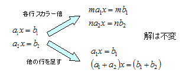
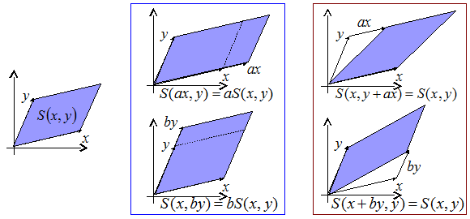

# 行列式

## 概要
「[輪講発表資料](../../misc/list/lecture.md)」の「[プログラミングのための線形代数](../../misc/list/lecture.md#2006a)」の内容にそって説明を書く予定。

## 記法に関して
ここでは、ベクトル・行列を以下のような記法で書きます。

* ベクトルも特に太字にしない。

* 行列は大文字アルファベットで書く。

* ベクトルxに対して、その第 i 成分をxiと書く。

* 行列Aに対して、その i 行目の行（横）ベクトルをai、i, j 成分をai jと書く。

例をあげると、2変数2式の1次方程式、

a1 1 x1
＋
a1 2 x2
＝
b1

a2 1 x1
＋
a2 2 x2
＝
b2

はベクトル・行列を使って以下のように表現されます。

a1 x
＝
b1 ,　
a2 x
＝
b2

A x
＝
b

## 1次方程式の解法（掃き出し法）
1次方程式の最も簡単な解法として、
ガウスの<strong id="sweeping" class="keyword">掃き出し法</strong>（sweeping-out method）というものが知られています。
 
1次方程式に対して、以下のような操作を行っても、解は変化しません。

1. 方程式の i 行目を両辺ともにスカラー倍する。

2. 方程式の i 行目を j 行目に足す。

<figure>
	
	<figcaption>各行のスカラー倍と和</figcaption>
</figure>

掃き出し方では、これらの操作を繰り返し行い、
方程式の係数行列 A を単位行列に変形することで、
1次方程式の解を求めます。
 
例として、以下の1次方程式を解いてみましょう。

      [<table class="matrix" summary="matrix"><tr><td>2</td><td>6</td><td>4</td></tr><tr><td>1</td><td>2</td><td>5</td></tr><tr><td>3</td><td>7</td><td>8</td></tr></table>]
      [<table class="matrix" summary="matrix"><tr><td>x1</td></tr><tr><td>x2</td></tr><tr><td>x3</td></tr></table>]
＝
[<table class="matrix" summary="matrix"><tr><td>－2</td></tr><tr><td>1</td></tr><tr><td>－3</td></tr></table>]

まずは、1. の操作として、1行目を÷2。
そして、2. の操作として、
2行目を －1/2 a1、
3行目を －3/2 a1 します。

      [<table class="matrix" summary="matrix"><tr><td>1</td><td>3</td><td>2</td></tr><tr><td>0</td><td>－1</td><td>3</td></tr><tr><td>0</td><td>－2</td><td>2</td></tr></table>]
      [<table class="matrix" summary="matrix"><tr><td>x1</td></tr><tr><td>x2</td></tr><tr><td>x3</td></tr></table>]
＝
[<table class="matrix" summary="matrix"><tr><td>－1</td></tr><tr><td>2</td></tr><tr><td>0</td></tr></table>]

次に、1. の操作として、2行目を÷（－1）。
そして、2. の操作として、
1行目を ＋3 a2、
3行目を －2 a2 します。

      [<table class="matrix" summary="matrix"><tr><td>1</td><td>0</td><td>11</td></tr><tr><td>0</td><td>1</td><td>－3</td></tr><tr><td>0</td><td>0</td><td>－4</td></tr></table>]
      [<table class="matrix" summary="matrix"><tr><td>x1</td></tr><tr><td>x2</td></tr><tr><td>x3</td></tr></table>]
＝
[<table class="matrix" summary="matrix"><tr><td>5</td></tr><tr><td>－2</td></tr><tr><td>－4</td></tr></table>]

同様に、1. の操作として、2行目を÷（－4）。
2. の操作として、
1行目を ＋11/4 a3、
3行目を －3/4 a3。

      [<table class="matrix" summary="matrix"><tr><td>1</td><td>0</td><td>0</td></tr><tr><td>0</td><td>1</td><td>0</td></tr><tr><td>0</td><td>0</td><td>1</td></tr></table>]
      [<table class="matrix" summary="matrix"><tr><td>x1</td></tr><tr><td>x2</td></tr><tr><td>x3</td></tr></table>]
＝
[<table class="matrix" summary="matrix"><tr><td>－6</td></tr><tr><td>1</td></tr><tr><td>1</td></tr></table>]

したがって、
答えは、
x1 ＝ －6、
x2 ＝ 1、
x3 ＝ 1
となります。

<em>方程式が解けるためには、
1. の操作の際、÷0 にならないことが必要です</em>。

## 体積
ここで、一度話は変わりますが、面積・体積というものについて少し説明をします。
 
n 個の n 次元ベクトルの作る図形の容量について考えます。
これは、2次元なら平行四辺形の面積、
3次元なら平行六面体の体積になります。
4次元以上の場合、超体積とか言う場合もありますが、
ここでは2次元の場合も含めて「n 次元体積」という言葉で統一したいと思います。
 
n 次元体積は以下のような性質を持っています。
（正確には、2次元の面積や、3次元の体積がこういう性質を持っているので、
この性質を使って4次元以上の体積も定義しようという発想です。）

1. i 番目のベクトルをスカラー倍してa倍にすると、体積もa倍。

2. i 番目のベクトルを j 番目のベクトルに足しても、体積は不変。

2次元の場合で例示すると、
2つのベクトルx, y の作る平行四辺形の2次元体積（面積）を
S(x, y)、
a, b を実数として、以下のようになります。

1. 
S(a x, y)
＝
a S(x, y)、
S(x, b y)
＝
b S(x, y)

2. 
S(x, y ＋ a x)
＝
S(x, y)、
S(x ＋ b y, y)
＝
S(x, y)

<figure>
	
	<figcaption>n 次元体積の性質</figcaption>
</figure>

n 次元体積 S は、負の体積も認めることにします。
ベクトルのどちらか片方の向きを反転させると、
体積の符号が入れ替わるものとします。

S(－x, y)
＝
S(x, －y)
＝
－S(x, y)

こうしておく方がいろいろと整合性を保てるからです。
（1. の式が a, b が負の場合でも成り立ちます。）
 
また、2. の性質から、

S(x, y)
＝
S(x－y, y)
＝
S(x－y, y ＋ (x－y))
＝
S(x－y, x)

＝
S(x－y － x, x)
＝
S(－y, x)
＝
－S(y, x)

∴
 
S(y, x)
＝
－S(x, y)

となり、2. の条件を次のように言い換えることもできます。

1. i 番目のベクトルをスカラー倍してa倍にすると、体積もa倍。

2. i 番目のベクトルと j 番目のベクトルを入れ替えると、体積の符号が反転。

条件 1. を<strong id="multilinear" class="keyword">多重線形性</strong>（multi linearity）もしくは複線形性、
条件 2. を<strong id="d32e712" class="keyword">交代性</strong>（alternating property）といいます。
 
また、n 個の n 次元ベクトル → 実数の関数 Sで、
複線形性と交代性を満たすものを<strong id="mlaform" class="keyword">多重線形交代形式</strong>（multiliear alternating form）と呼びます。
 
n 次元の多重線形交代形式は、定数倍を除いて一意に定まります。
なので、「x, y が直交するとき、
S(x, y) ＝ |x||y|
となる」という条件をつけることで、
一意に決定することができます。
n 次元体積は、このような条件付きの多重線形交代形式だと考えることができます。
 
4次元以上の場合、体積を計算するのは大変そうに思えるかもしれませんが、
多重線形性と交代性を使って「[掃き出し法](#sweeping)」と同じ要領でベクトルをどんどん簡単化していくことで、
体積を計算することができます。
次元が高くなると、手作業での計算は難しくなりますが、
処理手順自体は低次元の場合と変わらないので、
コンピュータを使えば簡単に計算することができます。

## 行列式
これまでの話を1度振り返ってみましょう。
まず、「[掃き出し法](#sweeping)」は、
以下の操作によって1次方程式の解が不変であることを利用して、
これらの操作を繰り返すことで解を得る方法です。

1. 方程式の i 行目を両辺ともにスカラー倍する。

2. 方程式の i 行目を j 行目に足す。

ここで、1. の操作をするときに、「0 で割る」という操作が必要になると1次方程式が解けなくなります。
 
一方で、n 本の n 次元ベクトルが作る図形の体積は以下のような性質を持っています。

1. i 番目のベクトルをスカラー倍してa倍にすると、体積もa倍。

2. i 番目のベクトルを j 番目のベクトルに足しても、体積は不変。

これらの条件ですが、
掃き出し法で使う1次方程式の解を不変にする操作と似ています。
実は、先ほどの1次方程式が解けるための条件（1. のときに ÷0 という操作がない）は、
「1次方程式 A x ＝ b は、係数 A の各行ベクトル ai の作る図形の体積が 0 でなければ解ける」と言い換えることができます。
 
そこで、A の各行ベクトル ai の作る図形の体積を、
1次方程式の可解性を調べるための特徴量とみなして、
A の<strong id="determinant" class="keyword">行列式</strong>（determinant）と呼びます。
また、A の行列式を、
|A| または det A と表します。

      |A|
＝
S(
a1 , 
a2 , 
・・・, 
aN)

### 余談
日本には、行列が整備された後に行列や行列式の理論が入ってきたんで、
行列が先にあって、それに付随する特徴量として行列式という言葉がありますが、
歴史的には行列式の方が先に生まれています。
 
元をたどると、行列式は1次方程式の可解性の判別のたための式として生まれました。
なので英語では名前からして determinant（判定式、判別式）と呼びます。
そのだいぶ後になってから、1次方程式を行列と言うものを用いて表現する手法が完成しました。

## 良設定/不良設定
1次方程式 A x ＝ b は、
係数行列の行列式が非0のとき（|A| ≠ 0）<strong id="well" class="keyword">良設定問題</strong>または適切な問題（well-posed problem）、
0のとき（|A| ＝ 0）<strong id="ill" class="keyword">不良設定問題</strong>あるいは不適切な問題（ill-posed problem）と呼びます。
 
今まで、（簡単化のため）連立1次方程式が不良設定なら解けないみたいな書き方をしてきましたが、
正確には以下のようになります。

* 良設定 → 解がただ1つ定まる

* 不良設定 → 解が複数個存在する、または、解が存在しない

例えば、

      [<table class="matrix" summary="matrix"><tr><td>1</td><td>2</td></tr><tr><td>2</td><td>4</td></tr></table>]
      [<table class="matrix" summary="matrix"><tr><td>x</td></tr><tr><td>y</td></tr></table>]
＝
[<table class="matrix" summary="matrix"><tr><td>1</td></tr><tr><td>2</td></tr></table>]

は不良設定問題なんですが、
これは、k を任意定数として、
x ＝ 2 k ＋ 1, y ＝ －k が解になります。
一方で、同じ不良設定問題でも

      [<table class="matrix" summary="matrix"><tr><td>1</td><td>2</td></tr><tr><td>2</td><td>4</td></tr></table>]
      [<table class="matrix" summary="matrix"><tr><td>x</td></tr><tr><td>y</td></tr></table>]
＝
[<table class="matrix" summary="matrix"><tr><td>1</td></tr><tr><td>0</td></tr></table>]

は解なしとなります。

## 執筆予定
<pre>
|AB| ＝ |A| |B| とかの性質を

|A x| ＝ |det A| |x|

行列式の交代性から、
det A ≠ 0
⇔
A の各列ベクトルが独立
</pre>
