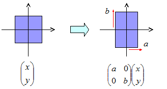
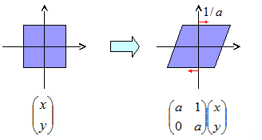
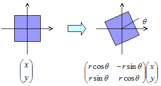
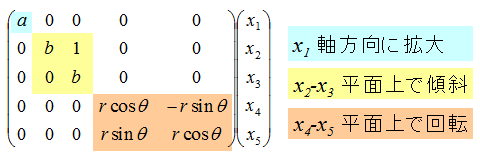

# 固有値

## <a id="sec-generated-title-1"></a> <a id="abstract"></a>概要

[2006年度前期輪講](../../misc/list/lecture.md#2006a)で発表した内容にそって説明を書く予定。
 
行列の、座標変換によって不変な性質を調べる。
 
座標変換によって不変な特徴量があるならば、その量こそが行列の本質を表す量なのではないか。
 
英語だとまさに、characteristic value、行列の“特性”値。
ちなみに、eigen はドイツ語起源の接頭語。
（英語だと own、「自分自身の」「自身に固有の」という感じの意味。
発音もドイツ語的にアイゲン。
というか、ドイツ語起源なので英語圏の人でも読めない場合があって、
エイジャンとかアイジャンとか読む人も。）
固有値の「固有」は「eigen」の訳語。
 
対角化、Jordan 標準形
 
行列の冪計算、指数計算


## <a id="sec-generated-title-2"></a> <a id="similar"></a>相似変換

「[線形写像](matrix.md#linear_map)」で説明しましたが、
線形写像を行列で表すとき、
線形空間の座標系の取り方によって行列の形が変わります。
 
となると、線形写像の性質は、座標系の取り方によって変わってしまうか？という疑問が生じます。
実際、行列の見た目は座標の取り方によってがらりと変わってしまいます。
しかしながら、これからこの章で説明していくように、
座標系の取り方を変えても変化しない性質もあります。
そういう、座標系の取り方によらない性質こそが、
線形写像の本質を表しているのではないかと考えるのが妥当でしょう。
 
そういうわけで、
これ以降、
座標変換によって不変な行列の性質を調べていくことになります。
 
まず、座標変換を行ったときに行列の形がどう変化するかを考えましょう。
線形空間 <span class="math">V</span> の元がある座標系によって、
ベクトル <span class="math"><span class="vector">x</span></span>, <span class="math"><span class="vector">y</span></span> で表されているといます。
このとき、<span class="math"><span class="vector">x</span></span> を <span class="math"><span class="vector">y</span></span> に移す線形写像は、
行列 <span class="math">A</span> を用いて
<div class="math">
      <span class="vector">y</span> ＝ A <span class="vector">x</span></div>
と表されます。
ここで、
別の座標系を用いた場合にどうなるかを考えるわけですが、
「[座標変換](matrix.md#coordinate)」で説明したように、
座標変換もある正則行列 <span class="math">P</span> を用いて、
<div class="math">
      <span class="vector">x</span> ＝ P <span class="vector">x</span>'
</div><div class="math">
      <span class="vector">y</span> ＝ P <span class="vector">y</span>'
</div>
と表すことができます。
したがって、新しい座標系で表されたベクトル
<span class="math"><span class="vector">x</span>'</span>, <span class="math"><span class="vector">y</span>'</span> 
の間には以下の関係が成り立ちます。
<div class="math">
      <span class="vector">y</span>' ＝ P<sup>－1</sup> A P <span class="vector">x</span>'
</div>
すなわち、元々の座標系では行列 <span class="math">A</span> で表されていた線形写像は、
新しい座標系では <span class="math">P<sup>－1</sup> A P</span> という形に変化します。
このような、<span class="math">P<sup>－1</sup> A P</span> という形の変形を、
<strong id="similar" class="keyword">相似変換</strong>（similar transform）と呼びます。
これまでの説明の通り、相似変換は行列の座標変換に相当します。
 
さて、元の話題に戻りますが、
この相似変換の考え方を用いると、
「座標変換によって変化しない線形写像の性質」
というのは、
「相似変換によって変化しない行列の性質」
ということになります。


## <a id="sec-generated-title-3"></a> <a id="diag"></a>行列の対角化と冪計算

前節で言うような「相似変換によって変化しない行列の性質」
として、これから説明する固有値や固有ベクトルという物があるのですが、
そういう概念を説明する前に、もう少し簡単な話から初めて見ましょう。
 
最初の一歩として、相似変換によって、行列を簡潔な形に変形できないかを考えてみます。
「簡潔な形」というのは、例えば行列の冪などが計算しやすい形です。
最も分かりやすい形と言うと、対角行列（diagonal matrix: 対角成分のみを持つ行列）でしょう。
簡単化のために、2次の場合で例を示すと、以下のような行列です。
<div class="math">
      <span class="paren" style="font-size:3em;">[</span><table class="matrix" summary="matrix"><tr><td>a</td><td>0</td></tr><tr><td>0</td><td>b</td></tr></table><span class="paren" style="font-size:3em;">]</span>
    </div>
対角行列の冪は非常に簡単に計算できて、
以下のようになります。
<div class="math">
      <span class="paren" style="font-size:3em;">[</span><table class="matrix" summary="matrix"><tr><td>a</td><td>0</td></tr><tr><td>0</td><td>b</td></tr></table><span class="paren" style="font-size:3em;">]</span>
      <sup>n</sup>
＝
<span class="paren" style="font-size:3em;">[</span><table class="matrix" summary="matrix"><tr><td>a<sup>n</sup></td><td>0</td></tr><tr><td>0</td><td>b<sup>n</sup></td></tr></table><span class="paren" style="font-size:3em;">]</span></div>
冪が計算できるなら、
冪級数によって定義される「行列の関数」も同様に簡単に計算できます。
<div class="math">
      <span class="normal">exp</span>
      <span class="paren" style="font-size:3em;">[</span><table class="matrix" summary="matrix"><tr><td>a</td><td>0</td></tr><tr><td>0</td><td>b</td></tr></table><span class="paren" style="font-size:3em;">]</span>
＝
<span class="paren" style="font-size:3em;">[</span><table class="matrix" summary="matrix"><tr><td><span class="normal">e</span><sup>a</sup></td><td>0</td></tr><tr><td>0</td><td><span class="normal">e</span><sup>b</sup></td></tr></table><span class="paren" style="font-size:3em;">]</span></div>
もし、行列 <span class="math">A</span> が相似変換によって対角行列 <span class="math">Λ</span> に変形できたらな、
行列 <span class="math">A</span> の冪も簡単に計算することができます。
なぜかというと、
<div class="math">
Λ ＝ P<sup>－1</sup> A P
</div>
ならば、
<div class="math">
Λ<sup>2</sup> ＝ P<sup>－1</sup> A P P<sup>－1</sup> A P
＝ P<sup>－1</sup> A A P
＝ P<sup>－1</sup> A<sup>2</sup> P
</div>
より一般的に、
<div class="math">
Λ<sup>n</sup> ＝ P<sup>－1</sup> A<sup>n</sup> P
</div>
となるので、
<span class="math">A</span> の冪計算を <span class="math">Λ</span> の冪計算に帰着することができます。


## <a id="sec-generated-title-4"></a> <a id="feasibility"></a>行列の対角化可能性

前節の通り、行列を相似変換によって対角行列に変形（対角化）したいわけですが、
任意の行列が対角化できるわけではありません。
ただし、結論から先に言ってしまえば、
行列は相似変換によって以下の3つのいずれかの形に帰着させることができます。

1. 拡大：対角行列

2. 傾斜：2重対角行列

3. 回転：回転行列


1の対角行列は、
図1のように、座標軸にそって縦横にそれぞれ拡大するようなイメージのものになります。

<figure>

[](../../../../assets/media/ufcpp2000/math/eigen01.png)

<figcaption>縦横拡大： 対角行列</figcaption>
</figure>


2の2重対角行列は、
図2のように、ある座標軸にそって斜めに押しつぶすようなイメージのものになります。

<figure>

[](../../../../assets/media/ufcpp2000/math/eigen02.png)

<figcaption>傾斜： 2重対角行列</figcaption>
</figure>


最後に、3の回転行列は、
図3のように、原点を中心に回転するようなイメージのものになります。

<figure>

[](../../../../assets/media/ufcpp2000/math/eigen03.png)

<figcaption>回転： 回転行列</figcaption>
</figure>


## <a id="sec-generated-title-5"></a> <a id="eigen_value"></a>固有値と固有ベクトル

それでは、具体的な対角化の方法について考えてみましょう。
 
行列 <span class="math">A</span> が相似変換によって対角行列 <span class="math">Λ</span> になるということは、
ある正則行列 <span class="math">P</span> があって、
<div class="math">
Λ ＝ P<sup>－1</sup> A P
</div><div class="math">
∴ P Λ ＝ A P
</div>
となるということです。
ここで、<span class="math">Λ</span> の <span class="math">i</span> 行 <span class="math">i</span> 列目の要素を
<span class="math">λ<sub>i</sub></span>、
<span class="math">P</span> の <span class="math">i</span> 列目の列ベクトルを
<span class="math"><span class="vector">p</span><sub>i</sub></span>
と置くと、
この式は、
<div class="math">
A <span class="vector">p</span><sub>i</sub> ＝ λ<sub>i</sub> <span class="vector">p</span><sub>i</sub></div>
となります。
 
このように、
行列 <span class="math">A</span> に対して、
以下のような式を満たすスカラー <span class="math">λ</span> を <span class="math">A</span> の<strong id="eigen_value" class="keyword">固有値</strong>（characteristic value, eigenvalue）、
非0のベクトル <span class="math"><span class="vector">p</span></span> を <span class="math">A</span> の<strong id="eigen_vector" class="keyword">固有ベクトル</strong>（characteristic vector, eigenvector）と呼びます。
<div class="math">
A <span class="vector">p</span> ＝ λ <span class="vector">p</span></div>
要するに、行列の対角化の問題は、
固有値・固有ベクトルを求める問題に帰着します。
このような問題を<strong id="eigen_problem" class="keyword">固有値問題</strong>と呼びます。


## <a id="sec-generated-title-6"></a> <a id="eigen_equation"></a>固有方程式

さらに、固有値、固有ベクトルを具体的に求める方法を考えます。
 
固有ベクトルというのは、
要するに、1次方程式
<span class="math">
A <span class="vector">p</span> ＝ λ <span class="vector">p</span></span>
の非 0 解なわけですが、
この式が非 0 解を持つためには、
<span class="math"><span class="paren" style="font-size:em;">(</span>A － λI<span class="paren" style="font-size:em;">)</span><span class="vector">p</span> ＝ <span class="vector">0</span></span>
（<span class="math">I</span> は単位行列）
が「[不良設定問題](determinant.md#ill)」である必要があります。
したがって、
<span class="math"><span class="paren" style="font-size:em;">(</span>A － λI<span class="paren" style="font-size:em;">)</span></span>
の行列式は
<span class="math"><span class="normal">|</span>A － λI<span class="normal">|</span> ＝ 0
</span>
という条件を満たさなければなりません。
 
行列式の性質から、
<span class="math">A</span> が n 次正方行列のとき、
行列式
<span class="math"><span class="normal">|</span>A － λI<span class="normal">|</span> ＝ 0
</span>
は <span class="math">λ</span> に関する n 次方程式になります。
これを <span class="math">A</span> の<strong id="eigen_eq" class="keyword">固有方程式</strong>（characteristic equation, eigenequation）呼び、
この方程式を解くことで、重複度も含めて n 個の固有値が求まります。
 
固有方程式の解のパターンによって、行列が対角化可能か決まります。
具体的には以下のようになるのですが、それぞれの詳細に関しては次節で説明します。

1. 2つの実数解 → 拡大：対角行列

2. 重解 → 傾斜：2重対角行列

3. 複素数解 → 回転：回転行列


## <a id="sec-generated-title-7"></a> <a id="diagonal"></a>拡大： 相異なる実数解の場合

行列 <span class="math">A</span> の固有値が全て互いに異なる実数解
<span class="math">λ<sub>i</sub></span>
の場合、
ここでは証明は省きますが、
異なる固有値に対する固有ベクトルは互いに独立になることが知られています。
そして、得られた n 個の固有ベクトル <span class="math">p<sub>i</sub></span> を並べるて得られる行列
<span class="math">
P
＝
<span class="paren" style="font-size:em;">(</span>
p<sub>1</sub> , 
p<sub>2</sub> , 
・・・, 
p<sub>n</sub><span class="paren" style="font-size:em;">)</span></span>
は、正則になり、
この正則行列 <span class="math">P</span> を使って <span class="math">A</span> を対角化可能です。
<div class="math">
Λ
＝
P<sup>－1</sup> A P
</div>
ただし、<span class="math">Λ</span> は i 行 i 列目の対角成分が
<span class="math">λ<sub>i</sub></span>
であるような対角行列です。
（これを、<span class="math"><span class="normal">diag</span><span class="paren" style="font-size:em;">{</span>λ<sub>i</sub><span class="paren" style="font-size:em;">}</span></span> と書いたりします。）


## <a id="sec-generated-title-8"></a> <a id="ddiagonal"></a>傾斜： 重解を持つ場合

重解の場合でも、
<span class="math">
A <span class="vector">p</span> ＝ λ <span class="vector">p</span></span>
（あるいは、
<span class="math"><span class="paren" style="font-size:em;">(</span>A － λI<span class="paren" style="font-size:em;">)</span><span class="vector">p</span> ＝ <span class="vector">0</span></span>
）
となるベクトルが解の重複度と同じだけあれば、対角化することが可能です。
しかしながら、これは必ずしも成り立たず、
最悪の場合、解が1つしかない場合もあります。
 
そういう場合には、
<span class="math"><span class="paren" style="font-size:em;">(</span>A － λI<span class="paren" style="font-size:em;">)</span><span class="vector">p</span> ＝ <span class="vector">0</span></span>
の代わりに、
解の重複度を <span class="math">k</span> として、
<span class="math"><span class="paren" style="font-size:em;">(</span>A － λI<span class="paren" style="font-size:em;">)</span><sup>k</sup><span class="vector">p</span> ＝ <span class="vector">0</span></span>
を満たすベクトルを使います。
（これは <span class="math">k</span> 個あることが保証されます。）
 
通常、1本目は
<span class="math"><span class="paren" style="font-size:em;">(</span>A － λI<span class="paren" style="font-size:em;">)</span><span class="vector">p</span><sub>1</sub> ＝ <span class="vector">0</span></span>
となるものを選びます。
そして、この式を満たすベクトルが1つしかない場合には、
2本目は
<span class="math"><span class="paren" style="font-size:em;">(</span>A － λI<span class="paren" style="font-size:em;">)</span><span class="vector">p</span><sub>2</sub> ＝ <span class="vector">p</span><sub>1</sub></span>
となるものを選びます。
（こうすれば、
<span class="math"><span class="paren" style="font-size:em;">(</span>A － λI<span class="paren" style="font-size:em;">)</span><sup>2</sup><span class="vector">p</span><sub>2</sub> ＝ <span class="vector">0</span></span>
を満たします。）
重複度が 3 以上の場合にも、逐次、
<span class="math"><span class="paren" style="font-size:em;">(</span>A － λI<span class="paren" style="font-size:em;">)</span><span class="vector">p</span><sub>i＋1</sub> ＝ <span class="vector">p</span><sub>i</sub></span>
とします。
 
こうして得られたベクトルは互いに独立になることが知られています。
行列 <span class="math">A</span> を対角化することはできないんですが、
個々で得られたベクトルを並べた行列 <span class="math">P</span> を使って、
以下のような形の行列に変形することが可能です。
<div class="math">
      <span class="paren" style="font-size:8em;">[</span><table class="matrix" summary="matrix"><tr><td>λ</td><td>1</td><td></td><td></td><td></td></tr><tr><td></td><td>λ</td><td>1</td><td></td><td></td></tr><tr><td></td><td></td><td>λ</td><td>1</td><td></td></tr><tr><td></td><td></td><td></td><td>・・・</td><td></td></tr><tr><td></td><td></td><td></td><td></td><td>λ</td></tr></table><span class="paren" style="font-size:8em;">]</span>
＝
P<sup>－1</sup> A P
</div>
ただし、行列中の空白の部分は全て 0 です。
すなわち、対角成分と、その1つ上の成分だけが非 0 で、その他はすべて 0 です。
また、対角の1つ上の成分は全て 1 です。
このような行列を、2重対角行列（double diagonal matrix）と呼びます。


## <a id="sec-generated-title-9"></a> <a id="roteta"></a>回転： 共役複素数解の場合

解が複素数解の場合、
実数の範囲では対角化ができません。
 
でも、複素数行列になってしまってもいいなら対角化できます。
そこで、
<div class="math">
      <span class="paren" style="font-size:3em;">[</span><table class="matrix" summary="matrix"><tr><td>λ</td><td>0</td></tr><tr><td>0</td><td>
            λ<sup>*</sup>
          </td></tr></table><span class="paren" style="font-size:3em;">]</span>
＝
P<sup>－1</sup> A P
 ,　　
P
＝
<span class="paren" style="font-size:em;">(</span><span class="vector">p</span> <span class="vector">p</span><sup>*</sup><span class="paren" style="font-size:em;">)</span></div>
（<span class="math">x<sup>*</sup></span> は <span class="math">x</span> の共役複素数。
<span class="math">λ</span> に対応する固有ベクトルが <span class="math"><span class="vector">p</span></span> なら、
<span class="math">λ<sup>*</sup></span> に対応する固有ベクトルは <span class="math"><span class="vector">p</span><sup>*</sup></span> になる。
）
という形で対角化されているものを、実数の範囲に直すことを考えます。
 
やり方は簡単で、
<span class="math">λ</span> と <span class="math"><span class="vector">p</span></span> を
それぞれ、
<div class="math">
λ ＝ a ＋ i b
</div><div class="math">
      <span class="vector">p</span> ＝ <span class="vector">x</span> ＋ i <span class="vector">y</span></div>
というように、実部・虚部に分けると、
複素数の範囲で対角化されていた先ほどの式を、
以下のように変形することができます。
<div class="math">
      <span class="paren" style="font-size:3em;">[</span><table class="matrix" summary="matrix"><tr><td>a</td><td>－b</td></tr><tr><td>b</td><td>a</td></tr></table><span class="paren" style="font-size:3em;">]</span>
＝
P'<sup>－1</sup> A P'
 ,　　
P'
＝
<table class="frac" summary="fraction"><tr><td class="num"><span class="normal">1</span></td></tr><tr><td>2</td></tr></table>
P
<span class="paren" style="font-size:3em;">[</span><table class="matrix" summary="matrix"><tr><td>1</td><td>－i</td></tr><tr><td>1</td><td>i</td></tr></table><span class="paren" style="font-size:3em;">]</span>
＝
<span class="paren" style="font-size:em;">(</span><span class="vector">x</span> <span class="vector">y</span><span class="paren" style="font-size:em;">)</span></div>
簡単な計算で確認できるので、一度計算してみてください。
 
この左辺の行列ですが、極形式
<div class="math">
λ ＝ a ＋ i b
＝ r <span class="paren" style="font-size:em;">(</span><span class="normal">cos</span>θ ＋ i <span class="normal">sin</span>θ<span class="paren" style="font-size:em;">)</span></div>
で表すと、以下のようになります。
<div class="math">
      <span class="paren" style="font-size:3em;">[</span><table class="matrix" summary="matrix"><tr><td>a</td><td>－b</td></tr><tr><td>b</td><td>a</td></tr></table><span class="paren" style="font-size:3em;">]</span>
＝
r
<span class="paren" style="font-size:3em;">[</span><table class="matrix" summary="matrix"><tr><td><span class="normal">cos</span>θ</td><td>－<span class="normal">sin</span>θ</td></tr><tr><td><span class="normal">sin</span>θ</td><td><span class="normal">cos</span>θ</td></tr></table><span class="paren" style="font-size:3em;">]</span></div>
これは、原点を中心に <span class="math">r</span> 倍、
<span class="math">θ</span> の回転を表す行列になります。


## <a id="sec-generated-title-10"></a> <a id="jordan"></a>Jordan の標準形

これまで、相異なる実数解、重解、複素数解の場合についてそれぞれ説明しました。
これらが混在している場合には、
図4に示すような、対角、2重対角、回転が混在した行列に変形することになります。

<figure>

[](../../../../assets/media/ufcpp2000/math/eigen04.png)

<figcaption>Jordan 標準形</figcaption>
</figure>


このような形式の行列を、<strong id="jordan" class="keyword">Jordan の標準形</strong>（Jordan normal form）あるいはJordan 行列（Jordan matrix）と呼びます。
（Jordan は人名。ジョルダン。フランス人。
物理学者に同じスペルでヨルダンと読む人がいてややこしい。）


## <a id="sec-generated-title-11"></a> <a id="power"></a>行列の冪、指数

```text
執筆予定

Jordan cell

Jordan 行列の冪は Jordan cell の冪計算に帰着


ここから先は、複素数の範囲で対角化することにして、
（回転行列は使わない。複素数の対角行列にする）

Jordan 標準形は、対角行列と冪零行列の和に分解できる。
Λ ＋ N
　　[λ1        ]
Λ＝[    λ2    ]
　　[        λ3]
　　[0 1 0]
 N＝[0 0 1]
　　[0 0 0]
みたいな感じ。

このとき、
- ΛとNは必ず可換。
- N は次数が k なら k 乗すると必ず 0 になる。
   　[0 0 1]
N^2＝[0 0 0]
   　[0 0 0]
みたいな感じで、冪乗するたびに、1 のある場所が1行上に移動。

Λ と N が可換なとき、
(Λ ＋ N) の冪乗は2項展開可能。
N の k 乗までの項だけ計算すれば OK。

行列の指数関数 exp(A) に関しては、
A と B が可換のとき、
exp(A ＋ B) ＝ exp(A) ＋ exp(B)
が成り立つ。
対角行列 Λ の指数 exp(Λ) は簡単に計算可能。
exp(N) も、冪級数の k 項目まで計算すれば OK。
```

## <a id="sec-generated-title-12"></a> <a id="hk"></a>最小多項式とハミルトン・ケイリーの定理

（書きかけ）
<h4>固有ベクトル展開</h4>
（固有値に重根を持つ場合は拡張固有空間まで含めて）
<span class="math">N</span> 次行列の固有ベクトルは <span class="math">N</span> 本あって、これらは一次独立なので、
任意の <span class="math">N</span> 次元ベクトルは、固有ベクトルの線形結合で表せる。
 
要するに、
行列 <span class="math">A</span> の固有ベクトルを <span class="math">x<sub>i</sub></span> （<span class="math">i <span class="normal">=</span> 1<span class="normal">∼</span>N</span>）として、
任意のベクトル <span class="math">x</span> は、
<span class="math">
x
<span class="normal">=</span><table class="sigma" summary="sum"><tr><td class="sigmasub">N</td></tr><tr><td class="sigma">∑</td></tr><tr><td class="sigmasub">i<span class="normal">=</span>1</td></tr></table>
a<sub>i</sub>
x<sub>i</sub></span>
と展開可能。
<h4>ハミルトン・ケイリーの定理</h4>
行列 <span class="math">A</span> の固有方程式を
<span class="math">
f<span class="paren" style="font-size:em;">(</span>x<span class="paren" style="font-size:em;">)</span><span class="normal">=</span><span class="normal">det</span><span class="paren" style="font-size:em;">(</span>A <span class="normal">−</span> x<span class="paren" style="font-size:em;">)</span></span>
（ただし、<span class="math">I</span> を単位行列として、
<span class="math">xI</span> を単に <span class="math">x</span> と略記しています。）
とすると、
この（複素数を定義域とする）関数に、
形式的に行列 <span class="math">A</span> を代入したもの、
<span class="math">f<span class="paren" style="font-size:em;">(</span>A<span class="paren" style="font-size:em;">)</span></span> は、任意のベクトル <span class="math">x</span> に対して、
<div class="math">
f<span class="paren" style="font-size:em;">(</span>A<span class="paren" style="font-size:em;">)</span> x
<span class="normal">=</span><span class="normal">0</span></div>
を満たします。
これをハミルトン・ケイリーの定理と呼びます。
 
説明を簡単化するために、2次の行列の場合で説明しますが、
行列 <span class="math">A</span> の固有値を <span class="math">λ<sub>1</sub>, λ<sub>2</sub></span>、
それぞれ対応する固有ベクトルを <span class="math">x<sub>1</sub>, x<sub>2</sub></span> とします。
<div class="math">
      <span class="paren" style="font-size:em;">(</span>A <span class="normal">−</span> λ<sub>1</sub><span class="paren" style="font-size:em;">)</span> x<sub>1</sub><span class="normal">=</span><span class="normal">0</span></div><div class="math">
      <span class="paren" style="font-size:em;">(</span>A <span class="normal">−</span> λ<sub>2</sub><span class="paren" style="font-size:em;">)</span> x<sub>2</sub><span class="normal">=</span><span class="normal">0</span></div>
が成り立っています。
ここで、
<span class="math"><span class="paren" style="font-size:em;">(</span>A <span class="normal">−</span> λ<sub>1</sub><span class="paren" style="font-size:em;">)</span></span>
と
<span class="math"><span class="paren" style="font-size:em;">(</span>A <span class="normal">−</span> λ<sub>2</sub><span class="paren" style="font-size:em;">)</span></span>
が可換
（
<span class="math"><span class="paren" style="font-size:em;">(</span>A <span class="normal">−</span> λ<sub>1</sub><span class="paren" style="font-size:em;">)</span><span class="paren" style="font-size:em;">(</span>A <span class="normal">−</span> λ<sub>2</sub><span class="paren" style="font-size:em;">)</span><span class="normal">=</span><span class="paren" style="font-size:em;">(</span>A <span class="normal">−</span> λ<sub>2</sub><span class="paren" style="font-size:em;">)</span><span class="paren" style="font-size:em;">(</span>A <span class="normal">−</span> λ<sub>1</sub><span class="paren" style="font-size:em;">)</span></span>
）
なのと、
任意のベクトル <span class="math">x</span> が固有ベクトルを使って展開可能
（
<span class="math">
x
<span class="normal">=</span>
a x<sub>1</sub><span class="normal">+</span>
b x<sub>2</sub></span>
となる実数 <span class="math">a, b</span> が存在する
）
ので、
<div class="math">
      <span class="paren" style="font-size:em;">(</span>A <span class="normal">−</span> λ<sub>1</sub><span class="paren" style="font-size:em;">)</span>
      <span class="paren" style="font-size:em;">(</span>A <span class="normal">−</span> λ<sub>2</sub><span class="paren" style="font-size:em;">)</span> x
<span class="normal">=</span><span class="paren" style="font-size:em;">(</span>A <span class="normal">−</span> λ<sub>1</sub><span class="paren" style="font-size:em;">)</span><span class="paren" style="font-size:em;">(</span>A <span class="normal">−</span> λ<sub>2</sub><span class="paren" style="font-size:em;">)</span><span class="paren" style="font-size:em;">(</span>
a x<sub>1</sub><span class="normal">+</span>
b x<sub>2</sub><span class="paren" style="font-size:em;">)</span></div><div class="math">
　
<span class="normal">=</span><span class="paren" style="font-size:em;">(</span>A <span class="normal">−</span> λ<sub>2</sub><span class="paren" style="font-size:em;">)</span><span class="paren" style="font-size:em;">(</span>A <span class="normal">−</span> λ<sub>1</sub><span class="paren" style="font-size:em;">)</span>
a x<sub>1</sub><span class="normal">+</span><span class="paren" style="font-size:em;">(</span>A <span class="normal">−</span> λ<sub>1</sub><span class="paren" style="font-size:em;">)</span><span class="paren" style="font-size:em;">(</span>A <span class="normal">−</span> λ<sub>2</sub><span class="paren" style="font-size:em;">)</span>
b x<sub>2</sub><span class="normal">=</span><span class="paren" style="font-size:em;">(</span>A <span class="normal">−</span> λ<sub>2</sub><span class="paren" style="font-size:em;">)</span><span class="normal">0</span><span class="normal">+</span><span class="paren" style="font-size:em;">(</span>A <span class="normal">−</span> λ<sub>1</sub><span class="paren" style="font-size:em;">)</span><span class="normal">0</span><span class="normal">=</span><span class="normal">0</span></div><div class="math">
      <span class="normal">∴</span>
      <span class="paren" style="font-size:em;">(</span>A <span class="normal">−</span> λ<sub>1</sub><span class="paren" style="font-size:em;">)</span>
      <span class="paren" style="font-size:em;">(</span>A <span class="normal">−</span> λ<sub>2</sub><span class="paren" style="font-size:em;">)</span> x
<span class="normal">=</span><span class="normal">0</span></div>
となります。
結局、これは、
<span class="math">
f<span class="paren" style="font-size:em;">(</span>A<span class="paren" style="font-size:em;">)</span> x
<span class="normal">=</span><span class="normal">0</span></span>
を意味しています。
3次以上の場合でも、同様の議論によって、
<span class="math">
f<span class="paren" style="font-size:em;">(</span>A<span class="paren" style="font-size:em;">)</span> x
<span class="normal">=</span><span class="normal">0</span></span>
が証明できます。
<h4>最小多項式</h4>
行列 <span class="math">A</span> の
ある固有値 <span class="math">λ<sub>i</sub></span> が <span class="math">k</span> 重根のとき、
<span class="math"><span class="paren" style="font-size:em;">(</span>A <span class="normal">−</span> λ<sub>i</sub><span class="paren" style="font-size:em;">)</span> x<sub>i</sub><span class="normal">=</span><span class="normal">0</span></span>
を満たす一次独立なベクトル <span class="math">x<sub>i</sub></span> が <span class="math">k</span> 個あることもあれば、
それ未満なこともあります。

<span class="math">k</span> 個ある場合には、行列 <span class="math">A</span> は対角化可能。
（さもなくば、2重対角化しかできない。）

<span class="math">k</span> 重根があるときの固有方程式は
<div class="math">
f<span class="paren" style="font-size:em;">(</span>x<span class="paren" style="font-size:em;">)</span><span class="normal">=</span><span class="paren" style="font-size:em;">(</span>x <span class="normal">−</span> λ<sub>1</sub><span class="paren" style="font-size:em;">)</span><span class="normal">…</span><span class="paren" style="font-size:em;">(</span>x <span class="normal">−</span> λ<sub>i</sub><span class="paren" style="font-size:em;">)</span><sup>k</sup><span class="normal">…</span><span class="paren" style="font-size:em;">(</span>x <span class="normal">−</span> λ<sub>n</sub><span class="paren" style="font-size:em;">)</span></div>
で、これに形式的に行列 <span class="math">A</span> を代入すると、
任意のベクトル <span class="math">x</span> に対して、
<div class="math">
      <span class="paren" style="font-size:em;">(</span>A <span class="normal">−</span> λ<sub>1</sub><span class="paren" style="font-size:em;">)</span>
      <span class="normal">…</span>
      <span class="paren" style="font-size:em;">(</span>A <span class="normal">−</span> λ<sub>i</sub><span class="paren" style="font-size:em;">)</span>
      <sup>k</sup>
      <span class="normal">…</span>
      <span class="paren" style="font-size:em;">(</span>A <span class="normal">−</span> λ<sub>n</sub><span class="paren" style="font-size:em;">)</span>
x
<span class="normal">=</span><span class="normal">0</span></div>
になるわけですが、
<bra t="r">A <o n="m"></o> λ<sub>i</sub></bra> x<sub>i</sub><o n="eq"></o><n>0</n>
を満たす一次独立なベクトルが <span class="math">k</span> 個あるなら、
任意のベクトル <span class="math">x</span> に対して、
<div class="math">
      <span class="paren" style="font-size:em;">(</span>A <span class="normal">−</span> λ<sub>1</sub><span class="paren" style="font-size:em;">)</span>
      <span class="normal">…</span>
      <span class="paren" style="font-size:em;">(</span>A <span class="normal">−</span> λ<sub>i</sub><span class="paren" style="font-size:em;">)</span>
      <span class="normal">…</span>
      <span class="paren" style="font-size:em;">(</span>A <span class="normal">−</span> λ<sub>n</sub><span class="paren" style="font-size:em;">)</span>
x
<span class="normal">=</span><span class="normal">0</span></div>
が成り立ちます。
（<span class="math">i</span> 項目の所の <span class="math">k</span> 乗が不要。）
 
このように、
任意のベクトル <span class="math">x</span> に対して
<span class="math">
g<span class="paren" style="font-size:em;">(</span>A<span class="paren" style="font-size:em;">)</span> x
<span class="normal">=</span><span class="normal">0</span></span>
を満たすような最小次数の多項式を、
行列 <span class="math">A</span> の<strong id="minimal" class="keyword">最小多項式</strong>（minimal polynomial）と呼びます。
上述の説明から分かるように、
最小多項式は、固有方程式から、重根の部分の冪の次数を減らした形の多項式になります。
（必ずしも冪の次数は1にはならない）。
 
行列が対角化可能な条件は、最小多項式が重根を持たないこと。


### <a id="sec-generated-title-13"></a> <a id="d33e1699"></a>余談

ちなみに、ハミルトンとケイリーはそれぞれ別の数学者の名前。
 
アーサー・ケイリー（Arthur Cayley、1821年8月16日生まれ）、
ウィリアム・ローワン・ハミルトン（William Rowan Hamilton, 1805年8月4日生まれ）
 
人名が複数並んでいる場合、
昔はアルファベット順に並べたんで、
ケイリー・ハミルトンの定理と呼んでいました。
（この定理は主にケイリーの成果なんですが、
定理に対して誰がどの程度寄与してるかとかってのは判定が難しいですから、
そういうことは抜きにして、名前順とか生年順にする方がもめなくていい。）
 
でも、最近は、数学者の生年順に並べるようになってきたんで、
ハミルトン・ケイリーの定理と呼ぶようになってきました。
（多分、国際化の影響。
非ローマンアルファベット圏の数学者の並べ方で困るから。
日本語の「ち」を「ti」にするか「chi」にするかで順番変わっちゃうとか。）


## <a id="sec-generated-title-14"></a> <a id="d33e1717"></a>余談

実は、固有値・固有方程式の歴史は行列の概念が整理されるよりも古かったりします。
もちろん、行列の概念がないので、「行列の固有値」という言い方はしませんが、
同等の概念が存在しました。
 
その最も古い例は、
<div class="math">
      <table class="sigma" summary="sum"><tr><td class="sigmasub"></td></tr><tr><td class="sigma">∑</td></tr><tr><td class="sigmasub">i, j</td></tr></table>
a<sub>i j</sub> x<sub>i</sub> x<sub>j</sub>
＝ C
</div>
という2次式を、適当な座標変換によって、
<div class="math">
      <table class="sigma" summary="sum"><tr><td class="sigmasub"></td></tr><tr><td class="sigma">∑</td></tr><tr><td class="sigmasub">i</td></tr></table>
λ<sub>i</sub> y<sub>i</sub><sup>2</sup>
＝ C
</div>
の形に変換するという問題です。
（現代風に言えば、実対象行列の対角化の問題。
<span class="math">λ<sub>i</sub></span> をこの2次式の固有値と呼んでいました。）
このように変換することで、その2次式を、楕円型、一葉双曲型、二葉双曲型等と分類し、
この方程式の描く図形の大まかな形が推測できました。


## <a id="sec-generated-title-15"></a> <a id="d33e1773"></a>サンプルプログラム

[2次正方行列の固有値計算＆図示](../../../../assets/media/ufcpp2000/math/demo/matrix.xbap)

.NET Framework 3.0 必須。
 
デバッグ不十分かも。
