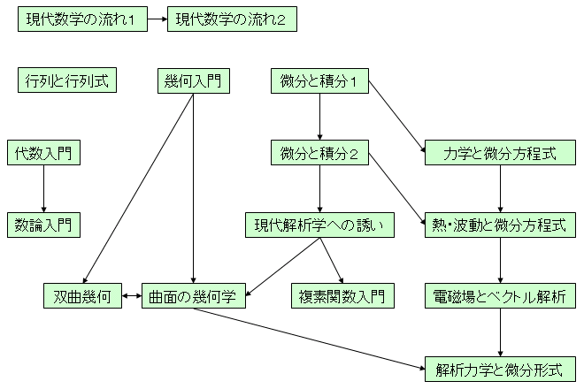
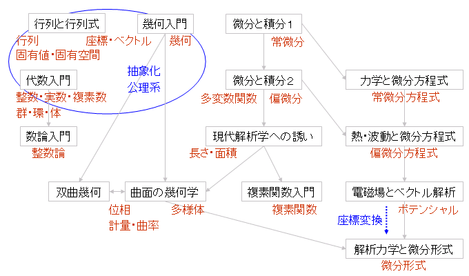
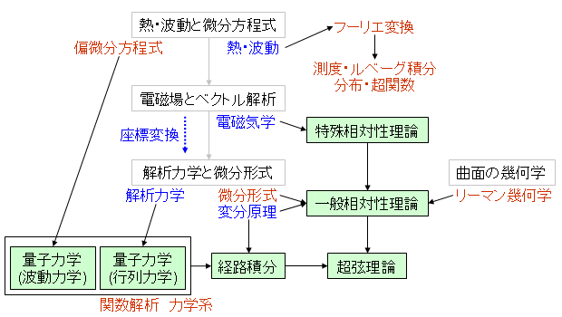

# 現代数学への入門

##  概要

勢いでシリーズ全巻そろえた岩波講座「現代数学への入門」、
せっかく全部買って全部読んだんだし、簡単にまとめを。
 
一通り読んだ今となって思えば、
読む順番をちゃんと考えて読めばもうちょっと楽に読めたかなぁと思うところがあるので、
近代数学の発展の流れを、本シリーズのタイトルに沿ってまとめておこうというのが主な趣旨。
 
別の出版社のシリーズで数学を学ぶにしても、
大体同じような流れがあるはず。

##  一覧

岩波講座「現代数学への入門」
全16巻。
 
レベルとしては、
大学の理系学部で習う内容。

1. <a name="amazletlink" target="_blank" href="http://www.amazon.co.jp/exec/obidos/ASIN/4000068717/cunflc-22/ref=nosim/">微分と積分〈1〉初等関数を中心に</a>

2. <a name="amazletlink" target="_blank" href="http://www.amazon.co.jp/exec/obidos/ASIN/4000068725/cunflc-22/ref=nosim/">微分と積分〈2〉多変数への広がり</a>

3. <a name="amazletlink" target="_blank" href="http://www.amazon.co.jp/exec/obidos/ASIN/4000068733/cunflc-22/ref=nosim/">現代解析学への誘い</a>

4. <a name="amazletlink" target="_blank" href="http://www.amazon.co.jp/exec/obidos/ASIN/4000068741/cunflc-22/ref=nosim/">複素関数入門</a>

5. <a name="amazletlink" target="_blank" href="http://www.amazon.co.jp/exec/obidos/ASIN/400006875X/cunflc-22/ref=nosim/">力学と微分方程式</a>

6. <a name="amazletlink" target="_blank" href="http://www.amazon.co.jp/exec/obidos/ASIN/4000068768/cunflc-22/ref=nosim/">熱・波動と微分方程式</a>

7. <a name="amazletlink" target="_blank" href="http://www.amazon.co.jp/exec/obidos/ASIN/4000068776/cunflc-22/ref=nosim/">代数入門</a>

8. <a name="amazletlink" target="_blank" href="http://www.amazon.co.jp/exec/obidos/ASIN/4000068784/cunflc-22/ref=nosim/">数論入門</a>

9. <a name="amazletlink" target="_blank" href="http://www.amazon.co.jp/exec/obidos/ASIN/4000068792/cunflc-22/ref=nosim/">行列と行列式</a>

10. <a name="amazletlink" target="_blank" href="http://www.amazon.co.jp/exec/obidos/ASIN/4000068806/cunflc-22/ref=nosim/">幾何入門</a>

11. <a name="amazletlink" target="_blank" href="http://www.amazon.co.jp/exec/obidos/ASIN/4000068814/cunflc-22/ref=nosim/">曲面の幾何</a>

12. <a name="amazletlink" target="_blank" href="http://www.amazon.co.jp/exec/obidos/ASIN/4000068822/cunflc-22/ref=nosim/">双曲幾何</a>

13. <a name="amazletlink" target="_blank" href="http://www.amazon.co.jp/exec/obidos/ASIN/4000068830/cunflc-22/ref=nosim/">電磁場とベクトル解析</a>

14. <a name="amazletlink" target="_blank" href="http://www.amazon.co.jp/exec/obidos/ASIN/4000068849/cunflc-22/ref=nosim/">解析力学と微分形式</a>

15. <a name="amazletlink" target="_blank" href="http://www.amazon.co.jp/exec/obidos/ASIN/4000068857/cunflc-22/ref=nosim/">現代数学の流れ〈1〉</a>

16. <a name="amazletlink" target="_blank" href="http://www.amazon.co.jp/exec/obidos/ASIN/4000068865/cunflc-22/ref=nosim/">現代数学の流れ〈2〉</a>

##  全体の流れ

まず、全体の流れを図1に、それぞれに関連するキーワードを図2に。
（クリックで拡大。）

<figure>
	
	<figcaption>全体の流れ</figcaption>
</figure>

<figure>
	
	<figcaption>関連キーワード</figcaption>
</figure>

左上辺りが、高校からの直接の延長。
そこから右下に読み進めていけばいいと思う。
その他、いくつか補足。

* 近代数学の歴史は公理的方法による厳密化・抽象化の歴史。 これは図2中、左上付近の基礎的な部分で繰り返し強調される。

* 図2中、右側付近の解析学の辺りは、物理学と直接かかわって大きく発展しているんで、 物理学とあわせて勉強するといい。

* 解析力学・多様体・微分形式の理論は、 座標系の取り方や座標変換によらない内在的・普遍的な理論を目指したもの。

##  物理学との関連

で、物理学との関連性を図3に。
図1の左上辺りは基礎中の基礎なんで、どの分野でもある程度出てくるんだけど、
直接のつながりが出てくるのは右下辺り。

<figure>
	
	<figcaption>発展・物理学との関連</figcaption>
</figure>

こちらも簡単にいくつか補足を入れておくと、

* 古典力学→量子力学に至った過程は抜きにして、 「量子論的な問題が解ければいい」という姿勢で行くなら、 変微分方程式だけ理解していればシュレディンガーの波動力学を理解できる。

* 古典力学→量子力学の過程を理解したければ、 解析力学→ハイゼンベルグの行列力学という流れを追う方が自然。

* アインシュタインの相対性理論の肝となる発想は、 光速度不変の原理とローレンツ変換で、 これはどちらも電磁気学からの帰結。

* 一般相対性理論は、 座標変換に対する普遍性・理論の対象性に徹底的にこだわったもの。 数学的な視点でいうと、曲面・ベクトル解析から多様体・微分形式への発展。
