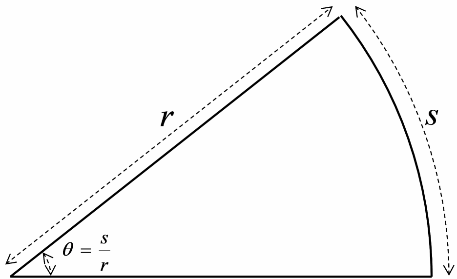
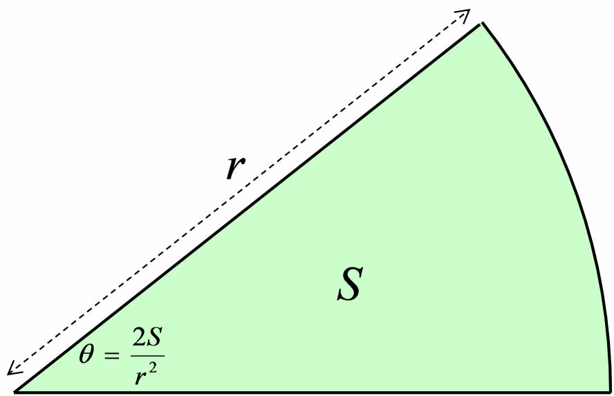
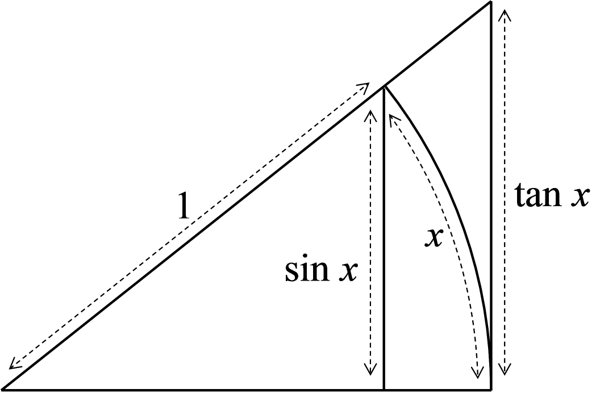
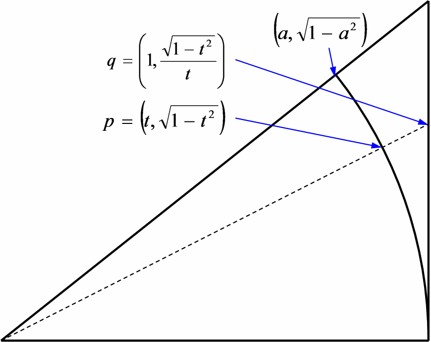
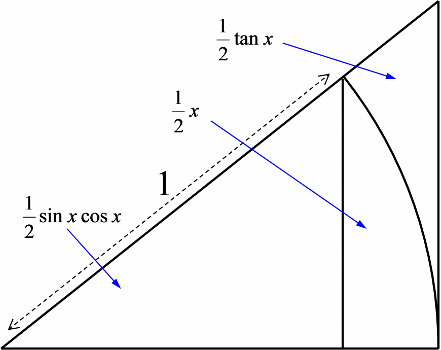

# ロピタルの定理と三角関数の微分

## ロピタルの定理は使うな
ロピタルの定理と言うもの、理系の人間なら大体みんな知っている言葉じゃないでしょうか。
高校数学の参考書には載ってるけど、なぜか教科書には載っていない便利な公式。
関数の極限で、
0/0 の不定形を簡単に求める方法で、
要するに、以下のような公式。

<blockquote markdown="1">

          <table class="sigma" summary="limitation"><tr><td>lim</td></tr><tr><td class="sigmasub">x → 0</td></tr></table>
f(x)
＝ 0
,
<table class="sigma" summary="limitation"><tr><td>lim</td></tr><tr><td class="sigmasub">x → 0</td></tr></table>
g(x)
＝ 0

のとき、

        <table class="sigma" summary="limitation"><tr><td>lim</td></tr><tr><td class="sigmasub">x → 0</td></tr></table>
        <table class="frac" summary="fraction"><tr><td class="num">f(x)</td></tr><tr><td>g(x)</td></tr></table>
＝
<table class="sigma" summary="limitation"><tr><td>lim</td></tr><tr><td class="sigmasub">x → 0</td></tr></table><table class="frac" summary="fraction"><tr><td class="num">f'(x)</td></tr><tr><td>g'(x)</td></tr></table>

が成り立つ。
ただし、
f' は f の x に関する微分を表すものとする。

</blockquote>
この定理、教科書に載っていないので、高校の試験や大学入試では「使うな」と言われたりします。

## 実は使ってもいい
「教科書に載っていないものは公式として使うな」というのは、
「その式を誰でも知っているものだと思って解くなという意味では当然のことではあります
（検算に使うのはかまわないんですが）。
 
でも、絶対に使っちゃいけないわけではないんですよ。
<em>自分で最初に証明してから使えば OK</em>（誰でもは知らないとしても、その説明からやればいい）。
それなら誰も文句はいいません。
 
あるいは、ロピタルの定理の証明と同じ手順を踏むことで、極限の計算手順を簡単に出来ます（定理の証明手順を知っていれば、それと同じ手順で個別の問題を証明できるはずです）。
例えば、
<table class="sigma" summary="limitation"><tr><td>lim</td></tr><tr><td class="sigmasub">x → 0</td></tr></table><table class="frac" summary="fraction"><tr><td class="num">ex － 1</td></tr><tr><td>x</td></tr></table>
を求めよと言われたとします。
このとき、

<blockquote markdown="1">
ロピタルの定理より、
<table class="sigma" summary="limitation"><tr><td>lim</td></tr><tr><td class="sigmasub">x → 0</td></tr></table><table class="frac" summary="fraction"><tr><td class="num">ex － 1</td></tr><tr><td>x</td></tr></table>
＝
<table class="sigma" summary="limitation"><tr><td>lim</td></tr><tr><td class="sigmasub">x → 0</td></tr></table><table class="frac" summary="fraction"><tr><td class="num">ex</td></tr><tr><td>1</td></tr></table>
＝
1

</blockquote>
なんて書こうものなら、即効で×されますが、

<blockquote markdown="1">
<em>
          
            <table class="sigma" summary="limitation"><tr><td>lim</td></tr><tr><td class="sigmasub">x → 0</td></tr></table>
            <table class="frac" summary="fraction"><tr><td class="num">
                e
                x － 1</td></tr><tr><td>x</td></tr></table>
＝
<table class="sigma" summary="limitation"><tr><td>lim</td></tr><tr><td class="sigmasub">x → 0</td></tr></table><table class="frac" summary="fraction"><tr><td class="num">ex － e0</td></tr><tr><td>x － 0</td></tr></table>
＝
<table class="sigma" summary="limitation"><tr><td>lim</td></tr><tr><td class="sigmasub">x → 0</td></tr></table><table class="frac" summary="fraction"><tr><td class="num">d</td></tr><tr><td>dx</td></tr></table>ex
＝
<table class="sigma" summary="limitation"><tr><td>lim</td></tr><tr><td class="sigmasub">x → 0</td></tr></table>ex
＝
1

        </em>

</blockquote>
とやれば文句を言われることはありません。
やってることはロピタルの定理と一緒なんですけどね。
ロピタルの定理を使って（分母分子を微分したという形で）解いたんじゃなくて、
あくまで、式変形の途中で微分の定義にあたる式が出てきたから微分したという形で解く。

## 教科書に載らない理由 ～ 循環論法の発生
で、教科書にロピタルの定理が載っていないのにも理由っぽいものがあります。
本当にこれが原因なのか確かではありませんが、
僕が思うに多分そうだと思います。
 
その理由ですが、三角関数の微分で循環論法が起きちゃうんですね。
問題が起きるのは、
<table class="sigma" summary="limitation"><tr><td>lim</td></tr><tr><td class="sigmasub">x → 0</td></tr></table><table class="frac" summary="fraction"><tr><td class="num">sinx</td></tr><tr><td>x</td></tr></table>
の極限。
これに対してロピタルの定理を使おうとすると、
三角関数の微分が必要なわけですが、
実は、<em>三角関数の微分には sin x/x の極限値が必要</em>なんですね。
ロピタルの定理を使うには微分が必要なので、これをロピタルの定理で証明しようとすると、「sin x/x の極限を求めるのに sin' が必要で、
sin' を求めるのに sin x/x の極限が必要で、
それを求めるためには・・・」
という循環論法が生じるわけです。
 
三角関数の微分に関して、忘れてしまった人のために少しだけ説明すると、
微分の定義式
<table class="sigma" summary="limitation"><tr><td>lim</td></tr><tr><td class="sigmasub">Δx → 0</td></tr></table><table class="frac" summary="fraction"><tr><td class="num">f(x ＋ Δx) － f(x)</td></tr><tr><td>Δx</td></tr></table>
に sin を入れることで、

      <table class="sigma" summary="limitation"><tr><td>lim</td></tr><tr><td class="sigmasub">Δx → 0</td></tr></table>
      <table class="frac" summary="fraction"><tr><td class="num">
          sin
          (x ＋ Δx) － sin(x)</td></tr><tr><td>Δx</td></tr></table>
＝
<table class="sigma" summary="limitation"><tr><td>lim</td></tr><tr><td class="sigmasub">Δx → 0</td></tr></table>{<table class="frac" summary="fraction"><tr><td class="num">cosΔx － 1</td></tr><tr><td>Δx</td></tr></table>sinx
＋
<table class="frac" summary="fraction"><tr><td class="num">sinΔx</td></tr><tr><td>Δx</td></tr></table>cosx
}

となるので、
sin x/x の極限が分からないと、この式が確定しないわけです。
(cos x － 1)/x の方も、sin x/x の極限が分かれば計算できます。
（ここでは三角関数の加法定理を使っていますが、
加法定理は幾何学的に証明されます。）
 
そして、循環論法を避けるためには、
<table class="sigma" summary="limitation"><tr><td>lim</td></tr><tr><td class="sigmasub">x → 0</td></tr></table><table class="frac" summary="fraction"><tr><td class="num">sinx</td></tr><tr><td>x</td></tr></table>
だけは、三角関数の微分の知識なしで求めなければいけません。
（三角関数を幾何学的に定義する場合の話。
あるいは、三角関数の幾何学的定義（半径1の円を描いて、ここの長さをsinとする、みたいな定義）と解析的定義（大学で習うことになりますが、べき級数というものを使って定義するやり方）の等価性を証明するためにも、この極限の値が必要になります。）
（実際、三角関数の微分を教える際には、だいたいセットでこの sin x/x の極限値の話が出てくるはず。）
 
多分、この辺りのことで生徒に突っ込まれると回答に困る先生が多いだろうことから、
ロピタルの定理が高校の数学の教科書から外れているのではないかと僕は思っています。
ロピタルの定理なんて、なくても困るものではないので、
混乱を生むくらいなら教科書に載せない方がマシということではないかと。

## sin x/x
### 孤度
sin x/x の極限の話をするまえに、
孤度（radian: ラジアン）の定義の話をしましょう。
孤度の定義の仕方はいくつか考えることができます。

1. 半径1の扇形を描き、その中心角の大きさを、扇の弧長で表す。

2. 半径√2の扇形を描き、その中心角の大きさを、扇の面積で表す。

3. 
            <table class="sigma" summary="limitation"><tr><td>lim</td></tr><tr><td class="sigmasub">x → 0</td></tr></table>
            <table class="frac" summary="fraction"><tr><td class="num">
                sinx</td></tr><tr><td>x</td></tr></table>
＝ 1
となるように中心角の大きさを定める。

一番馴染み深い定義の仕方は 1 の定義、すなわち、弧長によるものですね。
図で表すと、図1 のようになります。
ですが、後述しますが、実はこの定義だと sin x/x の極限値を求めるときにちょっと苦労します。

<figure>
	
	<figcaption>弧長による孤度の定義</figcaption>
</figure>

次は、2 つ目、面積による定義です。
図で表すと、図2 のような感じ。
面積が先で、その後に弧長が定義されるというのに少し違和感があるかもしれませんが、
それを言うと、弧長の定義から面積を求めるのも実は一苦労なので同じです。

<figure>
	
	<figcaption>扇の面積による孤度の定義</figcaption>
</figure>

円（あるいは扇形）の弧長と面積の関係というのは、
小中学校では「区分求積法」というやつを使って求めるわけですが、
この方法はいささか厳密性にかけています。
円の弧長と面積の関係を厳密に述べるためには、
三角関数の微分に関する知識を要します。
ここでは、孤度および三角関数の定義から、三角関数の微分を導こうとしているわけで、
現時点では三角関数の微分に関する知識は使えません。
したがって、
定義1を使う場合には弧長の情報のみ、
定義2を使う場合には面積の情報のみを利用して sin x/x の極限値を求める必要があります。
 
そして最後の3つ目の定義、
逆転の発想で sin x/x の極限が1になるように孤度を定めようというものです。
（参考リンク： [札幌東高等学校 平田嘉宏 氏のサイト](http://www.nikonet.or.jp/spring/radian/radian.htm)。）
詳細は参考リンクの方を読んでもらうとして、
この方法もなかなか面白い考え方です。
 
結論だけ言ってしまうと、
この3つのうちどの1つの定義を選んでも、他の2つが成り立つことを証明できます。
要するにどれを選んでも同じ結果になります。
 
ちなみに、「[集合の公理系](../set/axiom.md)」にも書いていますが、
数学の理論には必ず「前提とする条件」、すなわち、「公理（＝定義）」が必要になります。
ここでの議論においても、3つの条件のうちの1つは必ず定義として定める必要があり、
残りの2つは定理として証明可能です。
 
そして、「公理のよさ」というのは、
「少ない仮定・自然な仮定から出発してより多くの結論が得られること」です。
3つの孤度の定義の中で、一番自然なのは1ですかね。
ですから、通常は1の定義が用いられます。
 
sin x/x の極限値から孤度を定める方法では、
「sin x/x は収束する」すなわち「sin x は1次の項を持つ」という情報も持っていて、
弧長や面積による孤度の定義よりも強い仮定を持っているので、
「少ない仮定でより多くの結論」という視点から見ると、
この定義の仕方は少し不利になります。
（後述しますが、
「sin x/x は収束する」と言う部分だけ別に証明できればこの不利はなくなります。）

### 弧長による定義から sin x/x を計算
弧長による孤度の定義は、
直感的に一番自然な定義ではあるんですが、
ここからはじめると sin x/x を求めるのが少し面倒になります。
 
方法としては、
sinx ＜ x ＜ tanx を示して、
この式を変形し、
cosx
＜
<table class="frac" summary="fraction"><tr><td class="num">sinx</td></tr><tr><td>x</td></tr></table>
＜
1

で、
これを極限を取って x → 0 とすると、
両端が 1 になるので、
その間に挟まっている sin x/x も1になります。
 
あとは、
sinx ＜ x ＜ tanx を示す必要があります。
これを示すためには、図3に示すように、
半径 1 の扇形を描き、
内側と外側に三角形を描きます。

<figure>
	
	<figcaption>sin x、x、tan x</figcaption>
</figure>

          sinx ＜ x の方は、
「2点間を結ぶ最短の線は直線」ということから、
自明としていいかと思います。
問題は x と tanx の間の関係の部分です。
こちらは、曲線と、それよりも長い直線の比較と言うことで、
結構面倒な問題になります。
 
ここからの説明はほんの一例で、他にも証明方法はあると思いますが、
この大小関係を調べるために、図4 に示すように、
点 p, q を考えます。
（図中の a はある定数。）

<figure>
	
	<figcaption>弧上の点 p と半径の延長線上の点 q</figcaption>
</figure>

扇形の中心を原点とすると p, q の座標は、

        p
＝
(
t,
√1 － t2)

        q
＝
(
1,
<table class="frac" summary="fraction"><tr><td class="num">√1 － t2</td></tr><tr><td>t</td></tr></table>)

となります。
そして、ベクトル p(t) で表される曲線の長さは
∫<table class="integral" summary="integral"><tr><td class="intsup"> </td></tr><tr><td style="font-size:30%;"> </td></tr><tr><td class="intsub"></td></tr></table>|<table class="frac" summary="fraction"><tr><td class="num">d</td></tr><tr><td>dt</td></tr></table>p(t)|dt

で表せるので、
弧長 x と、
外側の三角形の縦の辺の長さ tanx は、

x ＝
∫<table class="integral" summary="integral"><tr><td class="intsup"> a</td></tr><tr><td style="font-size:30%;"> </td></tr><tr><td class="intsub">1</td></tr></table><table class="frac" summary="fraction"><tr><td class="num">dt</td></tr><tr><td>√1 － t2</td></tr></table>

        tanx ＝
∫<table class="integral" summary="integral"><tr><td class="intsup"> a</td></tr><tr><td style="font-size:30%;"> </td></tr><tr><td class="intsub">1</td></tr></table><table class="frac" summary="fraction"><tr><td class="num">dt</td></tr><tr><td>t2√1 － t2</td></tr></table>

となります。
この積分ですが、
解析的に原始関数を求めるためには、
t ＝ cosτ で置換積分するのが一般的で、
三角関数の微分の知識を要します。
しかしながら、
ここでは x と tanx の大小関係さえ分かれば十分なので、
定積分の値が求まる必要はありません。
積分区間が同じなので、
積分の中身の大小によって、両者の大小関係を示すことが出来ます。
 
積分の性質の1つに、
積分区間中で常に
f(t) ＜ g(t)
ならば、
∫<table class="integral" summary="integral"><tr><td class="intsup"> </td></tr><tr><td style="font-size:30%;"> </td></tr><tr><td class="intsub"></td></tr></table>f(t)dt ＜ ∫<table class="integral" summary="integral"><tr><td class="intsup"> </td></tr><tr><td style="font-size:30%;"> </td></tr><tr><td class="intsub"></td></tr></table>g(t)dt
（両辺の積分区間は同じものとする）
が成り立ちます。
ここで示した x と tanx に関する積分の中身は、
t ＜ 1 であることから、

        <table class="frac" summary="fraction"><tr><td class="num">1</td></tr><tr><td>
            √1 － t2
          </td></tr></table>
＜
<table class="frac" summary="fraction"><tr><td class="num">1</td></tr><tr><td>t2√1 － t2</td></tr></table>

        ∫<table class="integral" summary="integral"><tr><td class="intsup"> a</td></tr><tr><td style="font-size:30%;"> </td></tr><tr><td class="intsub">1</td></tr></table>
        <table class="frac" summary="fraction"><tr><td class="num">
            dt</td></tr><tr><td>
            √1 － t2
          </td></tr></table>
＜
∫<table class="integral" summary="integral"><tr><td class="intsup"> a</td></tr><tr><td style="font-size:30%;"> </td></tr><tr><td class="intsub">1</td></tr></table><table class="frac" summary="fraction"><tr><td class="num">dt</td></tr><tr><td>t2√1 － t2</td></tr></table>

x ＜ tanx

が成り立ちます。
 
（
ちなみに、余談になりますが、
ここでは弧の長さ（というか、曲線の長さ）を積分を使って定義しちゃっていますが、
円弧の長さを「弧を限りなく細分していったときの弦の長さの和の極限」で定義しても、
「△ABC で、∠Cが直角のとき、D, E をそれぞれ AB, AC の延長線上の点とすると、
BC ＜ DE が成り立つ」ということだけ証明できれば sinx ＜ x ＜ tan x が示せます。
これは実際に証明可能。
というか、弧長の定義の極限が有限確定値に収束することを証明するのにこの方法を使う。
）
 
これで最初の方で説明したとおり、
cosx
＜
<table class="frac" summary="fraction"><tr><td class="num">sinx</td></tr><tr><td>x</td></tr></table>
＜
1

が成り立ち、
この極限を取って、両端が 1 になることから
<table class="sigma" summary="limitation"><tr><td>lim</td></tr><tr><td class="sigmasub">x → 0</td></tr></table><table class="frac" summary="fraction"><tr><td class="num">sinx</td></tr><tr><td>x</td></tr></table>
＝ 1

が言えます。
 
で、これが分かれば円周と円の面積の関係が分かります。
半径 r の円の内接正 n 角形の面積は

2n × <table class="frac" summary="fraction"><tr><td class="num">1</td></tr><tr><td>2</td></tr></table> r2sin<table class="frac" summary="fraction"><tr><td class="num">π</td></tr><tr><td>n</td></tr></table>cos<table class="frac" summary="fraction"><tr><td class="num">π</td></tr><tr><td>n</td></tr></table>
、
外接正 n 角形の面積は

2n × <table class="frac" summary="fraction"><tr><td class="num">1</td></tr><tr><td>2</td></tr></table> r2tan<table class="frac" summary="fraction"><tr><td class="num">π</td></tr><tr><td>n</td></tr></table>
になりますが、
これらは n → ∞ で極限を取ると、
いずれも πr2 に収束します。
（これらの極限を求める際には、sin x/x の極限が1であることを用います。）
従って、これが真円の面積で、
中心角 x の扇形の面積は、
それに角度比 x/2π を掛けたものになるので、
<table class="frac" summary="fraction"><tr><td class="num">1</td></tr><tr><td>2</td></tr></table>r2 x になります。

### 面積による定義から sin x/x を計算
sin x/x を計算するという目的からすると、
面積を使って孤度を定義した方が簡単だったりします。
こちらも、sin x/x を計算するにあたって、
図5のように、
半径 1 の扇形を描き、
内側と外側に三角形を描きます。

<figure>
	
	<figcaption>面積の関係</figcaption>
</figure>

面積の場合、大小関係は明白で、
sinx cosx ＜ x ＜ tanx
になりますので、
これを変形して
cosx
＜
<table class="frac" summary="fraction"><tr><td class="num">sinx</td></tr><tr><td>x</td></tr></table>
＜
<table class="frac" summary="fraction"><tr><td class="num">1</td></tr><tr><td>cosx</td></tr></table>
が得られます。
x → ∞ で極限を取ると、
やぱり両辺が1になるので、
<table class="sigma" summary="limitation"><tr><td>lim</td></tr><tr><td class="sigmasub">x → 0</td></tr></table><table class="frac" summary="fraction"><tr><td class="num">sinx</td></tr><tr><td>x</td></tr></table>
＝ 1

が言えます。
また、半径 r の扇形の弧長は、

r
=∫<table class="integral" summary="integral"><tr><td class="intsup"> cosx</td></tr><tr><td style="font-size:30%;"> </td></tr><tr><td class="intsub">1</td></tr></table><table class="frac" summary="fraction"><tr><td class="num">dt</td></tr><tr><td>√1 － t2</td></tr></table>

を t ＝ cos τ で置換積分することで、
r x であることが示されます。
（sin x/x の極限が分かった後なので、三角関数の微分の知識を使ってもいい。）
 
面積の大小関係は明白で、証明が簡単なので、
高校の教科書などにはこの証明方法が書かれていることが多いはずです。
なのに、孤度は扇形の弧長で定義していて、循環論理に陥っていっているように見えます。
（実際は、「弧長は半径と中心角に比例」と「面積は半径の二乗と中心角に比例」という幾何学的な事実だけから、比例定数を除いて扇形の弧長と面積の関係が分かるので、循環を回避する方法はあります。）

### sin x/x → 1 自体が定義
角度による孤度の定義ですが、
2つの部分に分けて考えることが出来ます。

1. 扇形の弧長は中心角の大きさに比例する

2. 半径1のとき、比例定数が1となるように孤度を定める

面積による定義にしても、同様に2つの部分に分かれます。

1. 扇形の面積は中心角の大きさに比例する

2. 面積πのとき、比例定数が1となるように孤度を定める

いずれの定義においても、
1. は幾何学の分野での常識であって、
実際、孤度の定義として新たに定めているのは 2. だけです。
要するに、比例定数を定めているだけですね。
 
（
本当は軽々しく「常識」なんていうべきでもないんですが、
これ以上踏み込もうと思うと、幾何学の公理系の話から初めて、
線分の長さとは何かとか円とは何かまで説明が必要なので。
）
 
「sin x/x → 1」という具体的な値は、2. を定めないと決まらないわけですが、
「三角関数の微分は有限の値として存在する」ということだけなら、
1. だけ、要するに幾何学の常識だけを使って証明することができます。
（上述の sin x/x → 1 の証明と同じ手順で。）
より具体的に言うと、
1. から得られる結論は、

* x → 0 としたとき、sin x/x が有限確定値に収束する。

* 収束値は扇形の弧長（あるいは面積）と中心角の比例定数で決まる。

の2つです。
具体的な値が分からなくても、とりあえず有限の値として確定さえすれば、
三角関数の微分・積分を使った議論ができますので、
2. の比例定数を定めるという決まりごとはおまけみたいなものですね。
 
さて、sin x/x がある定数に収束することが分かった今、
この値が 1 になるように扇形の弧長と中心角の比率を決めてもかまわないわけです。
（すなわち、sin x/x → 1 の方が定義で、
弧長 ＝ rx、
面積 ＝ <table class="frac" summary="fraction"><tr><td class="num">1</td></tr><tr><td>2</td></tr></table> r2 x
の方がその結果として得られる定理。）
 
先に、値が収束することの証明だけはきっちりとしておく必要がありますが、
それさえすればあとは比例定数を定めているだけですから、
弧長や面積による定義と条件の厳しさは同じです。
