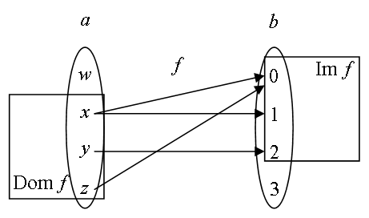
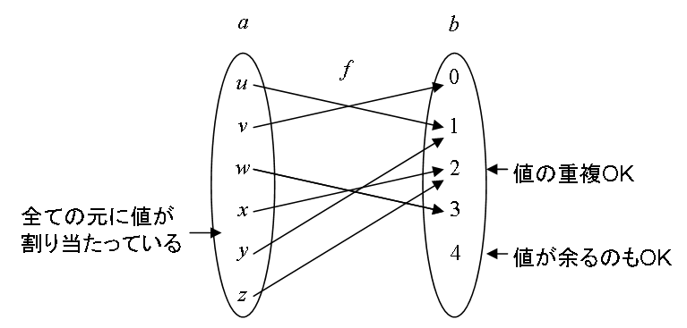
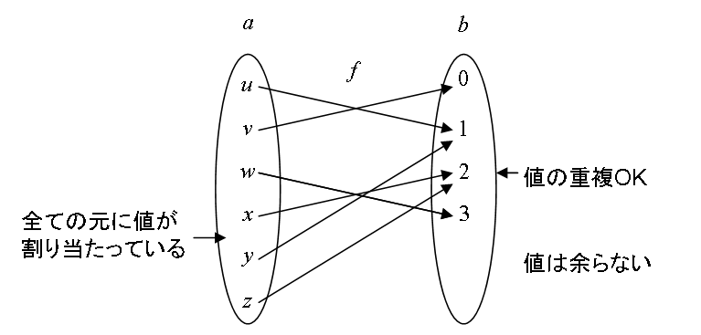
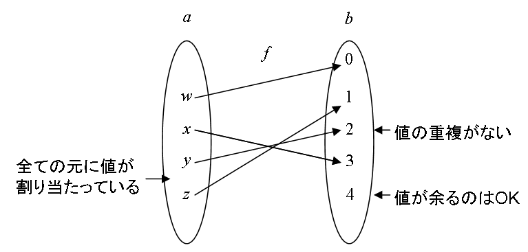
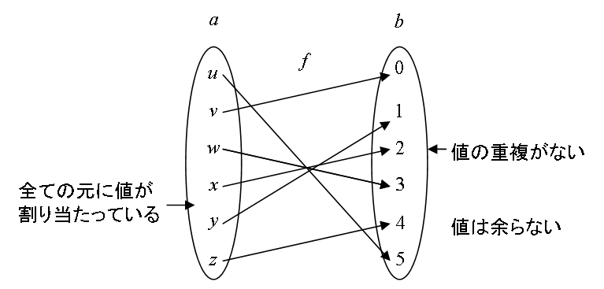

# 写像

## 概要
数学には関数（function）という概念があります。
関数とは「ある変数に依存して決まる値」の事を指します。
集合論的には、「ある2つの変数の間の対応関係」が関数になります。

通常、関数という言葉は数 → 数の対応関係を指します。
それに対して、一般の集合 → 集合の対応関係を写像（mapping）と呼びます。
（両者の間にはあまり差はありません。ニュアンスの違い程度です。）

集合論における数学的考察の対象は全て集合であるわけですが、
写像というものも集合の1種として定義することが出来ます。

余談ですが、関数という言葉は function を音訳したものです。
（中国語では「関」は「ファン」と読みます。
もともとは「函」と書いていましたが、この文字は常用漢字ではないので、次第に「関」に置き換えられるようになりました。）
古来の日本語には「h」や「f」の音はなく、は行の音は「p」の音で読まれていました。
そのため、「函」は「ハン」や「ファン」ではなく、「クワン」と読まれ、後に「カン」になったそうです。
（現在でも辞書などには「くわん」という読み方が書かれています。）

## 順序対
写像について述べる前に、いくつか下準備が必要になります。
まず最初に、順序対というものについて説明します。

「[対](set.md#pair)」で「[対](set.md#pair)」というものを説明しましたが、
これは順序関係を持っていません。
すなわち、x, y の対は 
        {x, y}
        =
        {y, x}
       となります。
これに対し、順序を持った対、つまり、
        x ≠ y
       のとき 
        (x, y)
        ≠
        (y, x)
       となるようなものを作ることを考えます。

このような集合を作るために、以下のようなものを考えます。

      (x, y)
      =
      {
        x, {x, y}
      }
    

このようにして作った x, y の組を<strong id="orderd_pair" class="keyword">順序対</strong>（ordered pair）と呼びます。
順序対は以下のような性質を持ちます。

* 
          (x, y) = (y, x) ⇔ x = y
        

* 
          (x, y) = (x', y') ⇔ x = x' ∧ y = y'
        

要するに、対（非順序対）とは異なり、中身が順序も含めて一致している場合にのみ同じ集合になります。

## 直積
次に、<strong id="directprod" class="keyword">直積</strong>（direct product）と呼ばれる集合を定義します。
直積とは、a の元 x と b の元 y の順序対 
        (x, y)
       全体からなる集合で、a×b と表します。

例えば、
        a = {x, y, z}, b = {
          0, 1, 2
        }
       のとき、

      a × b =
      {
        (
          x, 0
        ),
        (
          x, 1
        ),
        (
          x, 2
        ),　
        (
          y, 0
        ),
        (
          y, 1
        ),
        (
          y, 2
        ),　
        (
          z, 0
        ),
        (
          z, 1
        ),
        (
          z, 2
        )
      }
    

になります。

上述の直積 a×b の定義は、集合論的には以下のような表し方になります。

      a×b =
      {
        u ∈ P(
          P
          (
            a ∪ b
          )
        ) |
        ∃x∃y
        (
          x ∈ a ∧ y ∈ b ∧ u = (x, y)
        )
      }
    

（順序対 
        (x, y)
       全体の集合は、
        P
        (
          P
          (
            a ∪ b
          )
        )
       の部分集合になります。）

直積は以下のような性質を持っています。

* 
          ∅×b  = a×∅ = ∅
        

* 
          (
            a ∩ b
          )×c = (a×c) ∩ (b×c)
        

* 
          (
            a ∪ b
          )×c = (a×c) ∪ (b×c)
        

* 
          a ⊆ c ∧ b ⊆ d → a×b ⊆ c×d
        

## 対応
直積を使って2つの集合 a, b の間の元の対応関係を定義することが出来ます。

直積 a×b とその部分集合 f の順序対 
        (a×b, f)
       のことを a から b への<strong id="correspondence" class="keyword">対応</strong>（correspondence）とよび、f を対応 
        (a×b, f)
       のグラフ（graph）と呼びます。
対応は、グラフ f と a, b の3つ組 
        (f, a, b)
       （順序対の順序対 
        (
          f, (a, b)
        )
      ）で定義する流儀もあります。

ちなみに、a から a 自身への対応を<strong id="relation" class="keyword">関係</strong>（relation）と言います。
（集合 a の2つの元の間の関係を表すのに使う。
例えば、順序関係等。）

対応  
        (a×b, f)
       は、
便宜上、
        f : a → b
       と表すこともよくあります。
a, b があらかじめ与えられており、これらの表示を省略しても分かる場合には、
単に「対応 f」ということもあります。

        x ∈ a
       のとき、

      f(x) =
      {
        y ∈ b |
        (x, y) ∈ f
      }
    

を x の f による<strong id="image" class="keyword">像</strong>（image）といいます。

例えば、
        a = {w, x, y, z}, b = {
          0, 1, 2, 3
        }
       のとき、
対応 f を

      f =
      {
        (
          x, 0
        ),
        (
          x, 1
        ),
        (
          y, 2
        ),
        (
          z, 0
        )
      }
    

と定義すれば、

      f(w) = ∅
    

      f(x) = {
        0, 1
      }
    

      f(y) = {
        2
      }
    

      f(z) = {
        0
      }
    

となる。
像が「[シングルトン](set.md#singleton)」になるとき、
すなわち、
        f(x) = {y}
       のようになる場合には、
これを 
        f(x) = y
       と略記することもあります。

また、a の部分集合 a' ⊆ a に対して、
像 
        f[a']
       を

      f[a'] =
      {
        y ∈ b |
        ∃x
        (
          x ∈ a' ∧ (x, y) ∈ f
        )
      }
    

で定義します。
これは、
        f[a'] = <table class="sigma" summary="statement under a function"><tr><td>∩</td></tr><tr><td class="sigmasub">
          x ∈ a'
        </td></tr></table> f(x)
       と定義するのと等しくなります。
また、
        f[a]
       を f の像または<strong id="range" class="keyword">値域</strong>（range または range of values）と呼び、
        Im f
       と表します。
さらに、
        {
          x ∈ a | f(x) ≠ ∅
        }
       （f 像が
        ∅
      にならないような元全体）を<strong id="domain" class="keyword">定義域</strong>（domain または domain of definition）と呼び、
        Dom f
       と表します。

先ほどの例では、
f の値域は 
        Im f = {
          0, 1, 2
        }
      
（
        3
       という値をとることはないので）に、
定義域は 
        Dom f = {x, y, z}
      
（
        f(w)
       は
        ∅
      なので）になります。
この様子を図1に示します。

<figure>
	
	<figcaption>像の値域と定義域</figcaption>
</figure>

## 写像
対応 
        f : a → b
       のうちで、

        Dom f = a
       であり、
さらに、全ての値 
        f(x)
       がb の「[シングルトン](set.md#singleton)」となるものを a から b への<strong id="mapping" class="keyword">写像</strong>（mapping）と呼びます。
要するに、a 全ての元に対して、ちょうど1つずつ値が割り当てられているような対応のことを写像といいます。

<figure>
	
	<figcaption>写像</figcaption>
</figure>

例えば、
        a = {w, x, y, z}, b = {
          0, 1, 2, 3
        }
       のとき、

      f =
      {
        (
          w, 0
        ),
        (
          x, 1
        ),
        (
          y, 2
        ),
        (
          z, 0
        )
      }
    

は写像になります。
（w, x, y, z に対して、それぞれ1つずつ値が割り当たっている。）
一方、

      f =
      {
        (
          x, 0
        ),
        (
          x, 1
        ),
        (
          y, 2
        ),
        (
          z, 0
        )
      }
    

は対応ですが、写像ではありません。
（w に値がない。x が値を2つ持っている。）

### 特殊な写像
いくつか特殊な写像の例を挙げます。

集合 a に対して、

          Δa = {
            (x, y) ∈ a×a | x = y
          }
         を対角集合（diagonal set）と呼びます。
グラフが対角集合であるような写像 
          ida = {
            a×a, Δa
          }
         は、a からそれ自身への写像となり、
          f(x) = x
         となります。
このような写像を a の<strong id="identity" class="keyword">恒等写像</strong>（identity mapping）と呼びます。

また、直積 a×b から a への写像 f を

        f =
        {
          (
            (x, y), z
          )
          ∈ (a×b)×a |
          x = z
        }
      

で定義すると、

          f(
            (x, y)
          ) = x
         となります。
（要するに、y の値を無視して x のみを取り出す写像。）
このような写像を a×b から a への<strong id="canonical" class="keyword">標準的射影</strong>（canonical projection）と呼び、

          proj
          a
         と表したりします。
（同様に、y のみを取り出すような写像 
          proj
          b
         も定義できます。）

### 全写・単写
写像 
          f : a → b
         が、
          Im f = b
         を満たすとき、
f は a から b への<strong id="surjection" class="keyword">全写</strong>（surjection）、
もしくはa から b の上への写像（onto mapping）といいます。

<figure>
	
	<figcaption>全写</figcaption>
</figure>

また、a の任意の2元 x, y について、

          f(x) = f(y) → x = y
         を満たすとき、
f は a から b への<strong id="injection" class="keyword">単写</strong>（injection）、
もしくは1対1の写像（1:1 mapping）といいます。

<figure>
	
	<figcaption>単写</figcaption>
</figure>

写像 f が全写かつ単写のとき、
a から b への<strong id="bijection" class="keyword">全単写</strong>（bijection）、
もしくは上への1対1の写像（1:1 onto mapping）といいます。

<figure>
	
	<figcaption>全単写</figcaption>
</figure>

2つの集合の間に全単写が存在するとき、
その2つの集合の全ての元の間には1対1の対応があります。
このとき、2つの集合は<strong id="equivalent" class="keyword">同値</strong>（equivalent）（対等、等価などと訳す場合もあり）であるといいます。
互いに同値な集合というのは、集合的に完全に対等な関係にあると考えることが出来ます。

### 逆写像
対応 
          f : a → b
         が与えられたとき、
以下のような対応 
          f−1 : b → a
         が定義できます。

        f−1 =
        {
          (y, x) ∈ b×a |
          (x, y) ∈ f
        }
      

要するに、対応関係の向きを逆にしたものなんですが、
このようは対応 
          f−1
         を f の逆対応と呼びます。

写像は対応の一種ですから、
写像の逆対応を作ることが出来ます。
ただし、一般には写像の逆対応は写像とはなりません。

写像 f の逆対応 
          f−1
         が写像になるためには、
f が全単写である必要があります。
f が全単写である場合に限り、
その逆対応 
          f−1
         もまた写像となり、しかも全単写になります。
このような写像 
          f−1
         を f の<strong id="inverse" class="keyword">逆写像</strong>（inverse mapping）と呼びます。

### 写像全体の集合
a から b への写像 
          f: a → b
         のグラフ全体の集合を

        ba
      

で表します。

## 元の個数
ある集合 a に対して同値となるような自然数 n が存在するとき、
集合 a を<strong id="finite" class="keyword">有限集合</strong>（finite set）と呼びます。
逆に、そのような自然数が存在しないとき集合は<strong id="infinite" class="keyword">無限集合</strong>（infinite set）と呼びます。

このような自然数が存在するならば、その自然数はただ1つ確定します。
すなわち、a と自然数 m が同値でかつ a と自然数 n が成り立つとき、
        m = n
       となります。
この1つに確定する自然数 n を a の<strong id="num" class="keyword">元の個数</strong>（number）と呼び、

        |a|
       と表します。

元の個数というと、有限集合にしか使えない概念ですが、
この概念は無限集合にも適用できるように拡張することができます。
この無限集合の元の個数に相当する拡張概念を位数（order）、濃度（power, cardinality）または基数（cardinal number）などと呼びますが、この概念はまた後ほど説明します。
