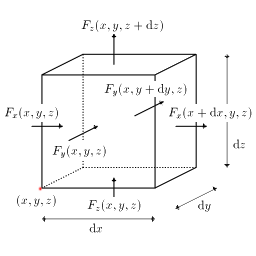

# 発散

## 発散とは
<em>
        <strong id="divergence" class="keyword">発散</strong>とはある点における単位体積あたりのベクトル場の湧き出し（「[流束](v_field.md#flux)」参照）の量、つまり湧き出しの密度
      </em>です。
発散という言葉は、ある点から湧き出したベクトル場が外に向かって広がっていくという意味で使われています。

すなわち、ある点Pにおけるベクトル場
        F
      の発散
        div
        F
      とは、点Pを囲む任意の閉曲面をS、その内部の体積をVとすると、

      <em>
        div
        F
        = <table class="sigma" summary="limitation"><tr><td>lim</td></tr><tr><td class="sigmasub">V→0</td></tr></table><table class="frac" summary="fraction"><tr><td class="num">
            ∮<table class="integral" summary="integral"><tr><td class="intsup"> </td></tr><tr><td style="font-size:30%;"> </td></tr><tr><td class="intsub">S</td></tr></table>F・dS
          </td></tr><tr><td>V</td></tr></table>
      </em>
    

で定義されます。
また、<em>
        
          div
          F
        は
          ∇・
          F
        とも書きます
      </em>。

これだけでは分かりにくいでしょうからもう少し直感的な発散の意味を言うと、
発散とは<em>
        面積分（「[面積分とは](surfaceint.md#surfaceint)」参照）と体積積分（「[体積積分とは](volumeint.md#volumeint)」参照）を関係付ける微分演算
      </em>で、直交座標を用いて表すと

      <em>
        ∇・
        F = <table class="frac" summary="fraction"><tr><td class="num">
            ∂Fx
          </td></tr><tr><td>∂x</td></tr></table>+<table class="frac" summary="fraction"><tr><td class="num">
            ∂Fy
          </td></tr><tr><td>∂y</td></tr></table>+<table class="frac" summary="fraction"><tr><td class="num">
            ∂Fz
          </td></tr><tr><td>∂z</td></tr></table>
      </em>
    

となります。
ただし、
        F = (
          Fx, Fy, Fz
        )
      です。

        ∇・
        F
      という書き方をするのは、ナブラベクトル
        ∇ = (
          <table class="frac" summary="fraction"><tr><td class="num">∂</td></tr><tr><td>∂x</td></tr></table>,<table class="frac" summary="fraction"><tr><td class="num">∂</td></tr><tr><td>∂y</td></tr></table>,<table class="frac" summary="fraction"><tr><td class="num">∂</td></tr><tr><td>∂z</td></tr></table>
        )
      と
        F
      の内積を取ったものが発散となるからです。

## ガウスの定理
発散は湧き出しの密度なわけですから発散を体積積分したものは湧き出しに等しくなります。
つまり、

      <em>
        ∮<table class="integral" summary="integral"><tr><td class="intsup"> </td></tr><tr><td style="font-size:30%;"> </td></tr><tr><td class="intsub">S</td></tr></table>
        F・dS = ∫<table class="integral" summary="integral"><tr><td class="intsup"> </td></tr><tr><td style="font-size:30%;"> </td></tr><tr><td class="intsub">V</td></tr></table>∇・FdV
      </em>
    

この式をガウスの定理といい、面積分と体積積分を関係付ける公式です。

図1のような微小体積を考えると、その表面を貫いて外に出て行くベクトル場
        F
      の流束は

      {
        Fx(x,y,z)−Fx(x+dx,y,z)
      }
      dydz+{
        Fy(x,y,z)−Fy(x,y+dy,z)
      }dzdx+{
        Fz(x,y,z)−Fz(x,y,z+dz)
      }dxdy
    

となります。

<figure>
	
	<figcaption>微小体積</figcaption>
</figure>

ここで、
        Fx(x,y,z)−Fx(x+dx,y,z) = <table class="frac" summary="fraction"><tr><td class="num">
            ∂Fx
          </td></tr><tr><td>∂x</td></tr></table>dx
      であることを用いると、この式の第一項は

        <table class="frac" summary="fraction"><tr><td class="num">
            ∂Fx
          </td></tr><tr><td>∂x</td></tr></table>
        dV
      
となります(
        dV=dxdydz
      )。
同様に第二項、第三項も

        <table class="frac" summary="fraction"><tr><td class="num">
            ∂Fy
          </td></tr><tr><td>∂y</td></tr></table>dV, <table class="frac" summary="fraction"><tr><td class="num">
            ∂Fz
          </td></tr><tr><td>∂z</td></tr></table>dV
      
となりますので、左図の微小体積の表面を貫く
        F
      の流束は

      {
        <table class="frac" summary="fraction"><tr><td class="num">
            ∂Fx
          </td></tr><tr><td>∂x</td></tr></table>+<table class="frac" summary="fraction"><tr><td class="num">
            ∂Fy
          </td></tr><tr><td>∂y</td></tr></table>+<table class="frac" summary="fraction"><tr><td class="num">
            ∂Fz
          </td></tr><tr><td>∂z</td></tr></table>
      }
      dV
    

となります。
そして発散の定義から、

      <em>
        ∇・
        F = <table class="frac" summary="fraction"><tr><td class="num">
            ∂Fx
          </td></tr><tr><td>∂x</td></tr></table>+<table class="frac" summary="fraction"><tr><td class="num">
            ∂Fy
          </td></tr><tr><td>∂y</td></tr></table>+<table class="frac" summary="fraction"><tr><td class="num">
            ∂Fz
          </td></tr><tr><td>∂z</td></tr></table>
      </em>
    

となります。
