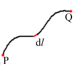

# 線積分

##  線積分とは

<figure>
	
	<figcaption>線積分</figcaption>
</figure>

ある経路C上で定義されるスカラー場Fに対し、

        <em>
          ∫<table class="integral" summary="integral"><tr><td class="intsup"> </td></tr><tr><td style="font-size:30%;"> </td></tr><tr><td class="intsub">C</td></tr></table>F dl
        </em>
      

をFのC上での<strong id="lineint" class="keyword">線積分</strong>といいます。
ここで、
        dl
      はC上の微小線素です(線素を
        ds
      と書く人も多いです(stringのs？))。
経路Cが閉路の場合、

      ∮<table class="integral" summary="integral"><tr><td class="intsup"> </td></tr><tr><td style="font-size:30%;"> </td></tr><tr><td class="intsub">C</td></tr></table>F dl
    

と書きます。

##  ベクトル場の線積分

ベクトル場
        F
      を考えます。
経路Cの単位接線ベクトルを
        t
      とすると

        F・t
      はスカラー場となります。
これをFとおいて線積分すると、

      ∫<table class="integral" summary="integral"><tr><td class="intsup"> </td></tr><tr><td style="font-size:30%;"> </td></tr><tr><td class="intsub">C</td></tr></table>F dl = ∫<table class="integral" summary="integral"><tr><td class="intsup"> </td></tr><tr><td style="font-size:30%;"> </td></tr><tr><td class="intsub">C</td></tr></table>F・tdl
    

となります。
ここで、
        dl = tdl
      とおくと上の式は

      <em>
        ∫<table class="integral" summary="integral"><tr><td class="intsup"> </td></tr><tr><td style="font-size:30%;"> </td></tr><tr><td class="intsub">C</td></tr></table>
        F・dl
      </em>
    

となります。
この
        dl
      を線素ベクトルといいます。

物理学ではこのようにベクトル場の接線方向成分のみが問題となる場合が多いので、

        ∫<table class="integral" summary="integral"><tr><td class="intsup"> </td></tr><tr><td style="font-size:30%;"> </td></tr><tr><td class="intsub">C</td></tr></table>F・dl
      という形の式を、
単にベクトル場
        F
      の曲線C上での線積分ということもあります。

##  線積分の直交座標系での表現

        dl
      は接線方向を向き、微小線分の長さと同じ絶対値を持つベクトルですから、
直行座標を用いてあらわすと

      dl = (
        dx,dy,dz
      )
    

となります。
よって、
        F=(
          Fx,Fy,Fz
        )
      とおくと、
線積分は

      <em>
        ∫<table class="integral" summary="integral"><tr><td class="intsup"> </td></tr><tr><td style="font-size:30%;"> </td></tr><tr><td class="intsub">C</td></tr></table>
        F・dl = ∫<table class="integral" summary="integral"><tr><td class="intsup"> </td></tr><tr><td style="font-size:30%;"> </td></tr><tr><td class="intsub">C</td></tr></table>(
          Fxdx+Fydy+Fzdz
        )
      </em>
    

となります。

##  積分経路

線積分は一般には始点Pと終点Qが同じでも経路が異なればまったく異なる値となります。
しかし、詳しくは「[回転とは](rotation.md#rot)」で説明しますが、<em>
        
          F
        が
          ∇×F = 0
        を満たすときには線積分の値は始点と終点が同じならば経路によらず常に一定の値を持ちます。
      </em>
このとき、

      φ(Q) − φ(P) = ∫<table class="integral" summary="integral"><tr><td class="intsup"> </td></tr><tr><td style="font-size:30%;"> </td></tr><tr><td class="intsub">C</td></tr></table>F・dl
    

という関係を満たすスカラー場φが存在します。
