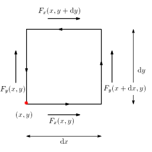

# 回転

## 回転とは
<em>
        <strong id="rotation" class="keyword">回転</strong>とはある点における単位面積あたりの渦（「」参照）の強さの量です。
      </em>
言い換えると、渦を起こす何らかの物があると考えて、それの密度が回転です。
流体の中で何かを回転させるとそこに渦が出来ますから、ベクトル場の渦を作るこの力のことを回転と言うわけです。

すなわち、ある点Pにおけるベクトル場
        F
      の回転
        rot
        F
      とは、点Pを通る任意の曲面をS、その外周をl、Sの点Pにおける法線を
        n
      とすると、Sの取り方によらず常に

      <em>
        rot
        F・n = <table class="sigma" summary="limitation"><tr><td>lim</td></tr><tr><td class="sigmasub">S→0</td></tr></table><table class="frac" summary="fraction"><tr><td class="num">
            ∮<table class="integral" summary="integral"><tr><td class="intsup"> </td></tr><tr><td style="font-size:30%;"> </td></tr><tr><td class="intsub">l</td></tr></table>F・dl
          </td></tr><tr><td>S</td></tr></table>
      </em>
    

が成り立つベクトルです。
また、<em>
        
          rotφ
        は
          ∇×φ
        とも書きます
      </em>。

これだけでは分かりにくいでしょうからもう少し直感的な回転の意味を言うと、
回転とは<em>
        線積分（「[線積分とは](lineint.md#lineint)」参照）と面積分（「[面積分とは](surfaceint.md#surfaceint)」参照）を関係付ける微分演算
      </em>で、直交座標を用いて表すと

      <em>
        ∇×
        F = (
          <table class="frac" summary="fraction"><tr><td class="num">
              ∂Fz
            </td></tr><tr><td>∂y</td></tr></table>−<table class="frac" summary="fraction"><tr><td class="num">
              ∂Fy
            </td></tr><tr><td>∂z</td></tr></table>,<table class="frac" summary="fraction"><tr><td class="num">
              ∂Fx
            </td></tr><tr><td>∂z</td></tr></table>−<table class="frac" summary="fraction"><tr><td class="num">
              ∂Fz
            </td></tr><tr><td>∂x</td></tr></table>,<table class="frac" summary="fraction"><tr><td class="num">
              ∂Fy
            </td></tr><tr><td>∂x</td></tr></table>−<table class="frac" summary="fraction"><tr><td class="num">
              ∂Fx
            </td></tr><tr><td>∂y</td></tr></table>
        )
      </em>
    

となります。
ただし、
        F = (
          Fx, Fy, Fz
        )
      です。

        ∇×
        F
      という書き方をするのは、ナブラベクトル
        ∇ = (
          <table class="frac" summary="fraction"><tr><td class="num">∂</td></tr><tr><td>∂x</td></tr></table>,<table class="frac" summary="fraction"><tr><td class="num">∂</td></tr><tr><td>∂y</td></tr></table>,<table class="frac" summary="fraction"><tr><td class="num">∂</td></tr><tr><td>∂z</td></tr></table>
        )
      と
        F
      の外積を取ったものが回転となるからです。

## グリーンの定理
いきなり3次元の線積分と面積分を関係付ける公式を出すよりも、2次元で考えたほうが分かりやすいので、まずは2次元で考えます。

図1のような積分経路を考えると、ベクトル場
        F
      の線積分の値は

      {
        Fy(x+dx,y)−Fy(x+,y)
      }
      dy − {
        Fx(x,y+dy)−Fx(x+,y)
      }dx
    

となります。

<figure>
	
	<figcaption>積分経路</figcaption>
</figure>

ここで、
        Fy(x,y)−Fy(x+dx,y) = <table class="frac" summary="fraction"><tr><td class="num">
            ∂Fy
          </td></tr><tr><td>∂x</td></tr></table>dx
      であることを用いると、この式の第一項は

        <table class="frac" summary="fraction"><tr><td class="num">
            ∂Fy
          </td></tr><tr><td>∂x</td></tr></table>dxdy
      
となります。
同様に第二項も

        <table class="frac" summary="fraction"><tr><td class="num">
            ∂Fy
          </td></tr><tr><td>∂y</td></tr></table>dxdy
      
となりますので、この線積分の値は

      {
        <table class="frac" summary="fraction"><tr><td class="num">
            ∂Fy
          </td></tr><tr><td>∂x</td></tr></table>−<table class="frac" summary="fraction"><tr><td class="num">
            ∂Fx
          </td></tr><tr><td>∂y</td></tr></table>
      }
      dxdy
    

となります。
すなわち、

      <em>
        ∮<table class="integral" summary="integral"><tr><td class="intsup"> </td></tr><tr><td style="font-size:30%;"> </td></tr><tr><td class="intsub">l</td></tr></table>
        F・dl = ∫∫<table class="integral" summary="integral"><tr><td class="intsup">  </td></tr><tr><td style="font-size:30%;"> </td></tr><tr><td class="intsub"></td></tr></table>{
          <table class="frac" summary="fraction"><tr><td class="num">
              ∂Fy
            </td></tr><tr><td>∂x</td></tr></table>−<table class="frac" summary="fraction"><tr><td class="num">
              ∂Fx
            </td></tr><tr><td>∂y</td></tr></table>
        }dxdy
      </em>
    

が成り立ちます。
この式をグリーンの定理といいます。

## ストークスの定理
回転は単位面積あたりの渦の強さなわけですから、回転の面積分の値は渦の強さに等しくなります。
つまり、

      <em>
        ∮<table class="integral" summary="integral"><tr><td class="intsup"> </td></tr><tr><td style="font-size:30%;"> </td></tr><tr><td class="intsub">l</td></tr></table>
        F・dl = ∫<table class="integral" summary="integral"><tr><td class="intsup"> </td></tr><tr><td style="font-size:30%;"> </td></tr><tr><td class="intsub">S</td></tr></table>∇×FdS
      </em>
    

この式をストークスの定理といい、線積分と面積分を関係付ける公式です。

この面積分の値をx方向成分、y方向成分、ｚ方向成分に分けて考えます。
x方向成分は曲面Sをy−z平面に投影したものを考えればいいので、
2次元の場合と同様にグリーンの定理を使って

        ∫∫<table class="integral" summary="integral"><tr><td class="intsup">  </td></tr><tr><td style="font-size:30%;"> </td></tr><tr><td class="intsub"></td></tr></table>{
          <table class="frac" summary="fraction"><tr><td class="num">
              ∂Fz
            </td></tr><tr><td>∂y</td></tr></table>−<table class="frac" summary="fraction"><tr><td class="num">
              ∂Fy
            </td></tr><tr><td>∂z</td></tr></table>
        }dydz
      
とあらわすことができます。
同様に、y方向成分、z方向成分はそれぞれ

        ∫∫<table class="integral" summary="integral"><tr><td class="intsup">  </td></tr><tr><td style="font-size:30%;"> </td></tr><tr><td class="intsub"></td></tr></table>{
          <table class="frac" summary="fraction"><tr><td class="num">
              ∂Fx
            </td></tr><tr><td>∂z</td></tr></table>−<table class="frac" summary="fraction"><tr><td class="num">
              ∂Fz
            </td></tr><tr><td>∂x</td></tr></table>
        }dzdx
      、

        ∫∫<table class="integral" summary="integral"><tr><td class="intsup">  </td></tr><tr><td style="font-size:30%;"> </td></tr><tr><td class="intsub"></td></tr></table>{
          <table class="frac" summary="fraction"><tr><td class="num">
              ∂Fy
            </td></tr><tr><td>∂x</td></tr></table>−<table class="frac" summary="fraction"><tr><td class="num">
              ∂Fx
            </td></tr><tr><td>∂y</td></tr></table>
        }dxdz
      
となります。
これらを足し合わせたものが面積分の値になりますので、

      ∮<table class="integral" summary="integral"><tr><td class="intsup"> </td></tr><tr><td style="font-size:30%;"> </td></tr><tr><td class="intsub">l</td></tr></table>
      F・dl =
      ∫∫<table class="integral" summary="integral"><tr><td class="intsup">  </td></tr><tr><td style="font-size:30%;"> </td></tr><tr><td class="intsub"></td></tr></table>[
        {
          <table class="frac" summary="fraction"><tr><td class="num">
              ∂Fz
            </td></tr><tr><td>∂y</td></tr></table>
          －
          <table class="frac" summary="fraction"><tr><td class="num">
              ∂Fy
            </td></tr><tr><td>∂z</td></tr></table>
        }dydz
        ＋
        {
          <table class="frac" summary="fraction"><tr><td class="num">
              ∂Fx
            </td></tr><tr><td>∂z</td></tr></table>
          －
          <table class="frac" summary="fraction"><tr><td class="num">
              ∂Fz
            </td></tr><tr><td>∂x</td></tr></table>
        }dzdx
        ＋
        {
          <table class="frac" summary="fraction"><tr><td class="num">
              ∂Fy
            </td></tr><tr><td>∂x</td></tr></table>
          －
          <table class="frac" summary="fraction"><tr><td class="num">
              ∂Fx
            </td></tr><tr><td>∂y</td></tr></table>
        }dxdz
      ]
    

      <em>
        ∴
        ∮<table class="integral" summary="integral"><tr><td class="intsup"> </td></tr><tr><td style="font-size:30%;"> </td></tr><tr><td class="intsub">l</td></tr></table>F・dl =
        ∫<table class="integral" summary="integral"><tr><td class="intsup"> </td></tr><tr><td style="font-size:30%;"> </td></tr><tr><td class="intsub"></td></tr></table>(
          <table class="frac" summary="fraction"><tr><td class="num">
              ∂Fz
            </td></tr><tr><td>∂y</td></tr></table>
          －
          <table class="frac" summary="fraction"><tr><td class="num">
              ∂Fy
            </td></tr><tr><td>∂z</td></tr></table>
          ,
          <table class="frac" summary="fraction"><tr><td class="num">
              ∂Fx
            </td></tr><tr><td>∂z</td></tr></table>
          －
          <table class="frac" summary="fraction"><tr><td class="num">
              ∂Fz
            </td></tr><tr><td>∂x</td></tr></table>
          ,
          <table class="frac" summary="fraction"><tr><td class="num">
              ∂Fy
            </td></tr><tr><td>∂x</td></tr></table>
          －
          <table class="frac" summary="fraction"><tr><td class="num">
              ∂Fx
            </td></tr><tr><td>∂y</td></tr></table>
        )
        ・dS
      </em>
    

となります。そして回転の定義より、

      <em>
        ∇×
        F
        ＝
        (
          <table class="frac" summary="fraction"><tr><td class="num">
              ∂Fz
            </td></tr><tr><td>∂y</td></tr></table>
          －
          <table class="frac" summary="fraction"><tr><td class="num">
              ∂Fy
            </td></tr><tr><td>∂z</td></tr></table>
          ,
          <table class="frac" summary="fraction"><tr><td class="num">
              ∂Fx
            </td></tr><tr><td>∂z</td></tr></table>
          －
          <table class="frac" summary="fraction"><tr><td class="num">
              ∂Fz
            </td></tr><tr><td>∂x</td></tr></table>
          ,
          <table class="frac" summary="fraction"><tr><td class="num">
              ∂Fy
            </td></tr><tr><td>∂x</td></tr></table>
          －
          <table class="frac" summary="fraction"><tr><td class="num">
              ∂Fx
            </td></tr><tr><td>∂y</td></tr></table>
        )
      </em>
    

となります。
